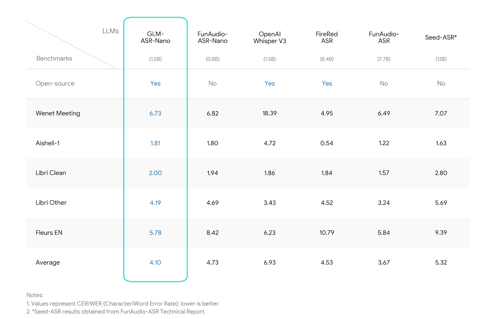

# GitHub Trending 排行榜

🔥 每周自动爬取GitHub最受欢迎的开源项目，生成AI智能总结的中文排行榜

[](https://github.com/qfy123/GitHub-Trending-/actions)
[](https://nodejs.org/)
[](LICENSE)

## ✨ 特性

- 🤖 **AI智能总结** - 使用DeepSeek AI生成简洁的中文项目描述
- 📊 **多维度排名** - 综合Star数、活跃度、新鲜度等指标
- 🖼️ **自动爬取图片** - 从项目README提取代表性图片
- 📈 **趋势分析** - 对比历史数据，显示项目排名变化
- 🗂️ **完整归档** - 按年份/周数归档所有历史数据
- 🔄 **自动更新** - GitHub Actions每周自动执行

## 📈 本周排行榜

<!-- TRENDING-START -->
### GitHub趋势排行榜 - 2025年第51周

**📅 统计周期**: 2025-12-14 ~ 2025-12-20  
**📊 项目总数**: 10 个  
**⭐ 总Star数**: 5,794  
**🔄 更新时间**: 2025-12-20 23:59:59  

| 排名 | 项目 | 描述 | Star | Fork | 语言 | 趋势 |
|------|------|------|------|------|------|------|
| 1 | [API-mega-list](https://github.com/cporter202/API-mega-list) | 一站式收录海量可用API，开发者无需四处搜寻即可快速找到所需接口，显著降低集成成本。 | 967 | 216 | JavaScript | 🆕 |
| 2 | [Gla-deploy](https://github.com/eooce/Gla-deploy) | 一键脚本合集，帮助用户在主流云平台上快速部署各类代理与科学上网服务，省去繁琐配置。 | 802 | 167 | JavaScript | 🆕 |
| 3 | [scraping-apis-for-devs](https://github.com/cporter202/scraping-apis-for-devs) | 一站式收录可直接调用的网页抓取与数据API，帮助开发者零配置快速集成公开数据源，实现从脚本到完整应用的自动化。 | 785 | 173 | JavaScript | 🆕 |
| 4 | [QQgroup-annual-report-analyzer](https://github.com/ZiHuixi/QQgroup-annual-report-analyzer) | 上传QQ群聊天记录，一键生成带热词、活跃度、表情包等多维度可视化年度报告，支持AI点评与在线/本地双模式。 | 411 | 33 | Python | 🆕 |
| 5 | [android-action-kernel](https://github.com/actionstatelabs/android-action-kernel) | 开源AI Agent库，让AI直接操控原生Android App，自动完成跨应用任务，无需Root或改代码。 | 657 | 74 | Python | 🆕 |
| 6 | [GLM-ASR](https://github.com/zai-org/GLM-ASR) | 15亿参数开源语音识别模型，体积小巧却超越Whisper V3，方言与复杂场景鲁棒性突出。 | 503 | 44 | Python | 🆕 |
| 7 | [clash-ip-checker](https://github.com/tombcato/clash-ip-checker) | 自动遍历Clash节点，用浏览器指纹检测IP纯净度与风险，并重命名标记，一键生成带评分的新配置。 | 573 | 38 | Python | 🆕 |
| 8 | [claude-island](https://github.com/farouqaldori/claude-island) | macOS菜单栏小程序，把Claude Code CLI的进度与通知做成类似Dynamic Island的悬浮提示... | 392 | 35 | Swift | 🆕 |
| 9 | [hn-time-capsule](https://github.com/karpathy/hn-time-capsule) | 用LLM复盘10年前Hacker News热帖，评估当时讨论的先见之明并生成可视化报告。 | 383 | 38 | Python | 🆕 |
| 10 | [stoolap](https://github.com/stoolap/stoolap) | Stoolap是一款用Rust编写的现代嵌入式SQL数据库，主打轻量、零配置、事务安全，适合直接嵌入应用内部使用。 | 321 | 9 | Rust | 🆕 |

### 🔥 详细介绍

#### 1. [API-mega-list](https://github.com/cporter202/API-mega-list) 

**📝 项目简介**: 一站式收录海量可用API，开发者无需四处搜寻即可快速找到所需接口，显著降低集成成本。

**✨ 核心特性**:
- 覆盖多领域公开API，分类清晰
- Star近1k，社区持续维护
- 零配置，复制即用

**📊 项目统计**:
- **⭐ Star数**: 967
- **🔀 Fork数**: 216
- **👀 Watch数**: 967
- **📝 语言**: JavaScript
- **💻 技术栈**: JavaScript, api, api-library, api-list, apis
- **📈 趋势**: 🆕 新上榜项目

---

#### 2. [Gla-deploy](https://github.com/eooce/Gla-deploy) 

**📝 项目简介**: 一键脚本合集，帮助用户在主流云平台上快速部署各类代理与科学上网服务，省去繁琐配置。

**✨ 核心特性**:
- 支持多平台一键部署
- 集成常用代理协议
- 持续更新，社区活跃

**📊 项目统计**:
- **⭐ Star数**: 802
- **🔀 Fork数**: 167
- **👀 Watch数**: 802
- **📝 语言**: JavaScript
- **💻 技术栈**: JavaScript, HTML
- **📈 趋势**: 🆕 新上榜项目

---

#### 3. [scraping-apis-for-devs](https://github.com/cporter202/scraping-apis-for-devs) 

**📝 项目简介**: 一站式收录可直接调用的网页抓取与数据API，帮助开发者零配置快速集成公开数据源，实现从脚本到完整应用的自动化。

**✨ 核心特性**:
- 785星热门，社区持续贡献
- 开箱即用，无需自建爬虫
- 覆盖多领域公开数据接口

**📊 项目统计**:
- **⭐ Star数**: 785
- **🔀 Fork数**: 173
- **👀 Watch数**: 785
- **📝 语言**: JavaScript
- **💻 技术栈**: JavaScript, api-library, api-list, developer-api, scraping-api
- **📈 趋势**: 🆕 新上榜项目

---

#### 4. [QQgroup-annual-report-analyzer](https://github.com/ZiHuixi/QQgroup-annual-report-analyzer) 

**📝 项目简介**: 上传QQ群聊天记录，一键生成带热词、活跃度、表情包等多维度可视化年度报告，支持AI点评与在线/本地双模式。

**✨ 核心特性**:
- jieba智能分词+新词发现
- 多维度排行榜与精美HTML/PNG报告
- 可选OpenAI年度总结与Web交互选词

**📊 项目统计**:
- **⭐ Star数**: 411
- **🔀 Fork数**: 33
- **👀 Watch数**: 411
- **📝 语言**: Python
- **💻 技术栈**: Python, Vue, HTML, CSS, Batchfile, JavaScript
- **📈 趋势**: 🆕 新上榜项目

---

#### 5. [android-action-kernel](https://github.com/actionstatelabs/android-action-kernel) 

**📝 项目简介**: 开源AI Agent库，让AI直接操控原生Android App，自动完成跨应用任务，无需Root或改代码。

**✨ 核心特性**:
- AI像人一样点击、输入、切换App
- 专为外勤、物流、零工经济设计
- AWS云端部署，1美元即可跑通全流程

**📊 项目统计**:
- **⭐ Star数**: 657
- **🔀 Fork数**: 74
- **👀 Watch数**: 657
- **📝 语言**: Python
- **💻 技术栈**: Python, AWS
- **📈 趋势**: 🆕 新上榜项目

---

#### 6. [GLM-ASR](https://github.com/zai-org/GLM-ASR) 



**📝 项目简介**: 15亿参数开源语音识别模型，体积小巧却超越Whisper V3，方言与复杂场景鲁棒性突出。

**✨ 核心特性**:
- 性能领先：多基准测试优于OpenAI Whisper V3
- 方言强：超越标准普通话，覆盖多种地方口音
- 轻量可边缘部署：1.5B参数，适合端侧与实时应用

**📊 项目统计**:
- **⭐ Star数**: 503
- **🔀 Fork数**: 44
- **👀 Watch数**: 503
- **📝 语言**: Python
- **🌐 官网**: [https://autoglm.zhipuai.cn/autotyper](https://autoglm.zhipuai.cn/autotyper)
- **💻 技术栈**: Python, asr, edge, llm, voice
- **📈 趋势**: 🆕 新上榜项目

---

#### 7. [clash-ip-checker](https://github.com/tombcato/clash-ip-checker) 


**📝 项目简介**: 自动遍历Clash节点，用浏览器指纹检测IP纯净度与风险，并重命名标记，一键生成带评分的新配置。

**✨ 核心特性**:
- 自动切换节点并过滤失效
- Playwright高拟真检测IP纯净度、Bot率、属性
- 生成带Emoji评分的新配置文件

**📊 项目统计**:
- **⭐ Star数**: 573
- **🔀 Fork数**: 38
- **👀 Watch数**: 573
- **📝 语言**: Python
- **💻 技术栈**: Python, automation, clash, clash-verge, ippure, iprisk
- **📈 趋势**: 🆕 新上榜项目

---

#### 8. [claude-island](https://github.com/farouqaldori/claude-island) 


**📝 项目简介**: macOS菜单栏小程序，把Claude Code CLI的进度与通知做成类似Dynamic Island的悬浮提示，避免反复切终端。

**✨ 核心特性**:
- 常驻菜单栏，零干扰查看会话
- 实时推送任务完成、报错等关键通知
- 一键展开/收起，支持深色模式与快捷键

**📊 项目统计**:
- **⭐ Star数**: 392
- **🔀 Fork数**: 35
- **👀 Watch数**: 392
- **📝 语言**: Swift
- **💻 技术栈**: Swift, Shell, Python
- **📈 趋势**: 🆕 新上榜项目

---

#### 9. [hn-time-capsule](https://github.com/karpathy/hn-time-capsule) 


**📝 项目简介**: 用LLM复盘10年前Hacker News热帖，评估当时讨论的先见之明并生成可视化报告。

**✨ 核心特性**:
- 自动抓取10年前HN首页与原文
- LLM hindsight分析评论预见性
- 一键生成HTML复盘报告

**📊 项目统计**:
- **⭐ Star数**: 383
- **🔀 Fork数**: 38
- **👀 Watch数**: 383
- **📝 语言**: Python
- **💻 技术栈**: Python
- **📈 趋势**: 🆕 新上榜项目

---

#### 10. [stoolap](https://github.com/stoolap/stoolap) 


**📝 项目简介**: Stoolap是一款用Rust编写的现代嵌入式SQL数据库，主打轻量、零配置、事务安全，适合直接嵌入应用内部使用。

**✨ 核心特性**:
- Rust实现，内存安全高性能
- 内置MVCC事务，支持并发读写
- 零依赖部署，即插即用

**📊 项目统计**:
- **⭐ Star数**: 321
- **🔀 Fork数**: 9
- **👀 Watch数**: 321
- **📝 语言**: Rust
- **🌐 官网**: [https://stoolap.io](https://stoolap.io)
- **💻 技术栈**: Rust, database, embedded-sql, mvcc, rust, sql
- **📈 趋势**: 🆕 新上榜项目

---

### 📈 本周统计

**🔥 热门语言**:
1. **Python** (5 个项目)
2. **JavaScript** (3 个项目)
3. **Swift** (1 个项目)
4. **Rust** (1 个项目)

**🏷️ 热门话题**:
1. api-library (2)
2. api-list (2)
3. api (1)
4. apis (1)
5. developer-api (1)
6. scraping-api (1)
7. asr (1)
8. edge (1)


<!-- TRENDING-END -->

## 📚 历史数据

<!-- HISTORY-START -->
| 时间 | 周期 | 项目数 | 链接 |
|------|------|--------|------|
| 12-20 | 2025年第51周 | 10 个 | [查看详情](./archives/2025/week-51/report.md) |
| 12-13 | 2025年第50周 | 10 个 | [查看详情](./archives/2025/week-50/report.md) |
| 12-06 | 2025年第49周 | 10 个 | [查看详情](./archives/2025/week-49/report.md) |
| 11-29 | 2025年第48周 | 10 个 | [查看详情](./archives/2025/week-48/report.md) |
| 11-22 | 2025年第47周 | 10 个 | [查看详情](./archives/2025/week-47/report.md) |
| 11-15 | 2025年第46周 | 10 个 | [查看详情](./archives/2025/week-46/report.md) |
| 11-08 | 2025年第45周 | 10 个 | [查看详情](./archives/2025/week-45/report.md) |
| 11-01 | 2025年第44周 | 10 个 | [查看详情](./archives/2025/week-44/report.md) |
| 10-25 | 2025年第43周 | 10 个 | [查看详情](./archives/2025/week-43/report.md) |
| 10-18 | 2025年第42周 | 10 个 | [查看详情](./archives/2025/week-42/report.md) |
| 10-11 | 2025年第41周 | 10 个 | [查看详情](./archives/2025/week-41/report.md) |
| 10-04 | 2025年第40周 | 10 个 | [查看详情](./archives/2025/week-40/report.md) |
| 09-27 | 2025年第39周 | 10 个 | [查看详情](./archives/2025/week-39/report.md) |
| 09-20 | 2025年第38周 | 10 个 | [查看详情](./archives/2025/week-38/report.md) |
| 09-13 | 2025年第37周 | 10 个 | [查看详情](./archives/2025/week-37/report.md) |
| 09-06 | 2025年第36周 | 10 个 | [查看详情](./archives/2025/week-36/report.md) |
| 08-30 | 2025年第35周 | 10 个 | [查看详情](./archives/2025/week-35/report.md) |
| 08-23 | 2025年第34周 | 10 个 | [查看详情](./archives/2025/week-34/report.md) |
| 08-16 | 2025年第33周 | 3 个 | [查看详情](./archives/2025/week-33/report.md) |

<!-- HISTORY-END -->

## 🚀 快速开始

### 1. 克隆项目

```bash
git clone https://github.com/your-username/GitHub-Trending.git
cd GitHub-Trending
```

### 2. 安装依赖

```bash
npm install
```

### 3. 配置环境变量

```bash
# 复制环境变量模板
cp .env.example .env

# 编辑 .env 文件，填入以下必需配置：
# GITHUB_TOKEN=your_github_token
# SILICONFLOW_API_KEY=your_siliconflow_api_key
```

### 4. 测试配置

```bash
# 系统测试
node test/system-test.js

# 配置检查
node scripts/update-trending.js --check
```

### 5. 运行项目

```bash
# 测试运行（少量数据）
node scripts/update-trending.js --limit 3

# 正式运行
node scripts/update-trending.js
```

## 🔧 配置说明

### 环境变量

| 变量名 | 必需 | 说明 | 获取方式 |
|--------|------|------|----------|
| `GITHUB_TOKEN` | ✅ | GitHub API访问令牌 | [GitHub设置](https://github.com/settings/tokens) |
| `SILICONFLOW_API_KEY` | ✅ | 硅基流动API密钥 | [硅基流动官网](https://siliconflow.cn) |
| `AI_BASE_URL` | ❌ | AI服务地址 | 默认硅基流动 |
| `AI_MODEL` | ❌ | AI模型名称 | 默认deepseek-chat |

详细配置请参考：[配置指南](config/README.md)

### GitHub Actions自动化

1. **Fork本项目**到你的GitHub账号
2. **设置Secrets**：
   - `SILICONFLOW_API_KEY`: 硅基流动API密钥
3. **启用Actions**：项目会自动每周一更新

详细设置请参考：[GitHub Actions配置](-.github/README.md)

## 📊 项目结构

```
GitHub-Trending/
├── src/                          # 核心源码
│   ├── github-api.js            # GitHub API调用
│   ├── ai-summarizer.js         # AI项目总结
│   ├── image-crawler.js         # 图片爬取
│   ├── data-processor.js        # 数据处理
│   ├── file-manager.js          # 文件管理
│   └── readme-updater.js        # README更新
├── scripts/                      # 执行脚本
│   └── update-trending.js       # 主执行脚本
├── test/                         # 测试文件
│   └── system-test.js           # 系统测试
├── archives/                     # 历史数据归档
│   └── YYYY/                    # 按年份归档
│       └── week-XX.md           # 周报文件
├── images/                       # 项目图片
│   └── YYYY/week-XX/            # 按周归档
├── data/                         # 临时数据
├── config/                       # 配置文档
├── .github/                      # GitHub Actions
│   └── workflows/
└── README.md                     # 项目说明
```

## 🎯 使用场景

### 开发者
- 🔍 **发现新项目** - 了解最新热门开源项目
- 📈 **技术趋势** - 跟踪编程语言和技术栈趋势
- 💡 **学习参考** - 学习优秀项目的设计和实现

### 技术团队
- 📊 **技术选型** - 参考热门项目进行技术选型
- 🎯 **竞品分析** - 关注同类项目的发展趋势
- 📝 **技术报告** - 生成定期的技术趋势报告

### 内容创作者
- ✍️ **素材收集** - 为技术文章和视频收集素材
- 📰 **新闻线索** - 发现值得报道的新兴项目
- 🗣️ **分享内容** - 分享有价值的开源项目

## 🛠️ 命令行工具

```bash
# 查看帮助
node scripts/update-trending.js --help

# 检查配置
node scripts/update-trending.js --check

# 自定义参数运行
node scripts/update-trending.js --limit 20 --language python

# 数据管理
node scripts/update-trending.js --backup     # 创建备份
node scripts/update-trending.js --cleanup    # 清理过期数据
node scripts/update-trending.js --stats      # 查看统计信息

# 系统测试
node test/system-test.js                      # 完整测试
node test/system-test.js --quick             # 快速诊断
```

## 📈 排名算法

项目排名基于以下三个维度的综合评分：

### 🌟 受欢迎程度 (50%)
- **Star数量** (60%): 项目获得的Star数
- **Fork数量** (25%): 项目被Fork的次数  
- **Watch数量** (15%): 项目被Watch的次数

### 🔥 活跃程度 (30%)
- **最近提交** (50%): 距离最后一次提交的时间
- **Issues活跃度** (30%): 开放的Issues数量
- **Fork活跃度** (20%): Fork的活跃程度

### 🆕 新鲜程度 (20%)
- **创建时间** (30%): 项目创建时间（新项目得分高）
- **更新时间** (70%): 最近更新时间

### 趋势分析
- 📈 **上升**: 排名比上周提升
- 📉 **下降**: 排名比上周下降  
- ➡️ **稳定**: 排名无明显变化
- 🆕 **新上榜**: 首次进入排行榜

## 🤝 贡献指南

欢迎提交 Issues 和 Pull Requests！

### 开发环境设置

```bash
# 1. Fork 并克隆项目
git clone https://github.com/your-username/GitHub-Trending.git

# 2. 创建功能分支
git checkout -b feature/your-feature

# 3. 安装依赖并测试
npm install
node test/system-test.js

# 4. 开发完成后提交
git commit -m "feat: 添加新功能"
git push origin feature/your-feature
```

### 提交规范

- `feat`: 新功能
- `fix`: 修复bug
- `docs`: 文档更新
- `style`: 代码格式调整
- `refactor`: 代码重构
- `test`: 测试相关
- `chore`: 构建/工具相关

## 📄 许可证

本项目基于 [MIT 许可证](LICENSE) 开源。

## 🙏 致谢

- [GitHub API](https://docs.github.com/en/rest) - 提供项目数据
- [硅基流动](https://siliconflow.cn) - 提供AI总结服务
- [DeepSeek](https://deepseek.com) - 优秀的AI模型
- [GitHub Actions](https://github.com/features/actions) - 自动化支持

## 📞 联系方式

- 🐛 **Bug报告**: [提交Issue](https://github.com/your-username/GitHub-Trending/issues)
- 💡 **功能建议**: [功能请求](https://github.com/your-username/GitHub-Trending/issues)
- 📧 **其他问题**: [发送邮件](mailto:your-email@example.com)

## 🔗 相关链接

- [项目文档](https://github.com/your-username/GitHub-Trending/wiki)
- [更新日志](CHANGELOG.md)
- [FAQ](FAQ.md)

---

⭐ 如果这个项目对你有帮助，请给它一个Star！

*本项目由 [GitHub Actions](https://github.com/features/actions) 自动维护，数据每周更新*