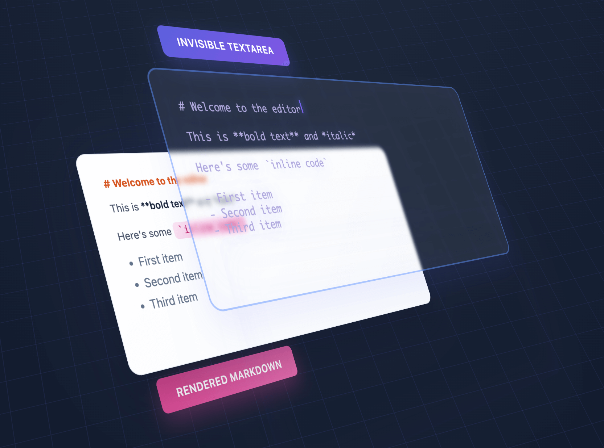

# GitHub Trending 排行榜

🔥 每周自动爬取GitHub最受欢迎的开源项目，生成AI智能总结的中文排行榜

[](https://github.com/qfy123/GitHub-Trending-/actions)
[](https://nodejs.org/)
[](LICENSE)

## ✨ 特性

- 🤖 **AI智能总结** - 使用DeepSeek AI生成简洁的中文项目描述
- 📊 **多维度排名** - 综合Star数、活跃度、新鲜度等指标
- 🖼️ **自动爬取图片** - 从项目README提取代表性图片
- 📈 **趋势分析** - 对比历史数据，显示项目排名变化
- 🗂️ **完整归档** - 按年份/周数归档所有历史数据
- 🔄 **自动更新** - GitHub Actions每周自动执行

## 📈 本周排行榜

<!-- TRENDING-START -->
### GitHub趋势排行榜 - 2025年第34周

**📅 统计周期**: 2025-08-17 ~ 2025-08-23  
**📊 项目总数**: 10 个  
**⭐ 总Star数**: 6,476  
**🔄 更新时间**: 2025-08-23 23:59:59  

| 排名 | 项目 | 描述 | Star | Fork | 语言 | 趋势 |
|------|------|------|------|------|------|------|
| 1 | [LunaTV](https://github.com/MoonTechLab/LunaTV) | 跨平台影视聚合播放器，一键聚合多源搜索、在线播放、收藏同步，免广告畅享海量免费影视。 | 2,179 | 924 | Unknown | 🆕 |
| 2 | [synapse-bot](https://github.com/anthugeist/synapse-bot) | 开源多功能加密货币交易机器人，实时整合行情、社媒情绪与历史模式，提供AI信号、回测与Telegram远程控制。 | 630 | 465 | Python | 🆕 |
| 3 | [keyboard-signature](https://github.com/cnrad/keyboard-signature) | 将键盘输入转化为独一无二的二维“指纹”签名，替代传统手写签名，实现数字化身份标识。 | 519 | 50 | TypeScript | 🆕 |
| 4 | [doxx](https://github.com/bgreenwell/doxx) | 用Rust编写的终端级.docx查看器，无需Office即可在命令行中快速、安全地浏览Word文档。 | 700 | 7 | Rust | 🆕 |
| 5 | [Stand-In](https://github.com/WeChatCV/Stand-In) | 轻量级即插即用框架，仅需训练1%参数即可在视频生成中保持人物身份一致性，无需重训大模型。 | 419 | 35 | Python | 🆕 |
| 6 | [Hunyuan-GameCraft-1.0](https://github.com/Tencent-Hunyuan/Hunyuan-GameCraft-1.0) | 腾讯混元团队开源的高动态交互式游戏视频生成模型，支持根据历史帧与动作指令实时生成连贯游戏画面。 | 388 | 34 | Python | 🆕 |
| 7 | [overtype](https://github.com/panphora/overtype) | 超轻量 Markdown 编辑器，用隐藏 textarea 覆盖预览层，实现所见即所得，体积仅 45 KB。 | 490 | 7 | JavaScript | 🆕 |
| 8 | [NextStep-1](https://github.com/stepfun-ai/NextStep-1) | 140亿参数的自回归图像生成模型，用连续token替代离散VQ，兼顾质量与效率，突破扩散模型高成本瓶颈。 | 398 | 10 | Python | 🆕 |
| 9 | [RLFromScratch](https://github.com/mingyin0312/RLFromScratch) | 纯PyTorch手写GRPO与DPO算法，揭开大模型对齐黑箱，1小时让1B模型GSM8K提升13%。 | 391 | 28 | Python | 🆕 |
| 10 | [warzone-cheat](https://github.com/BO6-Warzone-cheat/warzone-cheat) | 为《使命召唤：Warzone》提供自瞄、透视、全解锁等外挂功能，提升射击精度与战场感知。 | 362 | 1 | Unknown | 🆕 |

### 🔥 详细介绍

#### 1. [LunaTV](https://github.com/MoonTechLab/LunaTV) 

**📝 项目简介**: 跨平台影视聚合播放器，一键聚合多源搜索、在线播放、收藏同步，免广告畅享海量免费影视。

**✨ 核心特性**:
- 多源聚合搜索，秒出结果
- 多端同步收藏与播放进度
- PWA离线安装，移动端原生体验

**📊 项目统计**:
- **⭐ Star数**: 2,179
- **🔀 Fork数**: 924
- **👀 Watch数**: 2,179
- **📝 语言**: Unknown
- **💻 技术栈**: Docker, Redis, TypeScript
- **📈 趋势**: 🆕 新上榜项目

---

#### 2. [synapse-bot](https://github.com/anthugeist/synapse-bot) 

**📝 项目简介**: 开源多功能加密货币交易机器人，实时整合行情、社媒情绪与历史模式，提供AI信号、回测与Telegram远程控制。

**✨ 核心特性**:
- AI驱动的实时交易信号
- 支持回测与多交易所接入
- Telegram远程监控与操作

**📊 项目统计**:
- **⭐ Star数**: 630
- **🔀 Fork数**: 465
- **👀 Watch数**: 630
- **📝 语言**: Python
- **💻 技术栈**: Python, Batchfile, Dockerfile, bitcoin, bitcoin-trading, crypto
- **📈 趋势**: 🆕 新上榜项目

---

#### 3. [keyboard-signature](https://github.com/cnrad/keyboard-signature) 

**📝 项目简介**: 将键盘输入转化为独一无二的二维“指纹”签名，替代传统手写签名，实现数字化身份标识。

**✨ 核心特性**:
- 零依赖轻量实现
- 实时可视化签名
- 可嵌入任何网页

**📊 项目统计**:
- **⭐ Star数**: 519
- **🔀 Fork数**: 50
- **👀 Watch数**: 519
- **📝 语言**: TypeScript
- **🌐 官网**: [https://signature.cnrad.dev](https://signature.cnrad.dev)
- **💻 技术栈**: TypeScript, JavaScript, CSS
- **📈 趋势**: 🆕 新上榜项目

---

#### 4. [doxx](https://github.com/bgreenwell/doxx) 


**📝 项目简介**: 用Rust编写的终端级.docx查看器，无需Office即可在命令行中快速、安全地浏览Word文档。

**✨ 核心特性**:
- 终端原生渲染，无需Word
- 极速解析，占用极低
- 支持表格、导出与美化显示

**📊 项目统计**:
- **⭐ Star数**: 700
- **🔀 Fork数**: 7
- **👀 Watch数**: 700
- **📝 语言**: Rust
- **💻 技术栈**: Rust, Shell
- **📈 趋势**: 🆕 新上榜项目

---

#### 5. [Stand-In](https://github.com/WeChatCV/Stand-In) 


**📝 项目简介**: 轻量级即插即用框架，仅需训练1%参数即可在视频生成中保持人物身份一致性，无需重训大模型。

**✨ 核心特性**:
- 训练成本低
- 即插即用
- 身份一致性高

**📊 项目统计**:
- **⭐ Star数**: 419
- **🔀 Fork数**: 35
- **👀 Watch数**: 419
- **📝 语言**: Python
- **💻 技术栈**: Python, Express, AWS
- **📈 趋势**: 🆕 新上榜项目

---

#### 6. [Hunyuan-GameCraft-1.0](https://github.com/Tencent-Hunyuan/Hunyuan-GameCraft-1.0) 

**📝 项目简介**: 腾讯混元团队开源的高动态交互式游戏视频生成模型，支持根据历史帧与动作指令实时生成连贯游戏画面。

**✨ 核心特性**:
- 高动态范围画质，保持帧间一致性
- 混合历史条件建模，精准响应用户操作
- 开源完整推理与微调代码，支持Docker一键部署

**📊 项目统计**:
- **⭐ Star数**: 388
- **🔀 Fork数**: 34
- **👀 Watch数**: 388
- **📝 语言**: Python
- **🌐 官网**: [https://hunyuan-gamecraft.github.io/](https://hunyuan-gamecraft.github.io/)
- **💻 技术栈**: Python, Shell, Docker
- **📈 趋势**: 🆕 新上榜项目

---

#### 7. [overtype](https://github.com/panphora/overtype) 



**📝 项目简介**: 超轻量 Markdown 编辑器，用隐藏 textarea 覆盖预览层，实现所见即所得，体积仅 45 KB。

**✨ 核心特性**:
- 隐形输入层实现完美 WYSIWYG
- 内置明暗主题与快捷键
- 移动端优化，开箱即用

**📊 项目统计**:
- **⭐ Star数**: 490
- **🔀 Fork数**: 7
- **👀 Watch数**: 490
- **📝 语言**: JavaScript
- **💻 技术栈**: JavaScript, HTML, React, Vue, AWS
- **📈 趋势**: 🆕 新上榜项目

---

#### 8. [NextStep-1](https://github.com/stepfun-ai/NextStep-1) 


**📝 项目简介**: 140亿参数的自回归图像生成模型，用连续token替代离散VQ，兼顾质量与效率，突破扩散模型高成本瓶颈。

**✨ 核心特性**:
- 140亿参数规模
- 连续token无需VQ压缩
- 自回归生成高质量图像

**📊 项目统计**:
- **⭐ Star数**: 398
- **🔀 Fork数**: 10
- **👀 Watch数**: 398
- **📝 语言**: Python
- **💻 技术栈**: Python, Express, AWS
- **📈 趋势**: 🆕 新上榜项目

---

#### 9. [RLFromScratch](https://github.com/mingyin0312/RLFromScratch) 

**📝 项目简介**: 纯PyTorch手写GRPO与DPO算法，揭开大模型对齐黑箱，1小时让1B模型GSM8K提升13%。

**✨ 核心特性**:
- 零依赖实现GRPO/DPO
- 完整训练细节公开
- 1B模型1epoch显著提升

**📊 项目统计**:
- **⭐ Star数**: 391
- **🔀 Fork数**: 28
- **👀 Watch数**: 391
- **📝 语言**: Python
- **💻 技术栈**: Python
- **📈 趋势**: 🆕 新上榜项目

---

#### 10. [warzone-cheat](https://github.com/BO6-Warzone-cheat/warzone-cheat) 

**📝 项目简介**: 为《使命召唤：Warzone》提供自瞄、透视、全解锁等外挂功能，提升射击精度与战场感知。

**✨ 核心特性**:
- 精准自瞄
- ESP透视与墙体透视
- 一键解锁全部皮肤与道具

**📊 项目统计**:
- **⭐ Star数**: 362
- **🔀 Fork数**: 1
- **👀 Watch数**: 362
- **📝 语言**: Unknown
- **🌐 官网**: [https://discord.gg/elusiongg](https://discord.gg/elusiongg)
- **💻 技术栈**: Express
- **📈 趋势**: 🆕 新上榜项目

---

### 📈 本周统计

**🔥 热门语言**:
1. **Python** (5 个项目)
2. **Unknown** (2 个项目)
3. **TypeScript** (1 个项目)
4. **Rust** (1 个项目)
5. **JavaScript** (1 个项目)

**🏷️ 热门话题**:
1. bitcoin (1)
2. bitcoin-trading (1)
3. crypto (1)
4. cryptocurrency (1)
5. open-source (1)
6. trading (1)
7. trading-bot (1)
8. trading-strategies (1)


<!-- TRENDING-END -->

## 📚 历史数据

<!-- HISTORY-START -->
| 时间 | 周期 | 项目数 | 链接 |
|------|------|--------|------|
| 08-23 | 2025年第34周 | 10 个 | [查看详情](./archives/2025/week-34/report.md) |
| 08-16 | 2025年第33周 | 3 个 | [查看详情](./archives/2025/week-33/report.md) |

<!-- HISTORY-END -->

## 🚀 快速开始

### 1. 克隆项目

```bash
git clone https://github.com/your-username/GitHub-Trending.git
cd GitHub-Trending
```

### 2. 安装依赖

```bash
npm install
```

### 3. 配置环境变量

```bash
# 复制环境变量模板
cp .env.example .env

# 编辑 .env 文件，填入以下必需配置：
# GITHUB_TOKEN=your_github_token
# SILICONFLOW_API_KEY=your_siliconflow_api_key
```

### 4. 测试配置

```bash
# 系统测试
node test/system-test.js

# 配置检查
node scripts/update-trending.js --check
```

### 5. 运行项目

```bash
# 测试运行（少量数据）
node scripts/update-trending.js --limit 3

# 正式运行
node scripts/update-trending.js
```

## 🔧 配置说明

### 环境变量

| 变量名 | 必需 | 说明 | 获取方式 |
|--------|------|------|----------|
| `GITHUB_TOKEN` | ✅ | GitHub API访问令牌 | [GitHub设置](https://github.com/settings/tokens) |
| `SILICONFLOW_API_KEY` | ✅ | 硅基流动API密钥 | [硅基流动官网](https://siliconflow.cn) |
| `AI_BASE_URL` | ❌ | AI服务地址 | 默认硅基流动 |
| `AI_MODEL` | ❌ | AI模型名称 | 默认deepseek-chat |

详细配置请参考：[配置指南](config/README.md)

### GitHub Actions自动化

1. **Fork本项目**到你的GitHub账号
2. **设置Secrets**：
   - `SILICONFLOW_API_KEY`: 硅基流动API密钥
3. **启用Actions**：项目会自动每周一更新

详细设置请参考：[GitHub Actions配置](-.github/README.md)

## 📊 项目结构

```
GitHub-Trending/
├── src/                          # 核心源码
│   ├── github-api.js            # GitHub API调用
│   ├── ai-summarizer.js         # AI项目总结
│   ├── image-crawler.js         # 图片爬取
│   ├── data-processor.js        # 数据处理
│   ├── file-manager.js          # 文件管理
│   └── readme-updater.js        # README更新
├── scripts/                      # 执行脚本
│   └── update-trending.js       # 主执行脚本
├── test/                         # 测试文件
│   └── system-test.js           # 系统测试
├── archives/                     # 历史数据归档
│   └── YYYY/                    # 按年份归档
│       └── week-XX.md           # 周报文件
├── images/                       # 项目图片
│   └── YYYY/week-XX/            # 按周归档
├── data/                         # 临时数据
├── config/                       # 配置文档
├── .github/                      # GitHub Actions
│   └── workflows/
└── README.md                     # 项目说明
```

## 🎯 使用场景

### 开发者
- 🔍 **发现新项目** - 了解最新热门开源项目
- 📈 **技术趋势** - 跟踪编程语言和技术栈趋势
- 💡 **学习参考** - 学习优秀项目的设计和实现

### 技术团队
- 📊 **技术选型** - 参考热门项目进行技术选型
- 🎯 **竞品分析** - 关注同类项目的发展趋势
- 📝 **技术报告** - 生成定期的技术趋势报告

### 内容创作者
- ✍️ **素材收集** - 为技术文章和视频收集素材
- 📰 **新闻线索** - 发现值得报道的新兴项目
- 🗣️ **分享内容** - 分享有价值的开源项目

## 🛠️ 命令行工具

```bash
# 查看帮助
node scripts/update-trending.js --help

# 检查配置
node scripts/update-trending.js --check

# 自定义参数运行
node scripts/update-trending.js --limit 20 --language python

# 数据管理
node scripts/update-trending.js --backup     # 创建备份
node scripts/update-trending.js --cleanup    # 清理过期数据
node scripts/update-trending.js --stats      # 查看统计信息

# 系统测试
node test/system-test.js                      # 完整测试
node test/system-test.js --quick             # 快速诊断
```

## 📈 排名算法

项目排名基于以下三个维度的综合评分：

### 🌟 受欢迎程度 (50%)
- **Star数量** (60%): 项目获得的Star数
- **Fork数量** (25%): 项目被Fork的次数  
- **Watch数量** (15%): 项目被Watch的次数

### 🔥 活跃程度 (30%)
- **最近提交** (50%): 距离最后一次提交的时间
- **Issues活跃度** (30%): 开放的Issues数量
- **Fork活跃度** (20%): Fork的活跃程度

### 🆕 新鲜程度 (20%)
- **创建时间** (30%): 项目创建时间（新项目得分高）
- **更新时间** (70%): 最近更新时间

### 趋势分析
- 📈 **上升**: 排名比上周提升
- 📉 **下降**: 排名比上周下降  
- ➡️ **稳定**: 排名无明显变化
- 🆕 **新上榜**: 首次进入排行榜

## 🤝 贡献指南

欢迎提交 Issues 和 Pull Requests！

### 开发环境设置

```bash
# 1. Fork 并克隆项目
git clone https://github.com/your-username/GitHub-Trending.git

# 2. 创建功能分支
git checkout -b feature/your-feature

# 3. 安装依赖并测试
npm install
node test/system-test.js

# 4. 开发完成后提交
git commit -m "feat: 添加新功能"
git push origin feature/your-feature
```

### 提交规范

- `feat`: 新功能
- `fix`: 修复bug
- `docs`: 文档更新
- `style`: 代码格式调整
- `refactor`: 代码重构
- `test`: 测试相关
- `chore`: 构建/工具相关

## 📄 许可证

本项目基于 [MIT 许可证](LICENSE) 开源。

## 🙏 致谢

- [GitHub API](https://docs.github.com/en/rest) - 提供项目数据
- [硅基流动](https://siliconflow.cn) - 提供AI总结服务
- [DeepSeek](https://deepseek.com) - 优秀的AI模型
- [GitHub Actions](https://github.com/features/actions) - 自动化支持

## 📞 联系方式

- 🐛 **Bug报告**: [提交Issue](https://github.com/your-username/GitHub-Trending/issues)
- 💡 **功能建议**: [功能请求](https://github.com/your-username/GitHub-Trending/issues)
- 📧 **其他问题**: [发送邮件](mailto:your-email@example.com)

## 🔗 相关链接

- [项目文档](https://github.com/your-username/GitHub-Trending/wiki)
- [更新日志](CHANGELOG.md)
- [FAQ](FAQ.md)

---

⭐ 如果这个项目对你有帮助，请给它一个Star！

*本项目由 [GitHub Actions](https://github.com/features/actions) 自动维护，数据每周更新*