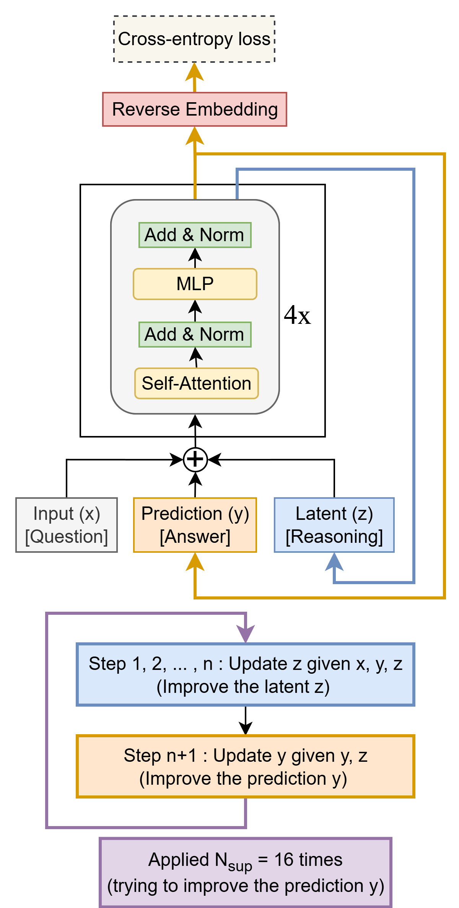
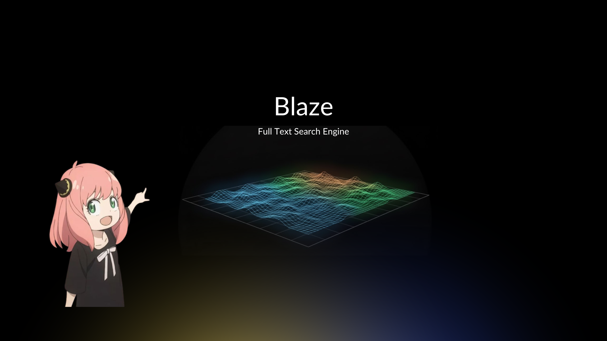

# GitHub Trending 排行榜

🔥 每周自动爬取GitHub最受欢迎的开源项目，生成AI智能总结的中文排行榜

[](https://github.com/qfy123/GitHub-Trending-/actions)
[](https://nodejs.org/)
[](LICENSE)

## ✨ 特性

- 🤖 **AI智能总结** - 使用DeepSeek AI生成简洁的中文项目描述
- 📊 **多维度排名** - 综合Star数、活跃度、新鲜度等指标
- 🖼️ **自动爬取图片** - 从项目README提取代表性图片
- 📈 **趋势分析** - 对比历史数据，显示项目排名变化
- 🗂️ **完整归档** - 按年份/周数归档所有历史数据
- 🔄 **自动更新** - GitHub Actions每周自动执行

## 📈 本周排行榜

<!-- TRENDING-START -->
### GitHub趋势排行榜 - 2025年第42周

**📅 统计周期**: 2025-10-12 ~ 2025-10-18  
**📊 项目总数**: 10 个  
**⭐ 总Star数**: 9,118  
**🔄 更新时间**: 2025-10-18 23:59:59  

| 排名 | 项目 | 描述 | Star | Fork | 语言 | 趋势 |
|------|------|------|------|------|------|------|
| 1 | [TinyRecursiveModels](https://github.com/SamsungSAILMontreal/TinyRecursiveModels) | 用仅7M参数的微型递归网络，在ARC-AGI抽象推理基准上取得45%高分，证明“小模型+递归”也能挑战大模型。 | 3,829 | 454 | Python | 🆕 |
| 2 | [unnamed_game_1_v2](https://github.com/Mordoria/unnamed_game_1_v2) | ThePrimeagen等主播在24×7直播塔防挑战后开源的Lua游戏，社区持续迭代，首版已可玩。 | 996 | 93 | Lua | 🆕 |
| 3 | [superpowers](https://github.com/obra/superpowers) | 为Claude Code注入“超能力”的Shell插件，一键拉取并本地管理可复用的技能库，让AI助手随用随增强。 | 727 | 44 | Shell | 🆕 |
| 4 | [Microverse](https://github.com/KsanaDock/Microverse) | Godot 4打造的多智能体沙盒，AI角色自主思考、记忆并演化复杂社会关系，像斯坦福小镇般自运行。 | 626 | 129 | GDScript | 🆕 |
| 5 | [crypto-tax-calculator](https://github.com/Uak0/crypto-tax-calculator) | 开源加密资产与个人所得税计算器，支持交易、质押、空投、NFT等多场景，一键生成符合美国等多辖区合规报表。 | 594 | 174 | Python | 🆕 |
| 6 | [claude-skills](https://github.com/simonw/claude-skills) | 提取并公开Claude代码解释器/mnt/skills目录下的全部技能脚本，方便开发者研究、复用与二次开发。 | 601 | 83 | Python | 🆕 |
| 7 | [MimicKit](https://github.com/xbpeng/MimicKit) | 基于Isaac Gym的Python套件，集成多种运动模仿与强化学习算法，一键训练高保真运动控制器。 | 581 | 42 | Python | 🆕 |
| 8 | [sora-extend](https://github.com/mshumer/sora-extend) | 通过首尾帧接力与智能分镜，把Sora 2的12秒限制突破为任意长度，并保持画面连贯。 | 411 | 75 | Jupyter Notebook | 🆕 |
| 9 | [agentic-design-patterns-cn](https://github.com/ginobefun/agentic-design-patterns-cn) | Antonio Gulli《Agentic Design Patterns》双语对照译本，系统梳理AI智能体设计模... | 393 | 44 | Python | 🆕 |
| 10 | [blaze](https://github.com/wizenheimer/blaze) | Blaze是一款轻量级全文搜索引擎，专为开发者打造，支持倒排索引、布尔/短语/邻近查询及BM25排序，可嵌入各类应用。 | 360 | 6 | Go | 🆕 |

### 🔥 详细介绍

#### 1. [TinyRecursiveModels](https://github.com/SamsungSAILMontreal/TinyRecursiveModels) 



**📝 项目简介**: 用仅7M参数的微型递归网络，在ARC-AGI抽象推理基准上取得45%高分，证明“小模型+递归”也能挑战大模型。

**✨ 核心特性**:
- 7M超小参数量
- 递归推理架构
- ARC-AGI-1达45%SOTA成绩

**📊 项目统计**:
- **⭐ Star数**: 3,829
- **🔀 Fork数**: 454
- **👀 Watch数**: 3,829
- **📝 语言**: Python
- **💻 技术栈**: Python
- **📈 趋势**: 🆕 新上榜项目

---

#### 2. [unnamed_game_1_v2](https://github.com/Mordoria/unnamed_game_1_v2) 

**📝 项目简介**: ThePrimeagen等主播在24×7直播塔防挑战后开源的Lua游戏，社区持续迭代，首版已可玩。

**✨ 核心特性**:
- 直播共创、社区驱动开发
- Lua+GLSL轻量高性能
- 首版即放出完整可玩状态

**📊 项目统计**:
- **⭐ Star数**: 996
- **🔀 Fork数**: 93
- **👀 Watch数**: 996
- **📝 语言**: Lua
- **💻 技术栈**: Lua, GLSL, Roff
- **📈 趋势**: 🆕 新上榜项目

---

#### 3. [superpowers](https://github.com/obra/superpowers) 

**📝 项目简介**: 为Claude Code注入“超能力”的Shell插件，一键拉取并本地管理可复用的技能库，让AI助手随用随增强。

**✨ 核心特性**:
- 极简shim，自动克隆/更新技能仓库
- 技能、脚本与文档独立维护，可自由贡献
- 本地编辑即时生效，无需重启环境

**📊 项目统计**:
- **⭐ Star数**: 727
- **🔀 Fork数**: 44
- **👀 Watch数**: 727
- **📝 语言**: Shell
- **💻 技术栈**: Shell
- **📈 趋势**: 🆕 新上榜项目

---

#### 4. [Microverse](https://github.com/KsanaDock/Microverse) 


**📝 项目简介**: Godot 4打造的多智能体沙盒，AI角色自主思考、记忆并演化复杂社会关系，像斯坦福小镇般自运行。

**✨ 核心特性**:
- AI角色拥有独立思维与持久记忆
- 多智能体实时社交、协作与任务执行
- 支持大模型对话API，易扩展新行为

**📊 项目统计**:
- **⭐ Star数**: 626
- **🔀 Fork数**: 129
- **👀 Watch数**: 626
- **📝 语言**: GDScript
- **💻 技术栈**: GDScript, REST API
- **📈 趋势**: 🆕 新上榜项目

---

#### 5. [crypto-tax-calculator](https://github.com/Uak0/crypto-tax-calculator) 


**📝 项目简介**: 开源加密资产与个人所得税计算器，支持交易、质押、空投、NFT等多场景，一键生成符合美国等多辖区合规报表。

**✨ 核心特性**:
- 统一导入引擎（UIE）自动归集全平台数据
- 覆盖交易、挖矿、质押、空投、NFT等全场景
- 开源透明，可自定义规则适配多国税制

**📊 项目统计**:
- **⭐ Star数**: 594
- **🔀 Fork数**: 174
- **👀 Watch数**: 594
- **📝 语言**: Python
- **💻 技术栈**: Python, bitcoin, crypto, crypto-tax-reports, cryptocurrency, cryptotax
- **📈 趋势**: 🆕 新上榜项目

---

#### 6. [claude-skills](https://github.com/simonw/claude-skills) 

**📝 项目简介**: 提取并公开Claude代码解释器/mnt/skills目录下的全部技能脚本，方便开发者研究、复用与二次开发。

**✨ 核心特性**:
- 完整还原Claude官方技能包
- 一键获取所有内置工具源码
- 开源可自由扩展与改进

**📊 项目统计**:
- **⭐ Star数**: 601
- **🔀 Fork数**: 83
- **👀 Watch数**: 601
- **📝 语言**: Python
- **💻 技术栈**: Python
- **📈 趋势**: 🆕 新上榜项目

---

#### 7. [MimicKit](https://github.com/xbpeng/MimicKit) 

**📝 项目简介**: 基于Isaac Gym的Python套件，集成多种运动模仿与强化学习算法，一键训练高保真运动控制器。

**✨ 核心特性**:
- 集成主流运动模仿方法
- 内置RL算法库
- Isaac Gym高并行仿真加速

**📊 项目统计**:
- **⭐ Star数**: 581
- **🔀 Fork数**: 42
- **👀 Watch数**: 581
- **📝 语言**: Python
- **💻 技术栈**: Python
- **📈 趋势**: 🆕 新上榜项目

---

#### 8. [sora-extend](https://github.com/mshumer/sora-extend) 


**📝 项目简介**: 通过首尾帧接力与智能分镜，把Sora 2的12秒限制突破为任意长度，并保持画面连贯。

**✨ 核心特性**:
- 首尾帧接力无缝衔接
- 自动拆分提示词保持叙事一致
- 纯Notebook零依赖一键运行

**📊 项目统计**:
- **⭐ Star数**: 411
- **🔀 Fork数**: 75
- **👀 Watch数**: 411
- **📝 语言**: Jupyter Notebook
- **💻 技术栈**: Jupyter Notebook
- **📈 趋势**: 🆕 新上榜项目

---

#### 9. [agentic-design-patterns-cn](https://github.com/ginobefun/agentic-design-patterns-cn) 


**📝 项目简介**: Antonio Gulli《Agentic Design Patterns》双语对照译本，系统梳理AI智能体设计模式，帮助中文读者快速掌握构建智能系统的核心方法。

**✨ 核心特性**:
- 官方授权中英对照，术语准确
- 覆盖现代AI智能体主流设计模式
- 提供Python+Spring实战示例

**📊 项目统计**:
- **⭐ Star数**: 393
- **🔀 Fork数**: 44
- **👀 Watch数**: 393
- **📝 语言**: Python
- **💻 技术栈**: Python, Spring
- **📈 趋势**: 🆕 新上榜项目

---

#### 10. [blaze](https://github.com/wizenheimer/blaze) 



**📝 项目简介**: Blaze是一款轻量级全文搜索引擎，专为开发者打造，支持倒排索引、布尔/短语/邻近查询及BM25排序，可嵌入各类应用。

**✨ 核心特性**:
- 代码精简，可完全读懂与二次开发
- 支持布尔、短语、邻近等多种查询
- 内置BM25评分与Roaring Bitmaps加速

**📊 项目统计**:
- **⭐ Star数**: 360
- **🔀 Fork数**: 6
- **👀 Watch数**: 360
- **📝 语言**: Go
- **🌐 官网**: [https://wizenheimer.github.io/blaze](https://wizenheimer.github.io/blaze)
- **💻 技术栈**: Go, Makefile, Express, Django, Redis
- **📈 趋势**: 🆕 新上榜项目

---

### 📈 本周统计

**🔥 热门语言**:
1. **Python** (5 个项目)
2. **Lua** (1 个项目)
3. **Shell** (1 个项目)
4. **GDScript** (1 个项目)
5. **Jupyter Notebook** (1 个项目)

**🏷️ 热门话题**:
1. bitcoin (1)
2. crypto (1)
3. crypto-tax-reports (1)
4. cryptocurrency (1)
5. cryptotax (1)
6. tax (1)
7. tax-calculation (1)
8. tax-calculator (1)


<!-- TRENDING-END -->

## 📚 历史数据

<!-- HISTORY-START -->
| 时间 | 周期 | 项目数 | 链接 |
|------|------|--------|------|
| 10-18 | 2025年第42周 | 10 个 | [查看详情](./archives/2025/week-42/report.md) |
| 10-11 | 2025年第41周 | 10 个 | [查看详情](./archives/2025/week-41/report.md) |
| 10-04 | 2025年第40周 | 10 个 | [查看详情](./archives/2025/week-40/report.md) |
| 09-27 | 2025年第39周 | 10 个 | [查看详情](./archives/2025/week-39/report.md) |
| 09-20 | 2025年第38周 | 10 个 | [查看详情](./archives/2025/week-38/report.md) |
| 09-13 | 2025年第37周 | 10 个 | [查看详情](./archives/2025/week-37/report.md) |
| 09-06 | 2025年第36周 | 10 个 | [查看详情](./archives/2025/week-36/report.md) |
| 08-30 | 2025年第35周 | 10 个 | [查看详情](./archives/2025/week-35/report.md) |
| 08-23 | 2025年第34周 | 10 个 | [查看详情](./archives/2025/week-34/report.md) |
| 08-16 | 2025年第33周 | 3 个 | [查看详情](./archives/2025/week-33/report.md) |

<!-- HISTORY-END -->

## 🚀 快速开始

### 1. 克隆项目

```bash
git clone https://github.com/your-username/GitHub-Trending.git
cd GitHub-Trending
```

### 2. 安装依赖

```bash
npm install
```

### 3. 配置环境变量

```bash
# 复制环境变量模板
cp .env.example .env

# 编辑 .env 文件，填入以下必需配置：
# GITHUB_TOKEN=your_github_token
# SILICONFLOW_API_KEY=your_siliconflow_api_key
```

### 4. 测试配置

```bash
# 系统测试
node test/system-test.js

# 配置检查
node scripts/update-trending.js --check
```

### 5. 运行项目

```bash
# 测试运行（少量数据）
node scripts/update-trending.js --limit 3

# 正式运行
node scripts/update-trending.js
```

## 🔧 配置说明

### 环境变量

| 变量名 | 必需 | 说明 | 获取方式 |
|--------|------|------|----------|
| `GITHUB_TOKEN` | ✅ | GitHub API访问令牌 | [GitHub设置](https://github.com/settings/tokens) |
| `SILICONFLOW_API_KEY` | ✅ | 硅基流动API密钥 | [硅基流动官网](https://siliconflow.cn) |
| `AI_BASE_URL` | ❌ | AI服务地址 | 默认硅基流动 |
| `AI_MODEL` | ❌ | AI模型名称 | 默认deepseek-chat |

详细配置请参考：[配置指南](config/README.md)

### GitHub Actions自动化

1. **Fork本项目**到你的GitHub账号
2. **设置Secrets**：
   - `SILICONFLOW_API_KEY`: 硅基流动API密钥
3. **启用Actions**：项目会自动每周一更新

详细设置请参考：[GitHub Actions配置](-.github/README.md)

## 📊 项目结构

```
GitHub-Trending/
├── src/                          # 核心源码
│   ├── github-api.js            # GitHub API调用
│   ├── ai-summarizer.js         # AI项目总结
│   ├── image-crawler.js         # 图片爬取
│   ├── data-processor.js        # 数据处理
│   ├── file-manager.js          # 文件管理
│   └── readme-updater.js        # README更新
├── scripts/                      # 执行脚本
│   └── update-trending.js       # 主执行脚本
├── test/                         # 测试文件
│   └── system-test.js           # 系统测试
├── archives/                     # 历史数据归档
│   └── YYYY/                    # 按年份归档
│       └── week-XX.md           # 周报文件
├── images/                       # 项目图片
│   └── YYYY/week-XX/            # 按周归档
├── data/                         # 临时数据
├── config/                       # 配置文档
├── .github/                      # GitHub Actions
│   └── workflows/
└── README.md                     # 项目说明
```

## 🎯 使用场景

### 开发者
- 🔍 **发现新项目** - 了解最新热门开源项目
- 📈 **技术趋势** - 跟踪编程语言和技术栈趋势
- 💡 **学习参考** - 学习优秀项目的设计和实现

### 技术团队
- 📊 **技术选型** - 参考热门项目进行技术选型
- 🎯 **竞品分析** - 关注同类项目的发展趋势
- 📝 **技术报告** - 生成定期的技术趋势报告

### 内容创作者
- ✍️ **素材收集** - 为技术文章和视频收集素材
- 📰 **新闻线索** - 发现值得报道的新兴项目
- 🗣️ **分享内容** - 分享有价值的开源项目

## 🛠️ 命令行工具

```bash
# 查看帮助
node scripts/update-trending.js --help

# 检查配置
node scripts/update-trending.js --check

# 自定义参数运行
node scripts/update-trending.js --limit 20 --language python

# 数据管理
node scripts/update-trending.js --backup     # 创建备份
node scripts/update-trending.js --cleanup    # 清理过期数据
node scripts/update-trending.js --stats      # 查看统计信息

# 系统测试
node test/system-test.js                      # 完整测试
node test/system-test.js --quick             # 快速诊断
```

## 📈 排名算法

项目排名基于以下三个维度的综合评分：

### 🌟 受欢迎程度 (50%)
- **Star数量** (60%): 项目获得的Star数
- **Fork数量** (25%): 项目被Fork的次数  
- **Watch数量** (15%): 项目被Watch的次数

### 🔥 活跃程度 (30%)
- **最近提交** (50%): 距离最后一次提交的时间
- **Issues活跃度** (30%): 开放的Issues数量
- **Fork活跃度** (20%): Fork的活跃程度

### 🆕 新鲜程度 (20%)
- **创建时间** (30%): 项目创建时间（新项目得分高）
- **更新时间** (70%): 最近更新时间

### 趋势分析
- 📈 **上升**: 排名比上周提升
- 📉 **下降**: 排名比上周下降  
- ➡️ **稳定**: 排名无明显变化
- 🆕 **新上榜**: 首次进入排行榜

## 🤝 贡献指南

欢迎提交 Issues 和 Pull Requests！

### 开发环境设置

```bash
# 1. Fork 并克隆项目
git clone https://github.com/your-username/GitHub-Trending.git

# 2. 创建功能分支
git checkout -b feature/your-feature

# 3. 安装依赖并测试
npm install
node test/system-test.js

# 4. 开发完成后提交
git commit -m "feat: 添加新功能"
git push origin feature/your-feature
```

### 提交规范

- `feat`: 新功能
- `fix`: 修复bug
- `docs`: 文档更新
- `style`: 代码格式调整
- `refactor`: 代码重构
- `test`: 测试相关
- `chore`: 构建/工具相关

## 📄 许可证

本项目基于 [MIT 许可证](LICENSE) 开源。

## 🙏 致谢

- [GitHub API](https://docs.github.com/en/rest) - 提供项目数据
- [硅基流动](https://siliconflow.cn) - 提供AI总结服务
- [DeepSeek](https://deepseek.com) - 优秀的AI模型
- [GitHub Actions](https://github.com/features/actions) - 自动化支持

## 📞 联系方式

- 🐛 **Bug报告**: [提交Issue](https://github.com/your-username/GitHub-Trending/issues)
- 💡 **功能建议**: [功能请求](https://github.com/your-username/GitHub-Trending/issues)
- 📧 **其他问题**: [发送邮件](mailto:your-email@example.com)

## 🔗 相关链接

- [项目文档](https://github.com/your-username/GitHub-Trending/wiki)
- [更新日志](CHANGELOG.md)
- [FAQ](FAQ.md)

---

⭐ 如果这个项目对你有帮助，请给它一个Star！

*本项目由 [GitHub Actions](https://github.com/features/actions) 自动维护，数据每周更新*