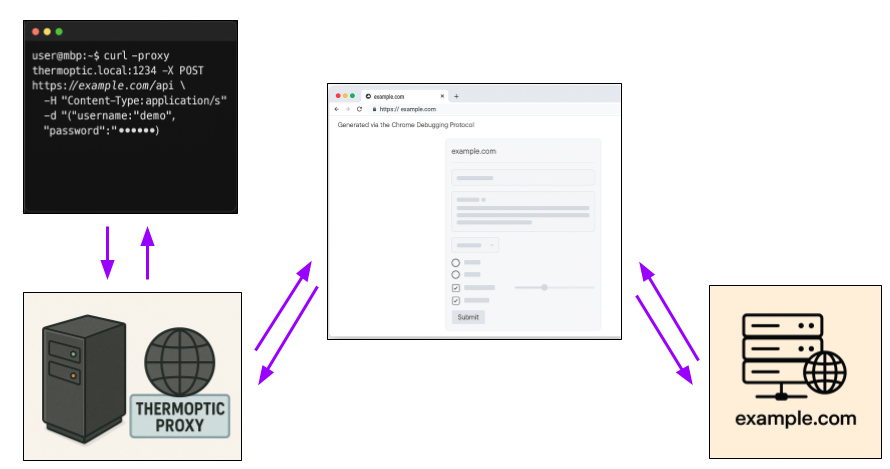

# GitHub Trending 排行榜

🔥 每周自动爬取GitHub最受欢迎的开源项目，生成AI智能总结的中文排行榜

[](https://github.com/qfy123/GitHub-Trending-/actions)
[](https://nodejs.org/)
[](LICENSE)

## ✨ 特性

- 🤖 **AI智能总结** - 使用DeepSeek AI生成简洁的中文项目描述
- 📊 **多维度排名** - 综合Star数、活跃度、新鲜度等指标
- 🖼️ **自动爬取图片** - 从项目README提取代表性图片
- 📈 **趋势分析** - 对比历史数据，显示项目排名变化
- 🗂️ **完整归档** - 按年份/周数归档所有历史数据
- 🔄 **自动更新** - GitHub Actions每周自动执行

## 📈 本周排行榜

<!-- TRENDING-START -->
### GitHub趋势排行榜 - 2025年第37周

**📅 统计周期**: 2025-09-07 ~ 2025-09-13  
**📊 项目总数**: 10 个  
**⭐ 总Star数**: 5,450  
**🔄 更新时间**: 2025-09-13 23:59:59  

| 排名 | 项目 | 描述 | Star | Fork | 语言 | 趋势 |
|------|------|------|------|------|------|------|
| 1 | [LidAngleSensor](https://github.com/samhenrigold/LidAngleSensor) | 实时读取并显示 MacBook 铰链角度的小工具，还能在缓慢开合时播放木门吱呀声，趣味十足。 | 1,472 | 58 | Objective-C | 🆕 |
| 2 | [linear-algebra](https://github.com/little-book-of/linear-algebra) | 一本极简线性代数入门书，用直观方式讲清向量、矩阵与空间变换的核心概念，适合零基础读者。 | 1,525 | 43 | TeX | 🆕 |
| 3 | [nano-banana-hackathon-kit](https://github.com/google-gemini/nano-banana-hackathon-kit) | Google DeepMind官方为Nano Banana黑客松准备的48小时极速开发套件，含Gemini 2.5... | 622 | 111 | Jupyter Notebook | 🆕 |
| 4 | [nano-banana-infinimap](https://github.com/seezatnap/nano-banana-infinimap) | 基于 Gemini Nano Banana 的实验性 AI 无限地图生成器，可实时生成无缝、邻接感知的瓦片地图。 | 374 | 64 | TypeScript | 🆕 |
| 5 | [liquid-glass](https://github.com/callstack/liquid-glass) | 为React Native应用带来iOS 26液态玻璃视效，一键实现模糊与色彩叠加的沉浸式UI体验。 | 280 | 11 | TypeScript | 🆕 |
| 6 | [Disciplined-AI-Software-Development](https://github.com/Varietyz/Disciplined-AI-Software-Development) | 一套与AI协作开发软件的规范方法，通过系统化约束与验证节点，解决代码膨胀、架构漂移和上下文稀释等常见痛点。 | 242 | 14 | Python | 🆕 |
| 7 | [Nano-Bananary](https://github.com/ZHO-ZHO-ZHO/Nano-Bananary) | 零门槛AI图像生成工具，支持局部涂选与连续编辑，无需输入提示词即可一键产出多样玩法。 | 217 | 36 | TypeScript | 🆕 |
| 8 | [flint](https://github.com/ccheshirecat/flint) | Flint 是一个仅 11 MB 的轻量级 KVM 虚拟机管理工具，通过现代化 Web UI、CLI 与 REST... | 270 | 6 | TypeScript | 🆕 |
| 9 | [absolutelyright](https://github.com/yoavf/absolutelyright) | 用科学方法记录并可视化Claude Code对你人生选择的肯定次数，生成1美元幽默网站的实时数据。 | 233 | 8 | Python | 🆕 |
| 10 | [thermoptic](https://github.com/mandatoryprogrammer/thermoptic) | 下一代HTTP隐形代理，将curl等客户端伪装成Chrome浏览器，绕过指纹检测封锁。 | 215 | 11 | JavaScript | 🆕 |

### 🔥 详细介绍

#### 1. [LidAngleSensor](https://github.com/samhenrigold/LidAngleSensor) 

**📝 项目简介**: 实时读取并显示 MacBook 铰链角度的小工具，还能在缓慢开合时播放木门吱呀声，趣味十足。

**✨ 核心特性**:
- 支持 2019 及以后 MacBook Pro 的 lid angle 传感器
- 可选木门吱呀音效，增加互动乐趣
- 极简 Objective-C 实现，零依赖

**📊 项目统计**:
- **⭐ Star数**: 1,472
- **🔀 Fork数**: 58
- **👀 Watch数**: 1,472
- **📝 语言**: Objective-C
- **🌐 官网**: [https://samhenri.gold](https://samhenri.gold)
- **💻 技术栈**: Objective-C
- **📈 趋势**: 🆕 新上榜项目

---

#### 2. [linear-algebra](https://github.com/little-book-of/linear-algebra) 

**📝 项目简介**: 一本极简线性代数入门书，用直观方式讲清向量、矩阵与空间变换的核心概念，适合零基础读者。

**✨ 核心特性**:
- 公式少、图解多，降低入门门槛
- 提供打印、电子书及 LaTeX 源码三种格式
- MIT 许可证，可自由再创作

**📊 项目统计**:
- **⭐ Star数**: 1,525
- **🔀 Fork数**: 43
- **👀 Watch数**: 1,525
- **📝 语言**: TeX
- **💻 技术栈**: TeX, React, Angular, Express
- **📈 趋势**: 🆕 新上榜项目

---

#### 3. [nano-banana-hackathon-kit](https://github.com/google-gemini/nano-banana-hackathon-kit) 


**📝 项目简介**: Google DeepMind官方为Nano Banana黑客松准备的48小时极速开发套件，含Gemini 2.5 Flash免费额度。

**✨ 核心特性**:
- 48小时Gemini API免费额度
- 官方认证黑客松起点
- 一键克隆即可开跑

**📊 项目统计**:
- **⭐ Star数**: 622
- **🔀 Fork数**: 111
- **👀 Watch数**: 622
- **📝 语言**: Jupyter Notebook
- **💻 技术栈**: Jupyter Notebook
- **📈 趋势**: 🆕 新上榜项目

---

#### 4. [nano-banana-infinimap](https://github.com/seezatnap/nano-banana-infinimap) 

**📝 项目简介**: 基于 Gemini Nano Banana 的实验性 AI 无限地图生成器，可实时生成无缝、邻接感知的瓦片地图。

**✨ 核心特性**:
- AI 驱动的无限地图
- 实时无缝瓦片生成
- 邻接感知一致性

**📊 项目统计**:
- **⭐ Star数**: 374
- **🔀 Fork数**: 64
- **👀 Watch数**: 374
- **📝 语言**: TypeScript
- **💻 技术栈**: TypeScript, JavaScript, CSS, React, Node.js
- **📈 趋势**: 🆕 新上榜项目

---

#### 5. [liquid-glass](https://github.com/callstack/liquid-glass) 


**📝 项目简介**: 为React Native应用带来iOS 26液态玻璃视效，一键实现模糊与色彩叠加的沉浸式UI体验。

**✨ 核心特性**:
- iOS 26原生液态玻璃效果
- 支持自定义色调
- 清晰/普通两种模式

**📊 项目统计**:
- **⭐ Star数**: 280
- **🔀 Fork数**: 11
- **👀 Watch数**: 280
- **📝 语言**: TypeScript
- **💻 技术栈**: TypeScript, Objective-C++, JavaScript, Swift, Kotlin, Ruby
- **📈 趋势**: 🆕 新上榜项目

---

#### 6. [Disciplined-AI-Software-Development](https://github.com/Varietyz/Disciplined-AI-Software-Development) 


**📝 项目简介**: 一套与AI协作开发软件的规范方法，通过系统化约束与验证节点，解决代码膨胀、架构漂移和上下文稀释等常见痛点。

**✨ 核心特性**:
- 系统化约束防止代码膨胀
- 验证节点实时纠正架构漂移
- 上下文保持机制减少信息稀释

**📊 项目统计**:
- **⭐ Star数**: 242
- **🔀 Fork数**: 14
- **👀 Watch数**: 242
- **📝 语言**: Python
- **🌐 官网**: [https://banes-lab.com](https://banes-lab.com)
- **💻 技术栈**: Python, ai, ai-agents, ai-collaboration, best-practices, collaborate
- **📈 趋势**: 🆕 新上榜项目

---

#### 7. [Nano-Bananary](https://github.com/ZHO-ZHO-ZHO/Nano-Bananary) 

**📝 项目简介**: 零门槛AI图像生成工具，支持局部涂选与连续编辑，无需输入提示词即可一键产出多样玩法。

**✨ 核心特性**:
- 无需提示词即可生成
- 局部涂选精准编辑
- 连续创作无缝衔接

**📊 项目统计**:
- **⭐ Star数**: 217
- **🔀 Fork数**: 36
- **👀 Watch数**: 217
- **📝 语言**: TypeScript
- **💻 技术栈**: TypeScript, HTML, Node.js
- **📈 趋势**: 🆕 新上榜项目

---

#### 8. [flint](https://github.com/ccheshirecat/flint) 


**📝 项目简介**: Flint 是一个仅 11 MB 的轻量级 KVM 虚拟机管理工具，通过现代化 Web UI、CLI 与 REST API 一键创建、快照、串口调试 Linux 虚拟机，告别 XML 配置。

**✨ 核心特性**:
- 单文件 <11 MB 零依赖
- Web+CLI+API 三合一操作
- 内建快照、串口、cloud-init 支持

**📊 项目统计**:
- **⭐ Star数**: 270
- **🔀 Fork数**: 6
- **👀 Watch数**: 270
- **📝 语言**: TypeScript
- **💻 技术栈**: TypeScript, Go, CSS, Makefile, HTML, Shell
- **📈 趋势**: 🆕 新上榜项目

---

#### 9. [absolutelyright](https://github.com/yoavf/absolutelyright) 

**📝 项目简介**: 用科学方法记录并可视化Claude Code对你人生选择的肯定次数，生成1美元幽默网站的实时数据。

**✨ 核心特性**:
- Rust后端+SQLite轻量API
- 前端仅用1美元成本实现图表
- Python脚本自动收集验证数据

**📊 项目统计**:
- **⭐ Star数**: 233
- **🔀 Fork数**: 8
- **👀 Watch数**: 233
- **📝 语言**: Python
- **🌐 官网**: [https://absolutelyright.lol](https://absolutelyright.lol)
- **💻 技术栈**: Python, Rust, JavaScript, CSS, HTML, Dockerfile
- **📈 趋势**: 🆕 新上榜项目

---

#### 10. [thermoptic](https://github.com/mandatoryprogrammer/thermoptic) 



**📝 项目简介**: 下一代HTTP隐形代理，将curl等客户端伪装成Chrome浏览器，绕过指纹检测封锁。

**✨ 核心特性**:
- 完美模拟Chrome指纹
- 全栈层隐身
- 支持curl等常用客户端

**📊 项目统计**:
- **⭐ Star数**: 215
- **🔀 Fork数**: 11
- **👀 Watch数**: 215
- **📝 语言**: JavaScript
- **💻 技术栈**: JavaScript, HTML, Pug, Dockerfile, Shell, Docker
- **📈 趋势**: 🆕 新上榜项目

---

### 📈 本周统计

**🔥 热门语言**:
1. **TypeScript** (4 个项目)
2. **Python** (2 个项目)
3. **Objective-C** (1 个项目)
4. **TeX** (1 个项目)
5. **Jupyter Notebook** (1 个项目)

**🏷️ 热门话题**:
1. ai (1)
2. ai-agents (1)
3. ai-collaboration (1)
4. best-practices (1)
5. collaborate (1)
6. collaboration (1)
7. collaborative (1)
8. context (1)


<!-- TRENDING-END -->

## 📚 历史数据

<!-- HISTORY-START -->
| 时间 | 周期 | 项目数 | 链接 |
|------|------|--------|------|
| 09-13 | 2025年第37周 | 10 个 | [查看详情](./archives/2025/week-37/report.md) |
| 09-06 | 2025年第36周 | 10 个 | [查看详情](./archives/2025/week-36/report.md) |
| 08-30 | 2025年第35周 | 10 个 | [查看详情](./archives/2025/week-35/report.md) |
| 08-23 | 2025年第34周 | 10 个 | [查看详情](./archives/2025/week-34/report.md) |
| 08-16 | 2025年第33周 | 3 个 | [查看详情](./archives/2025/week-33/report.md) |

<!-- HISTORY-END -->

## 🚀 快速开始

### 1. 克隆项目

```bash
git clone https://github.com/your-username/GitHub-Trending.git
cd GitHub-Trending
```

### 2. 安装依赖

```bash
npm install
```

### 3. 配置环境变量

```bash
# 复制环境变量模板
cp .env.example .env

# 编辑 .env 文件，填入以下必需配置：
# GITHUB_TOKEN=your_github_token
# SILICONFLOW_API_KEY=your_siliconflow_api_key
```

### 4. 测试配置

```bash
# 系统测试
node test/system-test.js

# 配置检查
node scripts/update-trending.js --check
```

### 5. 运行项目

```bash
# 测试运行（少量数据）
node scripts/update-trending.js --limit 3

# 正式运行
node scripts/update-trending.js
```

## 🔧 配置说明

### 环境变量

| 变量名 | 必需 | 说明 | 获取方式 |
|--------|------|------|----------|
| `GITHUB_TOKEN` | ✅ | GitHub API访问令牌 | [GitHub设置](https://github.com/settings/tokens) |
| `SILICONFLOW_API_KEY` | ✅ | 硅基流动API密钥 | [硅基流动官网](https://siliconflow.cn) |
| `AI_BASE_URL` | ❌ | AI服务地址 | 默认硅基流动 |
| `AI_MODEL` | ❌ | AI模型名称 | 默认deepseek-chat |

详细配置请参考：[配置指南](config/README.md)

### GitHub Actions自动化

1. **Fork本项目**到你的GitHub账号
2. **设置Secrets**：
   - `SILICONFLOW_API_KEY`: 硅基流动API密钥
3. **启用Actions**：项目会自动每周一更新

详细设置请参考：[GitHub Actions配置](-.github/README.md)

## 📊 项目结构

```
GitHub-Trending/
├── src/                          # 核心源码
│   ├── github-api.js            # GitHub API调用
│   ├── ai-summarizer.js         # AI项目总结
│   ├── image-crawler.js         # 图片爬取
│   ├── data-processor.js        # 数据处理
│   ├── file-manager.js          # 文件管理
│   └── readme-updater.js        # README更新
├── scripts/                      # 执行脚本
│   └── update-trending.js       # 主执行脚本
├── test/                         # 测试文件
│   └── system-test.js           # 系统测试
├── archives/                     # 历史数据归档
│   └── YYYY/                    # 按年份归档
│       └── week-XX.md           # 周报文件
├── images/                       # 项目图片
│   └── YYYY/week-XX/            # 按周归档
├── data/                         # 临时数据
├── config/                       # 配置文档
├── .github/                      # GitHub Actions
│   └── workflows/
└── README.md                     # 项目说明
```

## 🎯 使用场景

### 开发者
- 🔍 **发现新项目** - 了解最新热门开源项目
- 📈 **技术趋势** - 跟踪编程语言和技术栈趋势
- 💡 **学习参考** - 学习优秀项目的设计和实现

### 技术团队
- 📊 **技术选型** - 参考热门项目进行技术选型
- 🎯 **竞品分析** - 关注同类项目的发展趋势
- 📝 **技术报告** - 生成定期的技术趋势报告

### 内容创作者
- ✍️ **素材收集** - 为技术文章和视频收集素材
- 📰 **新闻线索** - 发现值得报道的新兴项目
- 🗣️ **分享内容** - 分享有价值的开源项目

## 🛠️ 命令行工具

```bash
# 查看帮助
node scripts/update-trending.js --help

# 检查配置
node scripts/update-trending.js --check

# 自定义参数运行
node scripts/update-trending.js --limit 20 --language python

# 数据管理
node scripts/update-trending.js --backup     # 创建备份
node scripts/update-trending.js --cleanup    # 清理过期数据
node scripts/update-trending.js --stats      # 查看统计信息

# 系统测试
node test/system-test.js                      # 完整测试
node test/system-test.js --quick             # 快速诊断
```

## 📈 排名算法

项目排名基于以下三个维度的综合评分：

### 🌟 受欢迎程度 (50%)
- **Star数量** (60%): 项目获得的Star数
- **Fork数量** (25%): 项目被Fork的次数  
- **Watch数量** (15%): 项目被Watch的次数

### 🔥 活跃程度 (30%)
- **最近提交** (50%): 距离最后一次提交的时间
- **Issues活跃度** (30%): 开放的Issues数量
- **Fork活跃度** (20%): Fork的活跃程度

### 🆕 新鲜程度 (20%)
- **创建时间** (30%): 项目创建时间（新项目得分高）
- **更新时间** (70%): 最近更新时间

### 趋势分析
- 📈 **上升**: 排名比上周提升
- 📉 **下降**: 排名比上周下降  
- ➡️ **稳定**: 排名无明显变化
- 🆕 **新上榜**: 首次进入排行榜

## 🤝 贡献指南

欢迎提交 Issues 和 Pull Requests！

### 开发环境设置

```bash
# 1. Fork 并克隆项目
git clone https://github.com/your-username/GitHub-Trending.git

# 2. 创建功能分支
git checkout -b feature/your-feature

# 3. 安装依赖并测试
npm install
node test/system-test.js

# 4. 开发完成后提交
git commit -m "feat: 添加新功能"
git push origin feature/your-feature
```

### 提交规范

- `feat`: 新功能
- `fix`: 修复bug
- `docs`: 文档更新
- `style`: 代码格式调整
- `refactor`: 代码重构
- `test`: 测试相关
- `chore`: 构建/工具相关

## 📄 许可证

本项目基于 [MIT 许可证](LICENSE) 开源。

## 🙏 致谢

- [GitHub API](https://docs.github.com/en/rest) - 提供项目数据
- [硅基流动](https://siliconflow.cn) - 提供AI总结服务
- [DeepSeek](https://deepseek.com) - 优秀的AI模型
- [GitHub Actions](https://github.com/features/actions) - 自动化支持

## 📞 联系方式

- 🐛 **Bug报告**: [提交Issue](https://github.com/your-username/GitHub-Trending/issues)
- 💡 **功能建议**: [功能请求](https://github.com/your-username/GitHub-Trending/issues)
- 📧 **其他问题**: [发送邮件](mailto:your-email@example.com)

## 🔗 相关链接

- [项目文档](https://github.com/your-username/GitHub-Trending/wiki)
- [更新日志](CHANGELOG.md)
- [FAQ](FAQ.md)

---

⭐ 如果这个项目对你有帮助，请给它一个Star！

*本项目由 [GitHub Actions](https://github.com/features/actions) 自动维护，数据每周更新*