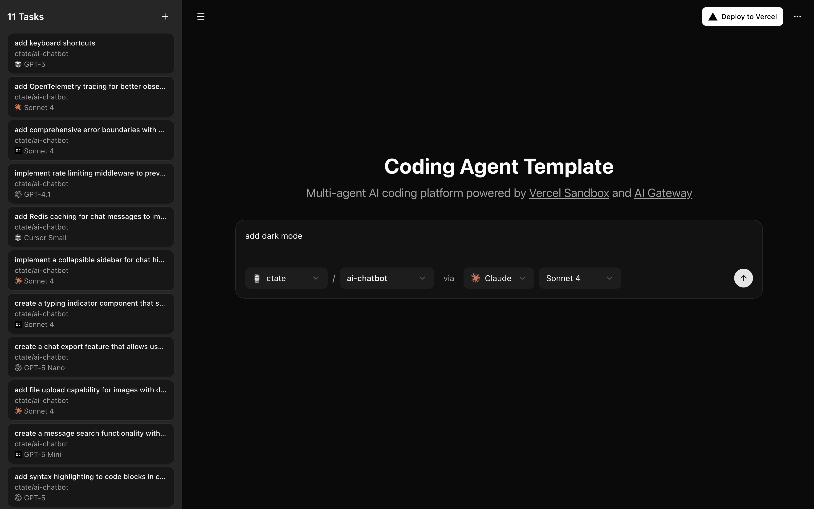
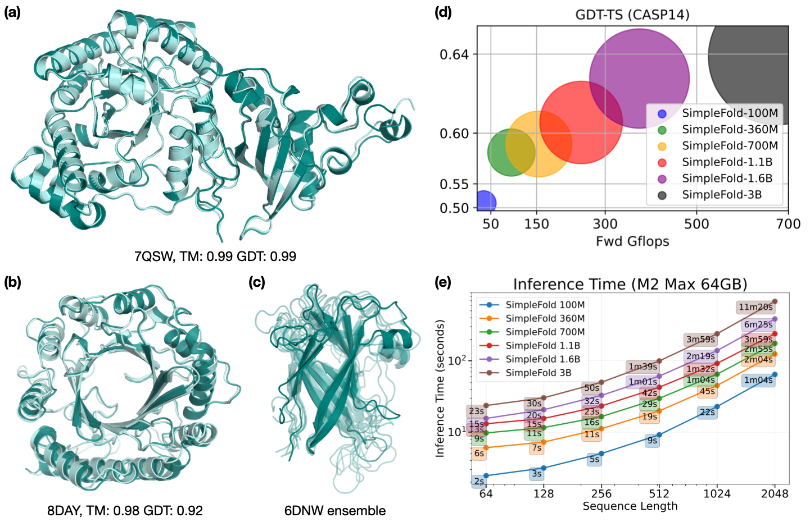

# GitHub Trending 排行榜

🔥 每周自动爬取GitHub最受欢迎的开源项目，生成AI智能总结的中文排行榜

[](https://github.com/qfy123/GitHub-Trending-/actions)
[](https://nodejs.org/)
[](LICENSE)

## ✨ 特性

- 🤖 **AI智能总结** - 使用DeepSeek AI生成简洁的中文项目描述
- 📊 **多维度排名** - 综合Star数、活跃度、新鲜度等指标
- 🖼️ **自动爬取图片** - 从项目README提取代表性图片
- 📈 **趋势分析** - 对比历史数据，显示项目排名变化
- 🗂️ **完整归档** - 按年份/周数归档所有历史数据
- 🔄 **自动更新** - GitHub Actions每周自动执行

## 📈 本周排行榜

<!-- TRENDING-START -->
### GitHub趋势排行榜 - 2025年第40周

**📅 统计周期**: 2025-09-28 ~ 2025-10-04  
**📊 项目总数**: 10 个  
**⭐ 总Star数**: 7,247  
**🔄 更新时间**: 2025-10-04 23:59:59  

| 排名 | 项目 | 描述 | Star | Fork | 语言 | 趋势 |
|------|------|------|------|------|------|------|
| 1 | [Dayflow](https://github.com/JerryZLiu/Dayflow) | macOS端Swift应用，自动记录屏幕活动并生成带AI摘要与分心提醒的每日时间线，帮助用户复盘时间使用。 | 2,384 | 88 | Swift | 🆕 |
| 2 | [The-Accidental-CTO](https://github.com/subhashchy/The-Accidental-CTO) | 非科班CTO亲述如何零起步把Dukaan扩至百万店铺的系统设计实战手册，含踩坑与AWS架构经验。 | 995 | 60 | Unknown | 🆕 |
| 3 | [NCE](https://github.com/iChochy/NCE) | 在线点读《新概念英语》1-4册，支持逐句朗读与循环播放，零配置随时随地练听说。 | 755 | 116 | JavaScript | 🆕 |
| 4 | [coding-agent-template](https://github.com/vercel-labs/coding-agent-template) | Vercel出品的多智能体AI编程平台，一键部署即可让Claude、OpenAI Codex等自动在隔离沙箱里完成... | 703 | 93 | TypeScript | 🆕 |
| 5 | [ml-simplefold](https://github.com/apple/ml-simplefold) | 苹果开源的极简蛋白质折叠模型，仅用通用Transformer层+流匹配即可预测三维结构，无需复杂几何模块。 | 688 | 34 | Python | 🆕 |
| 6 | [HunyuanImage-3.0](https://github.com/Tencent-Hunyuan/HunyuanImage-3.0) | 腾讯开源的原生多模态图像生成大模型，统一文本与视觉理解，一键生成高质量图像。 | 621 | 26 | Python | 🆕 |
| 7 | [swift-configuration](https://github.com/apple/swift-configuration) | 苹果官方Swift库，为应用与库提供统一、可扩展的配置读取抽象层，解耦配置源与业务代码。 | 311 | 5 | Swift | 🆕 |
| 8 | [Sec-Interview](https://github.com/duckpigdog/Sec-Interview) | 收录上万道网络安全各方向面试题并附参考答案，一站式解决护网、渗透、红队、逆向、密码学等岗位笔试面试备战需求。 | 281 | 48 | Unknown | 🆕 |
| 9 | [Hunyuan3D-Omni](https://github.com/Tencent-Hunyuan/Hunyuan3D-Omni) | 腾讯开源的统一3D资产生成框架，支持图像/文本等多模态输入，一键生成可控高质量3D模型，大幅降低游戏、影视等内容制... | 280 | 15 | Python | 🆕 |
| 10 | [Wallpaper-Engine](https://github.com/bitox123/Wallpaper-Engine) | 提供2025版Wallpaper Engine下载，支持4K/8K动态壁纸、交互场景与Steam Workshop... | 229 | 0 | Unknown | 🆕 |

### 🔥 详细介绍

#### 1. [Dayflow](https://github.com/JerryZLiu/Dayflow) 


**📝 项目简介**: macOS端Swift应用，自动记录屏幕活动并生成带AI摘要与分心提醒的每日时间线，帮助用户复盘时间使用。

**✨ 核心特性**:
- 自动截屏+OCR识别应用与网页
- 集成Gemini/Ollama生成AI摘要
- 一键标注分心时段，输出可视化时间线

**📊 项目统计**:
- **⭐ Star数**: 2,384
- **🔀 Fork数**: 88
- **👀 Watch数**: 2,384
- **📝 语言**: Swift
- **💻 技术栈**: Swift, Shell, gemini, lmstudio, ollama, productivity
- **📈 趋势**: 🆕 新上榜项目

---

#### 2. [The-Accidental-CTO](https://github.com/subhashchy/The-Accidental-CTO) 

**📝 项目简介**: 非科班CTO亲述如何零起步把Dukaan扩至百万店铺的系统设计实战手册，含踩坑与AWS架构经验。

**✨ 核心特性**:
- 真实百万级店铺扩展案例
- 无CS背景的系统设计心法
- AWS成本与性能优化实战

**📊 项目统计**:
- **⭐ Star数**: 995
- **🔀 Fork数**: 60
- **👀 Watch数**: 995
- **📝 语言**: Unknown
- **💻 技术栈**: scaling, system-design, AWS
- **📈 趋势**: 🆕 新上榜项目

---

#### 3. [NCE](https://github.com/iChochy/NCE) 

**📝 项目简介**: 在线点读《新概念英语》1-4册，支持逐句朗读与循环播放，零配置随时随地练听说。

**✨ 核心特性**:
- 全四册课文完整收录
- 单句点读+整课循环
- 纯前端离线可用

**📊 项目统计**:
- **⭐ Star数**: 755
- **🔀 Fork数**: 116
- **👀 Watch数**: 755
- **📝 语言**: JavaScript
- **🌐 官网**: [https://nce.ichochy.com/](https://nce.ichochy.com/)
- **💻 技术栈**: JavaScript, CSS, HTML, english, learn, nce
- **📈 趋势**: 🆕 新上榜项目

---

#### 4. [coding-agent-template](https://github.com/vercel-labs/coding-agent-template) 



**📝 项目简介**: Vercel出品的多智能体AI编程平台，一键部署即可让Claude、OpenAI Codex等自动在隔离沙箱里完成仓库编码任务，最低1美元起用。

**✨ 核心特性**:
- 多智能体：Claude Code/Codex CLI/Cursor CLI/opencode任选
- 安全隔离：Vercel Sandbox运行代码，防止污染主机
- 一键上线：Vercel按钮秒级部署，1美元即可启动自动化

**📊 项目统计**:
- **⭐ Star数**: 703
- **🔀 Fork数**: 93
- **👀 Watch数**: 703
- **📝 语言**: TypeScript
- **💻 技术栈**: TypeScript, CSS, JavaScript, React, PostgreSQL, REST API
- **📈 趋势**: 🆕 新上榜项目

---

#### 5. [ml-simplefold](https://github.com/apple/ml-simplefold) 



**📝 项目简介**: 苹果开源的极简蛋白质折叠模型，仅用通用Transformer层+流匹配即可预测三维结构，无需复杂几何模块。

**✨ 核心特性**:
- 首个纯Transformer流匹配折叠模型
- 训练推理代码与权重全开源
- Docker一键复现，支持AWS弹性推理

**📊 项目统计**:
- **⭐ Star数**: 688
- **🔀 Fork数**: 34
- **👀 Watch数**: 688
- **📝 语言**: Python
- **💻 技术栈**: Python, Jupyter Notebook, Docker, Redis, AWS
- **📈 趋势**: 🆕 新上榜项目

---

#### 6. [HunyuanImage-3.0](https://github.com/Tencent-Hunyuan/HunyuanImage-3.0) 


**📝 项目简介**: 腾讯开源的原生多模态图像生成大模型，统一文本与视觉理解，一键生成高质量图像。

**✨ 核心特性**:
- 原生多模态架构，文本-视觉端到端训练
- 中文与多风格高保真图像生成
- 官方提供在线体验与模型权重，零门槛使用

**📊 项目统计**:
- **⭐ Star数**: 621
- **🔀 Fork数**: 26
- **👀 Watch数**: 621
- **📝 语言**: Python
- **🌐 官网**: [https://hunyuan.tencent.com/image](https://hunyuan.tencent.com/image)
- **💻 技术栈**: Python, Shell, image-generation, native-multimodal-model, Express
- **📈 趋势**: 🆕 新上榜项目

---

#### 7. [swift-configuration](https://github.com/apple/swift-configuration) 

**📝 项目简介**: 苹果官方Swift库，为应用与库提供统一、可扩展的配置读取抽象层，解耦配置源与业务代码。

**✨ 核心特性**:
- 官方维护，Apache 2.0许可
- 配置源与读取逻辑解耦，支持多后端
- 文档、示例齐全，贡献友好

**📊 项目统计**:
- **⭐ Star数**: 311
- **🔀 Fork数**: 5
- **👀 Watch数**: 311
- **📝 语言**: Swift
- **🌐 官网**: [https://swiftpackageindex.com/apple/swift-configuration/documentation](https://swiftpackageindex.com/apple/swift-configuration/documentation)
- **💻 技术栈**: Swift, Python, Shell, configuration, server, swift
- **📈 趋势**: 🆕 新上榜项目

---

#### 8. [Sec-Interview](https://github.com/duckpigdog/Sec-Interview) 

**📝 项目简介**: 收录上万道网络安全各方向面试题并附参考答案，一站式解决护网、渗透、红队、逆向、密码学等岗位笔试面试备战需求。

**✨ 核心特性**:
- 题量庞大，覆盖10+安全细分方向
- 提供在线浏览与离线Markdown双模式
- 持续社区投稿，动态更新

**📊 项目统计**:
- **⭐ Star数**: 281
- **🔀 Fork数**: 48
- **👀 Watch数**: 281
- **📝 语言**: Unknown
- **📈 趋势**: 🆕 新上榜项目

---

#### 9. [Hunyuan3D-Omni](https://github.com/Tencent-Hunyuan/Hunyuan3D-Omni) 

**📝 项目简介**: 腾讯开源的统一3D资产生成框架，支持图像/文本等多模态输入，一键生成可控高质量3D模型，大幅降低游戏、影视等内容制作门槛。

**✨ 核心特性**:
- 多模态输入：图生3D、文生3D一键完成
- 统一框架：形状、纹理、姿态全链路可控
- 开源模型+在线Demo，即刻体验

**📊 项目统计**:
- **⭐ Star数**: 280
- **🔀 Fork数**: 15
- **👀 Watch数**: 280
- **📝 语言**: Python
- **🌐 官网**: [https://3d.hunyuan.tencent.com/](https://3d.hunyuan.tencent.com/)
- **💻 技术栈**: Python, 3d, 3d-aigc, 3d-generation, hunyuan3d, image-to-3d
- **📈 趋势**: 🆕 新上榜项目

---

#### 10. [Wallpaper-Engine](https://github.com/bitox123/Wallpaper-Engine) 

**📝 项目简介**: 提供2025版Wallpaper Engine下载，支持4K/8K动态壁纸、交互场景与Steam Workshop，一键美化Windows桌面。

**✨ 核心特性**:
- 4K/8K超清动态壁纸
- Steam Workshop海量资源
- 低占用实时交互特效

**📊 项目统计**:
- **⭐ Star数**: 229
- **🔀 Fork数**: 0
- **👀 Watch数**: 229
- **📝 语言**: Unknown
- **💻 技术栈**: 4k-wallpapers, animated-wallpapers, custom-wallpapers, dynamic-wallpapers, hd-wallpapers, live-wallpapers
- **📈 趋势**: 🆕 新上榜项目

---

### 📈 本周统计

**🔥 热门语言**:
1. **Unknown** (3 个项目)
2. **Python** (3 个项目)
3. **Swift** (2 个项目)
4. **JavaScript** (1 个项目)
5. **TypeScript** (1 个项目)

**🏷️ 热门话题**:
1. swift (2)
2. gemini (1)
3. lmstudio (1)
4. ollama (1)
5. productivity (1)
6. productivity-tools (1)
7. time (1)
8. timeline (1)


<!-- TRENDING-END -->

## 📚 历史数据

<!-- HISTORY-START -->
| 时间 | 周期 | 项目数 | 链接 |
|------|------|--------|------|
| 10-04 | 2025年第40周 | 10 个 | [查看详情](./archives/2025/week-40/report.md) |
| 09-27 | 2025年第39周 | 10 个 | [查看详情](./archives/2025/week-39/report.md) |
| 09-20 | 2025年第38周 | 10 个 | [查看详情](./archives/2025/week-38/report.md) |
| 09-13 | 2025年第37周 | 10 个 | [查看详情](./archives/2025/week-37/report.md) |
| 09-06 | 2025年第36周 | 10 个 | [查看详情](./archives/2025/week-36/report.md) |
| 08-30 | 2025年第35周 | 10 个 | [查看详情](./archives/2025/week-35/report.md) |
| 08-23 | 2025年第34周 | 10 个 | [查看详情](./archives/2025/week-34/report.md) |
| 08-16 | 2025年第33周 | 3 个 | [查看详情](./archives/2025/week-33/report.md) |

<!-- HISTORY-END -->

## 🚀 快速开始

### 1. 克隆项目

```bash
git clone https://github.com/your-username/GitHub-Trending.git
cd GitHub-Trending
```

### 2. 安装依赖

```bash
npm install
```

### 3. 配置环境变量

```bash
# 复制环境变量模板
cp .env.example .env

# 编辑 .env 文件，填入以下必需配置：
# GITHUB_TOKEN=your_github_token
# SILICONFLOW_API_KEY=your_siliconflow_api_key
```

### 4. 测试配置

```bash
# 系统测试
node test/system-test.js

# 配置检查
node scripts/update-trending.js --check
```

### 5. 运行项目

```bash
# 测试运行（少量数据）
node scripts/update-trending.js --limit 3

# 正式运行
node scripts/update-trending.js
```

## 🔧 配置说明

### 环境变量

| 变量名 | 必需 | 说明 | 获取方式 |
|--------|------|------|----------|
| `GITHUB_TOKEN` | ✅ | GitHub API访问令牌 | [GitHub设置](https://github.com/settings/tokens) |
| `SILICONFLOW_API_KEY` | ✅ | 硅基流动API密钥 | [硅基流动官网](https://siliconflow.cn) |
| `AI_BASE_URL` | ❌ | AI服务地址 | 默认硅基流动 |
| `AI_MODEL` | ❌ | AI模型名称 | 默认deepseek-chat |

详细配置请参考：[配置指南](config/README.md)

### GitHub Actions自动化

1. **Fork本项目**到你的GitHub账号
2. **设置Secrets**：
   - `SILICONFLOW_API_KEY`: 硅基流动API密钥
3. **启用Actions**：项目会自动每周一更新

详细设置请参考：[GitHub Actions配置](-.github/README.md)

## 📊 项目结构

```
GitHub-Trending/
├── src/                          # 核心源码
│   ├── github-api.js            # GitHub API调用
│   ├── ai-summarizer.js         # AI项目总结
│   ├── image-crawler.js         # 图片爬取
│   ├── data-processor.js        # 数据处理
│   ├── file-manager.js          # 文件管理
│   └── readme-updater.js        # README更新
├── scripts/                      # 执行脚本
│   └── update-trending.js       # 主执行脚本
├── test/                         # 测试文件
│   └── system-test.js           # 系统测试
├── archives/                     # 历史数据归档
│   └── YYYY/                    # 按年份归档
│       └── week-XX.md           # 周报文件
├── images/                       # 项目图片
│   └── YYYY/week-XX/            # 按周归档
├── data/                         # 临时数据
├── config/                       # 配置文档
├── .github/                      # GitHub Actions
│   └── workflows/
└── README.md                     # 项目说明
```

## 🎯 使用场景

### 开发者
- 🔍 **发现新项目** - 了解最新热门开源项目
- 📈 **技术趋势** - 跟踪编程语言和技术栈趋势
- 💡 **学习参考** - 学习优秀项目的设计和实现

### 技术团队
- 📊 **技术选型** - 参考热门项目进行技术选型
- 🎯 **竞品分析** - 关注同类项目的发展趋势
- 📝 **技术报告** - 生成定期的技术趋势报告

### 内容创作者
- ✍️ **素材收集** - 为技术文章和视频收集素材
- 📰 **新闻线索** - 发现值得报道的新兴项目
- 🗣️ **分享内容** - 分享有价值的开源项目

## 🛠️ 命令行工具

```bash
# 查看帮助
node scripts/update-trending.js --help

# 检查配置
node scripts/update-trending.js --check

# 自定义参数运行
node scripts/update-trending.js --limit 20 --language python

# 数据管理
node scripts/update-trending.js --backup     # 创建备份
node scripts/update-trending.js --cleanup    # 清理过期数据
node scripts/update-trending.js --stats      # 查看统计信息

# 系统测试
node test/system-test.js                      # 完整测试
node test/system-test.js --quick             # 快速诊断
```

## 📈 排名算法

项目排名基于以下三个维度的综合评分：

### 🌟 受欢迎程度 (50%)
- **Star数量** (60%): 项目获得的Star数
- **Fork数量** (25%): 项目被Fork的次数  
- **Watch数量** (15%): 项目被Watch的次数

### 🔥 活跃程度 (30%)
- **最近提交** (50%): 距离最后一次提交的时间
- **Issues活跃度** (30%): 开放的Issues数量
- **Fork活跃度** (20%): Fork的活跃程度

### 🆕 新鲜程度 (20%)
- **创建时间** (30%): 项目创建时间（新项目得分高）
- **更新时间** (70%): 最近更新时间

### 趋势分析
- 📈 **上升**: 排名比上周提升
- 📉 **下降**: 排名比上周下降  
- ➡️ **稳定**: 排名无明显变化
- 🆕 **新上榜**: 首次进入排行榜

## 🤝 贡献指南

欢迎提交 Issues 和 Pull Requests！

### 开发环境设置

```bash
# 1. Fork 并克隆项目
git clone https://github.com/your-username/GitHub-Trending.git

# 2. 创建功能分支
git checkout -b feature/your-feature

# 3. 安装依赖并测试
npm install
node test/system-test.js

# 4. 开发完成后提交
git commit -m "feat: 添加新功能"
git push origin feature/your-feature
```

### 提交规范

- `feat`: 新功能
- `fix`: 修复bug
- `docs`: 文档更新
- `style`: 代码格式调整
- `refactor`: 代码重构
- `test`: 测试相关
- `chore`: 构建/工具相关

## 📄 许可证

本项目基于 [MIT 许可证](LICENSE) 开源。

## 🙏 致谢

- [GitHub API](https://docs.github.com/en/rest) - 提供项目数据
- [硅基流动](https://siliconflow.cn) - 提供AI总结服务
- [DeepSeek](https://deepseek.com) - 优秀的AI模型
- [GitHub Actions](https://github.com/features/actions) - 自动化支持

## 📞 联系方式

- 🐛 **Bug报告**: [提交Issue](https://github.com/your-username/GitHub-Trending/issues)
- 💡 **功能建议**: [功能请求](https://github.com/your-username/GitHub-Trending/issues)
- 📧 **其他问题**: [发送邮件](mailto:your-email@example.com)

## 🔗 相关链接

- [项目文档](https://github.com/your-username/GitHub-Trending/wiki)
- [更新日志](CHANGELOG.md)
- [FAQ](FAQ.md)

---

⭐ 如果这个项目对你有帮助，请给它一个Star！

*本项目由 [GitHub Actions](https://github.com/features/actions) 自动维护，数据每周更新*