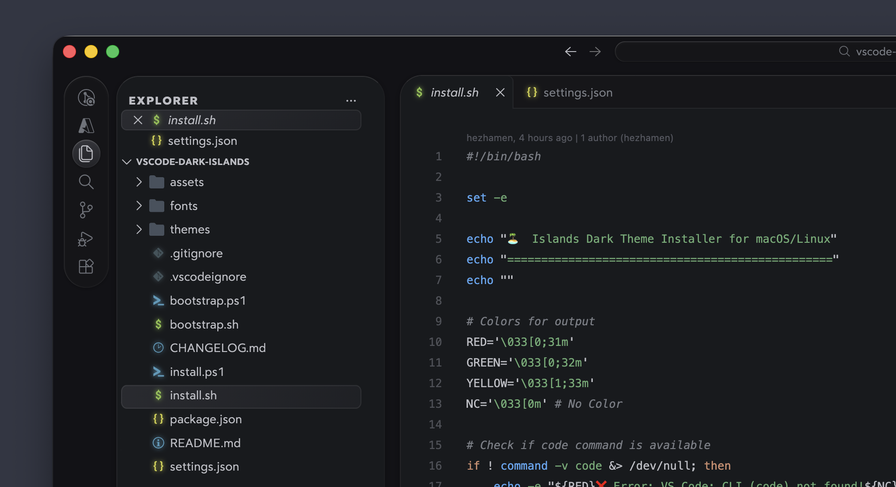
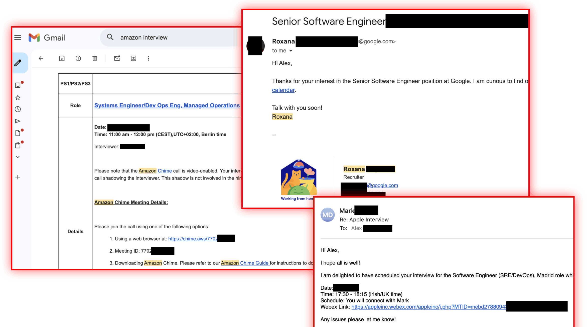
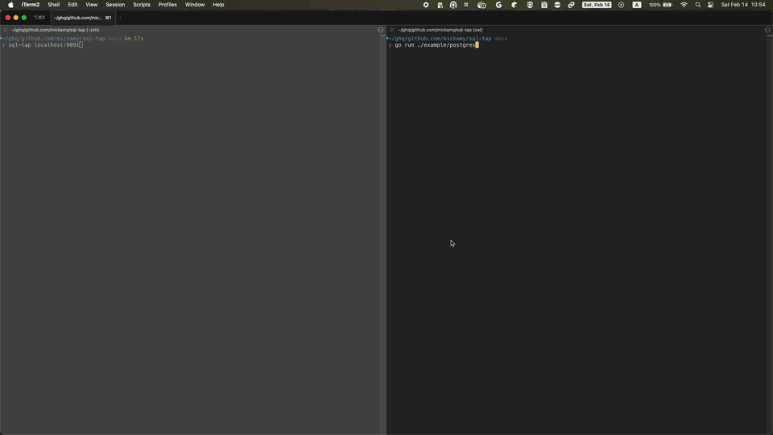

# GitHub Trending 排行榜

🔥 每周自动爬取GitHub最受欢迎的开源项目，生成AI智能总结的中文排行榜

[](https://github.com/qfy123/GitHub-Trending-/actions)
[](https://nodejs.org/)
[](LICENSE)

## ✨ 特性

- 🤖 **AI智能总结** - 使用DeepSeek AI生成简洁的中文项目描述
- 📊 **多维度排名** - 综合Star数、活跃度、新鲜度等指标
- 🖼️ **自动爬取图片** - 从项目README提取代表性图片
- 📈 **趋势分析** - 对比历史数据，显示项目排名变化
- 🗂️ **完整归档** - 按年份/周数归档所有历史数据
- 🔄 **自动更新** - GitHub Actions每周自动执行

## 📈 本周排行榜

<!-- TRENDING-START -->
### GitHub趋势排行榜 - 2026年第8周

**📅 统计周期**: 2026-02-15 ~ 2026-02-21  
**📊 项目总数**: 10 个  
**⭐ 总Star数**: 12,133  
**🔄 更新时间**: 2026-02-21 23:59:59  

| 排名 | 项目 | 描述 | Star | Fork | 语言 | 趋势 |
|------|------|------|------|------|------|------|
| 1 | [zeroclaw](https://github.com/zeroclaw-labs/zeroclaw) | 用Rust重写的轻量级“Claw”运行时，5MB内存即可跑在10美元硬件，成本与内存均降98%。 | 4,307 | 423 | Rust | 🆕 |
| 2 | [k-id-age-verifier](https://github.com/xyzeva/k-id-age-verifier) | 一键在Discord、Twitch、Kick、Quora等平台自动完成K-ID成人年龄验证，免手动上传证件。 | 1,546 | 56 | TypeScript | 🆕 |
| 3 | [discord-id-bypass-tool](https://github.com/promptpirate-x/discord-id-bypass-tool) | 号称可在任何低配电脑上运行，一键绕过Discord手机/邮箱验证的HTML工具，已获千星关注。 | 1,131 | 66 | HTML | 🆕 |
| 4 | [vscode-dark-islands](https://github.com/bwya77/vscode-dark-islands) | 将JetBrains Islands暗黑配色移植到VSCode，提供一致的沉浸式编码体验，已获近千星关注。 | 973 | 24 | PowerShell | 🆕 |
| 5 | [openclaw-wechat](https://github.com/freestylefly/openclaw-wechat) | 为 OpenClaw 提供稳定、可配置的微信个人号接入插件，一键安装即可把微信变成 AI 机器人的交互通道。 | 557 | 190 | TypeScript | 🆕 |
| 6 | [greenlight](https://github.com/RevylAI/greenlight) | 在提交苹果审核前，一键扫描源码、隐私清单、IPA与元数据，提前发现被拒风险，降低上架失败率。 | 974 | 63 | Go | 🆕 |
| 7 | [ai-daily-digest](https://github.com/vigorX777/ai-daily-digest) | 自动爬取90个顶级技术博客，用AI多维度评分，每日生成15篇高质量中文摘要，解决信息过载。 | 664 | 70 | TypeScript | 🆕 |
| 8 | [FastCode](https://github.com/HKUDS/FastCode) | FastCode通过AI与容器化技术，一键加速代码阅读、搜索与理解，显著降低开发者在大型代码库中的认知负担。 | 669 | 74 | Python | 🆕 |
| 9 | [devops-interviews](https://github.com/devops-interviews/devops-interviews) | 作者汇总大厂DevOps面试真题并录制视频解析，一站式助力通过DevOps岗位面试。 | 569 | 84 | Unknown | 🆕 |
| 10 | [sql-tap](https://github.com/mickamy/sql-tap) | 零侵入实时监听PostgreSQL/MySQL流量，终端交互式查看、事务追踪与EXPLAIN分析。 | 743 | 15 | Go | 🆕 |

### 🔥 详细介绍

#### 1. [zeroclaw](https://github.com/zeroclaw-labs/zeroclaw) 


**📝 项目简介**: 用Rust重写的轻量级“Claw”运行时，5MB内存即可跑在10美元硬件，成本与内存均降98%。

**✨ 核心特性**:
- 内存占用<5MB，比OpenClaw省99%
- $10硬件可运行，成本降98%
- 零开销、零妥协、100% Rust跨平台

**📊 项目统计**:
- **⭐ Star数**: 4,307
- **🔀 Fork数**: 423
- **👀 Watch数**: 4,307
- **📝 语言**: Rust
- **💻 技术栈**: Rust, Shell, Dockerfile, Node.js, Docker, TypeScript
- **📈 趋势**: 🆕 新上榜项目

---

#### 2. [k-id-age-verifier](https://github.com/xyzeva/k-id-age-verifier) 

**📝 项目简介**: 一键在Discord、Twitch、Kick、Quora等平台自动完成K-ID成人年龄验证，免手动上传证件。

**✨ 核心特性**:
- 多站统一验证
- 浏览器自动化
- 开源防后门

**📊 项目统计**:
- **⭐ Star数**: 1,546
- **🔀 Fork数**: 56
- **👀 Watch数**: 1,546
- **📝 语言**: TypeScript
- **🌐 官网**: [https://age-verifier.kibty.town](https://age-verifier.kibty.town)
- **💻 技术栈**: TypeScript, Svelte, JavaScript, HTML, CSS
- **📈 趋势**: 🆕 新上榜项目

---

#### 3. [discord-id-bypass-tool](https://github.com/promptpirate-x/discord-id-bypass-tool) 


**📝 项目简介**: 号称可在任何低配电脑上运行，一键绕过Discord手机/邮箱验证的HTML工具，已获千星关注。

**✨ 核心特性**:
- 零配置、即开即用
- 纯前端+Express，轻量跨平台
- 宣称支持所有Discord验证场景

**📊 项目统计**:
- **⭐ Star数**: 1,131
- **🔀 Fork数**: 66
- **👀 Watch数**: 1,131
- **📝 语言**: HTML
- **💻 技术栈**: HTML, Express
- **📈 趋势**: 🆕 新上榜项目

---

#### 4. [vscode-dark-islands](https://github.com/bwya77/vscode-dark-islands) 



**📝 项目简介**: 将JetBrains Islands暗黑配色移植到VSCode，提供一致的沉浸式编码体验，已获近千星关注。

**✨ 核心特性**:
- 还原JetBrains Islands暗黑配色
- 持续更新，细节打磨中
- 一键安装，无需配置

**📊 项目统计**:
- **⭐ Star数**: 973
- **🔀 Fork数**: 24
- **👀 Watch数**: 973
- **📝 语言**: PowerShell
- **💻 技术栈**: PowerShell, Shell, jetbrains, visual-studio-code, vscode, vscode-theme
- **📈 趋势**: 🆕 新上榜项目

---

#### 5. [openclaw-wechat](https://github.com/freestylefly/openclaw-wechat) 

**📝 项目简介**: 为 OpenClaw 提供稳定、可配置的微信个人号接入插件，一键安装即可把微信变成 AI 机器人的交互通道。

**✨ 核心特性**:
- 一行命令安装/升级，零开发成本
- 支持代理与 Webhook 灵活配置
- 官方 API Key 保障稳定不掉线

**📊 项目统计**:
- **⭐ Star数**: 557
- **🔀 Fork数**: 190
- **👀 Watch数**: 557
- **📝 语言**: TypeScript
- **💻 技术栈**: TypeScript
- **📈 趋势**: 🆕 新上榜项目

---

#### 6. [greenlight](https://github.com/RevylAI/greenlight) 

**📝 项目简介**: 在提交苹果审核前，一键扫描源码、隐私清单、IPA与元数据，提前发现被拒风险，降低上架失败率。

**✨ 核心特性**:
- 覆盖Apple Review Guidelines全规则
- 支持源码/IPA/隐私清单/元数据多维度扫描
- Homebrew一键安装，CI友好

**📊 项目统计**:
- **⭐ Star数**: 974
- **🔀 Fork数**: 63
- **👀 Watch数**: 974
- **📝 语言**: Go
- **💻 技术栈**: Go, Makefile, React
- **📈 趋势**: 🆕 新上榜项目

---

#### 7. [ai-daily-digest](https://github.com/vigorX777/ai-daily-digest) 


**📝 项目简介**: 自动爬取90个顶级技术博客，用AI多维度评分，每日生成15篇高质量中文摘要，解决信息过载。

**✨ 核心特性**:
- 源自信誉列表，含HN/西蒙/格雷厄姆等90站
- Gemini+OpenAI双模型自动降级，评分维度丰富
- 一键/digest交互，48h内精选，支持中英输出

**📊 项目统计**:
- **⭐ Star数**: 664
- **🔀 Fork数**: 70
- **👀 Watch数**: 664
- **📝 语言**: TypeScript
- **💻 技术栈**: TypeScript, React
- **📈 趋势**: 🆕 新上榜项目

---

#### 8. [FastCode](https://github.com/HKUDS/FastCode) 


**📝 项目简介**: FastCode通过AI与容器化技术，一键加速代码阅读、搜索与理解，显著降低开发者在大型代码库中的认知负担。

**✨ 核心特性**:
- 秒级索引百万行代码，查询延迟<100ms
- 按需GPU/CPU弹性伸缩，成本最低$1/天
- 零配置Docker一键部署，支持REST/VSCode插件

**📊 项目统计**:
- **⭐ Star数**: 669
- **🔀 Fork数**: 74
- **👀 Watch数**: 669
- **📝 语言**: Python
- **💻 技术栈**: Python, HTML, Shell, TypeScript, Dockerfile, JavaScript
- **📈 趋势**: 🆕 新上榜项目

---

#### 9. [devops-interviews](https://github.com/devops-interviews/devops-interviews) 



**📝 项目简介**: 作者汇总大厂DevOps面试真题并录制视频解析，一站式助力通过DevOps岗位面试。

**✨ 核心特性**:
- 含一线大厂真实面试题
- 配套作者视频讲解
- 覆盖Docker/K8s/AWS/Azure等核心考点

**📊 项目统计**:
- **⭐ Star数**: 569
- **🔀 Fork数**: 84
- **👀 Watch数**: 569
- **📝 语言**: Unknown
- **💻 技术栈**: Docker, Kubernetes, AWS, Azure
- **📈 趋势**: 🆕 新上榜项目

---

#### 10. [sql-tap](https://github.com/mickamy/sql-tap) 



**📝 项目简介**: 零侵入实时监听PostgreSQL/MySQL流量，终端交互式查看、事务追踪与EXPLAIN分析。

**✨ 核心特性**:
- 无需改代码即可抓包SQL
- 终端UI实时滚动查询与事务
- 支持一键EXPLAIN性能分析

**📊 项目统计**:
- **⭐ Star数**: 743
- **🔀 Fork数**: 15
- **👀 Watch数**: 743
- **📝 语言**: Go
- **💻 技术栈**: Go, Makefile, Dockerfile, Docker, PostgreSQL, MySQL
- **📈 趋势**: 🆕 新上榜项目

---

### 📈 本周统计

**🔥 热门语言**:
1. **TypeScript** (3 个项目)
2. **Go** (2 个项目)
3. **Rust** (1 个项目)
4. **HTML** (1 个项目)
5. **PowerShell** (1 个项目)

**🏷️ 热门话题**:
1. jetbrains (1)
2. visual-studio-code (1)
3. vscode (1)
4. vscode-theme (1)


<!-- TRENDING-END -->

## 📚 历史数据

<!-- HISTORY-START -->
| 时间 | 周期 | 项目数 | 链接 |
|------|------|--------|------|
| 02-21 | 2026年第8周 | 10 个 | [查看详情](./archives/2026/week-8/report.md) |
| 02-14 | 2026年第7周 | 10 个 | [查看详情](./archives/2026/week-7/report.md) |
| 02-07 | 2026年第6周 | 10 个 | [查看详情](./archives/2026/week-6/report.md) |
| 01-31 | 2026年第5周 | 10 个 | [查看详情](./archives/2026/week-5/report.md) |
| 01-24 | 2026年第4周 | 10 个 | [查看详情](./archives/2026/week-4/report.md) |
| 01-17 | 2026年第3周 | 10 个 | [查看详情](./archives/2026/week-3/report.md) |
| 01-10 | 2026年第2周 | 10 个 | [查看详情](./archives/2026/week-2/report.md) |
| 12-27 | 2025年第52周 | 10 个 | [查看详情](./archives/2025/week-52/report.md) |
| 12-20 | 2025年第51周 | 10 个 | [查看详情](./archives/2025/week-51/report.md) |
| 12-13 | 2025年第50周 | 10 个 | [查看详情](./archives/2025/week-50/report.md) |
| 12-06 | 2025年第49周 | 10 个 | [查看详情](./archives/2025/week-49/report.md) |
| 11-29 | 2025年第48周 | 10 个 | [查看详情](./archives/2025/week-48/report.md) |
| 11-22 | 2025年第47周 | 10 个 | [查看详情](./archives/2025/week-47/report.md) |
| 11-15 | 2025年第46周 | 10 个 | [查看详情](./archives/2025/week-46/report.md) |
| 11-08 | 2025年第45周 | 10 个 | [查看详情](./archives/2025/week-45/report.md) |
| 11-01 | 2025年第44周 | 10 个 | [查看详情](./archives/2025/week-44/report.md) |
| 10-25 | 2025年第43周 | 10 个 | [查看详情](./archives/2025/week-43/report.md) |
| 10-18 | 2025年第42周 | 10 个 | [查看详情](./archives/2025/week-42/report.md) |
| 10-11 | 2025年第41周 | 10 个 | [查看详情](./archives/2025/week-41/report.md) |
| 10-04 | 2025年第40周 | 10 个 | [查看详情](./archives/2025/week-40/report.md) |

[查看完整历史数据](./archives/)
<!-- HISTORY-END -->

## 🚀 快速开始

### 1. 克隆项目

```bash
git clone https://github.com/your-username/GitHub-Trending.git
cd GitHub-Trending
```

### 2. 安装依赖

```bash
npm install
```

### 3. 配置环境变量

```bash
# 复制环境变量模板
cp .env.example .env

# 编辑 .env 文件，填入以下必需配置：
# GITHUB_TOKEN=your_github_token
# SILICONFLOW_API_KEY=your_siliconflow_api_key
```

### 4. 测试配置

```bash
# 系统测试
node test/system-test.js

# 配置检查
node scripts/update-trending.js --check
```

### 5. 运行项目

```bash
# 测试运行（少量数据）
node scripts/update-trending.js --limit 3

# 正式运行
node scripts/update-trending.js
```

## 🔧 配置说明

### 环境变量

| 变量名 | 必需 | 说明 | 获取方式 |
|--------|------|------|----------|
| `GITHUB_TOKEN` | ✅ | GitHub API访问令牌 | [GitHub设置](https://github.com/settings/tokens) |
| `SILICONFLOW_API_KEY` | ✅ | 硅基流动API密钥 | [硅基流动官网](https://siliconflow.cn) |
| `AI_BASE_URL` | ❌ | AI服务地址 | 默认硅基流动 |
| `AI_MODEL` | ❌ | AI模型名称 | 默认deepseek-chat |

详细配置请参考：[配置指南](config/README.md)

### GitHub Actions自动化

1. **Fork本项目**到你的GitHub账号
2. **设置Secrets**：
   - `SILICONFLOW_API_KEY`: 硅基流动API密钥
3. **启用Actions**：项目会自动每周一更新

详细设置请参考：[GitHub Actions配置](-.github/README.md)

## 📊 项目结构

```
GitHub-Trending/
├── src/                          # 核心源码
│   ├── github-api.js            # GitHub API调用
│   ├── ai-summarizer.js         # AI项目总结
│   ├── image-crawler.js         # 图片爬取
│   ├── data-processor.js        # 数据处理
│   ├── file-manager.js          # 文件管理
│   └── readme-updater.js        # README更新
├── scripts/                      # 执行脚本
│   └── update-trending.js       # 主执行脚本
├── test/                         # 测试文件
│   └── system-test.js           # 系统测试
├── archives/                     # 历史数据归档
│   └── YYYY/                    # 按年份归档
│       └── week-XX.md           # 周报文件
├── images/                       # 项目图片
│   └── YYYY/week-XX/            # 按周归档
├── data/                         # 临时数据
├── config/                       # 配置文档
├── .github/                      # GitHub Actions
│   └── workflows/
└── README.md                     # 项目说明
```

## 🎯 使用场景

### 开发者
- 🔍 **发现新项目** - 了解最新热门开源项目
- 📈 **技术趋势** - 跟踪编程语言和技术栈趋势
- 💡 **学习参考** - 学习优秀项目的设计和实现

### 技术团队
- 📊 **技术选型** - 参考热门项目进行技术选型
- 🎯 **竞品分析** - 关注同类项目的发展趋势
- 📝 **技术报告** - 生成定期的技术趋势报告

### 内容创作者
- ✍️ **素材收集** - 为技术文章和视频收集素材
- 📰 **新闻线索** - 发现值得报道的新兴项目
- 🗣️ **分享内容** - 分享有价值的开源项目

## 🛠️ 命令行工具

```bash
# 查看帮助
node scripts/update-trending.js --help

# 检查配置
node scripts/update-trending.js --check

# 自定义参数运行
node scripts/update-trending.js --limit 20 --language python

# 数据管理
node scripts/update-trending.js --backup     # 创建备份
node scripts/update-trending.js --cleanup    # 清理过期数据
node scripts/update-trending.js --stats      # 查看统计信息

# 系统测试
node test/system-test.js                      # 完整测试
node test/system-test.js --quick             # 快速诊断
```

## 📈 排名算法

项目排名基于以下三个维度的综合评分：

### 🌟 受欢迎程度 (50%)
- **Star数量** (60%): 项目获得的Star数
- **Fork数量** (25%): 项目被Fork的次数  
- **Watch数量** (15%): 项目被Watch的次数

### 🔥 活跃程度 (30%)
- **最近提交** (50%): 距离最后一次提交的时间
- **Issues活跃度** (30%): 开放的Issues数量
- **Fork活跃度** (20%): Fork的活跃程度

### 🆕 新鲜程度 (20%)
- **创建时间** (30%): 项目创建时间（新项目得分高）
- **更新时间** (70%): 最近更新时间

### 趋势分析
- 📈 **上升**: 排名比上周提升
- 📉 **下降**: 排名比上周下降  
- ➡️ **稳定**: 排名无明显变化
- 🆕 **新上榜**: 首次进入排行榜

## 🤝 贡献指南

欢迎提交 Issues 和 Pull Requests！

### 开发环境设置

```bash
# 1. Fork 并克隆项目
git clone https://github.com/your-username/GitHub-Trending.git

# 2. 创建功能分支
git checkout -b feature/your-feature

# 3. 安装依赖并测试
npm install
node test/system-test.js

# 4. 开发完成后提交
git commit -m "feat: 添加新功能"
git push origin feature/your-feature
```

### 提交规范

- `feat`: 新功能
- `fix`: 修复bug
- `docs`: 文档更新
- `style`: 代码格式调整
- `refactor`: 代码重构
- `test`: 测试相关
- `chore`: 构建/工具相关

## 📄 许可证

本项目基于 [MIT 许可证](LICENSE) 开源。

## 🙏 致谢

- [GitHub API](https://docs.github.com/en/rest) - 提供项目数据
- [硅基流动](https://siliconflow.cn) - 提供AI总结服务
- [DeepSeek](https://deepseek.com) - 优秀的AI模型
- [GitHub Actions](https://github.com/features/actions) - 自动化支持

## 📞 联系方式

- 🐛 **Bug报告**: [提交Issue](https://github.com/your-username/GitHub-Trending/issues)
- 💡 **功能建议**: [功能请求](https://github.com/your-username/GitHub-Trending/issues)
- 📧 **其他问题**: [发送邮件](mailto:your-email@example.com)

## 🔗 相关链接

- [项目文档](https://github.com/your-username/GitHub-Trending/wiki)
- [更新日志](CHANGELOG.md)
- [FAQ](FAQ.md)

---

⭐ 如果这个项目对你有帮助，请给它一个Star！

*本项目由 [GitHub Actions](https://github.com/features/actions) 自动维护，数据每周更新*