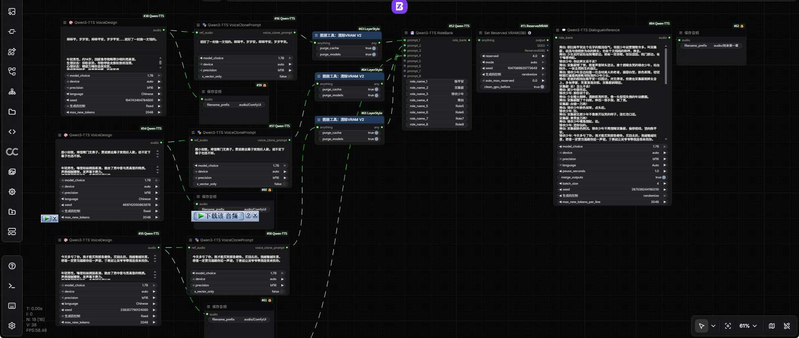

# GitHub Trending 排行榜

🔥 每周自动爬取GitHub最受欢迎的开源项目，生成AI智能总结的中文排行榜

[](https://github.com/qfy123/GitHub-Trending-/actions)
[](https://nodejs.org/)
[](LICENSE)

## ✨ 特性

- 🤖 **AI智能总结** - 使用DeepSeek AI生成简洁的中文项目描述
- 📊 **多维度排名** - 综合Star数、活跃度、新鲜度等指标
- 🖼️ **自动爬取图片** - 从项目README提取代表性图片
- 📈 **趋势分析** - 对比历史数据，显示项目排名变化
- 🗂️ **完整归档** - 按年份/周数归档所有历史数据
- 🔄 **自动更新** - GitHub Actions每周自动执行

## 📈 本周排行榜

<!-- TRENDING-START -->
### GitHub趋势排行榜 - 2026年第5周

**📅 统计周期**: 2026-01-25 ~ 2026-01-31  
**📊 项目总数**: 10 个  
**⭐ 总Star数**: 9,712  
**🔄 更新时间**: 2026-01-31 23:59:59  

| 排名 | 项目 | 描述 | Star | Fork | 语言 | 趋势 |
|------|------|------|------|------|------|------|
| 1 | [Qwen3-TTS](https://github.com/QwenLM/Qwen3-TTS) | 阿里云Qwen团队开源TTS系列，支持稳定、高表现、流式语音合成与零样本声音克隆，可自由设计音色。 | 4,424 | 435 | Python | 🆕 |
| 2 | [ComfyUI-Qwen-TTS](https://github.com/flybirdxx/ComfyUI-Qwen-TTS) | 为ComfyUI提供语音合成、克隆与音色设计节点，零门槛调用阿里开源Qwen3-TTS，一键生成高自然度语音。 | 498 | 50 | Python | 🆕 |
| 3 | [Youtube-clipper-skill](https://github.com/op7418/Youtube-clipper-skill) | AI驱动的YouTube智能剪辑工具，可自动语义分段、精准裁剪、双语字幕翻译并烧录，一键生成精华短视频。 | 699 | 117 | Python | 🆕 |
| 4 | [ocrbase](https://github.com/majcheradam/ocrbase) | 把PDF批量转成结构化JSON/Markdown的自托管OCR服务，支持schema定义、实时进度推送和React调用。 | 686 | 44 | TypeScript | 🆕 |
| 5 | [Practical-Digital-Product-Design-2025-Free](https://github.com/seeam/Practical-Digital-Product-Design-2025-Free) | 作者将其价值35000塔卡的付费UI/数字产品设计课程部分精华免费开源，含孟加拉语视频、练习与模板，帮助初学者零成... | 472 | 143 | Unknown | 🆕 |
| 6 | [Khazix-Skills](https://github.com/KKKKhazix/Khazix-Skills) | 一键把GitHub仓库变成可进化AI技能库，自动更新、反馈迭代，省去手动维护烦恼。 | 589 | 93 | Python | 🆕 |
| 7 | [vue-skills](https://github.com/hyf0/vue-skills) | 为AI代理设计的Vue3开发技能库，汇集真实问题与最佳实践，提升AI在Vue3项目中的辅助开发能力。 | 575 | 27 | Unknown | 🆕 |
| 8 | [polymarket-copy-trading-bot](https://github.com/terausss/polymarket-copy-trading-bot) | 自动实时跟单Polymarket高胜率鲸鱼交易员，提供Rust高性能与Python全功能双版本，一键复制盈利策略。 | 728 | 22 | Python | 🆕 |
| 9 | [posturr](https://github.com/tldev/posturr) | Mac端实时坐姿守护工具，摄像头监测驼背即渐进模糊屏幕，提醒挺直背部，改善久坐健康。 | 599 | 14 | Swift | 🆕 |
| 10 | [polymarket-copy-trading-bot-telegram-ui](https://github.com/yesnotrader/polymarket-copy-trading-bot-telegram-ui) | 基于Rust的高性能Polymarket跟单交易机器人，通过Telegram界面一键复制链上鲸鱼操作，实时风控，零... | 442 | 36 | Rust | 🆕 |

### 🔥 详细介绍

#### 1. [Qwen3-TTS](https://github.com/QwenLM/Qwen3-TTS) 


**📝 项目简介**: 阿里云Qwen团队开源TTS系列，支持稳定、高表现、流式语音合成与零样本声音克隆，可自由设计音色。

**✨ 核心特性**:
- 流式低延迟生成
- 零样本声音克隆
- 自由音色设计

**📊 项目统计**:
- **⭐ Star数**: 4,424
- **🔀 Fork数**: 435
- **👀 Watch数**: 4,424
- **📝 语言**: Python
- **💻 技术栈**: Python, Express
- **📈 趋势**: 🆕 新上榜项目

---

#### 2. [ComfyUI-Qwen-TTS](https://github.com/flybirdxx/ComfyUI-Qwen-TTS) 



**📝 项目简介**: 为ComfyUI提供语音合成、克隆与音色设计节点，零门槛调用阿里开源Qwen3-TTS，一键生成高自然度语音。

**✨ 核心特性**:
- 即装即用ComfyUI节点，无需编码
- 支持音色克隆与个性化语音设计
- 新增注意力机制与生成参数可调，兼容Mac MPS

**📊 项目统计**:
- **⭐ Star数**: 498
- **🔀 Fork数**: 50
- **👀 Watch数**: 498
- **📝 语言**: Python
- **💻 技术栈**: Python
- **📈 趋势**: 🆕 新上榜项目

---

#### 3. [Youtube-clipper-skill](https://github.com/op7418/Youtube-clipper-skill) 


**📝 项目简介**: AI驱动的YouTube智能剪辑工具，可自动语义分段、精准裁剪、双语字幕翻译并烧录，一键生成精华短视频。

**✨ 核心特性**:
- AI语义分析生成2-5分钟细粒度章节
- FFmpeg帧级精准裁剪
- 自动双语字幕翻译与烧录

**📊 项目统计**:
- **⭐ Star数**: 699
- **🔀 Fork数**: 117
- **👀 Watch数**: 699
- **📝 语言**: Python
- **💻 技术栈**: Python, Shell
- **📈 趋势**: 🆕 新上榜项目

---

#### 4. [ocrbase](https://github.com/majcheradam/ocrbase) 



**📝 项目简介**: 把PDF批量转成结构化JSON/Markdown的自托管OCR服务，支持schema定义、实时进度推送和React调用。

**✨ 核心特性**:
- PaddleOCR-VL精准文字识别
- 队列并发处理数千文档
- TypeScript SDK+React Hooks开箱即用

**📊 项目统计**:
- **⭐ Star数**: 686
- **🔀 Fork数**: 44
- **👀 Watch数**: 686
- **📝 语言**: TypeScript
- **💻 技术栈**: TypeScript, CSS, Dockerfile, ai, bun, document-processing
- **📈 趋势**: 🆕 新上榜项目

---

#### 5. [Practical-Digital-Product-Design-2025-Free](https://github.com/seeam/Practical-Digital-Product-Design-2025-Free) 


**📝 项目简介**: 作者将其价值35000塔卡的付费UI/数字产品设计课程部分精华免费开源，含孟加拉语视频、练习与模板，帮助初学者零成本入门产品思维与界面设计。

**✨ 核心特性**:
- 完整课程章节与实战练习免费下载
- 孟加拉语讲解，降低本地学习门槛
- 含Pathao、ShopUp等一线产品案例拆解

**📊 项目统计**:
- **⭐ Star数**: 472
- **🔀 Fork数**: 143
- **👀 Watch数**: 472
- **📝 语言**: Unknown
- **💻 技术栈**: AWS
- **📈 趋势**: 🆕 新上榜项目

---

#### 6. [Khazix-Skills](https://github.com/KKKKhazix/Khazix-Skills) 

**📝 项目简介**: 一键把GitHub仓库变成可进化AI技能库，自动更新、反馈迭代，省去手动维护烦恼。

**✨ 核心特性**:
- 自动将仓库转为AI技能
- 支持生命周期管理
- 基于用户反馈自我进化

**📊 项目统计**:
- **⭐ Star数**: 589
- **🔀 Fork数**: 93
- **👀 Watch数**: 589
- **📝 语言**: Python
- **💻 技术栈**: Python
- **📈 趋势**: 🆕 新上榜项目

---

#### 7. [vue-skills](https://github.com/hyf0/vue-skills) 

**📝 项目简介**: 为AI代理设计的Vue3开发技能库，汇集真实问题与最佳实践，提升AI在Vue3项目中的辅助开发能力。

**✨ 核心特性**:
- 基于真实Issue提炼技能
- 降低AI幻觉风险，提高建议准确性
- 社区驱动，持续迭代优化

**📊 项目统计**:
- **⭐ Star数**: 575
- **🔀 Fork数**: 27
- **👀 Watch数**: 575
- **📝 语言**: Unknown
- **💻 技术栈**: Vue, TypeScript
- **📈 趋势**: 🆕 新上榜项目

---

#### 8. [polymarket-copy-trading-bot](https://github.com/terausss/polymarket-copy-trading-bot) 


**📝 项目简介**: 自动实时跟单Polymarket高胜率鲸鱼交易员，提供Rust高性能与Python全功能双版本，一键复制盈利策略。

**✨ 核心特性**:
- 双语言实现，Rust极速、Python工具丰富
- 实时监测并镜像鲸鱼仓位，按自定义比例跟单
- 开源免费，已获700+星，社区活跃持续迭代

**📊 项目统计**:
- **⭐ Star数**: 728
- **🔀 Fork数**: 22
- **👀 Watch数**: 728
- **📝 语言**: Python
- **💻 技术栈**: Python, Rust, Shell, Batchfile, copy-trading-bot, copytrading-bot
- **📈 趋势**: 🆕 新上榜项目

---

#### 9. [posturr](https://github.com/tldev/posturr) 

**📝 项目简介**: Mac端实时坐姿守护工具，摄像头监测驼背即渐进模糊屏幕，提醒挺直背部，改善久坐健康。

**✨ 核心特性**:
- Vision框架实时姿态检测
- 驼背即屏幕渐进模糊
- 坐直瞬间恢复清晰

**📊 项目统计**:
- **⭐ Star数**: 599
- **🔀 Fork数**: 14
- **👀 Watch数**: 599
- **📝 语言**: Swift
- **💻 技术栈**: Swift, Shell
- **📈 趋势**: 🆕 新上榜项目

---

#### 10. [polymarket-copy-trading-bot-telegram-ui](https://github.com/yesnotrader/polymarket-copy-trading-bot-telegram-ui) 

**📝 项目简介**: 基于Rust的高性能Polymarket跟单交易机器人，通过Telegram界面一键复制链上鲸鱼操作，实时风控，零门槛参与预测市场。

**✨ 核心特性**:
- Telegram一键配置与监控
- 毫秒级链上鲸鱼跟单
- 内置熔断与仓位保护

**📊 项目统计**:
- **⭐ Star数**: 442
- **🔀 Fork数**: 36
- **👀 Watch数**: 442
- **📝 语言**: Rust
- **🌐 官网**: [https://t.me/poly_copy_tg_bot](https://t.me/poly_copy_tg_bot)
- **💻 技术栈**: Rust, copy-trading, copytrading, polymarket-copy-bot, polymarket-copy-trading-bot, polymarket-copytrading-bot
- **📈 趋势**: 🆕 新上榜项目

---

### 📈 本周统计

**🔥 热门语言**:
1. **Python** (5 个项目)
2. **Unknown** (2 个项目)
3. **TypeScript** (1 个项目)
4. **Swift** (1 个项目)
5. **Rust** (1 个项目)

**🏷️ 热门话题**:
1. polymarket-copy-bot (2)
2. polymarket-copy-trading-bot (2)
3. polymarket-copytrading-bot (2)
4. polymarket-trading-bot (2)
5. trading-bot (2)
6. ai (1)
7. bun (1)
8. document-processing (1)


<!-- TRENDING-END -->

## 📚 历史数据

<!-- HISTORY-START -->
| 时间 | 周期 | 项目数 | 链接 |
|------|------|--------|------|
| 01-31 | 2026年第5周 | 10 个 | [查看详情](./archives/2026/week-5/report.md) |
| 01-24 | 2026年第4周 | 10 个 | [查看详情](./archives/2026/week-4/report.md) |
| 01-17 | 2026年第3周 | 10 个 | [查看详情](./archives/2026/week-3/report.md) |
| 01-10 | 2026年第2周 | 10 个 | [查看详情](./archives/2026/week-2/report.md) |
| 12-27 | 2025年第52周 | 10 个 | [查看详情](./archives/2025/week-52/report.md) |
| 12-20 | 2025年第51周 | 10 个 | [查看详情](./archives/2025/week-51/report.md) |
| 12-13 | 2025年第50周 | 10 个 | [查看详情](./archives/2025/week-50/report.md) |
| 12-06 | 2025年第49周 | 10 个 | [查看详情](./archives/2025/week-49/report.md) |
| 11-29 | 2025年第48周 | 10 个 | [查看详情](./archives/2025/week-48/report.md) |
| 11-22 | 2025年第47周 | 10 个 | [查看详情](./archives/2025/week-47/report.md) |
| 11-15 | 2025年第46周 | 10 个 | [查看详情](./archives/2025/week-46/report.md) |
| 11-08 | 2025年第45周 | 10 个 | [查看详情](./archives/2025/week-45/report.md) |
| 11-01 | 2025年第44周 | 10 个 | [查看详情](./archives/2025/week-44/report.md) |
| 10-25 | 2025年第43周 | 10 个 | [查看详情](./archives/2025/week-43/report.md) |
| 10-18 | 2025年第42周 | 10 个 | [查看详情](./archives/2025/week-42/report.md) |
| 10-11 | 2025年第41周 | 10 个 | [查看详情](./archives/2025/week-41/report.md) |
| 10-04 | 2025年第40周 | 10 个 | [查看详情](./archives/2025/week-40/report.md) |
| 09-27 | 2025年第39周 | 10 个 | [查看详情](./archives/2025/week-39/report.md) |
| 09-20 | 2025年第38周 | 10 个 | [查看详情](./archives/2025/week-38/report.md) |
| 09-13 | 2025年第37周 | 10 个 | [查看详情](./archives/2025/week-37/report.md) |

[查看完整历史数据](./archives/)
<!-- HISTORY-END -->

## 🚀 快速开始

### 1. 克隆项目

```bash
git clone https://github.com/your-username/GitHub-Trending.git
cd GitHub-Trending
```

### 2. 安装依赖

```bash
npm install
```

### 3. 配置环境变量

```bash
# 复制环境变量模板
cp .env.example .env

# 编辑 .env 文件，填入以下必需配置：
# GITHUB_TOKEN=your_github_token
# SILICONFLOW_API_KEY=your_siliconflow_api_key
```

### 4. 测试配置

```bash
# 系统测试
node test/system-test.js

# 配置检查
node scripts/update-trending.js --check
```

### 5. 运行项目

```bash
# 测试运行（少量数据）
node scripts/update-trending.js --limit 3

# 正式运行
node scripts/update-trending.js
```

## 🔧 配置说明

### 环境变量

| 变量名 | 必需 | 说明 | 获取方式 |
|--------|------|------|----------|
| `GITHUB_TOKEN` | ✅ | GitHub API访问令牌 | [GitHub设置](https://github.com/settings/tokens) |
| `SILICONFLOW_API_KEY` | ✅ | 硅基流动API密钥 | [硅基流动官网](https://siliconflow.cn) |
| `AI_BASE_URL` | ❌ | AI服务地址 | 默认硅基流动 |
| `AI_MODEL` | ❌ | AI模型名称 | 默认deepseek-chat |

详细配置请参考：[配置指南](config/README.md)

### GitHub Actions自动化

1. **Fork本项目**到你的GitHub账号
2. **设置Secrets**：
   - `SILICONFLOW_API_KEY`: 硅基流动API密钥
3. **启用Actions**：项目会自动每周一更新

详细设置请参考：[GitHub Actions配置](-.github/README.md)

## 📊 项目结构

```
GitHub-Trending/
├── src/                          # 核心源码
│   ├── github-api.js            # GitHub API调用
│   ├── ai-summarizer.js         # AI项目总结
│   ├── image-crawler.js         # 图片爬取
│   ├── data-processor.js        # 数据处理
│   ├── file-manager.js          # 文件管理
│   └── readme-updater.js        # README更新
├── scripts/                      # 执行脚本
│   └── update-trending.js       # 主执行脚本
├── test/                         # 测试文件
│   └── system-test.js           # 系统测试
├── archives/                     # 历史数据归档
│   └── YYYY/                    # 按年份归档
│       └── week-XX.md           # 周报文件
├── images/                       # 项目图片
│   └── YYYY/week-XX/            # 按周归档
├── data/                         # 临时数据
├── config/                       # 配置文档
├── .github/                      # GitHub Actions
│   └── workflows/
└── README.md                     # 项目说明
```

## 🎯 使用场景

### 开发者
- 🔍 **发现新项目** - 了解最新热门开源项目
- 📈 **技术趋势** - 跟踪编程语言和技术栈趋势
- 💡 **学习参考** - 学习优秀项目的设计和实现

### 技术团队
- 📊 **技术选型** - 参考热门项目进行技术选型
- 🎯 **竞品分析** - 关注同类项目的发展趋势
- 📝 **技术报告** - 生成定期的技术趋势报告

### 内容创作者
- ✍️ **素材收集** - 为技术文章和视频收集素材
- 📰 **新闻线索** - 发现值得报道的新兴项目
- 🗣️ **分享内容** - 分享有价值的开源项目

## 🛠️ 命令行工具

```bash
# 查看帮助
node scripts/update-trending.js --help

# 检查配置
node scripts/update-trending.js --check

# 自定义参数运行
node scripts/update-trending.js --limit 20 --language python

# 数据管理
node scripts/update-trending.js --backup     # 创建备份
node scripts/update-trending.js --cleanup    # 清理过期数据
node scripts/update-trending.js --stats      # 查看统计信息

# 系统测试
node test/system-test.js                      # 完整测试
node test/system-test.js --quick             # 快速诊断
```

## 📈 排名算法

项目排名基于以下三个维度的综合评分：

### 🌟 受欢迎程度 (50%)
- **Star数量** (60%): 项目获得的Star数
- **Fork数量** (25%): 项目被Fork的次数  
- **Watch数量** (15%): 项目被Watch的次数

### 🔥 活跃程度 (30%)
- **最近提交** (50%): 距离最后一次提交的时间
- **Issues活跃度** (30%): 开放的Issues数量
- **Fork活跃度** (20%): Fork的活跃程度

### 🆕 新鲜程度 (20%)
- **创建时间** (30%): 项目创建时间（新项目得分高）
- **更新时间** (70%): 最近更新时间

### 趋势分析
- 📈 **上升**: 排名比上周提升
- 📉 **下降**: 排名比上周下降  
- ➡️ **稳定**: 排名无明显变化
- 🆕 **新上榜**: 首次进入排行榜

## 🤝 贡献指南

欢迎提交 Issues 和 Pull Requests！

### 开发环境设置

```bash
# 1. Fork 并克隆项目
git clone https://github.com/your-username/GitHub-Trending.git

# 2. 创建功能分支
git checkout -b feature/your-feature

# 3. 安装依赖并测试
npm install
node test/system-test.js

# 4. 开发完成后提交
git commit -m "feat: 添加新功能"
git push origin feature/your-feature
```

### 提交规范

- `feat`: 新功能
- `fix`: 修复bug
- `docs`: 文档更新
- `style`: 代码格式调整
- `refactor`: 代码重构
- `test`: 测试相关
- `chore`: 构建/工具相关

## 📄 许可证

本项目基于 [MIT 许可证](LICENSE) 开源。

## 🙏 致谢

- [GitHub API](https://docs.github.com/en/rest) - 提供项目数据
- [硅基流动](https://siliconflow.cn) - 提供AI总结服务
- [DeepSeek](https://deepseek.com) - 优秀的AI模型
- [GitHub Actions](https://github.com/features/actions) - 自动化支持

## 📞 联系方式

- 🐛 **Bug报告**: [提交Issue](https://github.com/your-username/GitHub-Trending/issues)
- 💡 **功能建议**: [功能请求](https://github.com/your-username/GitHub-Trending/issues)
- 📧 **其他问题**: [发送邮件](mailto:your-email@example.com)

## 🔗 相关链接

- [项目文档](https://github.com/your-username/GitHub-Trending/wiki)
- [更新日志](CHANGELOG.md)
- [FAQ](FAQ.md)

---

⭐ 如果这个项目对你有帮助，请给它一个Star！

*本项目由 [GitHub Actions](https://github.com/features/actions) 自动维护，数据每周更新*