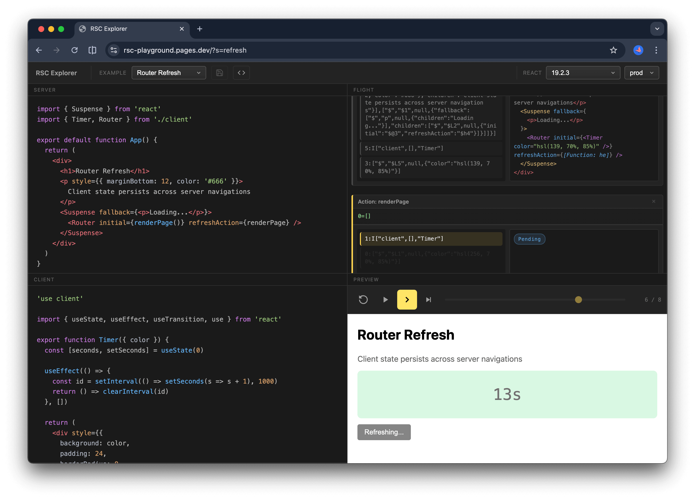

# GitHub Trending 排行榜

🔥 每周自动爬取GitHub最受欢迎的开源项目，生成AI智能总结的中文排行榜

[](https://github.com/qfy123/GitHub-Trending-/actions)
[](https://nodejs.org/)
[](LICENSE)

## ✨ 特性

- 🤖 **AI智能总结** - 使用DeepSeek AI生成简洁的中文项目描述
- 📊 **多维度排名** - 综合Star数、活跃度、新鲜度等指标
- 🖼️ **自动爬取图片** - 从项目README提取代表性图片
- 📈 **趋势分析** - 对比历史数据，显示项目排名变化
- 🗂️ **完整归档** - 按年份/周数归档所有历史数据
- 🔄 **自动更新** - GitHub Actions每周自动执行

## 📈 本周排行榜

<!-- TRENDING-START -->
### GitHub趋势排行榜 - 2025年第52周

**📅 统计周期**: 2025-12-21 ~ 2025-12-27  
**📊 项目总数**: 10 个  
**⭐ 总Star数**: 10,402  
**🔄 更新时间**: 2025-12-27 23:59:59  

| 排名 | 项目 | 描述 | Star | Fork | 语言 | 趋势 |
|------|------|------|------|------|------|------|
| 1 | [agentskills](https://github.com/agentskills/agentskills) | agentskills 定义了一套开放规范，让开发者把能力封装成“技能包”，任何 AI 代理都能即插即用，实现一次... | 2,654 | 115 | Python | 🆕 |
| 2 | [port-killer](https://github.com/productdevbook/port-killer) | 原生macOS菜单栏工具，一键扫描并强制释放被占用的端口，解决开发中“端口已被占用”痛点。 | 2,372 | 66 | Swift | 🆕 |
| 3 | [vibe-coding-cn](https://github.com/2025Emma/vibe-coding-cn) | 中文Vibe Coding指南，教你与AI结对编程，把创意快速落地成可运行代码的完整工作站。 | 1,187 | 134 | Python | 🆕 |
| 4 | [gemini-watermark-remover](https://github.com/journey-ad/gemini-watermark-remover) | 纯浏览器端一键无损移除Gemini AI图片水印，数学算法精准还原原图，无需上传、无需AI重绘。 | 689 | 67 | JavaScript | 🆕 |
| 5 | [Qwen-Image-Layered](https://github.com/QwenLM/Qwen-Image-Layered) | 将单张图片自动拆成多层可编辑PSD，文字、物体、背景独立，支持精准替换与再创作。 | 531 | 34 | Python | 🆕 |
| 6 | [rscexplorer](https://github.com/gaearon/rscexplorer) | 浏览器内运行React Server Components，逐帧可视化RSC协议流，帮助理解服务端与客户端组件如何... | 828 | 24 | TypeScript | 🆕 |
| 7 | [NitroGen](https://github.com/MineDojo/NitroGen) | NitroGen是MineDojo推出的开源生成式模型，可基于文本提示快速生成高质量、可玩的Minecraft关卡... | 550 | 51 | Python | 🆕 |
| 8 | [lightron](https://github.com/lwj2015/lightron) | 轻量级 Megatron 教学版，支持 4-D 并行与最新 LLM 架构，帮助研究者低成本复现分布式大模型训练。 | 510 | 45 | Python | 🆕 |
| 9 | [skills](https://github.com/GuDaStudio/skills) | GudaStudio开源的Agent Skills仓库，用模块化脚本让Claude按需调用Codex/Gemini... | 507 | 26 | PowerShell | 🆕 |
| 10 | [tinypdf](https://github.com/Lulzx/tinypdf) | 极致轻量的TypeScript PDF生成库，源码不足400行、零依赖，即可输出标准PDF，体积仅3.3KB，比主... | 574 | 9 | TypeScript | 🆕 |

### 🔥 详细介绍

#### 1. [agentskills](https://github.com/agentskills/agentskills) 

**📝 项目简介**: agentskills 定义了一套开放规范，让开发者把能力封装成“技能包”，任何 AI 代理都能即插即用，实现一次编写、多代理共享。

**✨ 核心特性**:
- 开放文件夹格式，零配置即插即用
- 一次开发，跨代理/平台复用
- 官方提供 SDK 与示例，快速上手

**📊 项目统计**:
- **⭐ Star数**: 2,654
- **🔀 Fork数**: 115
- **👀 Watch数**: 2,654
- **📝 语言**: Python
- **🌐 官网**: [https://agentskills.io](https://agentskills.io)
- **💻 技术栈**: Python, Shell
- **📈 趋势**: 🆕 新上榜项目

---

#### 2. [port-killer](https://github.com/productdevbook/port-killer) 


**📝 项目简介**: 原生macOS菜单栏工具，一键扫描并强制释放被占用的端口，解决开发中“端口已被占用”痛点。

**✨ 核心特性**:
- 菜单栏即时查杀，无需终端
- SwiftUI原生体验，轻量极速
- 支持多端口批量清理，自动识别进程

**📊 项目统计**:
- **⭐ Star数**: 2,372
- **🔀 Fork数**: 66
- **👀 Watch数**: 2,372
- **📝 语言**: Swift
- **💻 技术栈**: Swift, Shell, developer-tools, macos, macos-app, menu-bar
- **📈 趋势**: 🆕 新上榜项目

---

#### 3. [vibe-coding-cn](https://github.com/2025Emma/vibe-coding-cn) 


**📝 项目简介**: 中文Vibe Coding指南，教你与AI结对编程，把创意快速落地成可运行代码的完整工作站。

**✨ 核心特性**:
- 零门槛AI结对编程流程
- 中文友好示例与模板
- 一键环境搭建脚本

**📊 项目统计**:
- **⭐ Star数**: 1,187
- **🔀 Fork数**: 134
- **👀 Watch数**: 1,187
- **📝 语言**: Python
- **💻 技术栈**: Python, Shell, Makefile
- **📈 趋势**: 🆕 新上榜项目

---

#### 4. [gemini-watermark-remover](https://github.com/journey-ad/gemini-watermark-remover) 


**📝 项目简介**: 纯浏览器端一键无损移除Gemini AI图片水印，数学算法精准还原原图，无需上传、无需AI重绘。

**✨ 核心特性**:
- 100%本地处理，零上传零隐私风险
- 反向Alpha混合算法，像素级无损还原
- 轻量JS实现，无需安装即开即用

**📊 项目统计**:
- **⭐ Star数**: 689
- **🔀 Fork数**: 67
- **👀 Watch数**: 689
- **📝 语言**: JavaScript
- **🌐 官网**: [https://banana.ovo.re](https://banana.ovo.re)
- **💻 技术栈**: JavaScript, HTML, Express, AWS
- **📈 趋势**: 🆕 新上榜项目

---

#### 5. [Qwen-Image-Layered](https://github.com/QwenLM/Qwen-Image-Layered) 


**📝 项目简介**: 将单张图片自动拆成多层可编辑PSD，文字、物体、背景独立，支持精准替换与再创作。

**✨ 核心特性**:
- 一键分层生成PSD，无需手动抠图
- 文字、物体、背景解耦，可单独替换
- 开源模型+论文，本地可跑，商用友好

**📊 项目统计**:
- **⭐ Star数**: 531
- **🔀 Fork数**: 34
- **👀 Watch数**: 531
- **📝 语言**: Python
- **💻 技术栈**: Python
- **📈 趋势**: 🆕 新上榜项目

---

#### 6. [rscexplorer](https://github.com/gaearon/rscexplorer) 



**📝 项目简介**: 浏览器内运行React Server Components，逐帧可视化RSC协议流，帮助理解服务端与客户端组件如何协同渲染。

**✨ 核心特性**:
- 零配置，一键启动Server与Client
- 实时查看RSC流与React树变化
- 内置交互示例，直观教学

**📊 项目统计**:
- **⭐ Star数**: 828
- **🔀 Fork数**: 24
- **👀 Watch数**: 828
- **📝 语言**: TypeScript
- **🌐 官网**: [https://rscexplorer.dev/](https://rscexplorer.dev/)
- **💻 技术栈**: TypeScript, CSS, JavaScript, HTML, React
- **📈 趋势**: 🆕 新上榜项目

---

#### 7. [NitroGen](https://github.com/MineDojo/NitroGen) 

**📝 项目简介**: NitroGen是MineDojo推出的开源生成式模型，可基于文本提示快速生成高质量、可玩的Minecraft关卡与场景。

**✨ 核心特性**:
- 文本驱动无限关卡生成
- 与Minecraft原生兼容即开即玩
- 提供预训练模型与大规模数据集

**📊 项目统计**:
- **⭐ Star数**: 550
- **🔀 Fork数**: 51
- **👀 Watch数**: 550
- **📝 语言**: Python
- **💻 技术栈**: Python
- **📈 趋势**: 🆕 新上榜项目

---

#### 8. [lightron](https://github.com/lwj2015/lightron) 

**📝 项目简介**: 轻量级 Megatron 教学版，支持 4-D 并行与最新 LLM 架构，帮助研究者低成本复现分布式大模型训练。

**✨ 核心特性**:
- 4-D 并行（TP/PP/DP/CP）+ EP/FSDP V2
- 集成 RMSNorm、SwiGLU、RoPE、FlashAttention V2
- 代码简洁，专为教学与快速实验设计

**📊 项目统计**:
- **⭐ Star数**: 510
- **🔀 Fork数**: 45
- **👀 Watch数**: 510
- **📝 语言**: Python
- **💻 技术栈**: Python
- **📈 趋势**: 🆕 新上榜项目

---

#### 9. [skills](https://github.com/GuDaStudio/skills) 


**📝 项目简介**: GudaStudio开源的Agent Skills仓库，用模块化脚本让Claude按需调用Codex/Gemini等模型，实现多AI协同编码、调试与审查。

**✨ 核心特性**:
- 一键切换OpenAI Codex与Google Gemini
- PowerShell脚本即插即用，零配置集成
- 覆盖原型开发、调试、代码审查全链路

**📊 项目统计**:
- **⭐ Star数**: 507
- **🔀 Fork数**: 26
- **👀 Watch数**: 507
- **📝 语言**: PowerShell
- **🌐 官网**: [https://code.guda.studio](https://code.guda.studio)
- **💻 技术栈**: PowerShell, Shell, React, Vue
- **📈 趋势**: 🆕 新上榜项目

---

#### 10. [tinypdf](https://github.com/Lulzx/tinypdf) 


**📝 项目简介**: 极致轻量的TypeScript PDF生成库，源码不足400行、零依赖，即可输出标准PDF，体积仅3.3KB，比主流方案小70倍。

**✨ 核心特性**:
- <400行源码、零依赖、3.3KB
- 直接生成合规PDF，支持文本与图片排版
- 比jsPDF小70倍，快速集成、无冗余功能

**📊 项目统计**:
- **⭐ Star数**: 574
- **🔀 Fork数**: 9
- **👀 Watch数**: 574
- **📝 语言**: TypeScript
- **💻 技术栈**: TypeScript
- **📈 趋势**: 🆕 新上榜项目

---

### 📈 本周统计

**🔥 热门语言**:
1. **Python** (5 个项目)
2. **TypeScript** (2 个项目)
3. **Swift** (1 个项目)
4. **JavaScript** (1 个项目)
5. **PowerShell** (1 个项目)

**🏷️ 热门话题**:
1. developer-tools (1)
2. macos (1)
3. macos-app (1)
4. menu-bar (1)
5. port-killer (1)
6. process-manager (1)
7. swift (1)
8. swiftui (1)


<!-- TRENDING-END -->

## 📚 历史数据

<!-- HISTORY-START -->
| 时间 | 周期 | 项目数 | 链接 |
|------|------|--------|------|
| 12-27 | 2025年第52周 | 10 个 | [查看详情](./archives/2025/week-52/report.md) |
| 12-20 | 2025年第51周 | 10 个 | [查看详情](./archives/2025/week-51/report.md) |
| 12-13 | 2025年第50周 | 10 个 | [查看详情](./archives/2025/week-50/report.md) |
| 12-06 | 2025年第49周 | 10 个 | [查看详情](./archives/2025/week-49/report.md) |
| 11-29 | 2025年第48周 | 10 个 | [查看详情](./archives/2025/week-48/report.md) |
| 11-22 | 2025年第47周 | 10 个 | [查看详情](./archives/2025/week-47/report.md) |
| 11-15 | 2025年第46周 | 10 个 | [查看详情](./archives/2025/week-46/report.md) |
| 11-08 | 2025年第45周 | 10 个 | [查看详情](./archives/2025/week-45/report.md) |
| 11-01 | 2025年第44周 | 10 个 | [查看详情](./archives/2025/week-44/report.md) |
| 10-25 | 2025年第43周 | 10 个 | [查看详情](./archives/2025/week-43/report.md) |
| 10-18 | 2025年第42周 | 10 个 | [查看详情](./archives/2025/week-42/report.md) |
| 10-11 | 2025年第41周 | 10 个 | [查看详情](./archives/2025/week-41/report.md) |
| 10-04 | 2025年第40周 | 10 个 | [查看详情](./archives/2025/week-40/report.md) |
| 09-27 | 2025年第39周 | 10 个 | [查看详情](./archives/2025/week-39/report.md) |
| 09-20 | 2025年第38周 | 10 个 | [查看详情](./archives/2025/week-38/report.md) |
| 09-13 | 2025年第37周 | 10 个 | [查看详情](./archives/2025/week-37/report.md) |
| 09-06 | 2025年第36周 | 10 个 | [查看详情](./archives/2025/week-36/report.md) |
| 08-30 | 2025年第35周 | 10 个 | [查看详情](./archives/2025/week-35/report.md) |
| 08-23 | 2025年第34周 | 10 个 | [查看详情](./archives/2025/week-34/report.md) |
| 08-16 | 2025年第33周 | 3 个 | [查看详情](./archives/2025/week-33/report.md) |

<!-- HISTORY-END -->

## 🚀 快速开始

### 1. 克隆项目

```bash
git clone https://github.com/your-username/GitHub-Trending.git
cd GitHub-Trending
```

### 2. 安装依赖

```bash
npm install
```

### 3. 配置环境变量

```bash
# 复制环境变量模板
cp .env.example .env

# 编辑 .env 文件，填入以下必需配置：
# GITHUB_TOKEN=your_github_token
# SILICONFLOW_API_KEY=your_siliconflow_api_key
```

### 4. 测试配置

```bash
# 系统测试
node test/system-test.js

# 配置检查
node scripts/update-trending.js --check
```

### 5. 运行项目

```bash
# 测试运行（少量数据）
node scripts/update-trending.js --limit 3

# 正式运行
node scripts/update-trending.js
```

## 🔧 配置说明

### 环境变量

| 变量名 | 必需 | 说明 | 获取方式 |
|--------|------|------|----------|
| `GITHUB_TOKEN` | ✅ | GitHub API访问令牌 | [GitHub设置](https://github.com/settings/tokens) |
| `SILICONFLOW_API_KEY` | ✅ | 硅基流动API密钥 | [硅基流动官网](https://siliconflow.cn) |
| `AI_BASE_URL` | ❌ | AI服务地址 | 默认硅基流动 |
| `AI_MODEL` | ❌ | AI模型名称 | 默认deepseek-chat |

详细配置请参考：[配置指南](config/README.md)

### GitHub Actions自动化

1. **Fork本项目**到你的GitHub账号
2. **设置Secrets**：
   - `SILICONFLOW_API_KEY`: 硅基流动API密钥
3. **启用Actions**：项目会自动每周一更新

详细设置请参考：[GitHub Actions配置](-.github/README.md)

## 📊 项目结构

```
GitHub-Trending/
├── src/                          # 核心源码
│   ├── github-api.js            # GitHub API调用
│   ├── ai-summarizer.js         # AI项目总结
│   ├── image-crawler.js         # 图片爬取
│   ├── data-processor.js        # 数据处理
│   ├── file-manager.js          # 文件管理
│   └── readme-updater.js        # README更新
├── scripts/                      # 执行脚本
│   └── update-trending.js       # 主执行脚本
├── test/                         # 测试文件
│   └── system-test.js           # 系统测试
├── archives/                     # 历史数据归档
│   └── YYYY/                    # 按年份归档
│       └── week-XX.md           # 周报文件
├── images/                       # 项目图片
│   └── YYYY/week-XX/            # 按周归档
├── data/                         # 临时数据
├── config/                       # 配置文档
├── .github/                      # GitHub Actions
│   └── workflows/
└── README.md                     # 项目说明
```

## 🎯 使用场景

### 开发者
- 🔍 **发现新项目** - 了解最新热门开源项目
- 📈 **技术趋势** - 跟踪编程语言和技术栈趋势
- 💡 **学习参考** - 学习优秀项目的设计和实现

### 技术团队
- 📊 **技术选型** - 参考热门项目进行技术选型
- 🎯 **竞品分析** - 关注同类项目的发展趋势
- 📝 **技术报告** - 生成定期的技术趋势报告

### 内容创作者
- ✍️ **素材收集** - 为技术文章和视频收集素材
- 📰 **新闻线索** - 发现值得报道的新兴项目
- 🗣️ **分享内容** - 分享有价值的开源项目

## 🛠️ 命令行工具

```bash
# 查看帮助
node scripts/update-trending.js --help

# 检查配置
node scripts/update-trending.js --check

# 自定义参数运行
node scripts/update-trending.js --limit 20 --language python

# 数据管理
node scripts/update-trending.js --backup     # 创建备份
node scripts/update-trending.js --cleanup    # 清理过期数据
node scripts/update-trending.js --stats      # 查看统计信息

# 系统测试
node test/system-test.js                      # 完整测试
node test/system-test.js --quick             # 快速诊断
```

## 📈 排名算法

项目排名基于以下三个维度的综合评分：

### 🌟 受欢迎程度 (50%)
- **Star数量** (60%): 项目获得的Star数
- **Fork数量** (25%): 项目被Fork的次数  
- **Watch数量** (15%): 项目被Watch的次数

### 🔥 活跃程度 (30%)
- **最近提交** (50%): 距离最后一次提交的时间
- **Issues活跃度** (30%): 开放的Issues数量
- **Fork活跃度** (20%): Fork的活跃程度

### 🆕 新鲜程度 (20%)
- **创建时间** (30%): 项目创建时间（新项目得分高）
- **更新时间** (70%): 最近更新时间

### 趋势分析
- 📈 **上升**: 排名比上周提升
- 📉 **下降**: 排名比上周下降  
- ➡️ **稳定**: 排名无明显变化
- 🆕 **新上榜**: 首次进入排行榜

## 🤝 贡献指南

欢迎提交 Issues 和 Pull Requests！

### 开发环境设置

```bash
# 1. Fork 并克隆项目
git clone https://github.com/your-username/GitHub-Trending.git

# 2. 创建功能分支
git checkout -b feature/your-feature

# 3. 安装依赖并测试
npm install
node test/system-test.js

# 4. 开发完成后提交
git commit -m "feat: 添加新功能"
git push origin feature/your-feature
```

### 提交规范

- `feat`: 新功能
- `fix`: 修复bug
- `docs`: 文档更新
- `style`: 代码格式调整
- `refactor`: 代码重构
- `test`: 测试相关
- `chore`: 构建/工具相关

## 📄 许可证

本项目基于 [MIT 许可证](LICENSE) 开源。

## 🙏 致谢

- [GitHub API](https://docs.github.com/en/rest) - 提供项目数据
- [硅基流动](https://siliconflow.cn) - 提供AI总结服务
- [DeepSeek](https://deepseek.com) - 优秀的AI模型
- [GitHub Actions](https://github.com/features/actions) - 自动化支持

## 📞 联系方式

- 🐛 **Bug报告**: [提交Issue](https://github.com/your-username/GitHub-Trending/issues)
- 💡 **功能建议**: [功能请求](https://github.com/your-username/GitHub-Trending/issues)
- 📧 **其他问题**: [发送邮件](mailto:your-email@example.com)

## 🔗 相关链接

- [项目文档](https://github.com/your-username/GitHub-Trending/wiki)
- [更新日志](CHANGELOG.md)
- [FAQ](FAQ.md)

---

⭐ 如果这个项目对你有帮助，请给它一个Star！

*本项目由 [GitHub Actions](https://github.com/features/actions) 自动维护，数据每周更新*