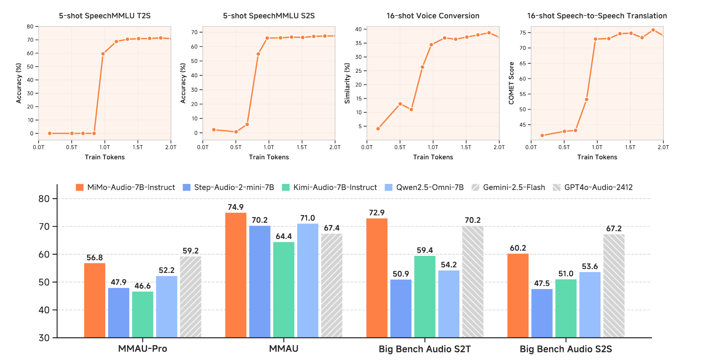

# GitHub Trending 排行榜

🔥 每周自动爬取GitHub最受欢迎的开源项目，生成AI智能总结的中文排行榜

[](https://github.com/qfy123/GitHub-Trending-/actions)
[](https://nodejs.org/)
[](LICENSE)

## ✨ 特性

- 🤖 **AI智能总结** - 使用DeepSeek AI生成简洁的中文项目描述
- 📊 **多维度排名** - 综合Star数、活跃度、新鲜度等指标
- 🖼️ **自动爬取图片** - 从项目README提取代表性图片
- 📈 **趋势分析** - 对比历史数据，显示项目排名变化
- 🗂️ **完整归档** - 按年份/周数归档所有历史数据
- 🔄 **自动更新** - GitHub Actions每周自动执行

## 📈 本周排行榜

<!-- TRENDING-START -->
### GitHub趋势排行榜 - 2025年第39周

**📅 统计周期**: 2025-09-21 ~ 2025-09-27  
**📊 项目总数**: 10 个  
**⭐ 总Star数**: 5,463  
**🔄 更新时间**: 2025-09-27 23:59:59  

| 排名 | 项目 | 描述 | Star | Fork | 语言 | 趋势 |
|------|------|------|------|------|------|------|
| 1 | [VoxCPM](https://github.com/OpenBMB/VoxCPM) | 无需分词器的TTS系统，用连续空间建模实现高保真语音克隆与上下文感知合成，效果逼近真人。 | 1,081 | 111 | Python | 🆕 |
| 2 | [LaunchNext](https://github.com/RoversX/LaunchNext) | 为macOS 26+找回被官方移除的Launchpad，提供高度可定制、免费且性能更强的替代方案。 | 340 | 18 | Swift | 🆕 |
| 3 | [MiMo-Audio](https://github.com/XiaomiMiMo/MiMo-Audio) | 小米开源的音频语言模型，主打小样本即可快速适配新任务，降低语音应用门槛。 | 485 | 38 | Python | 🆕 |
| 4 | [GuitarPedal](https://github.com/torvalds/GuitarPedal) | Linus Torvalds用OpenSCAD设计的模块化吉他效果器外壳，像成人乐高一样可自由拼装，专为电子实验而生。 | 648 | 21 | OpenSCAD | 🆕 |
| 5 | [Asus-ROG-Aml-Deep-Dive](https://github.com/Zephkek/Asus-ROG-Aml-Deep-Dive) | 深入剖析华硕ROG笔记本ACPI固件缺陷导致的DPC延迟卡顿、音视频爆音与鼠标冻结问题，提供ASL级修复方案。 | 540 | 12 | ASL | 🆕 |
| 6 | [Qwen3-ASR-Toolkit](https://github.com/QwenLM/Qwen3-ASR-Toolkit) | 官方Python工具包，突破Qwen3-ASR 3分钟限制，智能切分并行转写超长音视频，实现小时级内容秒级转录。 | 448 | 35 | Python | 🆕 |
| 7 | [sj.h](https://github.com/rxi/sj.h) | 单头文件极简JSON解析库，约150行C99代码，零内存分配，可快速嵌入任意C项目完成轻量级JSON读取。 | 601 | 9 | C | 🆕 |
| 8 | [uuidv47](https://github.com/stateless-me/uuidv47) | 数据库内用可排序UUIDv7存储，API对外返回隐私UUIDv4，一键双向映射，零依赖C头文件库。 | 561 | 11 | C | 🆕 |
| 9 | [comfydeploy](https://github.com/comfy-deploy/comfydeploy) | 一键将ComfyUI工作流部署为生产级Serverless API，解决复杂环境配置与扩缩容难题。 | 405 | 52 | Unknown | 🆕 |
| 10 | [pgmcp](https://github.com/subnetmarco/pgmcp) | 把自然语言直接变成PostgreSQL查询的MCP服务器，AI助手无需写SQL即可实时取数。 | 354 | 36 | Go | 🆕 |

### 🔥 详细介绍

#### 1. [VoxCPM](https://github.com/OpenBMB/VoxCPM) 


**📝 项目简介**: 无需分词器的TTS系统，用连续空间建模实现高保真语音克隆与上下文感知合成，效果逼近真人。

**✨ 核心特性**:
- 无需分词器，连续空间建模
- 上下文感知，语调自然
- 零样本语音克隆，高保真还原

**📊 项目统计**:
- **⭐ Star数**: 1,081
- **🔀 Fork数**: 111
- **👀 Watch数**: 1,081
- **📝 语言**: Python
- **💻 技术栈**: Python, Express
- **📈 趋势**: 🆕 新上榜项目

---

#### 2. [LaunchNext](https://github.com/RoversX/LaunchNext) 


**📝 项目简介**: 为macOS 26+找回被官方移除的Launchpad，提供高度可定制、免费且性能更强的替代方案。

**✨ 核心特性**:
- 原生Swift重写，GPU加速流畅动画
- 支持主题、布局、快捷键深度自定义
- 一键安装，与系统无缝集成

**📊 项目统计**:
- **⭐ Star数**: 340
- **🔀 Fork数**: 18
- **👀 Watch数**: 340
- **📝 语言**: Swift
- **💻 技术栈**: Swift
- **📈 趋势**: 🆕 新上榜项目

---

#### 3. [MiMo-Audio](https://github.com/XiaomiMiMo/MiMo-Audio) 



**📝 项目简介**: 小米开源的音频语言模型，主打小样本即可快速适配新任务，降低语音应用门槛。

**✨ 核心特性**:
- 小样本学习，无需大量数据微调
- 开源模型与代码，社区可二次开发
- 小米背书，中文场景优化

**📊 项目统计**:
- **⭐ Star数**: 485
- **🔀 Fork数**: 38
- **👀 Watch数**: 485
- **📝 语言**: Python
- **💻 技术栈**: Python
- **📈 趋势**: 🆕 新上榜项目

---

#### 4. [GuitarPedal](https://github.com/torvalds/GuitarPedal) 

**📝 项目简介**: Linus Torvalds用OpenSCAD设计的模块化吉他效果器外壳，像成人乐高一样可自由拼装，专为电子实验而生。

**✨ 核心特性**:
- 开源硬件乐高式拼装
- OpenSCAD参数化建模
- 面向电子DIY教学

**📊 项目统计**:
- **⭐ Star数**: 648
- **🔀 Fork数**: 21
- **👀 Watch数**: 648
- **📝 语言**: OpenSCAD
- **💻 技术栈**: OpenSCAD
- **📈 趋势**: 🆕 新上榜项目

---

#### 5. [Asus-ROG-Aml-Deep-Dive](https://github.com/Zephkek/Asus-ROG-Aml-Deep-Dive) 

**📝 项目简介**: 深入剖析华硕ROG笔记本ACPI固件缺陷导致的DPC延迟卡顿、音视频爆音与鼠标冻结问题，提供ASL级修复方案。

**✨ 核心特性**:
- 定位ACPI.sys高延迟根因
- 提供可刷写ASL补丁
- 覆盖RTX30/40全系ROG机型

**📊 项目统计**:
- **⭐ Star数**: 540
- **🔀 Fork数**: 12
- **👀 Watch数**: 540
- **📝 语言**: ASL
- **💻 技术栈**: ASL, AWS
- **📈 趋势**: 🆕 新上榜项目

---

#### 6. [Qwen3-ASR-Toolkit](https://github.com/QwenLM/Qwen3-ASR-Toolkit) 


**📝 项目简介**: 官方Python工具包，突破Qwen3-ASR 3分钟限制，智能切分并行转写超长音视频，实现小时级内容秒级转录。

**✨ 核心特性**:
- 突破3分钟API限制
- 并行高吞吐长音频转写
- 多采样率自动适配

**📊 项目统计**:
- **⭐ Star数**: 448
- **🔀 Fork数**: 35
- **👀 Watch数**: 448
- **📝 语言**: Python
- **💻 技术栈**: Python
- **📈 趋势**: 🆕 新上榜项目

---

#### 7. [sj.h](https://github.com/rxi/sj.h) 

**📝 项目简介**: 单头文件极简JSON解析库，约150行C99代码，零内存分配，可快速嵌入任意C项目完成轻量级JSON读取。

**✨ 核心特性**:
- 单头文件即插即用
- 零堆分配，极低资源占用
- 提供行列号精准错误定位

**📊 项目统计**:
- **⭐ Star数**: 601
- **🔀 Fork数**: 9
- **👀 Watch数**: 601
- **📝 语言**: C
- **💻 技术栈**: C
- **📈 趋势**: 🆕 新上榜项目

---

#### 8. [uuidv47](https://github.com/stateless-me/uuidv47) 

**📝 项目简介**: 数据库内用可排序UUIDv7存储，API对外返回隐私UUIDv4，一键双向映射，零依赖C头文件库。

**✨ 核心特性**:
- 存储有序、接口匿名，兼顾性能与隐私
- SipHash掩码可逆，往返无数据丢失
- 头文件即库，C89零依赖，PostgreSQL扩展现成

**📊 项目统计**:
- **⭐ Star数**: 561
- **🔀 Fork数**: 11
- **👀 Watch数**: 561
- **📝 语言**: C
- **💻 技术栈**: C, PLpgSQL, Makefile, c, c89, database
- **📈 趋势**: 🆕 新上榜项目

---

#### 9. [comfydeploy](https://github.com/comfy-deploy/comfydeploy) 

**📝 项目简介**: 一键将ComfyUI工作流部署为生产级Serverless API，解决复杂环境配置与扩缩容难题。

**✨ 核心特性**:
- 开源全栈前后端
- Docker秒级容器化
- Redis+AWS弹性扩缩

**📊 项目统计**:
- **⭐ Star数**: 405
- **🔀 Fork数**: 52
- **👀 Watch数**: 405
- **📝 语言**: Unknown
- **💻 技术栈**: Docker, Redis, AWS
- **📈 趋势**: 🆕 新上榜项目

---

#### 10. [pgmcp](https://github.com/subnetmarco/pgmcp) 


**📝 项目简介**: 把自然语言直接变成PostgreSQL查询的MCP服务器，AI助手无需写SQL即可实时取数。

**✨ 核心特性**:
- 自然语言转SQL，零代码查询
- 流式返回结果，自动容错
- 兼容Cursor、Claude、VS Code等主流AI客户端

**📊 项目统计**:
- **⭐ Star数**: 354
- **🔀 Fork数**: 36
- **👀 Watch数**: 354
- **📝 语言**: Go
- **💻 技术栈**: Go, agent, agentic-ai, ai, analytics, artificial-intelligence
- **📈 趋势**: 🆕 新上榜项目

---

### 📈 本周统计

**🔥 热门语言**:
1. **Python** (3 个项目)
2. **C** (2 个项目)
3. **Swift** (1 个项目)
4. **OpenSCAD** (1 个项目)
5. **ASL** (1 个项目)

**🏷️ 热门话题**:
1. database (2)
2. postgres (2)
3. c (1)
4. c89 (1)
5. header-only (1)
6. libpq (1)
7. postgresql-extension (1)
8. siphash (1)


<!-- TRENDING-END -->

## 📚 历史数据

<!-- HISTORY-START -->
| 时间 | 周期 | 项目数 | 链接 |
|------|------|--------|------|
| 09-27 | 2025年第39周 | 10 个 | [查看详情](./archives/2025/week-39/report.md) |
| 09-20 | 2025年第38周 | 10 个 | [查看详情](./archives/2025/week-38/report.md) |
| 09-13 | 2025年第37周 | 10 个 | [查看详情](./archives/2025/week-37/report.md) |
| 09-06 | 2025年第36周 | 10 个 | [查看详情](./archives/2025/week-36/report.md) |
| 08-30 | 2025年第35周 | 10 个 | [查看详情](./archives/2025/week-35/report.md) |
| 08-23 | 2025年第34周 | 10 个 | [查看详情](./archives/2025/week-34/report.md) |
| 08-16 | 2025年第33周 | 3 个 | [查看详情](./archives/2025/week-33/report.md) |

<!-- HISTORY-END -->

## 🚀 快速开始

### 1. 克隆项目

```bash
git clone https://github.com/your-username/GitHub-Trending.git
cd GitHub-Trending
```

### 2. 安装依赖

```bash
npm install
```

### 3. 配置环境变量

```bash
# 复制环境变量模板
cp .env.example .env

# 编辑 .env 文件，填入以下必需配置：
# GITHUB_TOKEN=your_github_token
# SILICONFLOW_API_KEY=your_siliconflow_api_key
```

### 4. 测试配置

```bash
# 系统测试
node test/system-test.js

# 配置检查
node scripts/update-trending.js --check
```

### 5. 运行项目

```bash
# 测试运行（少量数据）
node scripts/update-trending.js --limit 3

# 正式运行
node scripts/update-trending.js
```

## 🔧 配置说明

### 环境变量

| 变量名 | 必需 | 说明 | 获取方式 |
|--------|------|------|----------|
| `GITHUB_TOKEN` | ✅ | GitHub API访问令牌 | [GitHub设置](https://github.com/settings/tokens) |
| `SILICONFLOW_API_KEY` | ✅ | 硅基流动API密钥 | [硅基流动官网](https://siliconflow.cn) |
| `AI_BASE_URL` | ❌ | AI服务地址 | 默认硅基流动 |
| `AI_MODEL` | ❌ | AI模型名称 | 默认deepseek-chat |

详细配置请参考：[配置指南](config/README.md)

### GitHub Actions自动化

1. **Fork本项目**到你的GitHub账号
2. **设置Secrets**：
   - `SILICONFLOW_API_KEY`: 硅基流动API密钥
3. **启用Actions**：项目会自动每周一更新

详细设置请参考：[GitHub Actions配置](-.github/README.md)

## 📊 项目结构

```
GitHub-Trending/
├── src/                          # 核心源码
│   ├── github-api.js            # GitHub API调用
│   ├── ai-summarizer.js         # AI项目总结
│   ├── image-crawler.js         # 图片爬取
│   ├── data-processor.js        # 数据处理
│   ├── file-manager.js          # 文件管理
│   └── readme-updater.js        # README更新
├── scripts/                      # 执行脚本
│   └── update-trending.js       # 主执行脚本
├── test/                         # 测试文件
│   └── system-test.js           # 系统测试
├── archives/                     # 历史数据归档
│   └── YYYY/                    # 按年份归档
│       └── week-XX.md           # 周报文件
├── images/                       # 项目图片
│   └── YYYY/week-XX/            # 按周归档
├── data/                         # 临时数据
├── config/                       # 配置文档
├── .github/                      # GitHub Actions
│   └── workflows/
└── README.md                     # 项目说明
```

## 🎯 使用场景

### 开发者
- 🔍 **发现新项目** - 了解最新热门开源项目
- 📈 **技术趋势** - 跟踪编程语言和技术栈趋势
- 💡 **学习参考** - 学习优秀项目的设计和实现

### 技术团队
- 📊 **技术选型** - 参考热门项目进行技术选型
- 🎯 **竞品分析** - 关注同类项目的发展趋势
- 📝 **技术报告** - 生成定期的技术趋势报告

### 内容创作者
- ✍️ **素材收集** - 为技术文章和视频收集素材
- 📰 **新闻线索** - 发现值得报道的新兴项目
- 🗣️ **分享内容** - 分享有价值的开源项目

## 🛠️ 命令行工具

```bash
# 查看帮助
node scripts/update-trending.js --help

# 检查配置
node scripts/update-trending.js --check

# 自定义参数运行
node scripts/update-trending.js --limit 20 --language python

# 数据管理
node scripts/update-trending.js --backup     # 创建备份
node scripts/update-trending.js --cleanup    # 清理过期数据
node scripts/update-trending.js --stats      # 查看统计信息

# 系统测试
node test/system-test.js                      # 完整测试
node test/system-test.js --quick             # 快速诊断
```

## 📈 排名算法

项目排名基于以下三个维度的综合评分：

### 🌟 受欢迎程度 (50%)
- **Star数量** (60%): 项目获得的Star数
- **Fork数量** (25%): 项目被Fork的次数  
- **Watch数量** (15%): 项目被Watch的次数

### 🔥 活跃程度 (30%)
- **最近提交** (50%): 距离最后一次提交的时间
- **Issues活跃度** (30%): 开放的Issues数量
- **Fork活跃度** (20%): Fork的活跃程度

### 🆕 新鲜程度 (20%)
- **创建时间** (30%): 项目创建时间（新项目得分高）
- **更新时间** (70%): 最近更新时间

### 趋势分析
- 📈 **上升**: 排名比上周提升
- 📉 **下降**: 排名比上周下降  
- ➡️ **稳定**: 排名无明显变化
- 🆕 **新上榜**: 首次进入排行榜

## 🤝 贡献指南

欢迎提交 Issues 和 Pull Requests！

### 开发环境设置

```bash
# 1. Fork 并克隆项目
git clone https://github.com/your-username/GitHub-Trending.git

# 2. 创建功能分支
git checkout -b feature/your-feature

# 3. 安装依赖并测试
npm install
node test/system-test.js

# 4. 开发完成后提交
git commit -m "feat: 添加新功能"
git push origin feature/your-feature
```

### 提交规范

- `feat`: 新功能
- `fix`: 修复bug
- `docs`: 文档更新
- `style`: 代码格式调整
- `refactor`: 代码重构
- `test`: 测试相关
- `chore`: 构建/工具相关

## 📄 许可证

本项目基于 [MIT 许可证](LICENSE) 开源。

## 🙏 致谢

- [GitHub API](https://docs.github.com/en/rest) - 提供项目数据
- [硅基流动](https://siliconflow.cn) - 提供AI总结服务
- [DeepSeek](https://deepseek.com) - 优秀的AI模型
- [GitHub Actions](https://github.com/features/actions) - 自动化支持

## 📞 联系方式

- 🐛 **Bug报告**: [提交Issue](https://github.com/your-username/GitHub-Trending/issues)
- 💡 **功能建议**: [功能请求](https://github.com/your-username/GitHub-Trending/issues)
- 📧 **其他问题**: [发送邮件](mailto:your-email@example.com)

## 🔗 相关链接

- [项目文档](https://github.com/your-username/GitHub-Trending/wiki)
- [更新日志](CHANGELOG.md)
- [FAQ](FAQ.md)

---

⭐ 如果这个项目对你有帮助，请给它一个Star！

*本项目由 [GitHub Actions](https://github.com/features/actions) 自动维护，数据每周更新*