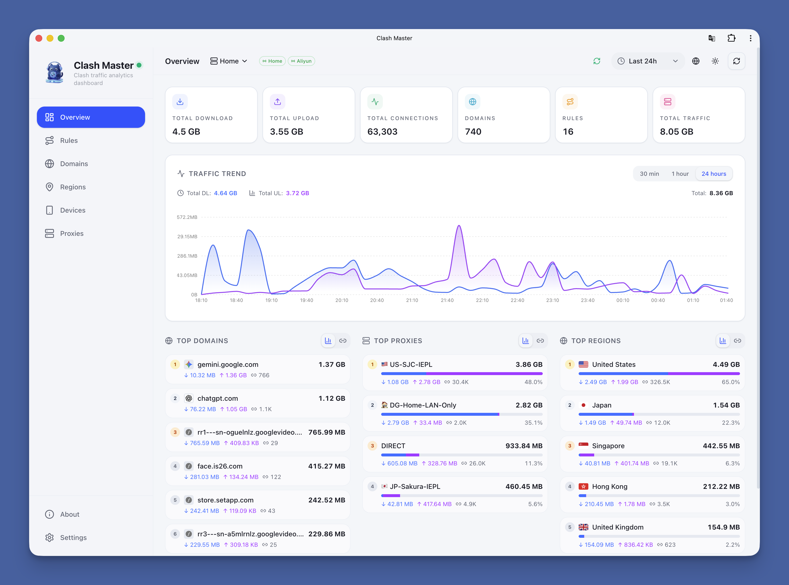

# GitHub Trending 排行榜

🔥 每周自动爬取GitHub最受欢迎的开源项目，生成AI智能总结的中文排行榜

[](https://github.com/qfy123/GitHub-Trending-/actions)
[](https://nodejs.org/)
[](LICENSE)

## ✨ 特性

- 🤖 **AI智能总结** - 使用DeepSeek AI生成简洁的中文项目描述
- 📊 **多维度排名** - 综合Star数、活跃度、新鲜度等指标
- 🖼️ **自动爬取图片** - 从项目README提取代表性图片
- 📈 **趋势分析** - 对比历史数据，显示项目排名变化
- 🗂️ **完整归档** - 按年份/周数归档所有历史数据
- 🔄 **自动更新** - GitHub Actions每周自动执行

## 📈 本周排行榜

<!-- TRENDING-START -->
### GitHub趋势排行榜 - 2026年第7周

**📅 统计周期**: 2026-02-08 ~ 2026-02-14  
**📊 项目总数**: 10 个  
**⭐ 总Star数**: 9,826  
**🔄 更新时间**: 2026-02-14 23:59:59  

| 排名 | 项目 | 描述 | Star | Fork | 语言 | 趋势 |
|------|------|------|------|------|------|------|
| 1 | [claudes-c-compiler](https://github.com/anthropics/claudes-c-compiler) | Claude Opus 4.6用Rust手写的零依赖C编译器，可独立生成ELF并编译出能启动的Linux内核。 | 1,705 | 91 | Rust | 🆕 |
| 2 | [ClawRouter](https://github.com/BlockRunAI/ClawRouter) | 智能LLM路由器，自动把请求派给最划算模型，统一钱包付费，平均省78%推理成本，支持30+模型免API Key。 | 1,855 | 179 | TypeScript | 🆕 |
| 3 | [vouch](https://github.com/mitchellh/vouch) | 基于显式“担保”机制的社区信任管理系统，可灵活控制谁能在项目中执行哪些操作，并支持公开“谴责”封禁。 | 1,568 | 27 | Nushell | 🆕 |
| 4 | [clash-master](https://github.com/foru17/clash-master) | 为OpenClash打造的现代化流量仪表盘，实时可视化多节点网络数据，一键管理多后端，让代理状态一目了然。 | 887 | 57 | TypeScript | 🆕 |
| 5 | [excalidraw-mcp-app](https://github.com/antonpk1/excalidraw-mcp-app) | 基于MCP协议，把Excalidraw手绘图实时流式推送到Claude、ChatGPT、VS Code等客户端，支... | 981 | 64 | TypeScript | 🆕 |
| 6 | [paqctl](https://github.com/SamNet-dev/paqctl) | 一键管理多协议穿墙代理，整合Paqet(KCP/raw)与GFW-Knocker(变异TCP/QUIC)，双后端并... | 602 | 74 | Shell | 🆕 |
| 7 | [rememory](https://github.com/eljojo/rememory) | 将加密文件密钥拆分给好友，离线浏览器即可共同恢复，防单点泄露的终极备份方案。 | 718 | 28 | Go | 🆕 |
| 8 | [jcp](https://github.com/run-bigpig/jcp) | 跨桌面AI股票分析工具，聚合多模型Agent协同讨论，实时行情+舆情+研报一键生成投资参考。 | 510 | 116 | Go | 🆕 |
| 9 | [EpsteIn](https://github.com/cfinke/EpsteIn) | 一键比对LinkedIn好友名单与爱泼斯坦案公开法庭文件，秒速发现潜在关联人，满足公众知情与风险自查需求。 | 501 | 29 | Python | 🆕 |
| 10 | [code-review-expert](https://github.com/sanyuan0704/code-review-expert) | 一键为AI代理注入资深工程师级代码评审能力，自动发现SOLID违规、安全漏洞、性能瓶颈与异常处理缺陷，显著提升代码... | 499 | 49 | Unknown | 🆕 |

### 🔥 详细介绍

#### 1. [claudes-c-compiler](https://github.com/anthropics/claudes-c-compiler) 

**📝 项目简介**: Claude Opus 4.6用Rust手写的零依赖C编译器，可独立生成ELF并编译出能启动的Linux内核。

**✨ 核心特性**:
- 零外部依赖，前端到链接器全自研
- 支持x86-64/32、ARM64、RISC-V多后端
- 自带优化器与DWARF调试信息生成

**📊 项目统计**:
- **⭐ Star数**: 1,705
- **🔀 Fork数**: 91
- **👀 Watch数**: 1,705
- **📝 语言**: Rust
- **💻 技术栈**: Rust, C, Shell, Redis, PostgreSQL
- **📈 趋势**: 🆕 新上榜项目

---

#### 2. [ClawRouter](https://github.com/BlockRunAI/ClawRouter) 


**📝 项目简介**: 智能LLM路由器，自动把请求派给最划算模型，统一钱包付费，平均省78%推理成本，支持30+模型免API Key。

**✨ 核心特性**:
- 动态选模型，成本最高省78%
- 一个钱包管理30+主流模型，无需各自API Key
- 内置x402微支付，按量计费，秒级结算

**📊 项目统计**:
- **⭐ Star数**: 1,855
- **🔀 Fork数**: 179
- **👀 Watch数**: 1,855
- **📝 语言**: TypeScript
- **💻 技术栈**: TypeScript, JavaScript, Shell, ai, ai-agents, anthropic
- **📈 趋势**: 🆕 新上榜项目

---

#### 3. [vouch](https://github.com/mitchellh/vouch) 

**📝 项目简介**: 基于显式“担保”机制的社区信任管理系统，可灵活控制谁能在项目中执行哪些操作，并支持公开“谴责”封禁。

**✨ 核心特性**:
- 担保/谴责双机制，权限粒度可配置
- 实现通用，适配任意代码托管平台
- 用Nushell+Nix构建，脚本即配置

**📊 项目统计**:
- **⭐ Star数**: 1,568
- **🔀 Fork数**: 27
- **👀 Watch数**: 1,568
- **📝 语言**: Nushell
- **💻 技术栈**: Nushell, Nix, Shell
- **📈 趋势**: 🆕 新上榜项目

---

#### 4. [clash-master](https://github.com/foru17/clash-master) 



**📝 项目简介**: 为OpenClash打造的现代化流量仪表盘，实时可视化多节点网络数据，一键管理多后端，让代理状态一目了然。

**✨ 核心特性**:
- 实时监控与多维度流量分析
- 优雅UI支持多后端集中管理
- 零配置开箱即用，兼容Clash/OpenClash

**📊 项目统计**:
- **⭐ Star数**: 887
- **🔀 Fork数**: 57
- **👀 Watch数**: 887
- **📝 语言**: TypeScript
- **💻 技术栈**: TypeScript, Shell, CSS, JavaScript, Dockerfile, clash
- **📈 趋势**: 🆕 新上榜项目

---

#### 5. [excalidraw-mcp-app](https://github.com/antonpk1/excalidraw-mcp-app) 


**📝 项目简介**: 基于MCP协议，把Excalidraw手绘图实时流式推送到Claude、ChatGPT、VS Code等客户端，支持平滑视口与全屏互动编辑。

**✨ 核心特性**:
- 即装即用，远程/本地一键接入
- 支持所有主流MCP客户端
- 手绘图实时同步+视口跟随

**📊 项目统计**:
- **⭐ Star数**: 981
- **🔀 Fork数**: 64
- **👀 Watch数**: 981
- **📝 语言**: TypeScript
- **💻 技术栈**: TypeScript, JavaScript, CSS, HTML
- **📈 趋势**: 🆕 新上榜项目

---

#### 6. [paqctl](https://github.com/SamNet-dev/paqctl) 


**📝 项目简介**: 一键管理多协议穿墙代理，整合Paqet(KCP/raw)与GFW-Knocker(变异TCP/QUIC)，双后端并发绕过GFW与伊朗防火墙。

**✨ 核心特性**:
- 单脚本同时驱动Paqet+GFW-Knocker双后端
- 支持Windows/Linux/macOS，Shell+Python跨平台
- 服务端一键部署，客户端零配置自动选路

**📊 项目统计**:
- **⭐ Star数**: 602
- **🔀 Fork数**: 74
- **👀 Watch数**: 602
- **📝 语言**: Shell
- **💻 技术栈**: Shell, Python, PowerShell, Batchfile, china, firewall-bypass
- **📈 趋势**: 🆕 新上榜项目

---

#### 7. [rememory](https://github.com/eljojo/rememory) 

**📝 项目简介**: 将加密文件密钥拆分给好友，离线浏览器即可共同恢复，防单点泄露的终极备份方案。

**✨ 核心特性**:
- Shamir密钥分片，无需信任单一人
- recover.html纯离线恢复，零依赖
- age加密+自托管，无服务器痕迹

**📊 项目统计**:
- **⭐ Star数**: 718
- **🔀 Fork数**: 28
- **👀 Watch数**: 718
- **📝 语言**: Go
- **🌐 官网**: [https://eljojo.github.io/rememory/](https://eljojo.github.io/rememory/)
- **💻 技术栈**: Go, HTML, TypeScript, JavaScript, CSS, Makefile
- **📈 趋势**: 🆕 新上榜项目

---

#### 8. [jcp](https://github.com/run-bigpig/jcp) 


**📝 项目简介**: 跨桌面AI股票分析工具，聚合多模型Agent协同讨论，实时行情+舆情+研报一键生成投资参考。

**✨ 核心特性**:
- 多AI专家角色协作，多维视角碰撞
- 股票级长期记忆，历史观点可追溯
- 集成行情/舆情/研报，信息一站式

**📊 项目统计**:
- **⭐ Star数**: 510
- **🔀 Fork数**: 116
- **👀 Watch数**: 510
- **📝 语言**: Go
- **💻 技术栈**: Go, TypeScript, NSIS, JavaScript, CSS, HTML
- **📈 趋势**: 🆕 新上榜项目

---

#### 9. [EpsteIn](https://github.com/cfinke/EpsteIn) 


**📝 项目简介**: 一键比对LinkedIn好友名单与爱泼斯坦案公开法庭文件，秒速发现潜在关联人，满足公众知情与风险自查需求。

**✨ 核心特性**:
- 直接对接官方公开文档，数据源可信
- 自动化拉取LinkedIn通讯录，零手动录入
- 本地运行，保护用户隐私不泄露

**📊 项目统计**:
- **⭐ Star数**: 501
- **🔀 Fork数**: 29
- **👀 Watch数**: 501
- **📝 语言**: Python
- **💻 技术栈**: Python
- **📈 趋势**: 🆕 新上榜项目

---

#### 10. [code-review-expert](https://github.com/sanyuan0704/code-review-expert) 

**📝 项目简介**: 一键为AI代理注入资深工程师级代码评审能力，自动发现SOLID违规、安全漏洞、性能瓶颈与异常处理缺陷，显著提升代码质量与可维护性。

**✨ 核心特性**:
- 覆盖SOLID五大原则违规检测
- 集成XSS、注入、SSRF等安全扫描
- 识别N+1查询、CPU热点、内存泄漏等性能问题

**📊 项目统计**:
- **⭐ Star数**: 499
- **🔀 Fork数**: 49
- **👀 Watch数**: 499
- **📝 语言**: Unknown
- **📈 趋势**: 🆕 新上榜项目

---

### 📈 本周统计

**🔥 热门语言**:
1. **TypeScript** (3 个项目)
2. **Go** (2 个项目)
3. **Rust** (1 个项目)
4. **Nushell** (1 个项目)
5. **Shell** (1 个项目)

**🏷️ 热门话题**:
1. ai (1)
2. ai-agents (1)
3. anthropic (1)
4. cost-optimization (1)
5. crypto (1)
6. deepseek (1)
7. gemini (1)
8. llm (1)


<!-- TRENDING-END -->

## 📚 历史数据

<!-- HISTORY-START -->
| 时间 | 周期 | 项目数 | 链接 |
|------|------|--------|------|
| 02-14 | 2026年第7周 | 10 个 | [查看详情](./archives/2026/week-7/report.md) |
| 02-07 | 2026年第6周 | 10 个 | [查看详情](./archives/2026/week-6/report.md) |
| 01-31 | 2026年第5周 | 10 个 | [查看详情](./archives/2026/week-5/report.md) |
| 01-24 | 2026年第4周 | 10 个 | [查看详情](./archives/2026/week-4/report.md) |
| 01-17 | 2026年第3周 | 10 个 | [查看详情](./archives/2026/week-3/report.md) |
| 01-10 | 2026年第2周 | 10 个 | [查看详情](./archives/2026/week-2/report.md) |
| 12-27 | 2025年第52周 | 10 个 | [查看详情](./archives/2025/week-52/report.md) |
| 12-20 | 2025年第51周 | 10 个 | [查看详情](./archives/2025/week-51/report.md) |
| 12-13 | 2025年第50周 | 10 个 | [查看详情](./archives/2025/week-50/report.md) |
| 12-06 | 2025年第49周 | 10 个 | [查看详情](./archives/2025/week-49/report.md) |
| 11-29 | 2025年第48周 | 10 个 | [查看详情](./archives/2025/week-48/report.md) |
| 11-22 | 2025年第47周 | 10 个 | [查看详情](./archives/2025/week-47/report.md) |
| 11-15 | 2025年第46周 | 10 个 | [查看详情](./archives/2025/week-46/report.md) |
| 11-08 | 2025年第45周 | 10 个 | [查看详情](./archives/2025/week-45/report.md) |
| 11-01 | 2025年第44周 | 10 个 | [查看详情](./archives/2025/week-44/report.md) |
| 10-25 | 2025年第43周 | 10 个 | [查看详情](./archives/2025/week-43/report.md) |
| 10-18 | 2025年第42周 | 10 个 | [查看详情](./archives/2025/week-42/report.md) |
| 10-11 | 2025年第41周 | 10 个 | [查看详情](./archives/2025/week-41/report.md) |
| 10-04 | 2025年第40周 | 10 个 | [查看详情](./archives/2025/week-40/report.md) |
| 09-27 | 2025年第39周 | 10 个 | [查看详情](./archives/2025/week-39/report.md) |

[查看完整历史数据](./archives/)
<!-- HISTORY-END -->

## 🚀 快速开始

### 1. 克隆项目

```bash
git clone https://github.com/your-username/GitHub-Trending.git
cd GitHub-Trending
```

### 2. 安装依赖

```bash
npm install
```

### 3. 配置环境变量

```bash
# 复制环境变量模板
cp .env.example .env

# 编辑 .env 文件，填入以下必需配置：
# GITHUB_TOKEN=your_github_token
# SILICONFLOW_API_KEY=your_siliconflow_api_key
```

### 4. 测试配置

```bash
# 系统测试
node test/system-test.js

# 配置检查
node scripts/update-trending.js --check
```

### 5. 运行项目

```bash
# 测试运行（少量数据）
node scripts/update-trending.js --limit 3

# 正式运行
node scripts/update-trending.js
```

## 🔧 配置说明

### 环境变量

| 变量名 | 必需 | 说明 | 获取方式 |
|--------|------|------|----------|
| `GITHUB_TOKEN` | ✅ | GitHub API访问令牌 | [GitHub设置](https://github.com/settings/tokens) |
| `SILICONFLOW_API_KEY` | ✅ | 硅基流动API密钥 | [硅基流动官网](https://siliconflow.cn) |
| `AI_BASE_URL` | ❌ | AI服务地址 | 默认硅基流动 |
| `AI_MODEL` | ❌ | AI模型名称 | 默认deepseek-chat |

详细配置请参考：[配置指南](config/README.md)

### GitHub Actions自动化

1. **Fork本项目**到你的GitHub账号
2. **设置Secrets**：
   - `SILICONFLOW_API_KEY`: 硅基流动API密钥
3. **启用Actions**：项目会自动每周一更新

详细设置请参考：[GitHub Actions配置](-.github/README.md)

## 📊 项目结构

```
GitHub-Trending/
├── src/                          # 核心源码
│   ├── github-api.js            # GitHub API调用
│   ├── ai-summarizer.js         # AI项目总结
│   ├── image-crawler.js         # 图片爬取
│   ├── data-processor.js        # 数据处理
│   ├── file-manager.js          # 文件管理
│   └── readme-updater.js        # README更新
├── scripts/                      # 执行脚本
│   └── update-trending.js       # 主执行脚本
├── test/                         # 测试文件
│   └── system-test.js           # 系统测试
├── archives/                     # 历史数据归档
│   └── YYYY/                    # 按年份归档
│       └── week-XX.md           # 周报文件
├── images/                       # 项目图片
│   └── YYYY/week-XX/            # 按周归档
├── data/                         # 临时数据
├── config/                       # 配置文档
├── .github/                      # GitHub Actions
│   └── workflows/
└── README.md                     # 项目说明
```

## 🎯 使用场景

### 开发者
- 🔍 **发现新项目** - 了解最新热门开源项目
- 📈 **技术趋势** - 跟踪编程语言和技术栈趋势
- 💡 **学习参考** - 学习优秀项目的设计和实现

### 技术团队
- 📊 **技术选型** - 参考热门项目进行技术选型
- 🎯 **竞品分析** - 关注同类项目的发展趋势
- 📝 **技术报告** - 生成定期的技术趋势报告

### 内容创作者
- ✍️ **素材收集** - 为技术文章和视频收集素材
- 📰 **新闻线索** - 发现值得报道的新兴项目
- 🗣️ **分享内容** - 分享有价值的开源项目

## 🛠️ 命令行工具

```bash
# 查看帮助
node scripts/update-trending.js --help

# 检查配置
node scripts/update-trending.js --check

# 自定义参数运行
node scripts/update-trending.js --limit 20 --language python

# 数据管理
node scripts/update-trending.js --backup     # 创建备份
node scripts/update-trending.js --cleanup    # 清理过期数据
node scripts/update-trending.js --stats      # 查看统计信息

# 系统测试
node test/system-test.js                      # 完整测试
node test/system-test.js --quick             # 快速诊断
```

## 📈 排名算法

项目排名基于以下三个维度的综合评分：

### 🌟 受欢迎程度 (50%)
- **Star数量** (60%): 项目获得的Star数
- **Fork数量** (25%): 项目被Fork的次数  
- **Watch数量** (15%): 项目被Watch的次数

### 🔥 活跃程度 (30%)
- **最近提交** (50%): 距离最后一次提交的时间
- **Issues活跃度** (30%): 开放的Issues数量
- **Fork活跃度** (20%): Fork的活跃程度

### 🆕 新鲜程度 (20%)
- **创建时间** (30%): 项目创建时间（新项目得分高）
- **更新时间** (70%): 最近更新时间

### 趋势分析
- 📈 **上升**: 排名比上周提升
- 📉 **下降**: 排名比上周下降  
- ➡️ **稳定**: 排名无明显变化
- 🆕 **新上榜**: 首次进入排行榜

## 🤝 贡献指南

欢迎提交 Issues 和 Pull Requests！

### 开发环境设置

```bash
# 1. Fork 并克隆项目
git clone https://github.com/your-username/GitHub-Trending.git

# 2. 创建功能分支
git checkout -b feature/your-feature

# 3. 安装依赖并测试
npm install
node test/system-test.js

# 4. 开发完成后提交
git commit -m "feat: 添加新功能"
git push origin feature/your-feature
```

### 提交规范

- `feat`: 新功能
- `fix`: 修复bug
- `docs`: 文档更新
- `style`: 代码格式调整
- `refactor`: 代码重构
- `test`: 测试相关
- `chore`: 构建/工具相关

## 📄 许可证

本项目基于 [MIT 许可证](LICENSE) 开源。

## 🙏 致谢

- [GitHub API](https://docs.github.com/en/rest) - 提供项目数据
- [硅基流动](https://siliconflow.cn) - 提供AI总结服务
- [DeepSeek](https://deepseek.com) - 优秀的AI模型
- [GitHub Actions](https://github.com/features/actions) - 自动化支持

## 📞 联系方式

- 🐛 **Bug报告**: [提交Issue](https://github.com/your-username/GitHub-Trending/issues)
- 💡 **功能建议**: [功能请求](https://github.com/your-username/GitHub-Trending/issues)
- 📧 **其他问题**: [发送邮件](mailto:your-email@example.com)

## 🔗 相关链接

- [项目文档](https://github.com/your-username/GitHub-Trending/wiki)
- [更新日志](CHANGELOG.md)
- [FAQ](FAQ.md)

---

⭐ 如果这个项目对你有帮助，请给它一个Star！

*本项目由 [GitHub Actions](https://github.com/features/actions) 自动维护，数据每周更新*