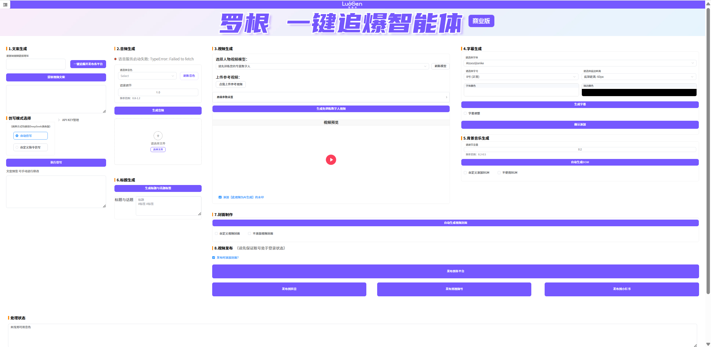

# GitHub Trending 排行榜

🔥 每周自动爬取GitHub最受欢迎的开源项目，生成AI智能总结的中文排行榜

[](https://github.com/qfy123/GitHub-Trending-/actions)
[](https://nodejs.org/)
[](LICENSE)

## ✨ 特性

- 🤖 **AI智能总结** - 使用DeepSeek AI生成简洁的中文项目描述
- 📊 **多维度排名** - 综合Star数、活跃度、新鲜度等指标
- 🖼️ **自动爬取图片** - 从项目README提取代表性图片
- 📈 **趋势分析** - 对比历史数据，显示项目排名变化
- 🗂️ **完整归档** - 按年份/周数归档所有历史数据
- 🔄 **自动更新** - GitHub Actions每周自动执行

## 📈 本周排行榜

<!-- TRENDING-START -->
### GitHub趋势排行榜 - 2025年第41周

**📅 统计周期**: 2025-10-05 ~ 2025-10-11  
**📊 项目总数**: 10 个  
**⭐ 总Star数**: 5,749  
**🔄 更新时间**: 2025-10-11 23:59:59  

| 排名 | 项目 | 描述 | Star | Fork | 语言 | 趋势 |
|------|------|------|------|------|------|------|
| 1 | [bdh](https://github.com/pathwaycom/bdh) | 论文《The Dragon Hatchling》官方实现，提出介于Transformer与脑模型之间的新架构，附完... | 2,342 | 68 | Python | 🆕 |
| 2 | [crypto-arbitrage-bot](https://github.com/yottjane/crypto-arbitrage-bot) | 免费开源的多交易所加密货币套利机器人，可自动捕捉价差并执行跨平台搬砖交易，降低人工盯盘成本。 | 630 | 390 | TypeScript | 🆕 |
| 3 | [neutts-air](https://github.com/neuphonic/neutts-air) | NeuTTS Air是全球首款可在本地运行的超逼真TTS引擎，无需联网即可生成高质量语音，彻底摆脱云端API依赖。 | 617 | 72 | Python | 🆕 |
| 4 | [LuoGen-agent](https://github.com/LuoGen-AI/LuoGen-agent) | 一键生成爆款短视频的自动化工具，自动完成文案、配音、数字人、字幕、封面到多平台发布的全流程。 | 529 | 42 | Python | 🆕 |
| 5 | [run](https://github.com/Esubaalew/run) | Rust编写的多语言通用运行器与智能REPL，一键脚本、编译、交互25+语言，无需切换CLI。 | 464 | 8 | Rust | 🆕 |
| 6 | [Gift-Buyer-Tg](https://github.com/ThunderTo/Gift-Buyer-Tg) | Telegram礼物抢购机器人，可按自定义条件秒级扫货并自动下单，已服务200+用户。 | 206 | 70 | Python | 🆕 |
| 7 | [proofofthought](https://github.com/DebarghaG/proofofthought) | 结合大模型与Z3定理证明器，实现可解释、鲁棒的神经符号程序合成与推理，支持复杂问答与批量评估。 | 289 | 17 | Python | 🆕 |
| 8 | [TTT3R](https://github.com/Inception3D/TTT3R) | TTT3R通过测试时训练策略，为CUT3R引入简单状态更新规则，显著提升长序列三维重建的泛化能力。 | 266 | 6 | Python | 🆕 |
| 9 | [WindowMode](https://github.com/True3DLabs/WindowMode) | 将屏幕变成通往虚拟世界的“窗户”，用户可透过显示器实时观察并交互3D场景，实现沉浸式裸眼3D体验。 | 205 | 16 | TypeScript | 🆕 |
| 10 | [reddix](https://github.com/ck-zhang/reddix) | Reddix 是一款终端 Reddit 客户端，支持多账号、键盘导航与图片预览，让开发者在命令行中高效浏览 Red... | 201 | 1 | Rust | 🆕 |

### 🔥 详细介绍

#### 1. [bdh](https://github.com/pathwaycom/bdh) 


**📝 项目简介**: 论文《The Dragon Hatchling》官方实现，提出介于Transformer与脑模型之间的新架构，附完整训练与实验代码。

**✨ 核心特性**:
- 填补Transformer与脑模型理论空白
- 提供可复现的架构与训练脚本
- 附Scaling Law实验数据与图表

**📊 项目统计**:
- **⭐ Star数**: 2,342
- **🔀 Fork数**: 68
- **👀 Watch数**: 2,342
- **📝 语言**: Python
- **💻 技术栈**: Python, Express, AWS
- **📈 趋势**: 🆕 新上榜项目

---

#### 2. [crypto-arbitrage-bot](https://github.com/yottjane/crypto-arbitrage-bot) 


**📝 项目简介**: 免费开源的多交易所加密货币套利机器人，可自动捕捉价差并执行跨平台搬砖交易，降低人工盯盘成本。

**✨ 核心特性**:
- 支持Binance等主流交易所
- NestJS+Solidity双引擎，链上链下套利
- TypeScript全栈，二次开发友好

**📊 项目统计**:
- **⭐ Star数**: 630
- **🔀 Fork数**: 390
- **👀 Watch数**: 630
- **📝 语言**: TypeScript
- **💻 技术栈**: TypeScript, Solidity, JavaScript, arbitrage, arbitrage-bots, binance
- **📈 趋势**: 🆕 新上榜项目

---

#### 3. [neutts-air](https://github.com/neuphonic/neutts-air) 

**📝 项目简介**: NeuTTS Air是全球首款可在本地运行的超逼真TTS引擎，无需联网即可生成高质量语音，彻底摆脱云端API依赖。

**✨ 核心特性**:
- 完全离线运行，保护隐私
- 超小体积，适配端侧设备
- 语音自然度媲美云端服务

**📊 项目统计**:
- **⭐ Star数**: 617
- **🔀 Fork数**: 72
- **👀 Watch数**: 617
- **📝 语言**: Python
- **💻 技术栈**: Python
- **📈 趋势**: 🆕 新上榜项目

---

#### 4. [LuoGen-agent](https://github.com/LuoGen-AI/LuoGen-agent) 



**📝 项目简介**: 一键生成爆款短视频的自动化工具，自动完成文案、配音、数字人、字幕、封面到多平台发布的全流程。

**✨ 核心特性**:
- 对标文案自动提取与仿写
- Whisper+CosyVoice高保真语音克隆
- HeyGem数字人口播+多平台一键发布

**📊 项目统计**:
- **⭐ Star数**: 529
- **🔀 Fork数**: 42
- **👀 Watch数**: 529
- **📝 语言**: Python
- **💻 技术栈**: Python, Batchfile
- **📈 趋势**: 🆕 新上榜项目

---

#### 5. [run](https://github.com/Esubaalew/run) 


**📝 项目简介**: Rust编写的多语言通用运行器与智能REPL，一键脚本、编译、交互25+语言，无需切换CLI。

**✨ 核心特性**:
- 25+语言零配置即跑
- 内置智能REPL与缓存
- 单二进制跨平台

**📊 项目统计**:
- **⭐ Star数**: 464
- **🔀 Fork数**: 8
- **👀 Watch数**: 464
- **📝 语言**: Rust
- **🌐 官网**: [https://run.esubalew.et](https://run.esubalew.et)
- **💻 技术栈**: Rust, Shell, Smarty, repl, rust, Node.js
- **📈 趋势**: 🆕 新上榜项目

---

#### 6. [Gift-Buyer-Tg](https://github.com/ThunderTo/Gift-Buyer-Tg) 

**📝 项目简介**: Telegram礼物抢购机器人，可按自定义条件秒级扫货并自动下单，已服务200+用户。

**✨ 核心特性**:
- 每秒抢购5+礼物
- 全自动扫描与下单
- 可接入自有Telegram Bot

**📊 项目统计**:
- **⭐ Star数**: 206
- **🔀 Fork数**: 70
- **👀 Watch数**: 206
- **📝 语言**: Python
- **💻 技术栈**: Python, Batchfile, gift-bot-telegram, gift-buyer, gift-sniper, telegram-gift
- **📈 趋势**: 🆕 新上榜项目

---

#### 7. [proofofthought](https://github.com/DebarghaG/proofofthought) 

**📝 项目简介**: 结合大模型与Z3定理证明器，实现可解释、鲁棒的神经符号程序合成与推理，支持复杂问答与批量评估。

**✨ 核心特性**:
- LLM+Z3神经符号融合，推理可解释
- 支持单条/批量问答评估，快速验证逻辑
- NeurIPS 2024官方认可，研究前沿

**📊 项目统计**:
- **⭐ Star数**: 289
- **🔀 Fork数**: 17
- **👀 Watch数**: 289
- **📝 语言**: Python
- **💻 技术栈**: Python, Azure
- **📈 趋势**: 🆕 新上榜项目

---

#### 8. [TTT3R](https://github.com/Inception3D/TTT3R) 


**📝 项目简介**: TTT3R通过测试时训练策略，为CUT3R引入简单状态更新规则，显著提升长序列三维重建的泛化能力。

**✨ 核心特性**:
- 测试时训练增强长序列泛化
- 单状态更新规则即插即用
- 兼容CUT3R无需重训练

**📊 项目统计**:
- **⭐ Star数**: 266
- **🔀 Fork数**: 6
- **👀 Watch数**: 266
- **📝 语言**: Python
- **🌐 官网**: [https://rover-xingyu.github.io/TTT3R/](https://rover-xingyu.github.io/TTT3R/)
- **💻 技术栈**: Python, Jupyter Notebook, Shell, Cuda, C++, 3d-reconstruction
- **📈 趋势**: 🆕 新上榜项目

---

#### 9. [WindowMode](https://github.com/True3DLabs/WindowMode) 


**📝 项目简介**: 将屏幕变成通往虚拟世界的“窗户”，用户可透过显示器实时观察并交互3D场景，实现沉浸式裸眼3D体验。

**✨ 核心特性**:
- 裸眼3D窗口视角
- 基于NextJS的轻量演示
- 自定义体素格式(.vv)高效加载

**📊 项目统计**:
- **⭐ Star数**: 205
- **🔀 Fork数**: 16
- **👀 Watch数**: 205
- **📝 语言**: TypeScript
- **🌐 官网**: [https://lab.true3d.com/targets](https://lab.true3d.com/targets)
- **💻 技术栈**: TypeScript, CSS, JavaScript
- **📈 趋势**: 🆕 新上榜项目

---

#### 10. [reddix](https://github.com/ck-zhang/reddix) 


**📝 项目简介**: Reddix 是一款终端 Reddit 客户端，支持多账号、键盘导航与图片预览，让开发者在命令行中高效浏览 Reddit。

**✨ 核心特性**:
- 终端原生体验，无需图形界面
- Kitty 协议图片预览，信息更丰富
- 多账号一键切换，键盘快捷导航

**📊 项目统计**:
- **⭐ Star数**: 201
- **🔀 Fork数**: 1
- **👀 Watch数**: 201
- **📝 语言**: Rust
- **💻 技术栈**: Rust, reddit, reddit-client
- **📈 趋势**: 🆕 新上榜项目

---

### 📈 本周统计

**🔥 热门语言**:
1. **Python** (6 个项目)
2. **TypeScript** (2 个项目)
3. **Rust** (2 个项目)

**🏷️ 热门话题**:
1. arbitrage (1)
2. arbitrage-bots (1)
3. binance (1)
4. bitcoin (1)
5. crypto-trading (1)
6. cryptocurrency (1)
7. ethereum (1)
8. smart-contracts (1)


<!-- TRENDING-END -->

## 📚 历史数据

<!-- HISTORY-START -->
| 时间 | 周期 | 项目数 | 链接 |
|------|------|--------|------|
| 10-11 | 2025年第41周 | 10 个 | [查看详情](./archives/2025/week-41/report.md) |
| 10-04 | 2025年第40周 | 10 个 | [查看详情](./archives/2025/week-40/report.md) |
| 09-27 | 2025年第39周 | 10 个 | [查看详情](./archives/2025/week-39/report.md) |
| 09-20 | 2025年第38周 | 10 个 | [查看详情](./archives/2025/week-38/report.md) |
| 09-13 | 2025年第37周 | 10 个 | [查看详情](./archives/2025/week-37/report.md) |
| 09-06 | 2025年第36周 | 10 个 | [查看详情](./archives/2025/week-36/report.md) |
| 08-30 | 2025年第35周 | 10 个 | [查看详情](./archives/2025/week-35/report.md) |
| 08-23 | 2025年第34周 | 10 个 | [查看详情](./archives/2025/week-34/report.md) |
| 08-16 | 2025年第33周 | 3 个 | [查看详情](./archives/2025/week-33/report.md) |

<!-- HISTORY-END -->

## 🚀 快速开始

### 1. 克隆项目

```bash
git clone https://github.com/your-username/GitHub-Trending.git
cd GitHub-Trending
```

### 2. 安装依赖

```bash
npm install
```

### 3. 配置环境变量

```bash
# 复制环境变量模板
cp .env.example .env

# 编辑 .env 文件，填入以下必需配置：
# GITHUB_TOKEN=your_github_token
# SILICONFLOW_API_KEY=your_siliconflow_api_key
```

### 4. 测试配置

```bash
# 系统测试
node test/system-test.js

# 配置检查
node scripts/update-trending.js --check
```

### 5. 运行项目

```bash
# 测试运行（少量数据）
node scripts/update-trending.js --limit 3

# 正式运行
node scripts/update-trending.js
```

## 🔧 配置说明

### 环境变量

| 变量名 | 必需 | 说明 | 获取方式 |
|--------|------|------|----------|
| `GITHUB_TOKEN` | ✅ | GitHub API访问令牌 | [GitHub设置](https://github.com/settings/tokens) |
| `SILICONFLOW_API_KEY` | ✅ | 硅基流动API密钥 | [硅基流动官网](https://siliconflow.cn) |
| `AI_BASE_URL` | ❌ | AI服务地址 | 默认硅基流动 |
| `AI_MODEL` | ❌ | AI模型名称 | 默认deepseek-chat |

详细配置请参考：[配置指南](config/README.md)

### GitHub Actions自动化

1. **Fork本项目**到你的GitHub账号
2. **设置Secrets**：
   - `SILICONFLOW_API_KEY`: 硅基流动API密钥
3. **启用Actions**：项目会自动每周一更新

详细设置请参考：[GitHub Actions配置](-.github/README.md)

## 📊 项目结构

```
GitHub-Trending/
├── src/                          # 核心源码
│   ├── github-api.js            # GitHub API调用
│   ├── ai-summarizer.js         # AI项目总结
│   ├── image-crawler.js         # 图片爬取
│   ├── data-processor.js        # 数据处理
│   ├── file-manager.js          # 文件管理
│   └── readme-updater.js        # README更新
├── scripts/                      # 执行脚本
│   └── update-trending.js       # 主执行脚本
├── test/                         # 测试文件
│   └── system-test.js           # 系统测试
├── archives/                     # 历史数据归档
│   └── YYYY/                    # 按年份归档
│       └── week-XX.md           # 周报文件
├── images/                       # 项目图片
│   └── YYYY/week-XX/            # 按周归档
├── data/                         # 临时数据
├── config/                       # 配置文档
├── .github/                      # GitHub Actions
│   └── workflows/
└── README.md                     # 项目说明
```

## 🎯 使用场景

### 开发者
- 🔍 **发现新项目** - 了解最新热门开源项目
- 📈 **技术趋势** - 跟踪编程语言和技术栈趋势
- 💡 **学习参考** - 学习优秀项目的设计和实现

### 技术团队
- 📊 **技术选型** - 参考热门项目进行技术选型
- 🎯 **竞品分析** - 关注同类项目的发展趋势
- 📝 **技术报告** - 生成定期的技术趋势报告

### 内容创作者
- ✍️ **素材收集** - 为技术文章和视频收集素材
- 📰 **新闻线索** - 发现值得报道的新兴项目
- 🗣️ **分享内容** - 分享有价值的开源项目

## 🛠️ 命令行工具

```bash
# 查看帮助
node scripts/update-trending.js --help

# 检查配置
node scripts/update-trending.js --check

# 自定义参数运行
node scripts/update-trending.js --limit 20 --language python

# 数据管理
node scripts/update-trending.js --backup     # 创建备份
node scripts/update-trending.js --cleanup    # 清理过期数据
node scripts/update-trending.js --stats      # 查看统计信息

# 系统测试
node test/system-test.js                      # 完整测试
node test/system-test.js --quick             # 快速诊断
```

## 📈 排名算法

项目排名基于以下三个维度的综合评分：

### 🌟 受欢迎程度 (50%)
- **Star数量** (60%): 项目获得的Star数
- **Fork数量** (25%): 项目被Fork的次数  
- **Watch数量** (15%): 项目被Watch的次数

### 🔥 活跃程度 (30%)
- **最近提交** (50%): 距离最后一次提交的时间
- **Issues活跃度** (30%): 开放的Issues数量
- **Fork活跃度** (20%): Fork的活跃程度

### 🆕 新鲜程度 (20%)
- **创建时间** (30%): 项目创建时间（新项目得分高）
- **更新时间** (70%): 最近更新时间

### 趋势分析
- 📈 **上升**: 排名比上周提升
- 📉 **下降**: 排名比上周下降  
- ➡️ **稳定**: 排名无明显变化
- 🆕 **新上榜**: 首次进入排行榜

## 🤝 贡献指南

欢迎提交 Issues 和 Pull Requests！

### 开发环境设置

```bash
# 1. Fork 并克隆项目
git clone https://github.com/your-username/GitHub-Trending.git

# 2. 创建功能分支
git checkout -b feature/your-feature

# 3. 安装依赖并测试
npm install
node test/system-test.js

# 4. 开发完成后提交
git commit -m "feat: 添加新功能"
git push origin feature/your-feature
```

### 提交规范

- `feat`: 新功能
- `fix`: 修复bug
- `docs`: 文档更新
- `style`: 代码格式调整
- `refactor`: 代码重构
- `test`: 测试相关
- `chore`: 构建/工具相关

## 📄 许可证

本项目基于 [MIT 许可证](LICENSE) 开源。

## 🙏 致谢

- [GitHub API](https://docs.github.com/en/rest) - 提供项目数据
- [硅基流动](https://siliconflow.cn) - 提供AI总结服务
- [DeepSeek](https://deepseek.com) - 优秀的AI模型
- [GitHub Actions](https://github.com/features/actions) - 自动化支持

## 📞 联系方式

- 🐛 **Bug报告**: [提交Issue](https://github.com/your-username/GitHub-Trending/issues)
- 💡 **功能建议**: [功能请求](https://github.com/your-username/GitHub-Trending/issues)
- 📧 **其他问题**: [发送邮件](mailto:your-email@example.com)

## 🔗 相关链接

- [项目文档](https://github.com/your-username/GitHub-Trending/wiki)
- [更新日志](CHANGELOG.md)
- [FAQ](FAQ.md)

---

⭐ 如果这个项目对你有帮助，请给它一个Star！

*本项目由 [GitHub Actions](https://github.com/features/actions) 自动维护，数据每周更新*