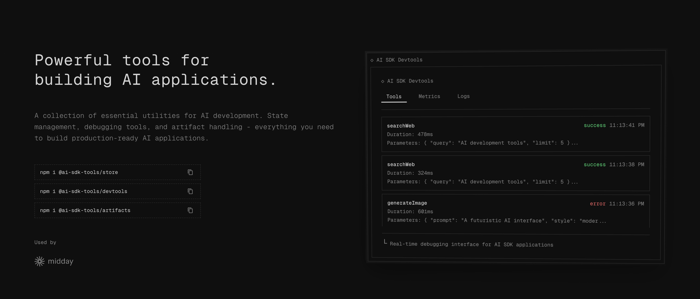

# GitHub Trending 排行榜

🔥 每周自动爬取GitHub最受欢迎的开源项目，生成AI智能总结的中文排行榜

[](https://github.com/qfy123/GitHub-Trending-/actions)
[](https://nodejs.org/)
[](LICENSE)

## ✨ 特性

- 🤖 **AI智能总结** - 使用DeepSeek AI生成简洁的中文项目描述
- 📊 **多维度排名** - 综合Star数、活跃度、新鲜度等指标
- 🖼️ **自动爬取图片** - 从项目README提取代表性图片
- 📈 **趋势分析** - 对比历史数据，显示项目排名变化
- 🗂️ **完整归档** - 按年份/周数归档所有历史数据
- 🔄 **自动更新** - GitHub Actions每周自动执行

## 📈 本周排行榜

<!-- TRENDING-START -->
### GitHub趋势排行榜 - 2025年第38周

**📅 统计周期**: 2025-09-14 ~ 2025-09-20  
**📊 项目总数**: 10 个  
**⭐ 总Star数**: 4,203  
**🔄 更新时间**: 2025-09-20 23:59:59  

| 排名 | 项目 | 描述 | Star | Fork | 语言 | 趋势 |
|------|------|------|------|------|------|------|
| 1 | [Super-Mario-Bros.-Remastered-Public](https://github.com/JHDev2006/Super-Mario-Bros.-Remastered-Public) | 基于God引擎的《超级马里奥兄弟》高清重制版，新增角色、关卡与编辑器，致敬经典并支持自定义创作。 | 353 | 44 | GDScript | 🆕 |
| 2 | [ZeroTrace-Stealer-13-2026](https://github.com/luis22d/ZeroTrace-Stealer-13-2026) | 基于C#的隐蔽信息窃取工具，可提取浏览器密码、Cookie等敏感数据并回传服务器。 | 432 | 381 | C# | 🆕 |
| 3 | [nano11](https://github.com/ntdevlabs/nano11) | 一键生成极度精简、无预装软件、可启动的Windows 11镜像脚本，让系统体积最小化。 | 438 | 30 | PowerShell | 🆕 |
| 4 | [batch_invariant_ops](https://github.com/thinking-machines-lab/batch_invariant_ops) | 用可复现的“批无关”算子替换PyTorch核心kernel，让LLM推理结果完全确定，不再因batch size不... | 563 | 28 | Python | 🆕 |
| 5 | [SRPO](https://github.com/Tencent-Hunyuan/SRPO) | 腾讯混元开源的SRPO框架，通过细粒度人类偏好直接对齐扩散模型完整生成轨迹，提升图像生成质量与可控性。 | 533 | 11 | Python | 🆕 |
| 6 | [docker-mcp-tutorial](https://github.com/theNetworkChuck/docker-mcp-tutorial) | NetworkChuck出品的Docker版MCP服务器速成教程，含视频配套代码与模板，5分钟可跑通首个AI工具服务。 | 333 | 76 | Unknown | 🆕 |
| 7 | [oq](https://github.com/plutov/oq) | 终端里的OpenAPI文档浏览器，支持本地/远程YAML/JSON一键预览，键盘交互式浏览接口详情。 | 481 | 6 | Go | 🆕 |
| 8 | [ai-sdk-tools](https://github.com/midday-ai/ai-sdk-tools) | 围绕 Vercel AI SDK 打造的实用工具包，提供状态管理、调试与产物处理，帮助开发者快速构建可上线的 AI... | 369 | 19 | TypeScript | 🆕 |
| 9 | [elden-github](https://github.com/SaltyAom/elden-github) | 把GitHub界面改造成《艾尔登法环》风格，提供沉浸式游戏化浏览体验。 | 384 | 10 | TypeScript | 🆕 |
| 10 | [Lumina-DiMOO](https://github.com/Alpha-VLLM/Lumina-DiMOO) | 首个开源的离散扩散式多模态大模型，实现文本、图像统一理解与生成，打破传统自回归范式。 | 317 | 18 | Python | 🆕 |

### 🔥 详细介绍

#### 1. [Super-Mario-Bros.-Remastered-Public](https://github.com/JHDev2006/Super-Mario-Bros.-Remastered-Public) 

**📝 项目简介**: 基于God引擎的《超级马里奥兄弟》高清重制版，新增角色、关卡与编辑器，致敬经典并支持自定义创作。

**✨ 核心特性**:
- 新增关卡与角色
- 内置关卡编辑器
- 支持自定义关卡分享

**📊 项目统计**:
- **⭐ Star数**: 353
- **🔀 Fork数**: 44
- **👀 Watch数**: 353
- **📝 语言**: GDScript
- **💻 技术栈**: GDScript, GAP, C#, GDShader
- **📈 趋势**: 🆕 新上榜项目

---

#### 2. [ZeroTrace-Stealer-13-2026](https://github.com/luis22d/ZeroTrace-Stealer-13-2026) 


**📝 项目简介**: 基于C#的隐蔽信息窃取工具，可提取浏览器密码、Cookie等敏感数据并回传服务器。

**✨ 核心特性**:
- 支持最新Chrome数据提取
- 内置FUD加密绕过检测
- 提供可视化控制面板

**📊 项目统计**:
- **⭐ Star数**: 432
- **🔀 Fork数**: 381
- **👀 Watch数**: 432
- **📝 语言**: C#
- **💻 技术栈**: C#, crypter, crypter-fud, fud-crypter, fud-stealer, panel-stealer
- **📈 趋势**: 🆕 新上榜项目

---

#### 3. [nano11](https://github.com/ntdevlabs/nano11) 

**📝 项目简介**: 一键生成极度精简、无预装软件、可启动的Windows 11镜像脚本，让系统体积最小化。

**✨ 核心特性**:
- 纯PowerShell+官方工具，无需第三方组件
- 自动下载oscdimg并集成无人值守应答，跳过微软账户
- 保留核心功能，显著降低内存与磁盘占用

**📊 项目统计**:
- **⭐ Star数**: 438
- **🔀 Fork数**: 30
- **👀 Watch数**: 438
- **📝 语言**: PowerShell
- **💻 技术栈**: PowerShell
- **📈 趋势**: 🆕 新上榜项目

---

#### 4. [batch_invariant_ops](https://github.com/thinking-machines-lab/batch_invariant_ops) 

**📝 项目简介**: 用可复现的“批无关”算子替换PyTorch核心kernel，让LLM推理结果完全确定，不再因batch size不同而出差。

**✨ 核心特性**:
- 一行代码启用，零侵入改造
- 自带vLLM示例，即刻获得确定性输出
- 基于torch.Library，开销极低

**📊 项目统计**:
- **⭐ Star数**: 563
- **🔀 Fork数**: 28
- **👀 Watch数**: 563
- **📝 语言**: Python
- **💻 技术栈**: Python
- **📈 趋势**: 🆕 新上榜项目

---

#### 5. [SRPO](https://github.com/Tencent-Hunyuan/SRPO) 


**📝 项目简介**: 腾讯混元开源的SRPO框架，通过细粒度人类偏好直接对齐扩散模型完整生成轨迹，提升图像生成质量与可控性。

**✨ 核心特性**:
- 端到端轨迹级对齐
- 细粒度人类偏好学习
- 开源预训练模型与代码

**📊 项目统计**:
- **⭐ Star数**: 533
- **🔀 Fork数**: 11
- **👀 Watch数**: 533
- **📝 语言**: Python
- **🌐 官网**: [https://tencent.github.io/srpo-project-page/](https://tencent.github.io/srpo-project-page/)
- **💻 技术栈**: Python, Shell
- **📈 趋势**: 🆕 新上榜项目

---

#### 6. [docker-mcp-tutorial](https://github.com/theNetworkChuck/docker-mcp-tutorial) 

**📝 项目简介**: NetworkChuck出品的Docker版MCP服务器速成教程，含视频配套代码与模板，5分钟可跑通首个AI工具服务。

**✨ 核心特性**:
- 5分钟极速上手
- 配套视频+完整示例
- Docker一键部署

**📊 项目统计**:
- **⭐ Star数**: 333
- **🔀 Fork数**: 76
- **👀 Watch数**: 333
- **📝 语言**: Unknown
- **💻 技术栈**: Docker, REST API
- **📈 趋势**: 🆕 新上榜项目

---

#### 7. [oq](https://github.com/plutov/oq) 


**📝 项目简介**: 终端里的OpenAPI文档浏览器，支持本地/远程YAML/JSON一键预览，键盘交互式浏览接口详情。

**✨ 核心特性**:
- 终端即开即用，无需浏览器
- 支持OpenAPI 3.0/3.1与YAML/JSON
- 管道输入，可curl远程Spec直接查看

**📊 项目统计**:
- **⭐ Star数**: 481
- **🔀 Fork数**: 6
- **👀 Watch数**: 481
- **📝 语言**: Go
- **💻 技术栈**: Go
- **📈 趋势**: 🆕 新上榜项目

---

#### 8. [ai-sdk-tools](https://github.com/midday-ai/ai-sdk-tools) 



**📝 项目简介**: 围绕 Vercel AI SDK 打造的实用工具包，提供状态管理、调试与产物处理，帮助开发者快速构建可上线的 AI 应用。

**✨ 核心特性**:
- 消除 Chat 组件 prop drilling
- 内置调试与日志工具
- 开箱即用的产物/文件处理

**📊 项目统计**:
- **⭐ Star数**: 369
- **🔀 Fork数**: 19
- **👀 Watch数**: 369
- **📝 语言**: TypeScript
- **🌐 官网**: [https://ai-sdk-tools.dev](https://ai-sdk-tools.dev)
- **💻 技术栈**: TypeScript, CSS, JavaScript, ai-sdk, React
- **📈 趋势**: 🆕 新上榜项目

---

#### 9. [elden-github](https://github.com/SaltyAom/elden-github) 

**📝 项目简介**: 把GitHub界面改造成《艾尔登法环》风格，提供沉浸式游戏化浏览体验。

**✨ 核心特性**:
- 一键切换魂系视觉主题
- 保留完整GitHub功能
- TypeScript实现轻量高性能

**📊 项目统计**:
- **⭐ Star数**: 384
- **🔀 Fork数**: 10
- **👀 Watch数**: 384
- **📝 语言**: TypeScript
- **💻 技术栈**: TypeScript
- **📈 趋势**: 🆕 新上榜项目

---

#### 10. [Lumina-DiMOO](https://github.com/Alpha-VLLM/Lumina-DiMOO) 


**📝 项目简介**: 首个开源的离散扩散式多模态大模型，实现文本、图像统一理解与生成，打破传统自回归范式。

**✨ 核心特性**:
- 离散扩散架构，生成质量高
- 统一多模态理解与生成
- 完全开源，社区可复现

**📊 项目统计**:
- **⭐ Star数**: 317
- **🔀 Fork数**: 18
- **👀 Watch数**: 317
- **📝 语言**: Python
- **🌐 官网**: [https://synbol.github.io/Lumina-DiMOO/](https://synbol.github.io/Lumina-DiMOO/)
- **💻 技术栈**: Python, diffusion-large-language-model, discrete-diffusion-models, unified-multimodal-understanding-and-generation
- **📈 趋势**: 🆕 新上榜项目

---

### 📈 本周统计

**🔥 热门语言**:
1. **Python** (3 个项目)
2. **TypeScript** (2 个项目)
3. **GDScript** (1 个项目)
4. **C#** (1 个项目)
5. **PowerShell** (1 个项目)

**🏷️ 热门话题**:
1. crypter (1)
2. crypter-fud (1)
3. fud-crypter (1)
4. fud-stealer (1)
5. panel-stealer (1)
6. stealer (1)
7. stealer-files (1)
8. stealer-fud (1)


<!-- TRENDING-END -->

## 📚 历史数据

<!-- HISTORY-START -->
| 时间 | 周期 | 项目数 | 链接 |
|------|------|--------|------|
| 09-20 | 2025年第38周 | 10 个 | [查看详情](./archives/2025/week-38/report.md) |
| 09-13 | 2025年第37周 | 10 个 | [查看详情](./archives/2025/week-37/report.md) |
| 09-06 | 2025年第36周 | 10 个 | [查看详情](./archives/2025/week-36/report.md) |
| 08-30 | 2025年第35周 | 10 个 | [查看详情](./archives/2025/week-35/report.md) |
| 08-23 | 2025年第34周 | 10 个 | [查看详情](./archives/2025/week-34/report.md) |
| 08-16 | 2025年第33周 | 3 个 | [查看详情](./archives/2025/week-33/report.md) |

<!-- HISTORY-END -->

## 🚀 快速开始

### 1. 克隆项目

```bash
git clone https://github.com/your-username/GitHub-Trending.git
cd GitHub-Trending
```

### 2. 安装依赖

```bash
npm install
```

### 3. 配置环境变量

```bash
# 复制环境变量模板
cp .env.example .env

# 编辑 .env 文件，填入以下必需配置：
# GITHUB_TOKEN=your_github_token
# SILICONFLOW_API_KEY=your_siliconflow_api_key
```

### 4. 测试配置

```bash
# 系统测试
node test/system-test.js

# 配置检查
node scripts/update-trending.js --check
```

### 5. 运行项目

```bash
# 测试运行（少量数据）
node scripts/update-trending.js --limit 3

# 正式运行
node scripts/update-trending.js
```

## 🔧 配置说明

### 环境变量

| 变量名 | 必需 | 说明 | 获取方式 |
|--------|------|------|----------|
| `GITHUB_TOKEN` | ✅ | GitHub API访问令牌 | [GitHub设置](https://github.com/settings/tokens) |
| `SILICONFLOW_API_KEY` | ✅ | 硅基流动API密钥 | [硅基流动官网](https://siliconflow.cn) |
| `AI_BASE_URL` | ❌ | AI服务地址 | 默认硅基流动 |
| `AI_MODEL` | ❌ | AI模型名称 | 默认deepseek-chat |

详细配置请参考：[配置指南](config/README.md)

### GitHub Actions自动化

1. **Fork本项目**到你的GitHub账号
2. **设置Secrets**：
   - `SILICONFLOW_API_KEY`: 硅基流动API密钥
3. **启用Actions**：项目会自动每周一更新

详细设置请参考：[GitHub Actions配置](-.github/README.md)

## 📊 项目结构

```
GitHub-Trending/
├── src/                          # 核心源码
│   ├── github-api.js            # GitHub API调用
│   ├── ai-summarizer.js         # AI项目总结
│   ├── image-crawler.js         # 图片爬取
│   ├── data-processor.js        # 数据处理
│   ├── file-manager.js          # 文件管理
│   └── readme-updater.js        # README更新
├── scripts/                      # 执行脚本
│   └── update-trending.js       # 主执行脚本
├── test/                         # 测试文件
│   └── system-test.js           # 系统测试
├── archives/                     # 历史数据归档
│   └── YYYY/                    # 按年份归档
│       └── week-XX.md           # 周报文件
├── images/                       # 项目图片
│   └── YYYY/week-XX/            # 按周归档
├── data/                         # 临时数据
├── config/                       # 配置文档
├── .github/                      # GitHub Actions
│   └── workflows/
└── README.md                     # 项目说明
```

## 🎯 使用场景

### 开发者
- 🔍 **发现新项目** - 了解最新热门开源项目
- 📈 **技术趋势** - 跟踪编程语言和技术栈趋势
- 💡 **学习参考** - 学习优秀项目的设计和实现

### 技术团队
- 📊 **技术选型** - 参考热门项目进行技术选型
- 🎯 **竞品分析** - 关注同类项目的发展趋势
- 📝 **技术报告** - 生成定期的技术趋势报告

### 内容创作者
- ✍️ **素材收集** - 为技术文章和视频收集素材
- 📰 **新闻线索** - 发现值得报道的新兴项目
- 🗣️ **分享内容** - 分享有价值的开源项目

## 🛠️ 命令行工具

```bash
# 查看帮助
node scripts/update-trending.js --help

# 检查配置
node scripts/update-trending.js --check

# 自定义参数运行
node scripts/update-trending.js --limit 20 --language python

# 数据管理
node scripts/update-trending.js --backup     # 创建备份
node scripts/update-trending.js --cleanup    # 清理过期数据
node scripts/update-trending.js --stats      # 查看统计信息

# 系统测试
node test/system-test.js                      # 完整测试
node test/system-test.js --quick             # 快速诊断
```

## 📈 排名算法

项目排名基于以下三个维度的综合评分：

### 🌟 受欢迎程度 (50%)
- **Star数量** (60%): 项目获得的Star数
- **Fork数量** (25%): 项目被Fork的次数  
- **Watch数量** (15%): 项目被Watch的次数

### 🔥 活跃程度 (30%)
- **最近提交** (50%): 距离最后一次提交的时间
- **Issues活跃度** (30%): 开放的Issues数量
- **Fork活跃度** (20%): Fork的活跃程度

### 🆕 新鲜程度 (20%)
- **创建时间** (30%): 项目创建时间（新项目得分高）
- **更新时间** (70%): 最近更新时间

### 趋势分析
- 📈 **上升**: 排名比上周提升
- 📉 **下降**: 排名比上周下降  
- ➡️ **稳定**: 排名无明显变化
- 🆕 **新上榜**: 首次进入排行榜

## 🤝 贡献指南

欢迎提交 Issues 和 Pull Requests！

### 开发环境设置

```bash
# 1. Fork 并克隆项目
git clone https://github.com/your-username/GitHub-Trending.git

# 2. 创建功能分支
git checkout -b feature/your-feature

# 3. 安装依赖并测试
npm install
node test/system-test.js

# 4. 开发完成后提交
git commit -m "feat: 添加新功能"
git push origin feature/your-feature
```

### 提交规范

- `feat`: 新功能
- `fix`: 修复bug
- `docs`: 文档更新
- `style`: 代码格式调整
- `refactor`: 代码重构
- `test`: 测试相关
- `chore`: 构建/工具相关

## 📄 许可证

本项目基于 [MIT 许可证](LICENSE) 开源。

## 🙏 致谢

- [GitHub API](https://docs.github.com/en/rest) - 提供项目数据
- [硅基流动](https://siliconflow.cn) - 提供AI总结服务
- [DeepSeek](https://deepseek.com) - 优秀的AI模型
- [GitHub Actions](https://github.com/features/actions) - 自动化支持

## 📞 联系方式

- 🐛 **Bug报告**: [提交Issue](https://github.com/your-username/GitHub-Trending/issues)
- 💡 **功能建议**: [功能请求](https://github.com/your-username/GitHub-Trending/issues)
- 📧 **其他问题**: [发送邮件](mailto:your-email@example.com)

## 🔗 相关链接

- [项目文档](https://github.com/your-username/GitHub-Trending/wiki)
- [更新日志](CHANGELOG.md)
- [FAQ](FAQ.md)

---

⭐ 如果这个项目对你有帮助，请给它一个Star！

*本项目由 [GitHub Actions](https://github.com/features/actions) 自动维护，数据每周更新*