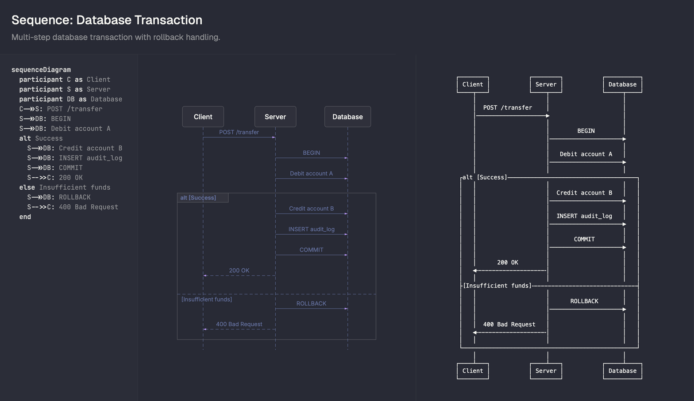
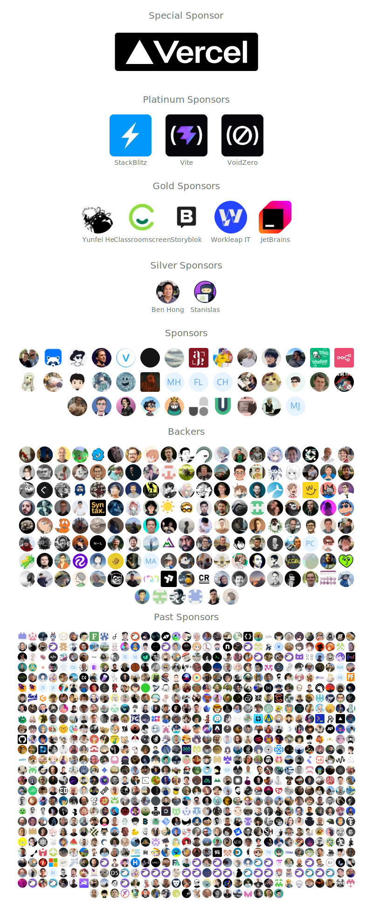

# GitHub Trending 排行榜

🔥 每周自动爬取GitHub最受欢迎的开源项目，生成AI智能总结的中文排行榜

[](https://github.com/qfy123/GitHub-Trending-/actions)
[](https://nodejs.org/)
[](LICENSE)

## ✨ 特性

- 🤖 **AI智能总结** - 使用DeepSeek AI生成简洁的中文项目描述
- 📊 **多维度排名** - 综合Star数、活跃度、新鲜度等指标
- 🖼️ **自动爬取图片** - 从项目README提取代表性图片
- 📈 **趋势分析** - 对比历史数据，显示项目排名变化
- 🗂️ **完整归档** - 按年份/周数归档所有历史数据
- 🔄 **自动更新** - GitHub Actions每周自动执行

## 📈 本周排行榜

<!-- TRENDING-START -->
### GitHub趋势排行榜 - 2026年第6周

**📅 统计周期**: 2026-02-01 ~ 2026-02-07  
**📊 项目总数**: 10 个  
**⭐ 总Star数**: 23,544  
**🔄 更新时间**: 2026-02-07 23:59:59  

| 排名 | 项目 | 描述 | Star | Fork | 语言 | 趋势 |
|------|------|------|------|------|------|------|
| 1 | [moltworker](https://github.com/cloudflare/moltworker) | 在Cloudflare Workers上低成本运行个人AI助手OpenClaw，月费仅1美元，验证边缘无服务器AI... | 5,389 | 770 | TypeScript | 🆕 |
| 2 | [beautiful-mermaid](https://github.com/lukilabs/beautiful-mermaid) | 极速零依赖的Mermaid渲染引擎，可在终端/AI对话中输出高颜值SVG或ASCII图，助力AI编程可视化。 | 5,158 | 143 | TypeScript | 🆕 |
| 3 | [DeepSeek-OCR-2](https://github.com/deepseek-ai/DeepSeek-OCR-2) | DeepSeek-OCR-2聚焦“视觉因果流”技术，用因果推理提升OCR在复杂版式、遮挡、低清图像下的准确率与可解释性。 | 1,840 | 135 | Python | 🆕 |
| 4 | [andrej-karpathy-skills](https://github.com/forrestchang/andrej-karpathy-skills) | 汇总Andrej Karpathy对LLM编码误区的洞见，提供一份CLAUDE.md指南，帮助Claude Cod... | 3,403 | 251 | Unknown | 🆕 |
| 5 | [lingbot-world](https://github.com/Robbyant/lingbot-world) | LingBot-World 用视频生成技术打造高保真开源世界模型，可快速模拟多样动态环境，降低构建虚拟世界的门槛。 | 1,821 | 119 | Python | 🆕 |
| 6 | [skills](https://github.com/antfu/skills) | 维护并同步一份可复用的「个人技能包」，供AI Agent按需调用，解决提示词碎片化、经验难沉淀的问题。 | 2,571 | 101 | TypeScript | 🆕 |
| 7 | [Qwen3-ASR](https://github.com/QwenLM/Qwen3-ASR) | 阿里云Qwen团队开源的多语ASR系列模型，可稳定识别语音/音乐/歌曲并输出时间戳与语种。 | 1,020 | 77 | Python | 🆕 |
| 8 | [OpenClawInstaller](https://github.com/miaoxworld/OpenClawInstaller) | 一条命令即可在macOS/Linux上部署私人AI助手OpenClaw，自动完成Docker环境、模型配置与多平台... | 846 | 145 | Shell | 🆕 |
| 9 | [dingtalk-moltbot-connector](https://github.com/DingTalk-Real-AI/dingtalk-moltbot-connector) | 把钉钉机器人秒变AI助手：流式卡片实时打字回复、多轮会话自动管理、图片主动推送，一条命令接入大模型网关。 | 805 | 49 | TypeScript | 🆕 |
| 10 | [frontend-slides](https://github.com/zarazhangrui/frontend-slides) | 借助Claude前端能力，把一句话或PPT秒变高颜值单文件HTML演示，无需写代码即可生成动画丰富的网页幻灯片。 | 691 | 67 | Unknown | 🆕 |

### 🔥 详细介绍

#### 1. [moltworker](https://github.com/cloudflare/moltworker) 


**📝 项目简介**: 在Cloudflare Workers上低成本运行个人AI助手OpenClaw，月费仅1美元，验证边缘无服务器AI可行性。

**✨ 核心特性**:
- 1美元/月超低门槛
- 边缘无服务器部署
- 开源AI助手可定制

**📊 项目统计**:
- **⭐ Star数**: 5,389
- **🔀 Fork数**: 770
- **👀 Watch数**: 5,389
- **📝 语言**: TypeScript
- **🌐 官网**: [https://blog.cloudflare.com/moltworker-self-hosted-ai-agent/](https://blog.cloudflare.com/moltworker-self-hosted-ai-agent/)
- **💻 技术栈**: TypeScript, JavaScript, Shell, HTML, CSS, Dockerfile
- **📈 趋势**: 🆕 新上榜项目

---

#### 2. [beautiful-mermaid](https://github.com/lukilabs/beautiful-mermaid) 



**📝 项目简介**: 极速零依赖的Mermaid渲染引擎，可在终端/AI对话中输出高颜值SVG或ASCII图，助力AI编程可视化。

**✨ 核心特性**:
- 终端即渲、无DOM
- 全主题可定制
- 为AI编码场景优化

**📊 项目统计**:
- **⭐ Star数**: 5,158
- **🔀 Fork数**: 143
- **👀 Watch数**: 5,158
- **📝 语言**: TypeScript
- **💻 技术栈**: TypeScript
- **📈 趋势**: 🆕 新上榜项目

---

#### 3. [DeepSeek-OCR-2](https://github.com/deepseek-ai/DeepSeek-OCR-2) 


**📝 项目简介**: DeepSeek-OCR-2聚焦“视觉因果流”技术，用因果推理提升OCR在复杂版式、遮挡、低清图像下的准确率与可解释性。

**✨ 核心特性**:
- 因果推理+视觉模型联合训练，显著降低误识别
- 支持中文、英文、表格、公式等多场景文本
- 提供一键微调脚本与HF模型仓库，零门槛落地

**📊 项目统计**:
- **⭐ Star数**: 1,840
- **🔀 Fork数**: 135
- **👀 Watch数**: 1,840
- **📝 语言**: Python
- **💻 技术栈**: Python
- **📈 趋势**: 🆕 新上榜项目

---

#### 4. [andrej-karpathy-skills](https://github.com/forrestchang/andrej-karpathy-skills) 

**📝 项目简介**: 汇总Andrej Karpathy对LLM编码误区的洞见，提供一份CLAUDE.md指南，帮助Claude Code减少臆测、简化设计、主动澄清。

**✨ 核心特性**:
- 提炼Karpathy核心观点
- 单文件即可集成
- 聚焦降低AI代码复杂度

**📊 项目统计**:
- **⭐ Star数**: 3,403
- **🔀 Fork数**: 251
- **👀 Watch数**: 3,403
- **📝 语言**: Unknown
- **💻 技术栈**: TypeScript
- **📈 趋势**: 🆕 新上榜项目

---

#### 5. [lingbot-world](https://github.com/Robbyant/lingbot-world) 


**📝 项目简介**: LingBot-World 用视频生成技术打造高保真开源世界模型，可快速模拟多样动态环境，降低构建虚拟世界的门槛。

**✨ 核心特性**:
- 高保真、多场景环境仿真
- 基于视频生成的开源世界模型
- 支持图像到视频一键生成

**📊 项目统计**:
- **⭐ Star数**: 1,821
- **🔀 Fork数**: 119
- **👀 Watch数**: 1,821
- **📝 语言**: Python
- **🌐 官网**: [https://technology.robbyant.com/lingbot-world](https://technology.robbyant.com/lingbot-world)
- **💻 技术栈**: Python, aigc, image-to-video, lingbot-world, video-generation, world-models
- **📈 趋势**: 🆕 新上榜项目

---

#### 6. [skills](https://github.com/antfu/skills) 



**📝 项目简介**: 维护并同步一份可复用的「个人技能包」，供AI Agent按需调用，解决提示词碎片化、经验难沉淀的问题。

**✨ 核心特性**:
- 一键安装全部或指定技能
- 文档与技能双向同步，持续更新
- 开源个人最佳实践，社区可贡献

**📊 项目统计**:
- **⭐ Star数**: 2,571
- **🔀 Fork数**: 101
- **👀 Watch数**: 2,571
- **📝 语言**: TypeScript
- **💻 技术栈**: TypeScript, JavaScript, agent-skills, skills, React, Vue
- **📈 趋势**: 🆕 新上榜项目

---

#### 7. [Qwen3-ASR](https://github.com/QwenLM/Qwen3-ASR) 


**📝 项目简介**: 阿里云Qwen团队开源的多语ASR系列模型，可稳定识别语音/音乐/歌曲并输出时间戳与语种。

**✨ 核心特性**:
- 多语+音乐+歌曲统一识别
- 自带语言检测与时间戳
- 模型已上架HuggingFace/ModelScope，一键调用

**📊 项目统计**:
- **⭐ Star数**: 1,020
- **🔀 Fork数**: 77
- **👀 Watch数**: 1,020
- **📝 语言**: Python
- **💻 技术栈**: Python, Flask, Docker
- **📈 趋势**: 🆕 新上榜项目

---

#### 8. [OpenClawInstaller](https://github.com/miaoxworld/OpenClawInstaller) 


**📝 项目简介**: 一条命令即可在macOS/Linux上部署私人AI助手OpenClaw，自动完成Docker环境、模型配置与多平台适配，零门槛拥有可扩展的智能机器人。

**✨ 核心特性**:
- 一键脚本，30秒完成部署
- 支持多模型切换与AWS云端配置
- 开源MIT，社区活跃持续更新

**📊 项目统计**:
- **⭐ Star数**: 846
- **🔀 Fork数**: 145
- **👀 Watch数**: 846
- **📝 语言**: Shell
- **💻 技术栈**: Shell, Dockerfile, clawdbot, moltbot, openclaw, Node.js
- **📈 趋势**: 🆕 新上榜项目

---

#### 9. [dingtalk-moltbot-connector](https://github.com/DingTalk-Real-AI/dingtalk-moltbot-connector) 

**📝 项目简介**: 把钉钉机器人秒变AI助手：流式卡片实时打字回复、多轮会话自动管理、图片主动推送，一条命令接入大模型网关。

**✨ 核心特性**:
- AI Card流式响应，打字机效果
- 30min无活动自动新会话，支持/new手动刷新
- 本地图片自动上传并主动推消息

**📊 项目统计**:
- **⭐ Star数**: 805
- **🔀 Fork数**: 49
- **👀 Watch数**: 805
- **📝 语言**: TypeScript
- **💻 技术栈**: TypeScript
- **📈 趋势**: 🆕 新上榜项目

---

#### 10. [frontend-slides](https://github.com/zarazhangrui/frontend-slides) 

**📝 项目简介**: 借助Claude前端能力，把一句话或PPT秒变高颜值单文件HTML演示，无需写代码即可生成动画丰富的网页幻灯片。

**✨ 核心特性**:
- 零依赖单HTML文件，直接浏览器打开
- 可视化预览选风格，无需描述审美
- 支持从PPT导入，自动生成动画与排版

**📊 项目统计**:
- **⭐ Star数**: 691
- **🔀 Fork数**: 67
- **👀 Watch数**: 691
- **📝 语言**: Unknown
- **💻 技术栈**: React
- **📈 趋势**: 🆕 新上榜项目

---

### 📈 本周统计

**🔥 热门语言**:
1. **TypeScript** (4 个项目)
2. **Python** (3 个项目)
3. **Unknown** (2 个项目)
4. **Shell** (1 个项目)

**🏷️ 热门话题**:
1. ai-agents (1)
2. cloudflare-workers (1)
3. aigc (1)
4. image-to-video (1)
5. lingbot-world (1)
6. video-generation (1)
7. world-models (1)
8. agent-skills (1)


<!-- TRENDING-END -->

## 📚 历史数据

<!-- HISTORY-START -->
| 时间 | 周期 | 项目数 | 链接 |
|------|------|--------|------|
| 02-07 | 2026年第6周 | 10 个 | [查看详情](./archives/2026/week-6/report.md) |
| 01-31 | 2026年第5周 | 10 个 | [查看详情](./archives/2026/week-5/report.md) |
| 01-24 | 2026年第4周 | 10 个 | [查看详情](./archives/2026/week-4/report.md) |
| 01-17 | 2026年第3周 | 10 个 | [查看详情](./archives/2026/week-3/report.md) |
| 01-10 | 2026年第2周 | 10 个 | [查看详情](./archives/2026/week-2/report.md) |
| 12-27 | 2025年第52周 | 10 个 | [查看详情](./archives/2025/week-52/report.md) |
| 12-20 | 2025年第51周 | 10 个 | [查看详情](./archives/2025/week-51/report.md) |
| 12-13 | 2025年第50周 | 10 个 | [查看详情](./archives/2025/week-50/report.md) |
| 12-06 | 2025年第49周 | 10 个 | [查看详情](./archives/2025/week-49/report.md) |
| 11-29 | 2025年第48周 | 10 个 | [查看详情](./archives/2025/week-48/report.md) |
| 11-22 | 2025年第47周 | 10 个 | [查看详情](./archives/2025/week-47/report.md) |
| 11-15 | 2025年第46周 | 10 个 | [查看详情](./archives/2025/week-46/report.md) |
| 11-08 | 2025年第45周 | 10 个 | [查看详情](./archives/2025/week-45/report.md) |
| 11-01 | 2025年第44周 | 10 个 | [查看详情](./archives/2025/week-44/report.md) |
| 10-25 | 2025年第43周 | 10 个 | [查看详情](./archives/2025/week-43/report.md) |
| 10-18 | 2025年第42周 | 10 个 | [查看详情](./archives/2025/week-42/report.md) |
| 10-11 | 2025年第41周 | 10 个 | [查看详情](./archives/2025/week-41/report.md) |
| 10-04 | 2025年第40周 | 10 个 | [查看详情](./archives/2025/week-40/report.md) |
| 09-27 | 2025年第39周 | 10 个 | [查看详情](./archives/2025/week-39/report.md) |
| 09-20 | 2025年第38周 | 10 个 | [查看详情](./archives/2025/week-38/report.md) |

[查看完整历史数据](./archives/)
<!-- HISTORY-END -->

## 🚀 快速开始

### 1. 克隆项目

```bash
git clone https://github.com/your-username/GitHub-Trending.git
cd GitHub-Trending
```

### 2. 安装依赖

```bash
npm install
```

### 3. 配置环境变量

```bash
# 复制环境变量模板
cp .env.example .env

# 编辑 .env 文件，填入以下必需配置：
# GITHUB_TOKEN=your_github_token
# SILICONFLOW_API_KEY=your_siliconflow_api_key
```

### 4. 测试配置

```bash
# 系统测试
node test/system-test.js

# 配置检查
node scripts/update-trending.js --check
```

### 5. 运行项目

```bash
# 测试运行（少量数据）
node scripts/update-trending.js --limit 3

# 正式运行
node scripts/update-trending.js
```

## 🔧 配置说明

### 环境变量

| 变量名 | 必需 | 说明 | 获取方式 |
|--------|------|------|----------|
| `GITHUB_TOKEN` | ✅ | GitHub API访问令牌 | [GitHub设置](https://github.com/settings/tokens) |
| `SILICONFLOW_API_KEY` | ✅ | 硅基流动API密钥 | [硅基流动官网](https://siliconflow.cn) |
| `AI_BASE_URL` | ❌ | AI服务地址 | 默认硅基流动 |
| `AI_MODEL` | ❌ | AI模型名称 | 默认deepseek-chat |

详细配置请参考：[配置指南](config/README.md)

### GitHub Actions自动化

1. **Fork本项目**到你的GitHub账号
2. **设置Secrets**：
   - `SILICONFLOW_API_KEY`: 硅基流动API密钥
3. **启用Actions**：项目会自动每周一更新

详细设置请参考：[GitHub Actions配置](-.github/README.md)

## 📊 项目结构

```
GitHub-Trending/
├── src/                          # 核心源码
│   ├── github-api.js            # GitHub API调用
│   ├── ai-summarizer.js         # AI项目总结
│   ├── image-crawler.js         # 图片爬取
│   ├── data-processor.js        # 数据处理
│   ├── file-manager.js          # 文件管理
│   └── readme-updater.js        # README更新
├── scripts/                      # 执行脚本
│   └── update-trending.js       # 主执行脚本
├── test/                         # 测试文件
│   └── system-test.js           # 系统测试
├── archives/                     # 历史数据归档
│   └── YYYY/                    # 按年份归档
│       └── week-XX.md           # 周报文件
├── images/                       # 项目图片
│   └── YYYY/week-XX/            # 按周归档
├── data/                         # 临时数据
├── config/                       # 配置文档
├── .github/                      # GitHub Actions
│   └── workflows/
└── README.md                     # 项目说明
```

## 🎯 使用场景

### 开发者
- 🔍 **发现新项目** - 了解最新热门开源项目
- 📈 **技术趋势** - 跟踪编程语言和技术栈趋势
- 💡 **学习参考** - 学习优秀项目的设计和实现

### 技术团队
- 📊 **技术选型** - 参考热门项目进行技术选型
- 🎯 **竞品分析** - 关注同类项目的发展趋势
- 📝 **技术报告** - 生成定期的技术趋势报告

### 内容创作者
- ✍️ **素材收集** - 为技术文章和视频收集素材
- 📰 **新闻线索** - 发现值得报道的新兴项目
- 🗣️ **分享内容** - 分享有价值的开源项目

## 🛠️ 命令行工具

```bash
# 查看帮助
node scripts/update-trending.js --help

# 检查配置
node scripts/update-trending.js --check

# 自定义参数运行
node scripts/update-trending.js --limit 20 --language python

# 数据管理
node scripts/update-trending.js --backup     # 创建备份
node scripts/update-trending.js --cleanup    # 清理过期数据
node scripts/update-trending.js --stats      # 查看统计信息

# 系统测试
node test/system-test.js                      # 完整测试
node test/system-test.js --quick             # 快速诊断
```

## 📈 排名算法

项目排名基于以下三个维度的综合评分：

### 🌟 受欢迎程度 (50%)
- **Star数量** (60%): 项目获得的Star数
- **Fork数量** (25%): 项目被Fork的次数  
- **Watch数量** (15%): 项目被Watch的次数

### 🔥 活跃程度 (30%)
- **最近提交** (50%): 距离最后一次提交的时间
- **Issues活跃度** (30%): 开放的Issues数量
- **Fork活跃度** (20%): Fork的活跃程度

### 🆕 新鲜程度 (20%)
- **创建时间** (30%): 项目创建时间（新项目得分高）
- **更新时间** (70%): 最近更新时间

### 趋势分析
- 📈 **上升**: 排名比上周提升
- 📉 **下降**: 排名比上周下降  
- ➡️ **稳定**: 排名无明显变化
- 🆕 **新上榜**: 首次进入排行榜

## 🤝 贡献指南

欢迎提交 Issues 和 Pull Requests！

### 开发环境设置

```bash
# 1. Fork 并克隆项目
git clone https://github.com/your-username/GitHub-Trending.git

# 2. 创建功能分支
git checkout -b feature/your-feature

# 3. 安装依赖并测试
npm install
node test/system-test.js

# 4. 开发完成后提交
git commit -m "feat: 添加新功能"
git push origin feature/your-feature
```

### 提交规范

- `feat`: 新功能
- `fix`: 修复bug
- `docs`: 文档更新
- `style`: 代码格式调整
- `refactor`: 代码重构
- `test`: 测试相关
- `chore`: 构建/工具相关

## 📄 许可证

本项目基于 [MIT 许可证](LICENSE) 开源。

## 🙏 致谢

- [GitHub API](https://docs.github.com/en/rest) - 提供项目数据
- [硅基流动](https://siliconflow.cn) - 提供AI总结服务
- [DeepSeek](https://deepseek.com) - 优秀的AI模型
- [GitHub Actions](https://github.com/features/actions) - 自动化支持

## 📞 联系方式

- 🐛 **Bug报告**: [提交Issue](https://github.com/your-username/GitHub-Trending/issues)
- 💡 **功能建议**: [功能请求](https://github.com/your-username/GitHub-Trending/issues)
- 📧 **其他问题**: [发送邮件](mailto:your-email@example.com)

## 🔗 相关链接

- [项目文档](https://github.com/your-username/GitHub-Trending/wiki)
- [更新日志](CHANGELOG.md)
- [FAQ](FAQ.md)

---

⭐ 如果这个项目对你有帮助，请给它一个Star！

*本项目由 [GitHub Actions](https://github.com/features/actions) 自动维护，数据每周更新*