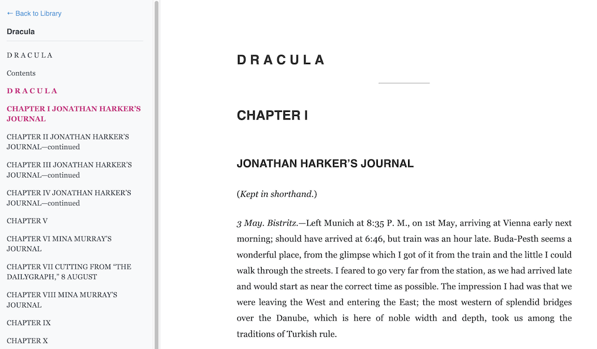
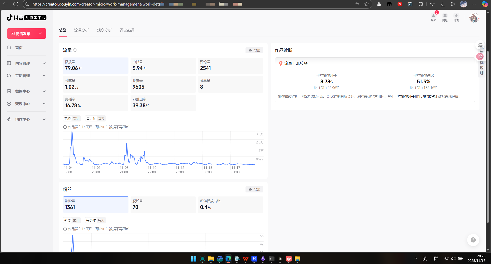

# GitHub Trending 排行榜

🔥 每周自动爬取GitHub最受欢迎的开源项目，生成AI智能总结的中文排行榜

[](https://github.com/qfy123/GitHub-Trending-/actions)
[](https://nodejs.org/)
[](LICENSE)

## ✨ 特性

- 🤖 **AI智能总结** - 使用DeepSeek AI生成简洁的中文项目描述
- 📊 **多维度排名** - 综合Star数、活跃度、新鲜度等指标
- 🖼️ **自动爬取图片** - 从项目README提取代表性图片
- 📈 **趋势分析** - 对比历史数据，显示项目排名变化
- 🗂️ **完整归档** - 按年份/周数归档所有历史数据
- 🔄 **自动更新** - GitHub Actions每周自动执行

## 📈 本周排行榜

<!-- TRENDING-START -->
### GitHub趋势排行榜 - 2025年第48周

**📅 统计周期**: 2025-11-23 ~ 2025-11-29  
**📊 项目总数**: 10 个  
**⭐ 总Star数**: 8,511  
**🔄 更新时间**: 2025-11-29 23:59:59  

| 排名 | 项目 | 描述 | Star | Fork | 语言 | 趋势 |
|------|------|------|------|------|------|------|
| 1 | [llm-council](https://github.com/karpathy/llm-council) | 本地网页应用，通过OpenRouter把问题同时抛给多家LLM，让它们互评后由“主席”模型汇总，输出更高质量答案。 | 2,586 | 372 | Python | 🆕 |
| 2 | [reader3](https://github.com/karpathy/reader3) | 极简自托管EPUB阅读器，一键分章复制内容到LLM，实现边读边与AI互动讨论。 | 1,997 | 222 | Python | 🆕 |
| 3 | [supertonic](https://github.com/supertone-inc/supertonic) | 基于ONNX Runtime的超快离线TTS引擎，零依赖、零隐私泄露，可在树莓派实时朗读。 | 827 | 65 | Swift | 🆕 |
| 4 | [Video-Materials-AutoGEN-Workstation](https://github.com/Norsico/Video-Materials-AutoGEN-Workstation) | 一站式短视频工厂：AI写脚本、TTS配音、AI绘图、自动字幕，一键批量生成完整视频项目，全流程可视化管理。 | 657 | 145 | Python | 🆕 |
| 5 | [moss](https://github.com/hexagonal-sun/moss) | 用Rust重写的Linux兼容内核，可在Aarch64上原生运行BusyBox等Linux用户态程序，兼具异步现代... | 628 | 18 | Rust | 🆕 |
| 6 | [HunyuanVideo-1.5](https://github.com/Tencent-Hunyuan/HunyuanVideo-1.5) | 腾讯开源的轻量级视频生成模型，仅8.3B参数即可在消费级GPU上生成高质量视频，大幅降低门槛。 | 522 | 34 | Python | 🆕 |
| 7 | [claude-agent-server](https://github.com/dzhng/claude-agent-server) | 把Claude Code封装成WebSocket服务，一键部署到E2B沙箱，前端通过SDK即可实时驱动AI代理安全... | 355 | 30 | TypeScript | 🆕 |
| 8 | [osgrep](https://github.com/Ryandonofrio3/osgrep) | 本地语义代码搜索工具，用自然语言快速定位“认证逻辑”等概念，无需联网，保护隐私。 | 326 | 19 | TypeScript | 🆕 |
| 9 | [iOS-Clone-SwiftUI](https://github.com/PallavAg/iOS-Clone-SwiftUI) | 用SwiftUI 1:1复刻iOS系统应用（天气、日历、照片），验证AI生成代码能否达到像素级还原，为SwiftU... | 276 | 43 | Swift | 🆕 |
| 10 | [LPLB](https://github.com/deepseek-ai/LPLB) | 基于线性规划的MoE并行负载均衡器，可动态重排专家并优化token分配，提升大模型训练效率。 | 337 | 14 | Python | 🆕 |

### 🔥 详细介绍

#### 1. [llm-council](https://github.com/karpathy/llm-council) 


**📝 项目简介**: 本地网页应用，通过OpenRouter把问题同时抛给多家LLM，让它们互评后由“主席”模型汇总，输出更高质量答案。

**✨ 核心特性**:
- 多模型互评+主席裁决，提升回答可靠性
- 本地运行，保护隐私
- 支持任意OpenRouter模型，扩展灵活

**📊 项目统计**:
- **⭐ Star数**: 2,586
- **🔀 Fork数**: 372
- **👀 Watch数**: 2,586
- **📝 语言**: Python
- **💻 技术栈**: Python, JavaScript, CSS, Shell, HTML, React
- **📈 趋势**: 🆕 新上榜项目

---

#### 2. [reader3](https://github.com/karpathy/reader3) 



**📝 项目简介**: 极简自托管EPUB阅读器，一键分章复制内容到LLM，实现边读边与AI互动讨论。

**✨ 核心特性**:
- 轻量级本地部署，零依赖
- 章节级文本复制，方便投喂LLM
- vibe coding示例，展示快速原型能力

**📊 项目统计**:
- **⭐ Star数**: 1,997
- **🔀 Fork数**: 222
- **👀 Watch数**: 1,997
- **📝 语言**: Python
- **💻 技术栈**: Python, HTML
- **📈 趋势**: 🆕 新上榜项目

---

#### 3. [supertonic](https://github.com/supertone-inc/supertonic) 


**📝 项目简介**: 基于ONNX Runtime的超快离线TTS引擎，零依赖、零隐私泄露，可在树莓派实时朗读。

**✨ 核心特性**:
- 毫秒级本地合成，无需网络
- 跨十语言绑定，iOS/Android/嵌入式通吃
- ONNX极致压缩，CPU占用极低

**📊 项目统计**:
- **⭐ Star数**: 827
- **🔀 Fork数**: 65
- **👀 Watch数**: 827
- **📝 语言**: Swift
- **🌐 官网**: [https://huggingface.co/spaces/Supertone/supertonic](https://huggingface.co/spaces/Supertone/supertonic)
- **💻 技术栈**: Swift, JavaScript, C++, Java, C#, Go
- **📈 趋势**: 🆕 新上榜项目

---

#### 4. [Video-Materials-AutoGEN-Workstation](https://github.com/Norsico/Video-Materials-AutoGEN-Workstation) 



**📝 项目简介**: 一站式短视频工厂：AI写脚本、TTS配音、AI绘图、自动字幕，一键批量生成完整视频项目，全流程可视化管理。

**✨ 核心特性**:
- 模板化批量出片，脚本-画面-音频-字幕一键齐
- Gemini+TTS自动改写并配带情绪人声
- 图文分轨前端实时替换、即时预览

**📊 项目统计**:
- **⭐ Star数**: 657
- **🔀 Fork数**: 145
- **👀 Watch数**: 657
- **📝 语言**: Python
- **💻 技术栈**: Python, JavaScript, HTML, CSS, Batchfile
- **📈 趋势**: 🆕 新上榜项目

---

#### 5. [moss](https://github.com/hexagonal-sun/moss) 


**📝 项目简介**: 用Rust重写的Linux兼容内核，可在Aarch64上原生运行BusyBox等Linux用户态程序，兼具异步现代架构与跨平台HAL。

**✨ 核心特性**:
- Linux二进制兼容，直接运行业已编译的BusyBox
- Rust+异步核心，内存安全且高性能
- 模块化HAL，轻松移植x86_64/RISC-V等架构

**📊 项目统计**:
- **⭐ Star数**: 628
- **🔀 Fork数**: 18
- **👀 Watch数**: 628
- **📝 语言**: Rust
- **💻 技术栈**: Rust, Assembly, Shell, Linker Script, RenderScript
- **📈 趋势**: 🆕 新上榜项目

---

#### 6. [HunyuanVideo-1.5](https://github.com/Tencent-Hunyuan/HunyuanVideo-1.5) 

**📝 项目简介**: 腾讯开源的轻量级视频生成模型，仅8.3B参数即可在消费级GPU上生成高质量视频，大幅降低门槛。

**✨ 核心特性**:
- 8.3B参数即可媲美大模型效果
- 消费级GPU流畅运行
- 支持文本/图片到视频双模态生成

**📊 项目统计**:
- **⭐ Star数**: 522
- **🔀 Fork数**: 34
- **👀 Watch数**: 522
- **📝 语言**: Python
- **🌐 官网**: [https://hunyuan.tencent.com/video/zh?tabIndex=0](https://hunyuan.tencent.com/video/zh?tabIndex=0)
- **💻 技术栈**: Python, image-to-video, text-to-video, video-generation, Express
- **📈 趋势**: 🆕 新上榜项目

---

#### 7. [claude-agent-server](https://github.com/dzhng/claude-agent-server) 

**📝 项目简介**: 把Claude Code封装成WebSocket服务，一键部署到E2B沙箱，前端通过SDK即可实时驱动AI代理安全执行任务。

**✨ 核心特性**:
- 沙箱隔离运行，安全无侵入
- WebSocket双向实时通信
- 配套TypeScript客户端，三行代码接入

**📊 项目统计**:
- **⭐ Star数**: 355
- **🔀 Fork数**: 30
- **👀 Watch数**: 355
- **📝 语言**: TypeScript
- **🌐 官网**: [https://x.com/dzhng/status/1991154972558581889?s=20](https://x.com/dzhng/status/1991154972558581889?s=20)
- **💻 技术栈**: TypeScript, JavaScript, agent, ai, claude, claude-agent-sdk
- **📈 趋势**: 🆕 新上榜项目

---

#### 8. [osgrep](https://github.com/Ryandonofrio3/osgrep) 


**📝 项目简介**: 本地语义代码搜索工具，用自然语言快速定位“认证逻辑”等概念，无需联网，保护隐私。

**✨ 核心特性**:
- 自然语言搜代码
- 100%本地运行
- 与编码助手无缝集成

**📊 项目统计**:
- **⭐ Star数**: 326
- **🔀 Fork数**: 19
- **👀 Watch数**: 326
- **📝 语言**: TypeScript
- **💻 技术栈**: TypeScript, JavaScript, Shell, React
- **📈 趋势**: 🆕 新上榜项目

---

#### 9. [iOS-Clone-SwiftUI](https://github.com/PallavAg/iOS-Clone-SwiftUI) 

**📝 项目简介**: 用SwiftUI 1:1复刻iOS系统应用（天气、日历、照片），验证AI生成代码能否达到像素级还原，为SwiftUI学习提供高质量参考实现。

**✨ 核心特性**:
- Gemini 3.0 Pro一键生成，展示AI代码上限
- 已还原天气/日历/照片三大原生App，UI精度高
- 纯SwiftUI实现，零Storyboard，代码简洁现代

**📊 项目统计**:
- **⭐ Star数**: 276
- **🔀 Fork数**: 43
- **👀 Watch数**: 276
- **📝 语言**: Swift
- **🌐 官网**: [https://twitter.com/pallavmac](https://twitter.com/pallavmac)
- **💻 技术栈**: Swift, ios, swiftui
- **📈 趋势**: 🆕 新上榜项目

---

#### 10. [LPLB](https://github.com/deepseek-ai/LPLB) 

**📝 项目简介**: 基于线性规划的MoE并行负载均衡器，可动态重排专家并优化token分配，提升大模型训练效率。

**✨ 核心特性**:
- 动态重排专家，实时适配负载
- 线性规划求解最优token分配
- 支持拓扑感知的副本构建

**📊 项目统计**:
- **⭐ Star数**: 337
- **🔀 Fork数**: 14
- **👀 Watch数**: 337
- **📝 语言**: Python
- **💻 技术栈**: Python, C++, Cuda, Shell, Redis
- **📈 趋势**: 🆕 新上榜项目

---

### 📈 本周统计

**🔥 热门语言**:
1. **Python** (5 个项目)
2. **Swift** (2 个项目)
3. **TypeScript** (2 个项目)
4. **Rust** (1 个项目)

**🏷️ 热门话题**:
1. ios (2)
2. cpp (1)
3. csharp (1)
4. go (1)
5. java (1)
6. lightweight (1)
7. nodejs (1)
8. on-device (1)


<!-- TRENDING-END -->

## 📚 历史数据

<!-- HISTORY-START -->
| 时间 | 周期 | 项目数 | 链接 |
|------|------|--------|------|
| 11-29 | 2025年第48周 | 10 个 | [查看详情](./archives/2025/week-48/report.md) |
| 11-22 | 2025年第47周 | 10 个 | [查看详情](./archives/2025/week-47/report.md) |
| 11-15 | 2025年第46周 | 10 个 | [查看详情](./archives/2025/week-46/report.md) |
| 11-08 | 2025年第45周 | 10 个 | [查看详情](./archives/2025/week-45/report.md) |
| 11-01 | 2025年第44周 | 10 个 | [查看详情](./archives/2025/week-44/report.md) |
| 10-25 | 2025年第43周 | 10 个 | [查看详情](./archives/2025/week-43/report.md) |
| 10-18 | 2025年第42周 | 10 个 | [查看详情](./archives/2025/week-42/report.md) |
| 10-11 | 2025年第41周 | 10 个 | [查看详情](./archives/2025/week-41/report.md) |
| 10-04 | 2025年第40周 | 10 个 | [查看详情](./archives/2025/week-40/report.md) |
| 09-27 | 2025年第39周 | 10 个 | [查看详情](./archives/2025/week-39/report.md) |
| 09-20 | 2025年第38周 | 10 个 | [查看详情](./archives/2025/week-38/report.md) |
| 09-13 | 2025年第37周 | 10 个 | [查看详情](./archives/2025/week-37/report.md) |
| 09-06 | 2025年第36周 | 10 个 | [查看详情](./archives/2025/week-36/report.md) |
| 08-30 | 2025年第35周 | 10 个 | [查看详情](./archives/2025/week-35/report.md) |
| 08-23 | 2025年第34周 | 10 个 | [查看详情](./archives/2025/week-34/report.md) |
| 08-16 | 2025年第33周 | 3 个 | [查看详情](./archives/2025/week-33/report.md) |

<!-- HISTORY-END -->

## 🚀 快速开始

### 1. 克隆项目

```bash
git clone https://github.com/your-username/GitHub-Trending.git
cd GitHub-Trending
```

### 2. 安装依赖

```bash
npm install
```

### 3. 配置环境变量

```bash
# 复制环境变量模板
cp .env.example .env

# 编辑 .env 文件，填入以下必需配置：
# GITHUB_TOKEN=your_github_token
# SILICONFLOW_API_KEY=your_siliconflow_api_key
```

### 4. 测试配置

```bash
# 系统测试
node test/system-test.js

# 配置检查
node scripts/update-trending.js --check
```

### 5. 运行项目

```bash
# 测试运行（少量数据）
node scripts/update-trending.js --limit 3

# 正式运行
node scripts/update-trending.js
```

## 🔧 配置说明

### 环境变量

| 变量名 | 必需 | 说明 | 获取方式 |
|--------|------|------|----------|
| `GITHUB_TOKEN` | ✅ | GitHub API访问令牌 | [GitHub设置](https://github.com/settings/tokens) |
| `SILICONFLOW_API_KEY` | ✅ | 硅基流动API密钥 | [硅基流动官网](https://siliconflow.cn) |
| `AI_BASE_URL` | ❌ | AI服务地址 | 默认硅基流动 |
| `AI_MODEL` | ❌ | AI模型名称 | 默认deepseek-chat |

详细配置请参考：[配置指南](config/README.md)

### GitHub Actions自动化

1. **Fork本项目**到你的GitHub账号
2. **设置Secrets**：
   - `SILICONFLOW_API_KEY`: 硅基流动API密钥
3. **启用Actions**：项目会自动每周一更新

详细设置请参考：[GitHub Actions配置](-.github/README.md)

## 📊 项目结构

```
GitHub-Trending/
├── src/                          # 核心源码
│   ├── github-api.js            # GitHub API调用
│   ├── ai-summarizer.js         # AI项目总结
│   ├── image-crawler.js         # 图片爬取
│   ├── data-processor.js        # 数据处理
│   ├── file-manager.js          # 文件管理
│   └── readme-updater.js        # README更新
├── scripts/                      # 执行脚本
│   └── update-trending.js       # 主执行脚本
├── test/                         # 测试文件
│   └── system-test.js           # 系统测试
├── archives/                     # 历史数据归档
│   └── YYYY/                    # 按年份归档
│       └── week-XX.md           # 周报文件
├── images/                       # 项目图片
│   └── YYYY/week-XX/            # 按周归档
├── data/                         # 临时数据
├── config/                       # 配置文档
├── .github/                      # GitHub Actions
│   └── workflows/
└── README.md                     # 项目说明
```

## 🎯 使用场景

### 开发者
- 🔍 **发现新项目** - 了解最新热门开源项目
- 📈 **技术趋势** - 跟踪编程语言和技术栈趋势
- 💡 **学习参考** - 学习优秀项目的设计和实现

### 技术团队
- 📊 **技术选型** - 参考热门项目进行技术选型
- 🎯 **竞品分析** - 关注同类项目的发展趋势
- 📝 **技术报告** - 生成定期的技术趋势报告

### 内容创作者
- ✍️ **素材收集** - 为技术文章和视频收集素材
- 📰 **新闻线索** - 发现值得报道的新兴项目
- 🗣️ **分享内容** - 分享有价值的开源项目

## 🛠️ 命令行工具

```bash
# 查看帮助
node scripts/update-trending.js --help

# 检查配置
node scripts/update-trending.js --check

# 自定义参数运行
node scripts/update-trending.js --limit 20 --language python

# 数据管理
node scripts/update-trending.js --backup     # 创建备份
node scripts/update-trending.js --cleanup    # 清理过期数据
node scripts/update-trending.js --stats      # 查看统计信息

# 系统测试
node test/system-test.js                      # 完整测试
node test/system-test.js --quick             # 快速诊断
```

## 📈 排名算法

项目排名基于以下三个维度的综合评分：

### 🌟 受欢迎程度 (50%)
- **Star数量** (60%): 项目获得的Star数
- **Fork数量** (25%): 项目被Fork的次数  
- **Watch数量** (15%): 项目被Watch的次数

### 🔥 活跃程度 (30%)
- **最近提交** (50%): 距离最后一次提交的时间
- **Issues活跃度** (30%): 开放的Issues数量
- **Fork活跃度** (20%): Fork的活跃程度

### 🆕 新鲜程度 (20%)
- **创建时间** (30%): 项目创建时间（新项目得分高）
- **更新时间** (70%): 最近更新时间

### 趋势分析
- 📈 **上升**: 排名比上周提升
- 📉 **下降**: 排名比上周下降  
- ➡️ **稳定**: 排名无明显变化
- 🆕 **新上榜**: 首次进入排行榜

## 🤝 贡献指南

欢迎提交 Issues 和 Pull Requests！

### 开发环境设置

```bash
# 1. Fork 并克隆项目
git clone https://github.com/your-username/GitHub-Trending.git

# 2. 创建功能分支
git checkout -b feature/your-feature

# 3. 安装依赖并测试
npm install
node test/system-test.js

# 4. 开发完成后提交
git commit -m "feat: 添加新功能"
git push origin feature/your-feature
```

### 提交规范

- `feat`: 新功能
- `fix`: 修复bug
- `docs`: 文档更新
- `style`: 代码格式调整
- `refactor`: 代码重构
- `test`: 测试相关
- `chore`: 构建/工具相关

## 📄 许可证

本项目基于 [MIT 许可证](LICENSE) 开源。

## 🙏 致谢

- [GitHub API](https://docs.github.com/en/rest) - 提供项目数据
- [硅基流动](https://siliconflow.cn) - 提供AI总结服务
- [DeepSeek](https://deepseek.com) - 优秀的AI模型
- [GitHub Actions](https://github.com/features/actions) - 自动化支持

## 📞 联系方式

- 🐛 **Bug报告**: [提交Issue](https://github.com/your-username/GitHub-Trending/issues)
- 💡 **功能建议**: [功能请求](https://github.com/your-username/GitHub-Trending/issues)
- 📧 **其他问题**: [发送邮件](mailto:your-email@example.com)

## 🔗 相关链接

- [项目文档](https://github.com/your-username/GitHub-Trending/wiki)
- [更新日志](CHANGELOG.md)
- [FAQ](FAQ.md)

---

⭐ 如果这个项目对你有帮助，请给它一个Star！

*本项目由 [GitHub Actions](https://github.com/features/actions) 自动维护，数据每周更新*