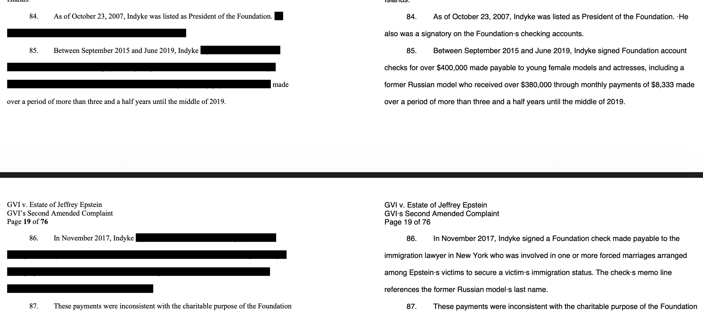

# GitHub Trending 排行榜

🔥 每周自动爬取GitHub最受欢迎的开源项目，生成AI智能总结的中文排行榜

[](https://github.com/qfy123/GitHub-Trending-/actions)
[](https://nodejs.org/)
[](LICENSE)

## ✨ 特性

- 🤖 **AI智能总结** - 使用DeepSeek AI生成简洁的中文项目描述
- 📊 **多维度排名** - 综合Star数、活跃度、新鲜度等指标
- 🖼️ **自动爬取图片** - 从项目README提取代表性图片
- 📈 **趋势分析** - 对比历史数据，显示项目排名变化
- 🗂️ **完整归档** - 按年份/周数归档所有历史数据
- 🔄 **自动更新** - GitHub Actions每周自动执行

## 📈 本周排行榜

<!-- TRENDING-START -->
### GitHub趋势排行榜 - 2025年第1周

**📅 统计周期**: 2025-12-28 ~ 2026-01-03  
**📊 项目总数**: 10 个  
**⭐ 总Star数**: 5,697  
**🔄 更新时间**: 2026-01-03 23:59:59  

| 排名 | 项目 | 描述 | Star | Fork | 语言 | 趋势 |
|------|------|------|------|------|------|------|
| 1 | [opensqt_market_maker](https://github.com/dennisyang1986/opensqt_market_maker) | Go实现的高频永续合约做市机器人，毫秒级挂单、撤单，专注震荡与上涨行情中的网格做多收益。 | 556 | 253 | Go | 🆕 |
| 2 | [Continuous-Claude-v2](https://github.com/parcadei/Continuous-Claude-v2) | 为Claude Code提供会话连续、上下文隔离与MCP无污染执行，实现多Agent协同与状态持久化。 | 824 | 55 | Python | 🆕 |
| 3 | [quotio](https://github.com/nguyenphutrong/quotio) | 原生macOS菜单栏工具，一键聚合Claude、Gemini、OpenAI等主流AI订阅，实时余量监控与智能故障切... | 766 | 52 | Swift | 🆕 |
| 4 | [tuxmate](https://github.com/abusoww/tuxmate) | TuxMate 通过 Web 界面一键生成发行版专属脚本，实现 Linux 批量装机，解决重装后逐一手动安装软件的痛点。 | 694 | 28 | TypeScript | 🆕 |
| 5 | [Self-Configuration](https://github.com/ClashConnectRules/Self-Configuration) | 收录Clash/Surge等主流代理工具的现成规则与配置，用户可一键导入，省去手动维护节点与策略的麻烦。 | 792 | 64 | Unknown | 🆕 |
| 6 | [unredact](https://github.com/leedrake5/unredact) | 一键提取PDF中被黑框遮盖但仍存在于文件流中的“已删”文字，还原原始内容，验证打码是否真正安全。 | 454 | 58 | Python | 🆕 |
| 7 | [mongobleed](https://github.com/joe-desimone/mongobleed) | 针对MongoDB zlib解压漏洞的PoC，可无认证读取服务端敏感内存，验证CVE-2025-14847危害。 | 428 | 69 | JavaScript | 🆕 |
| 8 | [Fun-Audio-Chat](https://github.com/FunAudioLLM/Fun-Audio-Chat) | Fun-Audio-Chat是低延迟大音频语言模型，支持自然流畅的语音对话，可本地部署。 | 443 | 39 | Python | 🆕 |
| 9 | [claude-code-transcripts](https://github.com/simonw/claude-code-transcripts) | 将 Claude Code 的 JSON/JSONL 会话日志一键转为移动端友好的分页 HTML 报告，方便分享与归档。 | 367 | 36 | Python | 🆕 |
| 10 | [nodecast-tv](https://github.com/technomancer702/nodecast-tv) | 自托管Web IPTV播放器，支持直播、点播、剧集与EPG，浏览器即点即看，轻松管理万级片库。 | 373 | 12 | JavaScript | 🆕 |

### 🔥 详细介绍

#### 1. [opensqt_market_maker](https://github.com/dennisyang1986/opensqt_market_maker) 


**📝 项目简介**: Go实现的高频永续合约做市机器人，毫秒级挂单、撤单，专注震荡与上涨行情中的网格做多收益。

**✨ 核心特性**:
- 毫秒级低延迟撮合
- 支持Binance/Bitget/Gate.io多交易所
- 实盘已跑1亿美元+交易量

**📊 项目统计**:
- **⭐ Star数**: 556
- **🔀 Fork数**: 253
- **👀 Watch数**: 556
- **📝 语言**: Go
- **🌐 官网**: [https://www.OpenSQT.com/](https://www.OpenSQT.com/)
- **💻 技术栈**: Go, HTML, crypto, crypto-bot, marketmaker, marketmakerbot
- **📈 趋势**: 🆕 新上榜项目

---

#### 2. [Continuous-Claude-v2](https://github.com/parcadei/Continuous-Claude-v2) 

**📝 项目简介**: 为Claude Code提供会话连续、上下文隔离与MCP无污染执行，实现多Agent协同与状态持久化。

**✨ 核心特性**:
- 会话断点续跑，token零浪费
- Ledger记账+Handoff切换，上下文不污染
- 子Agent隔离窗口，安全并行

**📊 项目统计**:
- **⭐ Star数**: 824
- **🔀 Fork数**: 55
- **👀 Watch数**: 824
- **📝 语言**: Python
- **💻 技术栈**: Python, Shell, TypeScript, JavaScript, agents, claude-code
- **📈 趋势**: 🆕 新上榜项目

---

#### 3. [quotio](https://github.com/nguyenphutrong/quotio) 


**📝 项目简介**: 原生macOS菜单栏工具，一键聚合Claude、Gemini、OpenAI等主流AI订阅，实时余量监控与智能故障切换，告别多账号切换烦恼。

**✨ 核心特性**:
- 多AI服务统一管理与配额实时追踪
- 智能自动故障切换保障工具链稳定
- 原生Swift体验，零配置即开即用

**📊 项目统计**:
- **⭐ Star数**: 766
- **🔀 Fork数**: 52
- **👀 Watch数**: 766
- **📝 语言**: Swift
- **🌐 官网**: [https://www.quotio.dev](https://www.quotio.dev)
- **💻 技术栈**: Swift, Shell
- **📈 趋势**: 🆕 新上榜项目

---

#### 4. [tuxmate](https://github.com/abusoww/tuxmate) 


**📝 项目简介**: TuxMate 通过 Web 界面一键生成发行版专属脚本，实现 Linux 批量装机，解决重装后逐一手动安装软件的痛点。

**✨ 核心特性**:
- 网页点选即生成脚本，零命令行门槛
- 自动识别 apt/dnf/pacman 等包管理，支持主流发行版
- 开源可自托管，脚本透明可审计

**📊 项目统计**:
- **⭐ Star数**: 694
- **🔀 Fork数**: 28
- **👀 Watch数**: 694
- **📝 语言**: TypeScript
- **🌐 官网**: [https://tuxmate.com](https://tuxmate.com)
- **💻 技术栈**: TypeScript, CSS, Dockerfile, JavaScript, linux, tool
- **📈 趋势**: 🆕 新上榜项目

---

#### 5. [Self-Configuration](https://github.com/ClashConnectRules/Self-Configuration) 

**📝 项目简介**: 收录Clash/Surge等主流代理工具的现成规则与配置，用户可一键导入，省去手动维护节点与策略的麻烦。

**✨ 核心特性**:
- 覆盖Clash Meta、Surge 5等主流客户端
- MIT开源，持续更新社区共享规则
- 结构清晰，支持按需取用与自定义

**📊 项目统计**:
- **⭐ Star数**: 792
- **🔀 Fork数**: 64
- **👀 Watch数**: 792
- **📝 语言**: Unknown
- **📈 趋势**: 🆕 新上榜项目

---

#### 6. [unredact](https://github.com/leedrake5/unredact) 



**📝 项目简介**: 一键提取PDF中被黑框遮盖但仍存在于文件流中的“已删”文字，还原原始内容，验证打码是否真正安全。

**✨ 核心特性**:
- 无需破解密码，仅读取残留文本
- 保留原分页与排版，可读性高
- 命令行简单，支持批量处理

**📊 项目统计**:
- **⭐ Star数**: 454
- **🔀 Fork数**: 58
- **👀 Watch数**: 454
- **📝 语言**: Python
- **💻 技术栈**: Python
- **📈 趋势**: 🆕 新上榜项目

---

#### 7. [mongobleed](https://github.com/joe-desimone/mongobleed) 

**📝 项目简介**: 针对MongoDB zlib解压漏洞的PoC，可无认证读取服务端敏感内存，验证CVE-2025-14847危害。

**✨ 核心特性**:
- 零认证即可利用
- PoC完整公开，含Docker一键复现
- 揭示缓冲区大小返回缺陷，影响数据安全

**📊 项目统计**:
- **⭐ Star数**: 428
- **🔀 Fork数**: 69
- **👀 Watch数**: 428
- **📝 语言**: JavaScript
- **💻 技术栈**: JavaScript, Python, Docker, MongoDB
- **📈 趋势**: 🆕 新上榜项目

---

#### 8. [Fun-Audio-Chat](https://github.com/FunAudioLLM/Fun-Audio-Chat) 


**📝 项目简介**: Fun-Audio-Chat是低延迟大音频语言模型，支持自然流畅的语音对话，可本地部署。

**✨ 核心特性**:
- 端到端语音输入输出，无需ASR/TTS转换
- 毫秒级延迟，接近人类对话节奏
- 开源可商用，提供Docker一键部署

**📊 项目统计**:
- **⭐ Star数**: 443
- **🔀 Fork数**: 39
- **👀 Watch数**: 443
- **📝 语言**: Python
- **💻 技术栈**: Python, TypeScript, Shell, CSS, HTML, Dockerfile
- **📈 趋势**: 🆕 新上榜项目

---

#### 9. [claude-code-transcripts](https://github.com/simonw/claude-code-transcripts) 


**📝 项目简介**: 将 Claude Code 的 JSON/JSONL 会话日志一键转为移动端友好的分页 HTML 报告，方便分享与归档。

**✨ 核心特性**:
- 零配置生成干净 HTML
- 自动分页、适配手机
- 支持 uv 一键安装/即用

**📊 项目统计**:
- **⭐ Star数**: 367
- **🔀 Fork数**: 36
- **👀 Watch数**: 367
- **📝 语言**: Python
- **💻 技术栈**: Python, HTML, JavaScript
- **📈 趋势**: 🆕 新上榜项目

---

#### 10. [nodecast-tv](https://github.com/technomancer702/nodecast-tv) 


**📝 项目简介**: 自托管Web IPTV播放器，支持直播、点播、剧集与EPG，浏览器即点即看，轻松管理万级片库。

**✨ 核心特性**:
- 直播秒切台与分组搜索
- 可视化24h节目指南
- 影剧聚合+统一收藏

**📊 项目统计**:
- **⭐ Star数**: 373
- **🔀 Fork数**: 12
- **👀 Watch数**: 373
- **📝 语言**: JavaScript
- **💻 技术栈**: JavaScript, CSS, HTML, Dockerfile, Node.js, Express
- **📈 趋势**: 🆕 新上榜项目

---

### 📈 本周统计

**🔥 热门语言**:
1. **Python** (4 个项目)
2. **JavaScript** (2 个项目)
3. **Go** (1 个项目)
4. **Swift** (1 个项目)
5. **TypeScript** (1 个项目)

**🏷️ 热门话题**:
1. crypto (1)
2. crypto-bot (1)
3. marketmaker (1)
4. marketmakerbot (1)
5. agents (1)
6. claude-code (1)
7. claude-code-cli (1)
8. claude-code-hooks (1)


<!-- TRENDING-END -->

## 📚 历史数据

<!-- HISTORY-START -->
| 时间 | 周期 | 项目数 | 链接 |
|------|------|--------|------|
| 12-27 | 2025年第52周 | 10 个 | [查看详情](./archives/2025/week-52/report.md) |
| 12-20 | 2025年第51周 | 10 个 | [查看详情](./archives/2025/week-51/report.md) |
| 12-13 | 2025年第50周 | 10 个 | [查看详情](./archives/2025/week-50/report.md) |
| 12-06 | 2025年第49周 | 10 个 | [查看详情](./archives/2025/week-49/report.md) |
| 11-29 | 2025年第48周 | 10 个 | [查看详情](./archives/2025/week-48/report.md) |
| 11-22 | 2025年第47周 | 10 个 | [查看详情](./archives/2025/week-47/report.md) |
| 11-15 | 2025年第46周 | 10 个 | [查看详情](./archives/2025/week-46/report.md) |
| 11-08 | 2025年第45周 | 10 个 | [查看详情](./archives/2025/week-45/report.md) |
| 11-01 | 2025年第44周 | 10 个 | [查看详情](./archives/2025/week-44/report.md) |
| 10-25 | 2025年第43周 | 10 个 | [查看详情](./archives/2025/week-43/report.md) |
| 10-18 | 2025年第42周 | 10 个 | [查看详情](./archives/2025/week-42/report.md) |
| 10-11 | 2025年第41周 | 10 个 | [查看详情](./archives/2025/week-41/report.md) |
| 10-04 | 2025年第40周 | 10 个 | [查看详情](./archives/2025/week-40/report.md) |
| 09-27 | 2025年第39周 | 10 个 | [查看详情](./archives/2025/week-39/report.md) |
| 09-20 | 2025年第38周 | 10 个 | [查看详情](./archives/2025/week-38/report.md) |
| 09-13 | 2025年第37周 | 10 个 | [查看详情](./archives/2025/week-37/report.md) |
| 09-06 | 2025年第36周 | 10 个 | [查看详情](./archives/2025/week-36/report.md) |
| 08-30 | 2025年第35周 | 10 个 | [查看详情](./archives/2025/week-35/report.md) |
| 08-23 | 2025年第34周 | 10 个 | [查看详情](./archives/2025/week-34/report.md) |
| 08-16 | 2025年第33周 | 3 个 | [查看详情](./archives/2025/week-33/report.md) |

[查看完整历史数据](./archives/)
<!-- HISTORY-END -->

## 🚀 快速开始

### 1. 克隆项目

```bash
git clone https://github.com/your-username/GitHub-Trending.git
cd GitHub-Trending
```

### 2. 安装依赖

```bash
npm install
```

### 3. 配置环境变量

```bash
# 复制环境变量模板
cp .env.example .env

# 编辑 .env 文件，填入以下必需配置：
# GITHUB_TOKEN=your_github_token
# SILICONFLOW_API_KEY=your_siliconflow_api_key
```

### 4. 测试配置

```bash
# 系统测试
node test/system-test.js

# 配置检查
node scripts/update-trending.js --check
```

### 5. 运行项目

```bash
# 测试运行（少量数据）
node scripts/update-trending.js --limit 3

# 正式运行
node scripts/update-trending.js
```

## 🔧 配置说明

### 环境变量

| 变量名 | 必需 | 说明 | 获取方式 |
|--------|------|------|----------|
| `GITHUB_TOKEN` | ✅ | GitHub API访问令牌 | [GitHub设置](https://github.com/settings/tokens) |
| `SILICONFLOW_API_KEY` | ✅ | 硅基流动API密钥 | [硅基流动官网](https://siliconflow.cn) |
| `AI_BASE_URL` | ❌ | AI服务地址 | 默认硅基流动 |
| `AI_MODEL` | ❌ | AI模型名称 | 默认deepseek-chat |

详细配置请参考：[配置指南](config/README.md)

### GitHub Actions自动化

1. **Fork本项目**到你的GitHub账号
2. **设置Secrets**：
   - `SILICONFLOW_API_KEY`: 硅基流动API密钥
3. **启用Actions**：项目会自动每周一更新

详细设置请参考：[GitHub Actions配置](-.github/README.md)

## 📊 项目结构

```
GitHub-Trending/
├── src/                          # 核心源码
│   ├── github-api.js            # GitHub API调用
│   ├── ai-summarizer.js         # AI项目总结
│   ├── image-crawler.js         # 图片爬取
│   ├── data-processor.js        # 数据处理
│   ├── file-manager.js          # 文件管理
│   └── readme-updater.js        # README更新
├── scripts/                      # 执行脚本
│   └── update-trending.js       # 主执行脚本
├── test/                         # 测试文件
│   └── system-test.js           # 系统测试
├── archives/                     # 历史数据归档
│   └── YYYY/                    # 按年份归档
│       └── week-XX.md           # 周报文件
├── images/                       # 项目图片
│   └── YYYY/week-XX/            # 按周归档
├── data/                         # 临时数据
├── config/                       # 配置文档
├── .github/                      # GitHub Actions
│   └── workflows/
└── README.md                     # 项目说明
```

## 🎯 使用场景

### 开发者
- 🔍 **发现新项目** - 了解最新热门开源项目
- 📈 **技术趋势** - 跟踪编程语言和技术栈趋势
- 💡 **学习参考** - 学习优秀项目的设计和实现

### 技术团队
- 📊 **技术选型** - 参考热门项目进行技术选型
- 🎯 **竞品分析** - 关注同类项目的发展趋势
- 📝 **技术报告** - 生成定期的技术趋势报告

### 内容创作者
- ✍️ **素材收集** - 为技术文章和视频收集素材
- 📰 **新闻线索** - 发现值得报道的新兴项目
- 🗣️ **分享内容** - 分享有价值的开源项目

## 🛠️ 命令行工具

```bash
# 查看帮助
node scripts/update-trending.js --help

# 检查配置
node scripts/update-trending.js --check

# 自定义参数运行
node scripts/update-trending.js --limit 20 --language python

# 数据管理
node scripts/update-trending.js --backup     # 创建备份
node scripts/update-trending.js --cleanup    # 清理过期数据
node scripts/update-trending.js --stats      # 查看统计信息

# 系统测试
node test/system-test.js                      # 完整测试
node test/system-test.js --quick             # 快速诊断
```

## 📈 排名算法

项目排名基于以下三个维度的综合评分：

### 🌟 受欢迎程度 (50%)
- **Star数量** (60%): 项目获得的Star数
- **Fork数量** (25%): 项目被Fork的次数  
- **Watch数量** (15%): 项目被Watch的次数

### 🔥 活跃程度 (30%)
- **最近提交** (50%): 距离最后一次提交的时间
- **Issues活跃度** (30%): 开放的Issues数量
- **Fork活跃度** (20%): Fork的活跃程度

### 🆕 新鲜程度 (20%)
- **创建时间** (30%): 项目创建时间（新项目得分高）
- **更新时间** (70%): 最近更新时间

### 趋势分析
- 📈 **上升**: 排名比上周提升
- 📉 **下降**: 排名比上周下降  
- ➡️ **稳定**: 排名无明显变化
- 🆕 **新上榜**: 首次进入排行榜

## 🤝 贡献指南

欢迎提交 Issues 和 Pull Requests！

### 开发环境设置

```bash
# 1. Fork 并克隆项目
git clone https://github.com/your-username/GitHub-Trending.git

# 2. 创建功能分支
git checkout -b feature/your-feature

# 3. 安装依赖并测试
npm install
node test/system-test.js

# 4. 开发完成后提交
git commit -m "feat: 添加新功能"
git push origin feature/your-feature
```

### 提交规范

- `feat`: 新功能
- `fix`: 修复bug
- `docs`: 文档更新
- `style`: 代码格式调整
- `refactor`: 代码重构
- `test`: 测试相关
- `chore`: 构建/工具相关

## 📄 许可证

本项目基于 [MIT 许可证](LICENSE) 开源。

## 🙏 致谢

- [GitHub API](https://docs.github.com/en/rest) - 提供项目数据
- [硅基流动](https://siliconflow.cn) - 提供AI总结服务
- [DeepSeek](https://deepseek.com) - 优秀的AI模型
- [GitHub Actions](https://github.com/features/actions) - 自动化支持

## 📞 联系方式

- 🐛 **Bug报告**: [提交Issue](https://github.com/your-username/GitHub-Trending/issues)
- 💡 **功能建议**: [功能请求](https://github.com/your-username/GitHub-Trending/issues)
- 📧 **其他问题**: [发送邮件](mailto:your-email@example.com)

## 🔗 相关链接

- [项目文档](https://github.com/your-username/GitHub-Trending/wiki)
- [更新日志](CHANGELOG.md)
- [FAQ](FAQ.md)

---

⭐ 如果这个项目对你有帮助，请给它一个Star！

*本项目由 [GitHub Actions](https://github.com/features/actions) 自动维护，数据每周更新*