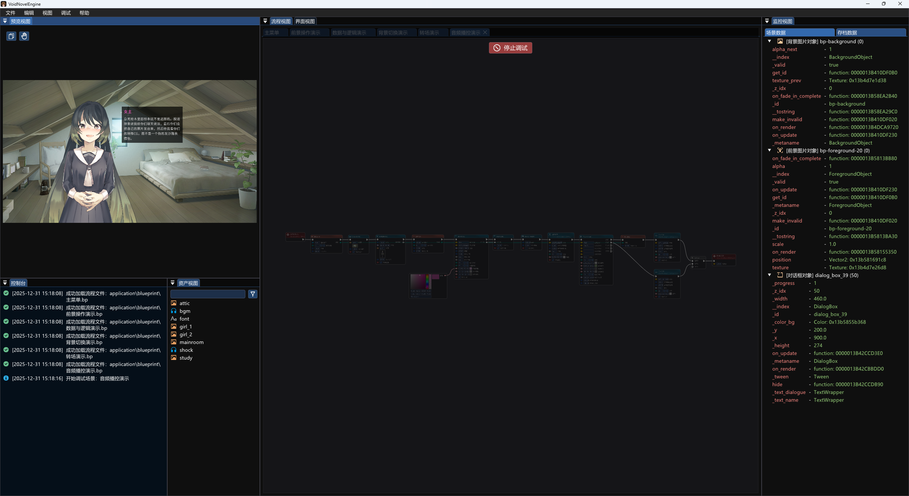
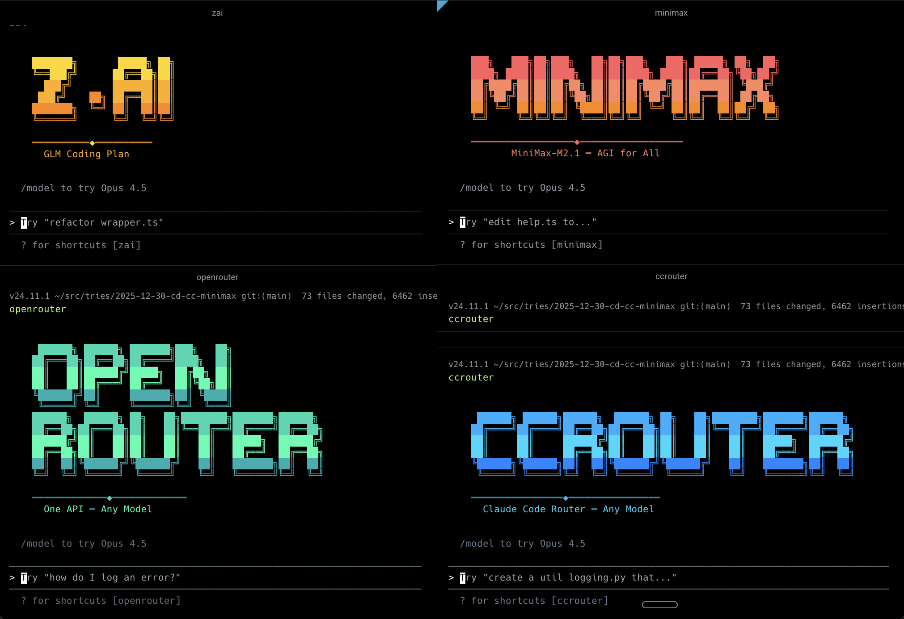

# GitHub Trending 排行榜

🔥 每周自动爬取GitHub最受欢迎的开源项目，生成AI智能总结的中文排行榜

[](https://github.com/qfy123/GitHub-Trending-/actions)
[](https://nodejs.org/)
[](LICENSE)

## ✨ 特性

- 🤖 **AI智能总结** - 使用DeepSeek AI生成简洁的中文项目描述
- 📊 **多维度排名** - 综合Star数、活跃度、新鲜度等指标
- 🖼️ **自动爬取图片** - 从项目README提取代表性图片
- 📈 **趋势分析** - 对比历史数据，显示项目排名变化
- 🗂️ **完整归档** - 按年份/周数归档所有历史数据
- 🔄 **自动更新** - GitHub Actions每周自动执行

## 📈 本周排行榜

<!-- TRENDING-START -->
### GitHub趋势排行榜 - 2026年第2周

**📅 统计周期**: 2026-01-04 ~ 2026-01-10  
**📊 项目总数**: 10 个  
**⭐ 总Star数**: 6,338  
**🔄 更新时间**: 2026-01-10 23:59:59  

| 排名 | 项目 | 描述 | Star | Fork | 语言 | 趋势 |
|------|------|------|------|------|------|------|
| 1 | [IQuest-Coder-V1](https://github.com/IQuestLab/IQuest-Coder-V1) | IQuest-Coder-V1是一套开源的400亿参数代码大模型家族，提供Base、Instruct及Loop-I... | 1,004 | 61 | Python | 🆕 |
| 2 | [claude-workflow-v2](https://github.com/CloudAI-X/claude-workflow-v2) | 为Claude Code提供通用工作流插件，集成多智能体、技能、钩子与命令，一键赋能任意软件项目。 | 952 | 151 | Python | 🆕 |
| 3 | [claude-hud](https://github.com/jarrodwatts/claude-hud) | 为Claude Code提供实时状态栏，直观展示上下文用量、活跃工具、运行代理与待办进度，提升开发透明度与效率。 | 618 | 36 | JavaScript | 🆕 |
| 4 | [VoidNovelEngine](https://github.com/VoidmatrixHeathcliff/VoidNovelEngine) | 跨平台、开源的视觉小说引擎，零授权费、现代化工作流，让独立开发者快速发布高质量文字冒险游戏。 | 600 | 59 | Unknown | 🆕 |
| 5 | [tradecat](https://github.com/tukuaiai/tradecat) | 交易猫是覆盖全市场的轻量级量化数据平台，聚合币安、比特币等行情，提供实时/历史K线、指标计算、交易信号与Teleg... | 472 | 144 | Python | 🆕 |
| 6 | [planning-with-files](https://github.com/OthmanAdi/planning-with-files) | 复刻Meta 20亿美元收购的Manus工作流：用持久化Markdown文件做AI规划、进度追踪与知识沉淀，让Cl... | 504 | 74 | Unknown | 🆕 |
| 7 | [smaug](https://github.com/alexknowshtml/smaug) | 一键把Twitter/X书签（及点赞）自动归档成Markdown，像巨龙囤宝般永久保存你的收藏。 | 484 | 50 | JavaScript | 🆕 |
| 8 | [cc-mirror](https://github.com/numman-ali/cc-mirror) | 一键生成多个隔离的 Claude Code 实例，可自由切换 Z.ai、MiniMax、OpenRouter 等后... | 473 | 33 | TypeScript | 🆕 |
| 9 | [zpdf](https://github.com/Lulzx/zpdf) | Zig编写的高性能零拷贝PDF文本提取库，内存映射+SIMD加速，无需外部依赖即可快速抽字。 | 729 | 22 | Zig | 🆕 |
| 10 | [Skills](https://github.com/Dimillian/Skills) | 为iOS/Swift开发者整理的可复用技能脚本集，一键完成发版日志、调试、代码质量检查等高频任务。 | 502 | 24 | Python | 🆕 |

### 🔥 详细介绍

#### 1. [IQuest-Coder-V1](https://github.com/IQuestLab/IQuest-Coder-V1) 


**📝 项目简介**: IQuest-Coder-V1是一套开源的400亿参数代码大模型家族，提供Base、Instruct及Loop-Instruct多版本，助力开发者高效生成与优化代码。

**✨ 核心特性**:
- 400亿参数规模，性能强劲
- 多阶段训练版本，灵活适配需求
- 配套技术报告与博客，文档完整

**📊 项目统计**:
- **⭐ Star数**: 1,004
- **🔀 Fork数**: 61
- **👀 Watch数**: 1,004
- **📝 语言**: Python
- **💻 技术栈**: Python, Shell, AWS
- **📈 趋势**: 🆕 新上榜项目

---

#### 2. [claude-workflow-v2](https://github.com/CloudAI-X/claude-workflow-v2) 


**📝 项目简介**: 为Claude Code提供通用工作流插件，集成多智能体、技能、钩子与命令，一键赋能任意软件项目。

**✨ 核心特性**:
- 多智能体协同，开箱即用
- 支持CLI与SDK双模式接入
- 可插拔技能与钩子，灵活扩展

**📊 项目统计**:
- **⭐ Star数**: 952
- **🔀 Fork数**: 151
- **👀 Watch数**: 952
- **📝 语言**: Python
- **💻 技术栈**: Python, Shell, Node.js, TypeScript, GraphQL
- **📈 趋势**: 🆕 新上榜项目

---

#### 3. [claude-hud](https://github.com/jarrodwatts/claude-hud) 


**📝 项目简介**: 为Claude Code提供实时状态栏，直观展示上下文用量、活跃工具、运行代理与待办进度，提升开发透明度与效率。

**✨ 核心特性**:
- 实时HUD常驻输入区下方
- 一键安装零配置即生效
- 可视化资源与任务进度

**📊 项目统计**:
- **⭐ Star数**: 618
- **🔀 Fork数**: 36
- **👀 Watch数**: 618
- **📝 语言**: JavaScript
- **💻 技术栈**: JavaScript, TypeScript, anthropic, claude, claude-code, cli
- **📈 趋势**: 🆕 新上榜项目

---

#### 4. [VoidNovelEngine](https://github.com/VoidmatrixHeathcliff/VoidNovelEngine) 



**📝 项目简介**: 跨平台、开源的视觉小说引擎，零授权费、现代化工作流，让独立开发者快速发布高质量文字冒险游戏。

**✨ 核心特性**:
- 完全免费开源，无版权限制
- 现代化UI与脚本，开发门槛低
- 跨Windows/macOS/Linux发布

**📊 项目统计**:
- **⭐ Star数**: 600
- **🔀 Fork数**: 59
- **👀 Watch数**: 600
- **📝 语言**: Unknown
- **📈 趋势**: 🆕 新上榜项目

---

#### 5. [tradecat](https://github.com/tukuaiai/tradecat) 


**📝 项目简介**: 交易猫是覆盖全市场的轻量级量化数据平台，聚合币安、比特币等行情，提供实时/历史K线、指标计算、交易信号与Telegram告警，一键部署即可监控与回测。

**✨ 核心特性**:
- 全市场数据一站式获取
- 内置150+技术指标与Wyckoff分析
- 支持实时告警与策略回测，代码开源可扩展

**📊 项目统计**:
- **⭐ Star数**: 472
- **🔀 Fork数**: 144
- **👀 Watch数**: 472
- **📝 语言**: Python
- **🌐 官网**: [https://x.com/tradecat_ai](https://x.com/tradecat_ai)
- **💻 技术栈**: Python, JavaScript, Shell, PLpgSQL, Makefile, ai
- **📈 趋势**: 🆕 新上榜项目

---

#### 6. [planning-with-files](https://github.com/OthmanAdi/planning-with-files) 


**📝 项目简介**: 复刻Meta 20亿美元收购的Manus工作流：用持久化Markdown文件做AI规划、进度追踪与知识沉淀，让Claude Code具备“上下文工程”能力。

**✨ 核心特性**:
- Manus同款$2B工作流
- 持久Markdown规划与复盘
- Claude Code一键技能

**📊 项目统计**:
- **⭐ Star数**: 504
- **🔀 Fork数**: 74
- **👀 Watch数**: 504
- **📝 语言**: Unknown
- **💻 技术栈**: TypeScript
- **📈 趋势**: 🆕 新上榜项目

---

#### 7. [smaug](https://github.com/alexknowshtml/smaug) 

**📝 项目简介**: 一键把Twitter/X书签（及点赞）自动归档成Markdown，像巨龙囤宝般永久保存你的收藏。

**✨ 核心特性**:
- 零配置自动同步
- 输出干净Markdown，方便本地搜索与备份
- 支持书签+点赞双模式

**📊 项目统计**:
- **⭐ Star数**: 484
- **🔀 Fork数**: 50
- **👀 Watch数**: 484
- **📝 语言**: JavaScript
- **💻 技术栈**: JavaScript
- **📈 趋势**: 🆕 新上榜项目

---

#### 8. [cc-mirror](https://github.com/numman-ali/cc-mirror) 



**📝 项目简介**: 一键生成多个隔离的 Claude Code 实例，可自由切换 Z.ai、MiniMax、OpenRouter 等后端，解决单账号限速与供应商锁定问题。

**✨ 核心特性**:
- 支持多供应商无缝切换
- 容器级隔离，配置互不干扰
- npm 一键安装，脚本自动化部署

**📊 项目统计**:
- **⭐ Star数**: 473
- **🔀 Fork数**: 33
- **👀 Watch数**: 473
- **📝 语言**: TypeScript
- **💻 技术栈**: TypeScript, Shell, JavaScript
- **📈 趋势**: 🆕 新上榜项目

---

#### 9. [zpdf](https://github.com/Lulzx/zpdf) 

**📝 项目简介**: Zig编写的高性能零拷贝PDF文本提取库，内存映射+SIMD加速，无需外部依赖即可快速抽字。

**✨ 核心特性**:
- 零拷贝内存映射，极致省内存
- SIMD加速，单文件即可解析
- 支持压缩、编码、标签PDF等完整特性

**📊 项目统计**:
- **⭐ Star数**: 729
- **🔀 Fork数**: 22
- **👀 Watch数**: 729
- **📝 语言**: Zig
- **🌐 官网**: [https://lulzx.com/zpdf](https://lulzx.com/zpdf)
- **💻 技术栈**: Zig, Python, HTML, Shell, C, high-performance
- **📈 趋势**: 🆕 新上榜项目

---

#### 10. [Skills](https://github.com/Dimillian/Skills) 

**📝 项目简介**: 为iOS/Swift开发者整理的可复用技能脚本集，一键完成发版日志、调试、代码质量检查等高频任务。

**✨ 核心特性**:
- 覆盖iOS开发全流程常用脚本
- 即装即用，支持CODEX环境快速集成
- 内置预提交钩子，自动同步技能索引

**📊 项目统计**:
- **⭐ Star数**: 502
- **🔀 Fork数**: 24
- **👀 Watch数**: 502
- **📝 语言**: Python
- **💻 技术栈**: Python, Shell
- **📈 趋势**: 🆕 新上榜项目

---

### 📈 本周统计

**🔥 热门语言**:
1. **Python** (4 个项目)
2. **JavaScript** (2 个项目)
3. **Unknown** (2 个项目)
4. **TypeScript** (1 个项目)
5. **Zig** (1 个项目)

**🏷️ 热门话题**:
1. anthropic (1)
2. claude (1)
3. claude-code (1)
4. cli (1)
5. plugin (1)
6. statusline (1)
7. typescript (1)
8. ai (1)


<!-- TRENDING-END -->

## 📚 历史数据

<!-- HISTORY-START -->
| 时间 | 周期 | 项目数 | 链接 |
|------|------|--------|------|
| 01-10 | 2026年第2周 | 10 个 | [查看详情](./archives/2026/week-2/report.md) |
| 12-27 | 2025年第52周 | 10 个 | [查看详情](./archives/2025/week-52/report.md) |
| 12-20 | 2025年第51周 | 10 个 | [查看详情](./archives/2025/week-51/report.md) |
| 12-13 | 2025年第50周 | 10 个 | [查看详情](./archives/2025/week-50/report.md) |
| 12-06 | 2025年第49周 | 10 个 | [查看详情](./archives/2025/week-49/report.md) |
| 11-29 | 2025年第48周 | 10 个 | [查看详情](./archives/2025/week-48/report.md) |
| 11-22 | 2025年第47周 | 10 个 | [查看详情](./archives/2025/week-47/report.md) |
| 11-15 | 2025年第46周 | 10 个 | [查看详情](./archives/2025/week-46/report.md) |
| 11-08 | 2025年第45周 | 10 个 | [查看详情](./archives/2025/week-45/report.md) |
| 11-01 | 2025年第44周 | 10 个 | [查看详情](./archives/2025/week-44/report.md) |
| 10-25 | 2025年第43周 | 10 个 | [查看详情](./archives/2025/week-43/report.md) |
| 10-18 | 2025年第42周 | 10 个 | [查看详情](./archives/2025/week-42/report.md) |
| 10-11 | 2025年第41周 | 10 个 | [查看详情](./archives/2025/week-41/report.md) |
| 10-04 | 2025年第40周 | 10 个 | [查看详情](./archives/2025/week-40/report.md) |
| 09-27 | 2025年第39周 | 10 个 | [查看详情](./archives/2025/week-39/report.md) |
| 09-20 | 2025年第38周 | 10 个 | [查看详情](./archives/2025/week-38/report.md) |
| 09-13 | 2025年第37周 | 10 个 | [查看详情](./archives/2025/week-37/report.md) |
| 09-06 | 2025年第36周 | 10 个 | [查看详情](./archives/2025/week-36/report.md) |
| 08-30 | 2025年第35周 | 10 个 | [查看详情](./archives/2025/week-35/report.md) |
| 08-23 | 2025年第34周 | 10 个 | [查看详情](./archives/2025/week-34/report.md) |

[查看完整历史数据](./archives/)
<!-- HISTORY-END -->

## 🚀 快速开始

### 1. 克隆项目

```bash
git clone https://github.com/your-username/GitHub-Trending.git
cd GitHub-Trending
```

### 2. 安装依赖

```bash
npm install
```

### 3. 配置环境变量

```bash
# 复制环境变量模板
cp .env.example .env

# 编辑 .env 文件，填入以下必需配置：
# GITHUB_TOKEN=your_github_token
# SILICONFLOW_API_KEY=your_siliconflow_api_key
```

### 4. 测试配置

```bash
# 系统测试
node test/system-test.js

# 配置检查
node scripts/update-trending.js --check
```

### 5. 运行项目

```bash
# 测试运行（少量数据）
node scripts/update-trending.js --limit 3

# 正式运行
node scripts/update-trending.js
```

## 🔧 配置说明

### 环境变量

| 变量名 | 必需 | 说明 | 获取方式 |
|--------|------|------|----------|
| `GITHUB_TOKEN` | ✅ | GitHub API访问令牌 | [GitHub设置](https://github.com/settings/tokens) |
| `SILICONFLOW_API_KEY` | ✅ | 硅基流动API密钥 | [硅基流动官网](https://siliconflow.cn) |
| `AI_BASE_URL` | ❌ | AI服务地址 | 默认硅基流动 |
| `AI_MODEL` | ❌ | AI模型名称 | 默认deepseek-chat |

详细配置请参考：[配置指南](config/README.md)

### GitHub Actions自动化

1. **Fork本项目**到你的GitHub账号
2. **设置Secrets**：
   - `SILICONFLOW_API_KEY`: 硅基流动API密钥
3. **启用Actions**：项目会自动每周一更新

详细设置请参考：[GitHub Actions配置](-.github/README.md)

## 📊 项目结构

```
GitHub-Trending/
├── src/                          # 核心源码
│   ├── github-api.js            # GitHub API调用
│   ├── ai-summarizer.js         # AI项目总结
│   ├── image-crawler.js         # 图片爬取
│   ├── data-processor.js        # 数据处理
│   ├── file-manager.js          # 文件管理
│   └── readme-updater.js        # README更新
├── scripts/                      # 执行脚本
│   └── update-trending.js       # 主执行脚本
├── test/                         # 测试文件
│   └── system-test.js           # 系统测试
├── archives/                     # 历史数据归档
│   └── YYYY/                    # 按年份归档
│       └── week-XX.md           # 周报文件
├── images/                       # 项目图片
│   └── YYYY/week-XX/            # 按周归档
├── data/                         # 临时数据
├── config/                       # 配置文档
├── .github/                      # GitHub Actions
│   └── workflows/
└── README.md                     # 项目说明
```

## 🎯 使用场景

### 开发者
- 🔍 **发现新项目** - 了解最新热门开源项目
- 📈 **技术趋势** - 跟踪编程语言和技术栈趋势
- 💡 **学习参考** - 学习优秀项目的设计和实现

### 技术团队
- 📊 **技术选型** - 参考热门项目进行技术选型
- 🎯 **竞品分析** - 关注同类项目的发展趋势
- 📝 **技术报告** - 生成定期的技术趋势报告

### 内容创作者
- ✍️ **素材收集** - 为技术文章和视频收集素材
- 📰 **新闻线索** - 发现值得报道的新兴项目
- 🗣️ **分享内容** - 分享有价值的开源项目

## 🛠️ 命令行工具

```bash
# 查看帮助
node scripts/update-trending.js --help

# 检查配置
node scripts/update-trending.js --check

# 自定义参数运行
node scripts/update-trending.js --limit 20 --language python

# 数据管理
node scripts/update-trending.js --backup     # 创建备份
node scripts/update-trending.js --cleanup    # 清理过期数据
node scripts/update-trending.js --stats      # 查看统计信息

# 系统测试
node test/system-test.js                      # 完整测试
node test/system-test.js --quick             # 快速诊断
```

## 📈 排名算法

项目排名基于以下三个维度的综合评分：

### 🌟 受欢迎程度 (50%)
- **Star数量** (60%): 项目获得的Star数
- **Fork数量** (25%): 项目被Fork的次数  
- **Watch数量** (15%): 项目被Watch的次数

### 🔥 活跃程度 (30%)
- **最近提交** (50%): 距离最后一次提交的时间
- **Issues活跃度** (30%): 开放的Issues数量
- **Fork活跃度** (20%): Fork的活跃程度

### 🆕 新鲜程度 (20%)
- **创建时间** (30%): 项目创建时间（新项目得分高）
- **更新时间** (70%): 最近更新时间

### 趋势分析
- 📈 **上升**: 排名比上周提升
- 📉 **下降**: 排名比上周下降  
- ➡️ **稳定**: 排名无明显变化
- 🆕 **新上榜**: 首次进入排行榜

## 🤝 贡献指南

欢迎提交 Issues 和 Pull Requests！

### 开发环境设置

```bash
# 1. Fork 并克隆项目
git clone https://github.com/your-username/GitHub-Trending.git

# 2. 创建功能分支
git checkout -b feature/your-feature

# 3. 安装依赖并测试
npm install
node test/system-test.js

# 4. 开发完成后提交
git commit -m "feat: 添加新功能"
git push origin feature/your-feature
```

### 提交规范

- `feat`: 新功能
- `fix`: 修复bug
- `docs`: 文档更新
- `style`: 代码格式调整
- `refactor`: 代码重构
- `test`: 测试相关
- `chore`: 构建/工具相关

## 📄 许可证

本项目基于 [MIT 许可证](LICENSE) 开源。

## 🙏 致谢

- [GitHub API](https://docs.github.com/en/rest) - 提供项目数据
- [硅基流动](https://siliconflow.cn) - 提供AI总结服务
- [DeepSeek](https://deepseek.com) - 优秀的AI模型
- [GitHub Actions](https://github.com/features/actions) - 自动化支持

## 📞 联系方式

- 🐛 **Bug报告**: [提交Issue](https://github.com/your-username/GitHub-Trending/issues)
- 💡 **功能建议**: [功能请求](https://github.com/your-username/GitHub-Trending/issues)
- 📧 **其他问题**: [发送邮件](mailto:your-email@example.com)

## 🔗 相关链接

- [项目文档](https://github.com/your-username/GitHub-Trending/wiki)
- [更新日志](CHANGELOG.md)
- [FAQ](FAQ.md)

---

⭐ 如果这个项目对你有帮助，请给它一个Star！

*本项目由 [GitHub Actions](https://github.com/features/actions) 自动维护，数据每周更新*