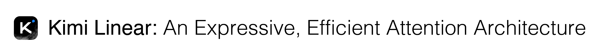
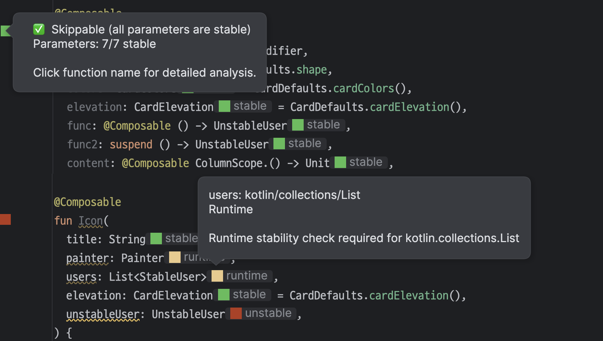

# GitHub Trending 排行榜

🔥 每周自动爬取GitHub最受欢迎的开源项目，生成AI智能总结的中文排行榜

[](https://github.com/qfy123/GitHub-Trending-/actions)
[](https://nodejs.org/)
[](LICENSE)

## ✨ 特性

- 🤖 **AI智能总结** - 使用DeepSeek AI生成简洁的中文项目描述
- 📊 **多维度排名** - 综合Star数、活跃度、新鲜度等指标
- 🖼️ **自动爬取图片** - 从项目README提取代表性图片
- 📈 **趋势分析** - 对比历史数据，显示项目排名变化
- 🗂️ **完整归档** - 按年份/周数归档所有历史数据
- 🔄 **自动更新** - GitHub Actions每周自动执行

## 📈 本周排行榜

<!-- TRENDING-START -->
### GitHub趋势排行榜 - 2025年第45周

**📅 统计周期**: 2025-11-02 ~ 2025-11-08  
**📊 项目总数**: 10 个  
**⭐ 总Star数**: 12,769  
**🔄 更新时间**: 2025-11-08 23:59:59  

| 排名 | 项目 | 描述 | Star | Fork | 语言 | 趋势 |
|------|------|------|------|------|------|------|
| 1 | [nofx](https://github.com/NoFxAiOS/nofx) | NOFX是下一代AI交易操作系统，聚合多交易所与多模型AI，实现毫秒级自动交易闭环，降低门槛提升收益。 | 5,306 | 1,188 | Go | 🆕 |
| 2 | [claude-code-infrastructure-showcase](https://github.com/diet103/claude-code-infrastructure-showcase) | 展示如何让Claude Code在复杂TypeScript微服务项目中自动激活技能、使用钩子与代理的实战模式库，解... | 2,600 | 372 | Shell | 🆕 |
| 3 | [Emu3.5](https://github.com/baaivision/Emu3.5) | Emu3.5是北京智源研究院开源的原生多模态大模型，统一处理文本、图像、视频，无需额外编码器即可“看世界”并学习世... | 951 | 35 | Python | 🆕 |
| 4 | [Escape-From-Duckov-Coop-Mod-Preview](https://github.com/Mr-sans-and-InitLoader-s-team/Escape-From-Duckov-Coop-Mod-Preview) | 为《逃离鸭科夫》打造的官方联机合作模组，一键把单机变成稳定的多人局域网/在线合作生存体验。 | 908 | 105 | C# | 🆕 |
| 5 | [Kimi-Linear](https://github.com/MoonshotAI/Kimi-Linear) | MoonshotAI开源的Kimi-Linear-48B-A3B-Instruct模型仓库，提供技术报告与Hugg... | 872 | 31 | Unknown | 🆕 |
| 6 | [sora2-watermark-remover](https://github.com/oyokki/sora2-watermark-remover) | 基于AI逐帧修复，一键无痕抹除Sora 2生成视频中的官方水印，保留原始画质。 | 405 | 151 | Python | 🆕 |
| 7 | [react-native-godot](https://github.com/borndotcom/react-native-godot) | 把 Godot 游戏引擎完整嵌入 React Native 应用，一套代码同时跑在 Android 与 iOS，让... | 652 | 20 | C++ | 🆕 |
| 8 | [sora2-api](https://github.com/jun6ry/sora2-api) | 一键调用Sora 2 API生成AI视频的Python工具，自带网页界面，零代码完成参数配置与任务提交，大幅降低视... | 366 | 108 | Python | 🆕 |
| 9 | [Awesome-World-Models](https://github.com/knightnemo/Awesome-World-Models) | 精选世界模型研究资源清单，一站式汇总具身AI、自动驾驶、NLP与智能体相关论文与项目，降低检索门槛。 | 371 | 8 | Unknown | 🆕 |
| 10 | [compose-stability-analyzer](https://github.com/skydoves/compose-stability-analyzer) | Android Studio/IntelliJ 插件，实时扫描 Jetpack Compose 函数稳定性，一键定... | 338 | 7 | Kotlin | 🆕 |

### 🔥 详细介绍

#### 1. [nofx](https://github.com/NoFxAiOS/nofx) 


**📝 项目简介**: NOFX是下一代AI交易操作系统，聚合多交易所与多模型AI，实现毫秒级自动交易闭环，降低门槛提升收益。

**✨ 核心特性**:
- 多交易所+多AI模型实时竞技
- 统一风控+低延迟执行闭环
- 可视化仪表盘一键部署

**📊 项目统计**:
- **⭐ Star数**: 5,306
- **🔀 Fork数**: 1,188
- **👀 Watch数**: 5,306
- **📝 语言**: Go
- **🌐 官网**: [https://nofxai.com](https://nofxai.com)
- **💻 技术栈**: Go, TypeScript, Shell, CSS, JavaScript, HTML
- **📈 趋势**: 🆕 新上榜项目

---

#### 2. [claude-code-infrastructure-showcase](https://github.com/diet103/claude-code-infrastructure-showcase) 

**📝 项目简介**: 展示如何让Claude Code在复杂TypeScript微服务项目中自动激活技能、使用钩子与代理的实战模式库，解决企业级落地难题。

**✨ 核心特性**:
- 技能自动激活方案
- 生产级钩子与代理示例
- 6个月真实项目沉淀，开箱即用

**📊 项目统计**:
- **⭐ Star数**: 2,600
- **🔀 Fork数**: 372
- **👀 Watch数**: 2,600
- **📝 语言**: Shell
- **💻 技术栈**: Shell, JavaScript, React, Node.js, Express, TypeScript
- **📈 趋势**: 🆕 新上榜项目

---

#### 3. [Emu3.5](https://github.com/baaivision/Emu3.5) 

**📝 项目简介**: Emu3.5是北京智源研究院开源的原生多模态大模型，统一处理文本、图像、视频，无需额外编码器即可“看世界”并学习世界规律。

**✨ 核心特性**:
- 原生多模态架构，单模型端到端训练
- 支持文本、图像、视频任意输入输出
- 开源可商用，社区活跃持续更新

**📊 项目统计**:
- **⭐ Star数**: 951
- **🔀 Fork数**: 35
- **👀 Watch数**: 951
- **📝 语言**: Python
- **💻 技术栈**: Python
- **📈 趋势**: 🆕 新上榜项目

---

#### 4. [Escape-From-Duckov-Coop-Mod-Preview](https://github.com/Mr-sans-and-InitLoader-s-team/Escape-From-Duckov-Coop-Mod-Preview) 


**📝 项目简介**: 为《逃离鸭科夫》打造的官方联机合作模组，一键把单机变成稳定的多人局域网/在线合作生存体验。

**✨ 核心特性**:
- 零配置Steam创意工坊一键订阅
- AI、战利品、战斗全同步
- 支持死亡观战与局域网/在线双模式

**📊 项目统计**:
- **⭐ Star数**: 908
- **🔀 Fork数**: 105
- **👀 Watch数**: 908
- **📝 语言**: C#
- **💻 技术栈**: C#, Batchfile
- **📈 趋势**: 🆕 新上榜项目

---

#### 5. [Kimi-Linear](https://github.com/MoonshotAI/Kimi-Linear) 



**📝 项目简介**: MoonshotAI开源的Kimi-Linear-48B-A3B-Instruct模型仓库，提供技术报告与HuggingFace一键调用，助力开发者快速集成高性能线性注意力大模型。

**✨ 核心特性**:
- 48B参数线性注意力架构
- 官方技术报告与推理代码
- HuggingFace直接加载推理

**📊 项目统计**:
- **⭐ Star数**: 872
- **🔀 Fork数**: 31
- **👀 Watch数**: 872
- **📝 语言**: Unknown
- **💻 技术栈**: Express
- **📈 趋势**: 🆕 新上榜项目

---

#### 6. [sora2-watermark-remover](https://github.com/oyokki/sora2-watermark-remover) 


**📝 项目简介**: 基于AI逐帧修复，一键无痕抹除Sora 2生成视频中的官方水印，保留原始画质。

**✨ 核心特性**:
- AI智能inpainting去水印，无需手动选区
- 支持全平台，4G内存即可运行
- 开源免费，已获400+Star社区验证

**📊 项目统计**:
- **⭐ Star数**: 405
- **🔀 Fork数**: 151
- **👀 Watch数**: 405
- **📝 语言**: Python
- **💻 技术栈**: Python, ai, sora-ai, sora-video, sora-watermark-remover, sora2
- **📈 趋势**: 🆕 新上榜项目

---

#### 7. [react-native-godot](https://github.com/borndotcom/react-native-godot) 

**📝 项目简介**: 把 Godot 游戏引擎完整嵌入 React Native 应用，一套代码同时跑在 Android 与 iOS，让游戏与 App UI 无缝融合。

**✨ 核心特性**:
- 双端原生支持，无需额外桥接
- 引擎可动态启停与重配置，内存可控
- 已在亿级用户 App 验证，稳定可靠

**📊 项目统计**:
- **⭐ Star数**: 652
- **🔀 Fork数**: 20
- **👀 Watch数**: 652
- **📝 语言**: C++
- **💻 技术栈**: C++, Objective-C++, TypeScript, Java, JavaScript, C
- **📈 趋势**: 🆕 新上榜项目

---

#### 8. [sora2-api](https://github.com/jun6ry/sora2-api) 


**📝 项目简介**: 一键调用Sora 2 API生成AI视频的Python工具，自带网页界面，零代码完成参数配置与任务提交，大幅降低视频创作门槛。

**✨ 核心特性**:
- 网页可视化配置，无需写代码
- 自动对接Sora 2 API，快速生成视频
- 开源轻量，本地即可部署使用

**📊 项目统计**:
- **⭐ Star数**: 366
- **🔀 Fork数**: 108
- **👀 Watch数**: 366
- **📝 语言**: Python
- **💻 技术栈**: Python, artificial-intelligence, python-tools, sora, sora-ai, sora-api
- **📈 趋势**: 🆕 新上榜项目

---

#### 9. [Awesome-World-Models](https://github.com/knightnemo/Awesome-World-Models) 


**📝 项目简介**: 精选世界模型研究资源清单，一站式汇总具身AI、自动驾驶、NLP与智能体相关论文与项目，降低检索门槛。

**✨ 核心特性**:
- 覆盖多领域世界模型成果
- 持续更新、分类清晰
- 面向研究者与开发者开放协作

**📊 项目统计**:
- **⭐ Star数**: 371
- **🔀 Fork数**: 8
- **👀 Watch数**: 371
- **📝 语言**: Unknown
- **💻 技术栈**: React, Express, AWS
- **📈 趋势**: 🆕 新上榜项目

---

#### 10. [compose-stability-analyzer](https://github.com/skydoves/compose-stability-analyzer) 



**📝 项目简介**: Android Studio/IntelliJ 插件，实时扫描 Jetpack Compose 函数稳定性，一键定位重组性能瓶颈。

**✨ 核心特性**:
- 实时标红不稳定参数，IDE 内即时提示
- 基于 Kotlin 编译器插件，零配置接入
- 支持跳转到源码，快速修复避免无效重组

**📊 项目统计**:
- **⭐ Star数**: 338
- **🔀 Fork数**: 7
- **👀 Watch数**: 338
- **📝 语言**: Kotlin
- **💻 技术栈**: Kotlin, Java, android, compose, intellij-plugin, jetpack-compose
- **📈 趋势**: 🆕 新上榜项目

---

### 📈 本周统计

**🔥 热门语言**:
1. **Python** (3 个项目)
2. **Unknown** (2 个项目)
3. **Go** (1 个项目)
4. **Shell** (1 个项目)
5. **C#** (1 个项目)

**🏷️ 热门话题**:
1. ai (2)
2. sora-ai (2)
3. sora2 (2)
4. android (2)
5. agentic-ai (1)
6. agentictrading (1)
7. ai-trading (1)
8. aitradingos (1)


<!-- TRENDING-END -->

## 📚 历史数据

<!-- HISTORY-START -->
| 时间 | 周期 | 项目数 | 链接 |
|------|------|--------|------|
| 11-08 | 2025年第45周 | 10 个 | [查看详情](./archives/2025/week-45/report.md) |
| 11-01 | 2025年第44周 | 10 个 | [查看详情](./archives/2025/week-44/report.md) |
| 10-25 | 2025年第43周 | 10 个 | [查看详情](./archives/2025/week-43/report.md) |
| 10-18 | 2025年第42周 | 10 个 | [查看详情](./archives/2025/week-42/report.md) |
| 10-11 | 2025年第41周 | 10 个 | [查看详情](./archives/2025/week-41/report.md) |
| 10-04 | 2025年第40周 | 10 个 | [查看详情](./archives/2025/week-40/report.md) |
| 09-27 | 2025年第39周 | 10 个 | [查看详情](./archives/2025/week-39/report.md) |
| 09-20 | 2025年第38周 | 10 个 | [查看详情](./archives/2025/week-38/report.md) |
| 09-13 | 2025年第37周 | 10 个 | [查看详情](./archives/2025/week-37/report.md) |
| 09-06 | 2025年第36周 | 10 个 | [查看详情](./archives/2025/week-36/report.md) |
| 08-30 | 2025年第35周 | 10 个 | [查看详情](./archives/2025/week-35/report.md) |
| 08-23 | 2025年第34周 | 10 个 | [查看详情](./archives/2025/week-34/report.md) |
| 08-16 | 2025年第33周 | 3 个 | [查看详情](./archives/2025/week-33/report.md) |

<!-- HISTORY-END -->

## 🚀 快速开始

### 1. 克隆项目

```bash
git clone https://github.com/your-username/GitHub-Trending.git
cd GitHub-Trending
```

### 2. 安装依赖

```bash
npm install
```

### 3. 配置环境变量

```bash
# 复制环境变量模板
cp .env.example .env

# 编辑 .env 文件，填入以下必需配置：
# GITHUB_TOKEN=your_github_token
# SILICONFLOW_API_KEY=your_siliconflow_api_key
```

### 4. 测试配置

```bash
# 系统测试
node test/system-test.js

# 配置检查
node scripts/update-trending.js --check
```

### 5. 运行项目

```bash
# 测试运行（少量数据）
node scripts/update-trending.js --limit 3

# 正式运行
node scripts/update-trending.js
```

## 🔧 配置说明

### 环境变量

| 变量名 | 必需 | 说明 | 获取方式 |
|--------|------|------|----------|
| `GITHUB_TOKEN` | ✅ | GitHub API访问令牌 | [GitHub设置](https://github.com/settings/tokens) |
| `SILICONFLOW_API_KEY` | ✅ | 硅基流动API密钥 | [硅基流动官网](https://siliconflow.cn) |
| `AI_BASE_URL` | ❌ | AI服务地址 | 默认硅基流动 |
| `AI_MODEL` | ❌ | AI模型名称 | 默认deepseek-chat |

详细配置请参考：[配置指南](config/README.md)

### GitHub Actions自动化

1. **Fork本项目**到你的GitHub账号
2. **设置Secrets**：
   - `SILICONFLOW_API_KEY`: 硅基流动API密钥
3. **启用Actions**：项目会自动每周一更新

详细设置请参考：[GitHub Actions配置](-.github/README.md)

## 📊 项目结构

```
GitHub-Trending/
├── src/                          # 核心源码
│   ├── github-api.js            # GitHub API调用
│   ├── ai-summarizer.js         # AI项目总结
│   ├── image-crawler.js         # 图片爬取
│   ├── data-processor.js        # 数据处理
│   ├── file-manager.js          # 文件管理
│   └── readme-updater.js        # README更新
├── scripts/                      # 执行脚本
│   └── update-trending.js       # 主执行脚本
├── test/                         # 测试文件
│   └── system-test.js           # 系统测试
├── archives/                     # 历史数据归档
│   └── YYYY/                    # 按年份归档
│       └── week-XX.md           # 周报文件
├── images/                       # 项目图片
│   └── YYYY/week-XX/            # 按周归档
├── data/                         # 临时数据
├── config/                       # 配置文档
├── .github/                      # GitHub Actions
│   └── workflows/
└── README.md                     # 项目说明
```

## 🎯 使用场景

### 开发者
- 🔍 **发现新项目** - 了解最新热门开源项目
- 📈 **技术趋势** - 跟踪编程语言和技术栈趋势
- 💡 **学习参考** - 学习优秀项目的设计和实现

### 技术团队
- 📊 **技术选型** - 参考热门项目进行技术选型
- 🎯 **竞品分析** - 关注同类项目的发展趋势
- 📝 **技术报告** - 生成定期的技术趋势报告

### 内容创作者
- ✍️ **素材收集** - 为技术文章和视频收集素材
- 📰 **新闻线索** - 发现值得报道的新兴项目
- 🗣️ **分享内容** - 分享有价值的开源项目

## 🛠️ 命令行工具

```bash
# 查看帮助
node scripts/update-trending.js --help

# 检查配置
node scripts/update-trending.js --check

# 自定义参数运行
node scripts/update-trending.js --limit 20 --language python

# 数据管理
node scripts/update-trending.js --backup     # 创建备份
node scripts/update-trending.js --cleanup    # 清理过期数据
node scripts/update-trending.js --stats      # 查看统计信息

# 系统测试
node test/system-test.js                      # 完整测试
node test/system-test.js --quick             # 快速诊断
```

## 📈 排名算法

项目排名基于以下三个维度的综合评分：

### 🌟 受欢迎程度 (50%)
- **Star数量** (60%): 项目获得的Star数
- **Fork数量** (25%): 项目被Fork的次数  
- **Watch数量** (15%): 项目被Watch的次数

### 🔥 活跃程度 (30%)
- **最近提交** (50%): 距离最后一次提交的时间
- **Issues活跃度** (30%): 开放的Issues数量
- **Fork活跃度** (20%): Fork的活跃程度

### 🆕 新鲜程度 (20%)
- **创建时间** (30%): 项目创建时间（新项目得分高）
- **更新时间** (70%): 最近更新时间

### 趋势分析
- 📈 **上升**: 排名比上周提升
- 📉 **下降**: 排名比上周下降  
- ➡️ **稳定**: 排名无明显变化
- 🆕 **新上榜**: 首次进入排行榜

## 🤝 贡献指南

欢迎提交 Issues 和 Pull Requests！

### 开发环境设置

```bash
# 1. Fork 并克隆项目
git clone https://github.com/your-username/GitHub-Trending.git

# 2. 创建功能分支
git checkout -b feature/your-feature

# 3. 安装依赖并测试
npm install
node test/system-test.js

# 4. 开发完成后提交
git commit -m "feat: 添加新功能"
git push origin feature/your-feature
```

### 提交规范

- `feat`: 新功能
- `fix`: 修复bug
- `docs`: 文档更新
- `style`: 代码格式调整
- `refactor`: 代码重构
- `test`: 测试相关
- `chore`: 构建/工具相关

## 📄 许可证

本项目基于 [MIT 许可证](LICENSE) 开源。

## 🙏 致谢

- [GitHub API](https://docs.github.com/en/rest) - 提供项目数据
- [硅基流动](https://siliconflow.cn) - 提供AI总结服务
- [DeepSeek](https://deepseek.com) - 优秀的AI模型
- [GitHub Actions](https://github.com/features/actions) - 自动化支持

## 📞 联系方式

- 🐛 **Bug报告**: [提交Issue](https://github.com/your-username/GitHub-Trending/issues)
- 💡 **功能建议**: [功能请求](https://github.com/your-username/GitHub-Trending/issues)
- 📧 **其他问题**: [发送邮件](mailto:your-email@example.com)

## 🔗 相关链接

- [项目文档](https://github.com/your-username/GitHub-Trending/wiki)
- [更新日志](CHANGELOG.md)
- [FAQ](FAQ.md)

---

⭐ 如果这个项目对你有帮助，请给它一个Star！

*本项目由 [GitHub Actions](https://github.com/features/actions) 自动维护，数据每周更新*