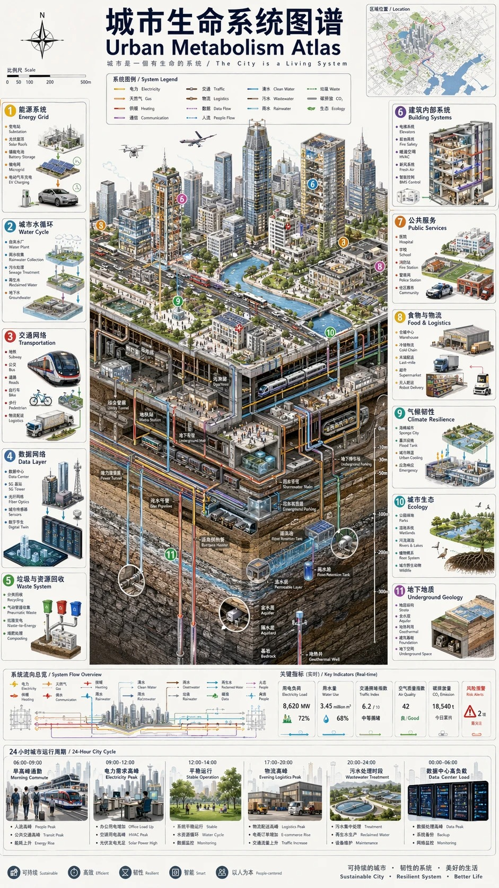

# GitHub Trending 排行榜

🔥 每周自动爬取GitHub最受欢迎的开源项目，生成AI智能总结的中文排行榜

[](https://github.com/qfy123/GitHub-Trending-/actions)
[](https://nodejs.org/)
[](LICENSE)

## ✨ 特性

- 🤖 **AI智能总结** - 使用DeepSeek AI生成简洁的中文项目描述
- 📊 **多维度排名** - 综合Star数、活跃度、新鲜度等指标
- 🖼️ **自动爬取图片** - 从项目README提取代表性图片
- 📈 **趋势分析** - 对比历史数据，显示项目排名变化
- 🗂️ **完整归档** - 按年份/周数归档所有历史数据
- 🔄 **自动更新** - GitHub Actions每周自动执行

## 📈 本周排行榜

<!-- TRENDING-START -->
### GitHub趋势排行榜 - 2026年第18周

**📅 统计周期**: 2026-04-26 ~ 2026-05-02  
**📊 项目总数**: 10 个  
**⭐ 总Star数**: 12,496  
**🔄 更新时间**: 2026-05-02 23:59:59  

| 排名 | 项目 | 描述 | Star | Fork | 语言 | 趋势 |
|------|------|------|------|------|------|------|
| 1 | [guizang-ppt-skill](https://github.com/op7418/guizang-ppt-skill) | 把一句话提示变成单文件横向翻页HTML演示，杂志级排版+WebGL背景，无需构建即可分享。 | 3,127 | 331 | HTML | 🆕 |
| 2 | [garden-skills](https://github.com/ConardLi/garden-skills) | ConardLi整理的AI Agent技能库，提供网页设计、知识检索、图像生成等可直接投入生产的代码片段，让Cla... | 1,422 | 262 | JavaScript | 🆕 |
| 3 | [OpenChronicle](https://github.com/Einsia/OpenChronicle) | 为任意工具型LLM代理提供本地优先、可审计的持久记忆系统，开源替代OpenAI Chronicle。 | 1,476 | 101 | Python | 🆕 |
| 4 | [TileKernels](https://github.com/deepseek-ai/TileKernels) | 基于TileLang DSL的GPU算子库，为LLM计算与访存极限优化，已用于内部训练推理。 | 1,231 | 94 | Python | 🆕 |
| 5 | [clawsweeper](https://github.com/openclaw/clawsweeper) | ClawSweeper是openclaw的保守型维护机器人，每周扫描全部Issue与PR，生成Markdown报告... | 1,049 | 114 | JavaScript | 🆕 |
| 6 | [awesome-gpt-image-2](https://github.com/freestylefly/awesome-gpt-image-2) | 逆向329个案例提炼13套工业级模板，一键生成高质量AI绘图提示词，解决提示词难写、效果不稳痛点。 | 816 | 169 | Unknown | 🆕 |
| 7 | [MasterHttpRelayVPN-RUST](https://github.com/therealaleph/MasterHttpRelayVPN-RUST) | 用Rust重写的免费抗审查工具，通过Google Apps Script中继+TLS SNI隐藏，把流量伪装成访问... | 757 | 87 | Rust | 🆕 |
| 8 | [deepseek_v4_rolepaly_instruct](https://github.com/victorchen96/deepseek_v4_rolepaly_instruct) | 提供DeepSeek-V4官方角色扮演模式的特殊控制指令，一键切换“角色沉浸/纯分析/默认”三种思维链风格，提升对... | 1,142 | 55 | Unknown | 🆕 |
| 9 | [text-to-cad](https://github.com/earthtojake/text-to-cad) | 开源Text-to-CAD工具，一句话把自然语言变成可版本控制的3D模型，并一键导出STEP/STL/GLB等格式... | 729 | 116 | JavaScript | 🆕 |
| 10 | [PPT-Design-Prompt](https://github.com/Russell-cell/PPT-Design-Prompt) | 将品牌设计文档自动转成面向图像模型的PPT素材描述，方便AI生成高质量演示文稿视觉元素。 | 747 | 56 | Python | 🆕 |

### 🔥 详细介绍

#### 1. [guizang-ppt-skill](https://github.com/op7418/guizang-ppt-skill) 

**📝 项目简介**: 把一句话提示变成单文件横向翻页HTML演示，杂志级排版+WebGL背景，无需构建即可分享。

**✨ 核心特性**:
- 单文件输出，浏览器即开即用
- 10种杂志布局+5套主题一键切换
- WebGL流体背景+多手势翻页体验

**📊 项目统计**:
- **⭐ Star数**: 3,127
- **🔀 Fork数**: 331
- **👀 Watch数**: 3,127
- **📝 语言**: HTML
- **💻 技术栈**: HTML
- **📈 趋势**: 🆕 新上榜项目

---

#### 2. [garden-skills](https://github.com/ConardLi/garden-skills) 

**📝 项目简介**: ConardLi整理的AI Agent技能库，提供网页设计、知识检索、图像生成等可直接投入生产的代码片段，让Claude、Cursor等AI编程助手秒变全栈设计师。

**✨ 核心特性**:
- 即插即用：针对主流AI Agent优化，复制即可运行
- 覆盖全栈：前端页面、RAG检索、GPT-4o图像生成一站式
- 持续更新：社区贡献+作者精选，保证生产级质量

**📊 项目统计**:
- **⭐ Star数**: 1,422
- **🔀 Fork数**: 262
- **👀 Watch数**: 1,422
- **📝 语言**: JavaScript
- **🌐 官网**: [https://github.com/ConardLi/garden-skills](https://github.com/ConardLi/garden-skills)
- **💻 技术栈**: JavaScript, Python, agent, claude, gpt-image-2, rag
- **📈 趋势**: 🆕 新上榜项目

---

#### 3. [OpenChronicle](https://github.com/Einsia/OpenChronicle) 


**📝 项目简介**: 为任意工具型LLM代理提供本地优先、可审计的持久记忆系统，开源替代OpenAI Chronicle。

**✨ 核心特性**:
- 本地存储，数据自主掌控
- 模型无关，适配各种LLM代理
- 完全开源可定制，透明可审计

**📊 项目统计**:
- **⭐ Star数**: 1,476
- **🔀 Fork数**: 101
- **👀 Watch数**: 1,476
- **📝 语言**: Python
- **💻 技术栈**: Python, Swift, Shell, Azure
- **📈 趋势**: 🆕 新上榜项目

---

#### 4. [TileKernels](https://github.com/deepseek-ai/TileKernels) 

**📝 项目简介**: 基于TileLang DSL的GPU算子库，为LLM计算与访存极限优化，已用于内部训练推理。

**✨ 核心特性**:
- Python DSL极速开发
- 自动逼近硬件性能上限
- 已落地生产训练/推理

**📊 项目统计**:
- **⭐ Star数**: 1,231
- **🔀 Fork数**: 94
- **👀 Watch数**: 1,231
- **📝 语言**: Python
- **💻 技术栈**: Python, Express
- **📈 趋势**: 🆕 新上榜项目

---

#### 5. [clawsweeper](https://github.com/openclaw/clawsweeper) 

**📝 项目简介**: ClawSweeper是openclaw的保守型维护机器人，每周扫描全部Issue与PR，生成Markdown报告并仅在证据充分时建议关闭，帮助项目保持整洁。

**✨ 核心特性**:
- 每周自动全量扫描
- 仅高置信度才提议关闭
- 生成持久化Codex评论与Markdown报告

**📊 项目统计**:
- **⭐ Star数**: 1,049
- **🔀 Fork数**: 114
- **👀 Watch数**: 1,049
- **📝 语言**: JavaScript
- **💻 技术栈**: JavaScript, AWS
- **📈 趋势**: 🆕 新上榜项目

---

#### 6. [awesome-gpt-image-2](https://github.com/freestylefly/awesome-gpt-image-2) 



**📝 项目简介**: 逆向329个案例提炼13套工业级模板，一键生成高质量AI绘图提示词，解决提示词难写、效果不稳痛点。

**✨ 核心特性**:
- 329案例逆向工程沉淀
- 13套可直接复用模板
- Prompt as Code引擎化输出

**📊 项目统计**:
- **⭐ Star数**: 816
- **🔀 Fork数**: 169
- **👀 Watch数**: 816
- **📝 语言**: Unknown
- **📈 趋势**: 🆕 新上榜项目

---

#### 7. [MasterHttpRelayVPN-RUST](https://github.com/therealaleph/MasterHttpRelayVPN-RUST) 


**📝 项目简介**: 用Rust重写的免费抗审查工具，通过Google Apps Script中继+TLS SNI隐藏，把流量伪装成访问Google，一键绕过DPI封锁。

**✨ 核心特性**:
- 零依赖单文件，CLI+跨平台GUI
- 免费自托管Google中继，无需服务器
- 同时提供HTTP/SOCKS5代理

**📊 项目统计**:
- **⭐ Star数**: 757
- **🔀 Fork数**: 87
- **👀 Watch数**: 757
- **📝 语言**: Rust
- **🌐 官网**: [https://github.com/masterking32/MasterHttpRelayVPN](https://github.com/masterking32/MasterHttpRelayVPN)
- **💻 技术栈**: Rust, Kotlin, JavaScript, Dockerfile, Shell, Batchfile
- **📈 趋势**: 🆕 新上榜项目

---

#### 8. [deepseek_v4_rolepaly_instruct](https://github.com/victorchen96/deepseek_v4_rolepaly_instruct) 

**📝 项目简介**: 提供DeepSeek-V4官方角色扮演模式的特殊控制指令，一键切换“角色沉浸/纯分析/默认”三种思维链风格，提升对话体验。

**✨ 核心特性**:
- 官方适配APP与API
- 三种思维链风格可切换
- 指令简单、可复现

**📊 项目统计**:
- **⭐ Star数**: 1,142
- **🔀 Fork数**: 55
- **👀 Watch数**: 1,142
- **📝 语言**: Unknown
- **📈 趋势**: 🆕 新上榜项目

---

#### 9. [text-to-cad](https://github.com/earthtojake/text-to-cad) 

**📝 项目简介**: 开源Text-to-CAD工具，一句话把自然语言变成可版本控制的3D模型，并一键导出STEP/STL/GLB等格式，解决手工建模慢、难协作的痛点。

**✨ 核心特性**:
- AI编码代理驱动，一句话生成CAD
- 自动输出STEP/STL/GLB/URDF等工业格式
- 源码级版本管理，协作复现零门槛

**📊 项目统计**:
- **⭐ Star数**: 729
- **🔀 Fork数**: 116
- **👀 Watch数**: 729
- **📝 语言**: JavaScript
- **💻 技术栈**: JavaScript, Python, CSS, HTML, agents, ai
- **📈 趋势**: 🆕 新上榜项目

---

#### 10. [PPT-Design-Prompt](https://github.com/Russell-cell/PPT-Design-Prompt) 

**📝 项目简介**: 将品牌设计文档自动转成面向图像模型的PPT素材描述，方便AI生成高质量演示文稿视觉元素。

**✨ 核心特性**:
- 一键把DESIGN.md转为图像模型可用格式
- 专注幻灯片视觉素材，不生成完整PPT
- 支持PowerPoint、Keynote、PDF等多平台素材

**📊 项目统计**:
- **⭐ Star数**: 747
- **🔀 Fork数**: 56
- **👀 Watch数**: 747
- **📝 语言**: Python
- **💻 技术栈**: Python, Redis
- **📈 趋势**: 🆕 新上榜项目

---

### 📈 本周统计

**🔥 热门语言**:
1. **JavaScript** (3 个项目)
2. **Python** (3 个项目)
3. **Unknown** (2 个项目)
4. **HTML** (1 个项目)
5. **Rust** (1 个项目)

**🏷️ 热门话题**:
1. agent (1)
2. claude (1)
3. gpt-image-2 (1)
4. rag (1)
5. skills (1)
6. web-design (1)
7. anti-censorship (1)
8. censorship-circumvention (1)


<!-- TRENDING-END -->

## 📚 历史数据

<!-- HISTORY-START -->
| 时间 | 周期 | 项目数 | 链接 |
|------|------|--------|------|
| 05-02 | 2026年第18周 | 10 个 | [查看详情](./archives/2026/week-18/report.md) |
| 04-25 | 2026年第17周 | 10 个 | [查看详情](./archives/2026/week-17/report.md) |
| 04-18 | 2026年第16周 | 10 个 | [查看详情](./archives/2026/week-16/report.md) |
| 04-11 | 2026年第15周 | 10 个 | [查看详情](./archives/2026/week-15/report.md) |
| 04-04 | 2026年第14周 | 10 个 | [查看详情](./archives/2026/week-14/report.md) |
| 03-28 | 2026年第13周 | 10 个 | [查看详情](./archives/2026/week-13/report.md) |
| 03-21 | 2026年第12周 | 10 个 | [查看详情](./archives/2026/week-12/report.md) |
| 03-14 | 2026年第11周 | 10 个 | [查看详情](./archives/2026/week-11/report.md) |
| 03-07 | 2026年第10周 | 10 个 | [查看详情](./archives/2026/week-10/report.md) |
| 02-28 | 2026年第9周 | 10 个 | [查看详情](./archives/2026/week-9/report.md) |
| 02-21 | 2026年第8周 | 10 个 | [查看详情](./archives/2026/week-8/report.md) |
| 02-14 | 2026年第7周 | 10 个 | [查看详情](./archives/2026/week-7/report.md) |
| 02-07 | 2026年第6周 | 10 个 | [查看详情](./archives/2026/week-6/report.md) |
| 01-31 | 2026年第5周 | 10 个 | [查看详情](./archives/2026/week-5/report.md) |
| 01-24 | 2026年第4周 | 10 个 | [查看详情](./archives/2026/week-4/report.md) |
| 01-17 | 2026年第3周 | 10 个 | [查看详情](./archives/2026/week-3/report.md) |
| 01-10 | 2026年第2周 | 10 个 | [查看详情](./archives/2026/week-2/report.md) |
| 12-27 | 2025年第52周 | 10 个 | [查看详情](./archives/2025/week-52/report.md) |
| 12-20 | 2025年第51周 | 10 个 | [查看详情](./archives/2025/week-51/report.md) |
| 12-13 | 2025年第50周 | 10 个 | [查看详情](./archives/2025/week-50/report.md) |

[查看完整历史数据](./archives/)
<!-- HISTORY-END -->

## 🚀 快速开始

### 1. 克隆项目

```bash
git clone https://github.com/your-username/GitHub-Trending.git
cd GitHub-Trending
```

### 2. 安装依赖

```bash
npm install
```

### 3. 配置环境变量

```bash
# 复制环境变量模板
cp .env.example .env

# 编辑 .env 文件，填入以下必需配置：
# GITHUB_TOKEN=your_github_token
# SILICONFLOW_API_KEY=your_siliconflow_api_key
```

### 4. 测试配置

```bash
# 系统测试
node test/system-test.js

# 配置检查
node scripts/update-trending.js --check
```

### 5. 运行项目

```bash
# 测试运行（少量数据）
node scripts/update-trending.js --limit 3

# 正式运行
node scripts/update-trending.js
```

## 🔧 配置说明

### 环境变量

| 变量名 | 必需 | 说明 | 获取方式 |
|--------|------|------|----------|
| `GITHUB_TOKEN` | ✅ | GitHub API访问令牌 | [GitHub设置](https://github.com/settings/tokens) |
| `SILICONFLOW_API_KEY` | ✅ | 硅基流动API密钥 | [硅基流动官网](https://siliconflow.cn) |
| `AI_BASE_URL` | ❌ | AI服务地址 | 默认硅基流动 |
| `AI_MODEL` | ❌ | AI模型名称 | 默认deepseek-chat |

详细配置请参考：[配置指南](config/README.md)

### GitHub Actions自动化

1. **Fork本项目**到你的GitHub账号
2. **设置Secrets**：
   - `SILICONFLOW_API_KEY`: 硅基流动API密钥
3. **启用Actions**：项目会自动每周一更新

详细设置请参考：[GitHub Actions配置](-.github/README.md)

## 📊 项目结构

```
GitHub-Trending/
├── src/                          # 核心源码
│   ├── github-api.js            # GitHub API调用
│   ├── ai-summarizer.js         # AI项目总结
│   ├── image-crawler.js         # 图片爬取
│   ├── data-processor.js        # 数据处理
│   ├── file-manager.js          # 文件管理
│   └── readme-updater.js        # README更新
├── scripts/                      # 执行脚本
│   └── update-trending.js       # 主执行脚本
├── test/                         # 测试文件
│   └── system-test.js           # 系统测试
├── archives/                     # 历史数据归档
│   └── YYYY/                    # 按年份归档
│       └── week-XX.md           # 周报文件
├── images/                       # 项目图片
│   └── YYYY/week-XX/            # 按周归档
├── data/                         # 临时数据
├── config/                       # 配置文档
├── .github/                      # GitHub Actions
│   └── workflows/
└── README.md                     # 项目说明
```

## 🎯 使用场景

### 开发者
- 🔍 **发现新项目** - 了解最新热门开源项目
- 📈 **技术趋势** - 跟踪编程语言和技术栈趋势
- 💡 **学习参考** - 学习优秀项目的设计和实现

### 技术团队
- 📊 **技术选型** - 参考热门项目进行技术选型
- 🎯 **竞品分析** - 关注同类项目的发展趋势
- 📝 **技术报告** - 生成定期的技术趋势报告

### 内容创作者
- ✍️ **素材收集** - 为技术文章和视频收集素材
- 📰 **新闻线索** - 发现值得报道的新兴项目
- 🗣️ **分享内容** - 分享有价值的开源项目

## 🛠️ 命令行工具

```bash
# 查看帮助
node scripts/update-trending.js --help

# 检查配置
node scripts/update-trending.js --check

# 自定义参数运行
node scripts/update-trending.js --limit 20 --language python

# 数据管理
node scripts/update-trending.js --backup     # 创建备份
node scripts/update-trending.js --cleanup    # 清理过期数据
node scripts/update-trending.js --stats      # 查看统计信息

# 系统测试
node test/system-test.js                      # 完整测试
node test/system-test.js --quick             # 快速诊断
```

## 📈 排名算法

项目排名基于以下三个维度的综合评分：

### 🌟 受欢迎程度 (50%)
- **Star数量** (60%): 项目获得的Star数
- **Fork数量** (25%): 项目被Fork的次数  
- **Watch数量** (15%): 项目被Watch的次数

### 🔥 活跃程度 (30%)
- **最近提交** (50%): 距离最后一次提交的时间
- **Issues活跃度** (30%): 开放的Issues数量
- **Fork活跃度** (20%): Fork的活跃程度

### 🆕 新鲜程度 (20%)
- **创建时间** (30%): 项目创建时间（新项目得分高）
- **更新时间** (70%): 最近更新时间

### 趋势分析
- 📈 **上升**: 排名比上周提升
- 📉 **下降**: 排名比上周下降  
- ➡️ **稳定**: 排名无明显变化
- 🆕 **新上榜**: 首次进入排行榜

## 🤝 贡献指南

欢迎提交 Issues 和 Pull Requests！

### 开发环境设置

```bash
# 1. Fork 并克隆项目
git clone https://github.com/your-username/GitHub-Trending.git

# 2. 创建功能分支
git checkout -b feature/your-feature

# 3. 安装依赖并测试
npm install
node test/system-test.js

# 4. 开发完成后提交
git commit -m "feat: 添加新功能"
git push origin feature/your-feature
```

### 提交规范

- `feat`: 新功能
- `fix`: 修复bug
- `docs`: 文档更新
- `style`: 代码格式调整
- `refactor`: 代码重构
- `test`: 测试相关
- `chore`: 构建/工具相关

## 📄 许可证

本项目基于 [MIT 许可证](LICENSE) 开源。

## 🙏 致谢

- [GitHub API](https://docs.github.com/en/rest) - 提供项目数据
- [硅基流动](https://siliconflow.cn) - 提供AI总结服务
- [DeepSeek](https://deepseek.com) - 优秀的AI模型
- [GitHub Actions](https://github.com/features/actions) - 自动化支持

## 📞 联系方式

- 🐛 **Bug报告**: [提交Issue](https://github.com/your-username/GitHub-Trending/issues)
- 💡 **功能建议**: [功能请求](https://github.com/your-username/GitHub-Trending/issues)
- 📧 **其他问题**: [发送邮件](mailto:your-email@example.com)

## 🔗 相关链接

- [项目文档](https://github.com/your-username/GitHub-Trending/wiki)
- [更新日志](CHANGELOG.md)
- [FAQ](FAQ.md)

---

⭐ 如果这个项目对你有帮助，请给它一个Star！

*本项目由 [GitHub Actions](https://github.com/features/actions) 自动维护，数据每周更新*