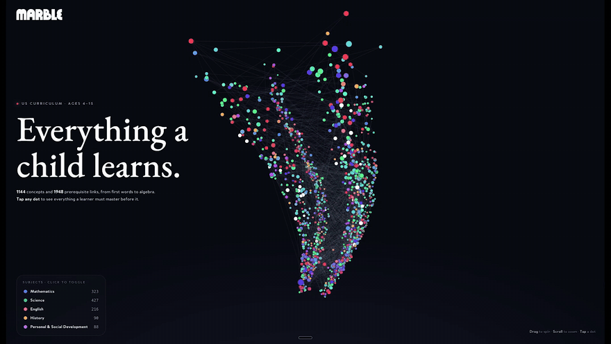
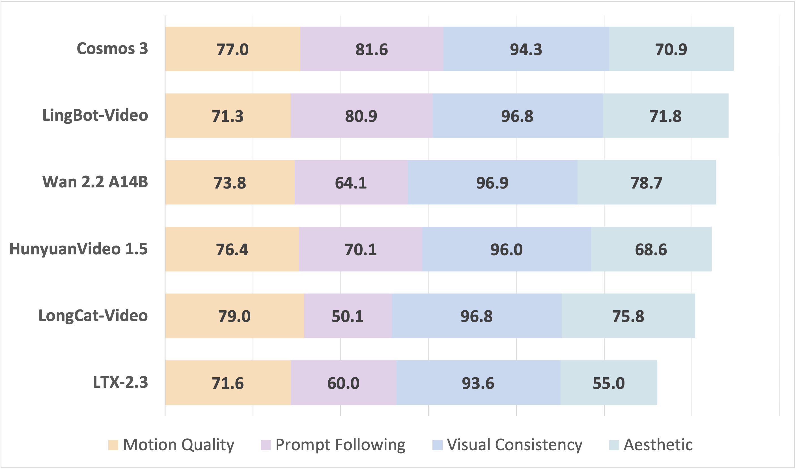
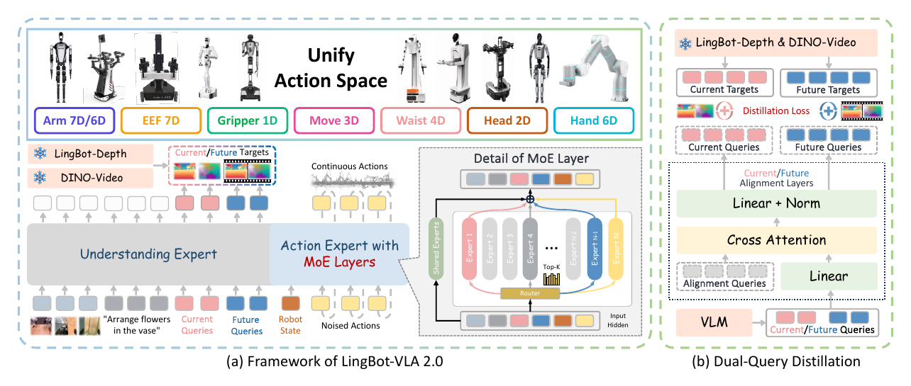

# GitHub Trending 排行榜

🔥 每周自动爬取GitHub最受欢迎的开源项目，生成AI智能总结的中文排行榜

[](https://github.com/qfy123/GitHub-Trending-/actions)
[](https://nodejs.org/)
[](LICENSE)

## ✨ 特性

- 🤖 **AI智能总结** - 使用DeepSeek AI生成简洁的中文项目描述
- 📊 **多维度排名** - 综合Star数、活跃度、新鲜度等指标
- 🖼️ **自动爬取图片** - 从项目README提取代表性图片
- 📈 **趋势分析** - 对比历史数据，显示项目排名变化
- 🗂️ **完整归档** - 按年份/周数归档所有历史数据
- 🔄 **自动更新** - GitHub Actions每周自动执行

## 📈 本周排行榜

<!-- TRENDING-START -->
### GitHub趋势排行榜 - 2026年第29周

**📅 统计周期**: 2026-07-12 ~ 2026-07-18  
**📊 项目总数**: 10 个  
**⭐ 总Star数**: 8,722  
**🔄 更新时间**: 2026-07-18 23:59:59  

| 排名 | 项目 | 描述 | Star | Fork | 语言 | 趋势 |
|------|------|------|------|------|------|------|
| 1 | [3x-ui-Upgrade](https://github.com/x4gKing/3x-ui-Upgrade) | 一个热门的HTML开源项目，在GitHub上获得了895个star，值得关注。 | 895 | 1,865 | HTML | 🆕 |
| 2 | [os-taxonomy](https://github.com/withmarbleapp/os-taxonomy) | 一个热门的JavaScript开源项目，在GitHub上获得了2,764个star，值得关注。 | 2,764 | 503 | JavaScript | 🆕 |
| 3 | [clodex-ide](https://github.com/mereyabdenbekuly-ctrl/clodex-ide) | 一个使用TypeScript开发的开源项目：Local-first, zero-trust agentic IDE... | 691 | 148 | TypeScript | 🆕 |
| 4 | [lingbot-world-v2](https://github.com/Robbyant/lingbot-world-v2) | 一个使用Python开发的开源项目：Infinite Worlds with Versatile Interact... | 955 | 49 | Python | 🆕 |
| 5 | [Three.js-Object-Sculptor-Codex-Plugin](https://github.com/vinhhien112/Three.js-Object-Sculptor-Codex-Plugin) | 一个使用Python开发的开源项目：Codex plugin that turns attached object... | 693 | 85 | Python | 🆕 |
| 6 | [homerail](https://github.com/xiaotianfotos/homerail) | 一个使用TypeScript开发的开源项目：Voice-first local agent orchestrati... | 491 | 112 | TypeScript | 🆕 |
| 7 | [lingbot-video](https://github.com/Robbyant/lingbot-video) | 一个使用Python开发的开源项目：Scaling Mixture-of-Experts Video Pretra... | 719 | 26 | Python | 🆕 |
| 8 | [guizang-material-illustration](https://github.com/op7418/guizang-material-illustration) | 一个使用Unknown开发的开源项目：归藏的材质插画 skill：生成带字解释图、图表美化和参考辅助配图。，已获得... | 599 | 64 | Unknown | 🆕 |
| 9 | [lingbot-vla-v2](https://github.com/Robbyant/lingbot-vla-v2) | 一个使用Python开发的开源项目：From Foundation to Application，已获得482个s... | 482 | 28 | Python | 🆕 |
| 10 | [uninstally](https://github.com/gostonx/uninstally) | 一个使用Swift开发的开源项目：A clean, native macOS uninstaller. Compl... | 433 | 15 | Swift | 🆕 |

### 🔥 详细介绍

#### 1. [3x-ui-Upgrade](https://github.com/x4gKing/3x-ui-Upgrade) 

**📝 项目简介**: 一个热门的HTML开源项目，在GitHub上获得了895个star，值得关注。

**✨ 核心特性**:
- 895 stars
- HTML

**📊 项目统计**:
- **⭐ Star数**: 895
- **🔀 Fork数**: 1,865
- **👀 Watch数**: 895
- **📝 语言**: HTML
- **💻 技术栈**: HTML, Dockerfile, Shell, Docker
- **📈 趋势**: 🆕 新上榜项目

---

#### 2. [os-taxonomy](https://github.com/withmarbleapp/os-taxonomy) 



**📝 项目简介**: 一个热门的JavaScript开源项目，在GitHub上获得了2,764个star，值得关注。

**✨ 核心特性**:
- 2,764 stars
- JavaScript

**📊 项目统计**:
- **⭐ Star数**: 2,764
- **🔀 Fork数**: 503
- **👀 Watch数**: 2,764
- **📝 语言**: JavaScript
- **💻 技术栈**: JavaScript, Express, Redis
- **📈 趋势**: 🆕 新上榜项目

---

#### 3. [clodex-ide](https://github.com/mereyabdenbekuly-ctrl/clodex-ide) 


**📝 项目简介**: 一个使用TypeScript开发的开源项目：Local-first, zero-trust agentic IDE for verifiable autonomous software development.，已获得691个star。

**✨ 核心特性**:
- 691 stars
- TypeScript

**📊 项目统计**:
- **⭐ Star数**: 691
- **🔀 Fork数**: 148
- **👀 Watch数**: 691
- **📝 语言**: TypeScript
- **🌐 官网**: [https://ide.clodex.xyz](https://ide.clodex.xyz)
- **💻 技术栈**: TypeScript, JavaScript, CSS, Shell, MDX, PowerShell
- **📈 趋势**: 🆕 新上榜项目

---

#### 4. [lingbot-world-v2](https://github.com/Robbyant/lingbot-world-v2) 


**📝 项目简介**: 一个使用Python开发的开源项目：Infinite Worlds with Versatile Interactions，已获得955个star。

**✨ 核心特性**:
- 955 stars
- Python

**📊 项目统计**:
- **⭐ Star数**: 955
- **🔀 Fork数**: 49
- **👀 Watch数**: 955
- **📝 语言**: Python
- **🌐 官网**: [https://technology.robbyant.com/lingbot-world-v2](https://technology.robbyant.com/lingbot-world-v2)
- **💻 技术栈**: Python, Shell, Makefile, React, Express
- **📈 趋势**: 🆕 新上榜项目

---

#### 5. [Three.js-Object-Sculptor-Codex-Plugin](https://github.com/vinhhien112/Three.js-Object-Sculptor-Codex-Plugin) 


**📝 项目简介**: 一个使用Python开发的开源项目：Codex plugin that turns attached object images into code-only, animation-ready procedural Three.js models.，已获得693个star。

**✨ 核心特性**:
- 693 stars
- Python

**📊 项目统计**:
- **⭐ Star数**: 693
- **🔀 Fork数**: 85
- **👀 Watch数**: 693
- **📝 语言**: Python
- **💻 技术栈**: Python, TypeScript
- **📈 趋势**: 🆕 新上榜项目

---

#### 6. [homerail](https://github.com/xiaotianfotos/homerail) 

**📝 项目简介**: 一个使用TypeScript开发的开源项目：Voice-first local agent orchestration runtime for auditable DAG workflows.，已获得491个star。

**✨ 核心特性**:
- 491 stars
- TypeScript

**📊 项目统计**:
- **⭐ Star数**: 491
- **🔀 Fork数**: 112
- **👀 Watch数**: 491
- **📝 语言**: TypeScript
- **💻 技术栈**: TypeScript, Vue, JavaScript, Shell, CSS, SCSS
- **📈 趋势**: 🆕 新上榜项目

---

#### 7. [lingbot-video](https://github.com/Robbyant/lingbot-video) 



**📝 项目简介**: 一个使用Python开发的开源项目：Scaling Mixture-of-Experts Video Pretraining for Embodied Intelligence，已获得719个star。

**✨ 核心特性**:
- 719 stars
- Python

**📊 项目统计**:
- **⭐ Star数**: 719
- **🔀 Fork数**: 26
- **👀 Watch数**: 719
- **📝 语言**: Python
- **🌐 官网**: [https://technology.robbyant.com/lingbot-video](https://technology.robbyant.com/lingbot-video)
- **💻 技术栈**: Python, Shell, image-to-video, lingbot-video, video-generation, world-models
- **📈 趋势**: 🆕 新上榜项目

---

#### 8. [guizang-material-illustration](https://github.com/op7418/guizang-material-illustration) 

**📝 项目简介**: 一个使用Unknown开发的开源项目：归藏的材质插画 skill：生成带字解释图、图表美化和参考辅助配图。，已获得599个star。

**✨ 核心特性**:
- 599 stars
- Unknown

**📊 项目统计**:
- **⭐ Star数**: 599
- **🔀 Fork数**: 64
- **👀 Watch数**: 599
- **📝 语言**: Unknown
- **💻 技术栈**: agent, chart-visualization, chinese, claude-code, codex, data-visualization
- **📈 趋势**: 🆕 新上榜项目

---

#### 9. [lingbot-vla-v2](https://github.com/Robbyant/lingbot-vla-v2) 



**📝 项目简介**: 一个使用Python开发的开源项目：From Foundation to Application，已获得482个star。

**✨ 核心特性**:
- 482 stars
- Python

**📊 项目统计**:
- **⭐ Star数**: 482
- **🔀 Fork数**: 28
- **👀 Watch数**: 482
- **📝 语言**: Python
- **💻 技术栈**: Python, Shell, Dockerfile, Makefile
- **📈 趋势**: 🆕 新上榜项目

---

#### 10. [uninstally](https://github.com/gostonx/uninstally) 

**📝 项目简介**: 一个使用Swift开发的开源项目：A clean, native macOS uninstaller. Completely removes apps and every file they leave behind using smart bundle-identifier detection. SwiftUI + Finder extension.，已获得433个star。

**✨ 核心特性**:
- 433 stars
- Swift

**📊 项目统计**:
- **⭐ Star数**: 433
- **🔀 Fork数**: 15
- **👀 Watch数**: 433
- **📝 语言**: Swift
- **💻 技术栈**: Swift, Python, Shell, Ruby, AWS
- **📈 趋势**: 🆕 新上榜项目

---

### 📈 本周统计

**🔥 热门语言**:
1. **Python** (4 个项目)
2. **TypeScript** (2 个项目)
3. **HTML** (1 个项目)
4. **JavaScript** (1 个项目)
5. **Unknown** (1 个项目)

**🏷️ 热门话题**:
1. agentic-ai (1)
2. agentic-ide (1)
3. ai-agents (1)
4. developer-tools (1)
5. electron (1)
6. ide (1)
7. local-first (1)
8. typescript (1)


<!-- TRENDING-END -->

## 📚 历史数据

<!-- HISTORY-START -->
| 时间 | 周期 | 项目数 | 链接 |
|------|------|--------|------|
| 07-18 | 2026年第29周 | 10 个 | [查看详情](./archives/2026/week-29/report.md) |
| 07-11 | 2026年第28周 | 10 个 | [查看详情](./archives/2026/week-28/report.md) |
| 07-04 | 2026年第27周 | 10 个 | [查看详情](./archives/2026/week-27/report.md) |
| 06-27 | 2026年第26周 | 10 个 | [查看详情](./archives/2026/week-26/report.md) |
| 06-20 | 2026年第25周 | 10 个 | [查看详情](./archives/2026/week-25/report.md) |
| 06-13 | 2026年第24周 | 10 个 | [查看详情](./archives/2026/week-24/report.md) |
| 06-06 | 2026年第23周 | 10 个 | [查看详情](./archives/2026/week-23/report.md) |
| 05-30 | 2026年第22周 | 10 个 | [查看详情](./archives/2026/week-22/report.md) |
| 05-23 | 2026年第21周 | 10 个 | [查看详情](./archives/2026/week-21/report.md) |
| 05-16 | 2026年第20周 | 10 个 | [查看详情](./archives/2026/week-20/report.md) |
| 05-09 | 2026年第19周 | 10 个 | [查看详情](./archives/2026/week-19/report.md) |
| 05-02 | 2026年第18周 | 10 个 | [查看详情](./archives/2026/week-18/report.md) |
| 04-25 | 2026年第17周 | 10 个 | [查看详情](./archives/2026/week-17/report.md) |
| 04-18 | 2026年第16周 | 10 个 | [查看详情](./archives/2026/week-16/report.md) |
| 04-11 | 2026年第15周 | 10 个 | [查看详情](./archives/2026/week-15/report.md) |
| 04-04 | 2026年第14周 | 10 个 | [查看详情](./archives/2026/week-14/report.md) |
| 03-28 | 2026年第13周 | 10 个 | [查看详情](./archives/2026/week-13/report.md) |
| 03-21 | 2026年第12周 | 10 个 | [查看详情](./archives/2026/week-12/report.md) |
| 03-14 | 2026年第11周 | 10 个 | [查看详情](./archives/2026/week-11/report.md) |
| 03-07 | 2026年第10周 | 10 个 | [查看详情](./archives/2026/week-10/report.md) |

[查看完整历史数据](./archives/)
<!-- HISTORY-END -->

## 🚀 快速开始

### 1. 克隆项目

```bash
git clone https://github.com/your-username/GitHub-Trending.git
cd GitHub-Trending
```

### 2. 安装依赖

```bash
npm install
```

### 3. 配置环境变量

```bash
# 复制环境变量模板
cp .env.example .env

# 编辑 .env 文件，填入以下必需配置：
# GITHUB_TOKEN=your_github_token
# SILICONFLOW_API_KEY=your_siliconflow_api_key
```

### 4. 测试配置

```bash
# 系统测试
node test/system-test.js

# 配置检查
node scripts/update-trending.js --check
```

### 5. 运行项目

```bash
# 测试运行（少量数据）
node scripts/update-trending.js --limit 3

# 正式运行
node scripts/update-trending.js
```

## 🔧 配置说明

### 环境变量

| 变量名 | 必需 | 说明 | 获取方式 |
|--------|------|------|----------|
| `GITHUB_TOKEN` | ✅ | GitHub API访问令牌 | [GitHub设置](https://github.com/settings/tokens) |
| `SILICONFLOW_API_KEY` | ✅ | 硅基流动API密钥 | [硅基流动官网](https://siliconflow.cn) |
| `AI_BASE_URL` | ❌ | AI服务地址 | 默认硅基流动 |
| `AI_MODEL` | ❌ | AI模型名称 | 默认deepseek-chat |

详细配置请参考：[配置指南](config/README.md)

### GitHub Actions自动化

1. **Fork本项目**到你的GitHub账号
2. **设置Secrets**：
   - `SILICONFLOW_API_KEY`: 硅基流动API密钥
3. **启用Actions**：项目会自动每周一更新

详细设置请参考：[GitHub Actions配置](-.github/README.md)

## 📊 项目结构

```
GitHub-Trending/
├── src/                          # 核心源码
│   ├── github-api.js            # GitHub API调用
│   ├── ai-summarizer.js         # AI项目总结
│   ├── image-crawler.js         # 图片爬取
│   ├── data-processor.js        # 数据处理
│   ├── file-manager.js          # 文件管理
│   └── readme-updater.js        # README更新
├── scripts/                      # 执行脚本
│   └── update-trending.js       # 主执行脚本
├── test/                         # 测试文件
│   └── system-test.js           # 系统测试
├── archives/                     # 历史数据归档
│   └── YYYY/                    # 按年份归档
│       └── week-XX.md           # 周报文件
├── images/                       # 项目图片
│   └── YYYY/week-XX/            # 按周归档
├── data/                         # 临时数据
├── config/                       # 配置文档
├── .github/                      # GitHub Actions
│   └── workflows/
└── README.md                     # 项目说明
```

## 🎯 使用场景

### 开发者
- 🔍 **发现新项目** - 了解最新热门开源项目
- 📈 **技术趋势** - 跟踪编程语言和技术栈趋势
- 💡 **学习参考** - 学习优秀项目的设计和实现

### 技术团队
- 📊 **技术选型** - 参考热门项目进行技术选型
- 🎯 **竞品分析** - 关注同类项目的发展趋势
- 📝 **技术报告** - 生成定期的技术趋势报告

### 内容创作者
- ✍️ **素材收集** - 为技术文章和视频收集素材
- 📰 **新闻线索** - 发现值得报道的新兴项目
- 🗣️ **分享内容** - 分享有价值的开源项目

## 🛠️ 命令行工具

```bash
# 查看帮助
node scripts/update-trending.js --help

# 检查配置
node scripts/update-trending.js --check

# 自定义参数运行
node scripts/update-trending.js --limit 20 --language python

# 数据管理
node scripts/update-trending.js --backup     # 创建备份
node scripts/update-trending.js --cleanup    # 清理过期数据
node scripts/update-trending.js --stats      # 查看统计信息

# 系统测试
node test/system-test.js                      # 完整测试
node test/system-test.js --quick             # 快速诊断
```

## 📈 排名算法

项目排名基于以下三个维度的综合评分：

### 🌟 受欢迎程度 (50%)
- **Star数量** (60%): 项目获得的Star数
- **Fork数量** (25%): 项目被Fork的次数  
- **Watch数量** (15%): 项目被Watch的次数

### 🔥 活跃程度 (30%)
- **最近提交** (50%): 距离最后一次提交的时间
- **Issues活跃度** (30%): 开放的Issues数量
- **Fork活跃度** (20%): Fork的活跃程度

### 🆕 新鲜程度 (20%)
- **创建时间** (30%): 项目创建时间（新项目得分高）
- **更新时间** (70%): 最近更新时间

### 趋势分析
- 📈 **上升**: 排名比上周提升
- 📉 **下降**: 排名比上周下降  
- ➡️ **稳定**: 排名无明显变化
- 🆕 **新上榜**: 首次进入排行榜

## 🤝 贡献指南

欢迎提交 Issues 和 Pull Requests！

### 开发环境设置

```bash
# 1. Fork 并克隆项目
git clone https://github.com/your-username/GitHub-Trending.git

# 2. 创建功能分支
git checkout -b feature/your-feature

# 3. 安装依赖并测试
npm install
node test/system-test.js

# 4. 开发完成后提交
git commit -m "feat: 添加新功能"
git push origin feature/your-feature
```

### 提交规范

- `feat`: 新功能
- `fix`: 修复bug
- `docs`: 文档更新
- `style`: 代码格式调整
- `refactor`: 代码重构
- `test`: 测试相关
- `chore`: 构建/工具相关

## 📄 许可证

本项目基于 [MIT 许可证](LICENSE) 开源。

## 🙏 致谢

- [GitHub API](https://docs.github.com/en/rest) - 提供项目数据
- [硅基流动](https://siliconflow.cn) - 提供AI总结服务
- [DeepSeek](https://deepseek.com) - 优秀的AI模型
- [GitHub Actions](https://github.com/features/actions) - 自动化支持

## 📞 联系方式

- 🐛 **Bug报告**: [提交Issue](https://github.com/your-username/GitHub-Trending/issues)
- 💡 **功能建议**: [功能请求](https://github.com/your-username/GitHub-Trending/issues)
- 📧 **其他问题**: [发送邮件](mailto:your-email@example.com)

## 🔗 相关链接

- [项目文档](https://github.com/your-username/GitHub-Trending/wiki)
- [更新日志](CHANGELOG.md)
- [FAQ](FAQ.md)

---

⭐ 如果这个项目对你有帮助，请给它一个Star！

*本项目由 [GitHub Actions](https://github.com/features/actions) 自动维护，数据每周更新*