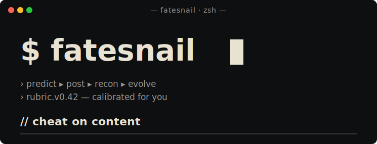
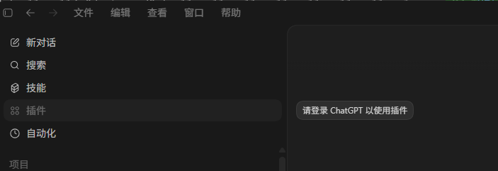
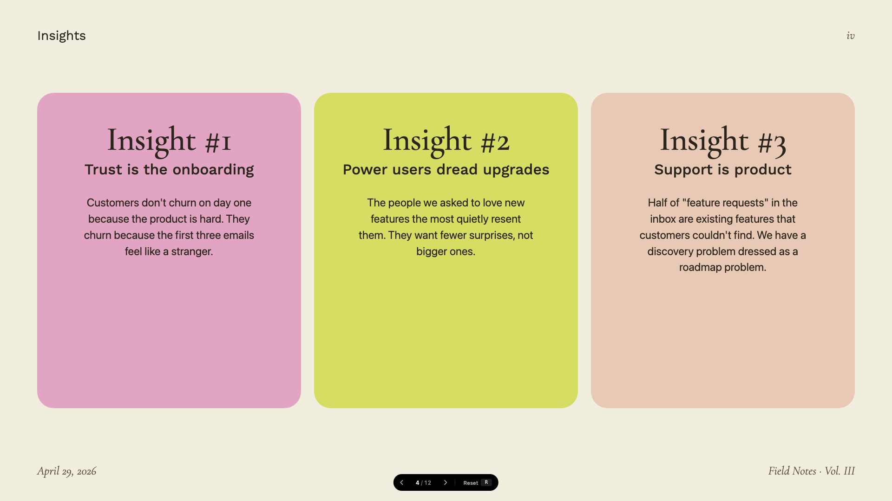

# GitHub Trending 排行榜

🔥 每周自动爬取GitHub最受欢迎的开源项目，生成AI智能总结的中文排行榜

[](https://github.com/qfy123/GitHub-Trending-/actions)
[](https://nodejs.org/)
[](LICENSE)

## ✨ 特性

- 🤖 **AI智能总结** - 使用DeepSeek AI生成简洁的中文项目描述
- 📊 **多维度排名** - 综合Star数、活跃度、新鲜度等指标
- 🖼️ **自动爬取图片** - 从项目README提取代表性图片
- 📈 **趋势分析** - 对比历史数据，显示项目排名变化
- 🗂️ **完整归档** - 按年份/周数归档所有历史数据
- 🔄 **自动更新** - GitHub Actions每周自动执行

## 📈 本周排行榜

<!-- TRENDING-START -->
### GitHub趋势排行榜 - 2026年第20周

**📅 统计周期**: 2026-05-10 ~ 2026-05-16  
**📊 项目总数**: 10 个  
**⭐ 总Star数**: 21,466  
**🔄 更新时间**: 2026-05-16 23:59:59  

| 排名 | 项目 | 描述 | Star | Fork | 语言 | 趋势 |
|------|------|------|------|------|------|------|
| 1 | [dirtyfrag](https://github.com/V4bel/dirtyfrag) | Dirty Frag通过组合两个内核页缓存写漏洞，在主流Linux发行版上实现一键本地提权，影响面极广。 | 4,066 | 608 | C | 🆕 |
| 2 | [ds4](https://github.com/antirez/ds4) | 专为DeepSeek V4 Flash打造的轻量级本地推理引擎，用Metal在苹果芯片上极速跑大模型，零依赖、低延迟。 | 6,588 | 477 | C | 🆕 |
| 3 | [zero-native](https://github.com/vercel-labs/zero-native) | 用Zig把Web前端秒变原生桌面/移动应用，体积最小、内存最少、热重载最快，可切换系统WebView或CEF。 | 2,378 | 104 | Zig | 🆕 |
| 4 | [mirage](https://github.com/strukto-ai/mirage) | 为AI Agent打造的统一虚拟文件系统，让大模型像操作本地盘一样安全读写数据、调用工具。 | 1,817 | 110 | TypeScript | 🆕 |
| 5 | [cheat-on-content](https://github.com/XBuilderLAB/cheat-on-content) | 将每条社媒内容变成可量化实验：打分→盲测→复盘→迭代，用数据替代直觉，实现粉丝爆发式增长。 | 1,587 | 323 | Shell | 🆕 |
| 6 | [yao-open-prompts](https://github.com/yaojingang/yao-open-prompts) | 开源中文AI提示词库，整理116个可直接复制的高质量提示词，覆盖工作、学习、营销、生活等真实场景，帮助用户零门槛调... | 1,585 | 250 | Python | 🆕 |
| 7 | [3DCellForge](https://github.com/huangserva/3DCellForge) | 基于AI的交互式3D细胞生成与探索平台，可上传图片秒变立体细胞模型，浏览器内即可旋转缩放、导出GLB。 | 943 | 160 | JavaScript | 🆕 |
| 8 | [tokenspeed](https://github.com/lightseekorg/tokenspeed) | TokenSpeed是面向智能体场景的极速LLM推理引擎，兼具TensorRT-LLM级性能与vLLM级易用性，主... | 923 | 66 | Python | 🆕 |
| 9 | [CodexPlusPlus](https://github.com/BigPizzaV3/CodexPlusPlus) | Codex++ 是 Codex App 的无侵入式增强启动器，通过 DevTools 协议注入脚本，实现会话删除、... | 805 | 50 | Python | 🆕 |
| 10 | [beautiful-html-templates](https://github.com/zarazhangrui/beautiful-html-templates) | 为AI编程助手准备的现成HTML幻灯片模板库，一键生成高颜值演示文稿，无需人工排版。 | 774 | 74 | HTML | 🆕 |

### 🔥 详细介绍

#### 1. [dirtyfrag](https://github.com/V4bel/dirtyfrag) 


**📝 项目简介**: Dirty Frag通过组合两个内核页缓存写漏洞，在主流Linux发行版上实现一键本地提权，影响面极广。

**✨ 核心特性**:
- 一键获取root权限
- 覆盖多版本主流发行版
- 利用链公开，验证简单

**📊 项目统计**:
- **⭐ Star数**: 4,066
- **🔀 Fork数**: 608
- **👀 Watch数**: 4,066
- **📝 语言**: C
- **💻 技术栈**: C
- **📈 趋势**: 🆕 新上榜项目

---

#### 2. [ds4](https://github.com/antirez/ds4) 

**📝 项目简介**: 专为DeepSeek V4 Flash打造的轻量级本地推理引擎，用Metal在苹果芯片上极速跑大模型，零依赖、低延迟。

**✨ 核心特性**:
- 苹果Metal原生加速，推理速度极快
- 仅针对DeepSeek V4 Flash深度优化，体积小巧
- 内置KV缓存与HTTP API，一键启动本地服务

**📊 项目统计**:
- **⭐ Star数**: 6,588
- **🔀 Fork数**: 477
- **👀 Watch数**: 6,588
- **📝 语言**: C
- **💻 技术栈**: C, Objective-C, Metal, Python, Shell, Makefile
- **📈 趋势**: 🆕 新上榜项目

---

#### 3. [zero-native](https://github.com/vercel-labs/zero-native) 

**📝 项目简介**: 用Zig把Web前端秒变原生桌面/移动应用，体积最小、内存最少、热重载最快，可切换系统WebView或CEF。

**✨ 核心特性**:
- Zig构建，单文件可执行<5MB
- 一键init，支持Next/React等前端
- 系统WebView/CEF双引擎，兼顾体积与一致性

**📊 项目统计**:
- **⭐ Star数**: 2,378
- **🔀 Fork数**: 104
- **👀 Watch数**: 2,378
- **📝 语言**: Zig
- **🌐 官网**: [https://zero-native.dev](https://zero-native.dev)
- **💻 技术栈**: Zig, Objective-C++, Objective-C, C, C++, JavaScript
- **📈 趋势**: 🆕 新上榜项目

---

#### 4. [mirage](https://github.com/strukto-ai/mirage) 


**📝 项目简介**: 为AI Agent打造的统一虚拟文件系统，让大模型像操作本地盘一样安全读写数据、调用工具。

**✨ 核心特性**:
- FUSE虚拟盘即插即用
- 沙箱隔离保障数据安全
- 已集成OpenAI/Claude/LangChain等主流Agent

**📊 项目统计**:
- **⭐ Star数**: 1,817
- **🔀 Fork数**: 110
- **👀 Watch数**: 1,817
- **📝 语言**: TypeScript
- **🌐 官网**: [https://www.strukto.ai/mirage](https://www.strukto.ai/mirage)
- **💻 技术栈**: TypeScript, Python, JavaScript, Shell, agent-sandbox, agent-tools
- **📈 趋势**: 🆕 新上榜项目

---

#### 5. [cheat-on-content](https://github.com/XBuilderLAB/cheat-on-content) 



**📝 项目简介**: 将每条社媒内容变成可量化实验：打分→盲测→复盘→迭代，用数据替代直觉，实现粉丝爆发式增长。

**✨ 核心特性**:
- 一键把帖子转为A/B实验
- Shell+Python自动化闭环
- 作者凭此1个月涨粉100万

**📊 项目统计**:
- **⭐ Star数**: 1,587
- **🔀 Fork数**: 323
- **👀 Watch数**: 1,587
- **📝 语言**: Shell
- **💻 技术栈**: Shell, Python
- **📈 趋势**: 🆕 新上榜项目

---

#### 6. [yao-open-prompts](https://github.com/yaojingang/yao-open-prompts) 

**📝 项目简介**: 开源中文AI提示词库，整理116个可直接复制的高质量提示词，覆盖工作、学习、营销、生活等真实场景，帮助用户零门槛调用大模型。

**✨ 核心特性**:
- 全中文、场景化分类，开箱即用
- 剔除广告与冗余样式，纯净可复用
- 持续新增GEO、合同、PPT、学习等实战提示词

**📊 项目统计**:
- **⭐ Star数**: 1,585
- **🔀 Fork数**: 250
- **👀 Watch数**: 1,585
- **📝 语言**: Python
- **🌐 官网**: [https://yaojingang.github.io/yao-open-prompts/](https://yaojingang.github.io/yao-open-prompts/)
- **💻 技术栈**: Python, ai, chinese-prompts, geo, prompt-engineering, prompts
- **📈 趋势**: 🆕 新上榜项目

---

#### 7. [3DCellForge](https://github.com/huangserva/3DCellForge) 


**📝 项目简介**: 基于AI的交互式3D细胞生成与探索平台，可上传图片秒变立体细胞模型，浏览器内即可旋转缩放、导出GLB。

**✨ 核心特性**:
- React+Three.js零安装即开即用
- 支持图片转3D一键生成细胞
- 可截图、导出GLB用于教学或汇报

**📊 项目统计**:
- **⭐ Star数**: 943
- **🔀 Fork数**: 160
- **👀 Watch数**: 943
- **📝 语言**: JavaScript
- **💻 技术栈**: JavaScript, CSS, HTML, React
- **📈 趋势**: 🆕 新上榜项目

---

#### 8. [tokenspeed](https://github.com/lightseekorg/tokenspeed) 


**📝 项目简介**: TokenSpeed是面向智能体场景的极速LLM推理引擎，兼具TensorRT-LLM级性能与vLLM级易用性，主打生产级光速推理。

**✨ 核心特性**:
- TensorRT-LLM级吞吐，延迟低至毫秒
- 本地SPMD+静态编译，通信零开销
- 一键部署，兼容主流模型生态

**📊 项目统计**:
- **⭐ Star数**: 923
- **🔀 Fork数**: 66
- **👀 Watch数**: 923
- **📝 语言**: Python
- **🌐 官网**: [https://lightseek.org/blog/lightseek-tokenspeed.html](https://lightseek.org/blog/lightseek-tokenspeed.html)
- **💻 技术栈**: Python, C++, Shell, CMake, Dockerfile, blackwell
- **📈 趋势**: 🆕 新上榜项目

---

#### 9. [CodexPlusPlus](https://github.com/BigPizzaV3/CodexPlusPlus) 



**📝 项目简介**: Codex++ 是 Codex App 的无侵入式增强启动器，通过 DevTools 协议注入脚本，实现会话删除、插件解锁等实用功能，无需改动原安装。

**✨ 核心特性**:
- 无侵入式增强，不改原文件
- 会话一键删除+撤销，支持本地/云端
- 插件选项解锁与强制安装，自由开关

**📊 项目统计**:
- **⭐ Star数**: 805
- **🔀 Fork数**: 50
- **👀 Watch数**: 805
- **📝 语言**: Python
- **💻 技术栈**: Python, JavaScript, Batchfile
- **📈 趋势**: 🆕 新上榜项目

---

#### 10. [beautiful-html-templates](https://github.com/zarazhangrui/beautiful-html-templates) 



**📝 项目简介**: 为AI编程助手准备的现成HTML幻灯片模板库，一键生成高颜值演示文稿，无需人工排版。

**✨ 核心特性**:
- 模板丰富，开箱即用
- AI自动匹配用户主题并填充内容
- 纯前端，零依赖，秒级渲染

**📊 项目统计**:
- **⭐ Star数**: 774
- **🔀 Fork数**: 74
- **👀 Watch数**: 774
- **📝 语言**: HTML
- **💻 技术栈**: HTML, JavaScript, CSS
- **📈 趋势**: 🆕 新上榜项目

---

### 📈 本周统计

**🔥 热门语言**:
1. **Python** (3 个项目)
2. **C** (2 个项目)
3. **Zig** (1 个项目)
4. **TypeScript** (1 个项目)
5. **Shell** (1 个项目)

**🏷️ 热门话题**:
1. agent-sandbox (1)
2. agent-tools (1)
3. ai-agents (1)
4. bash (1)
5. claude-code (1)
6. fuse (1)
7. langchain (1)
8. llm-agents (1)


<!-- TRENDING-END -->

## 📚 历史数据

<!-- HISTORY-START -->
| 时间 | 周期 | 项目数 | 链接 |
|------|------|--------|------|
| 05-16 | 2026年第20周 | 10 个 | [查看详情](./archives/2026/week-20/report.md) |
| 05-09 | 2026年第19周 | 10 个 | [查看详情](./archives/2026/week-19/report.md) |
| 05-02 | 2026年第18周 | 10 个 | [查看详情](./archives/2026/week-18/report.md) |
| 04-25 | 2026年第17周 | 10 个 | [查看详情](./archives/2026/week-17/report.md) |
| 04-18 | 2026年第16周 | 10 个 | [查看详情](./archives/2026/week-16/report.md) |
| 04-11 | 2026年第15周 | 10 个 | [查看详情](./archives/2026/week-15/report.md) |
| 04-04 | 2026年第14周 | 10 个 | [查看详情](./archives/2026/week-14/report.md) |
| 03-28 | 2026年第13周 | 10 个 | [查看详情](./archives/2026/week-13/report.md) |
| 03-21 | 2026年第12周 | 10 个 | [查看详情](./archives/2026/week-12/report.md) |
| 03-14 | 2026年第11周 | 10 个 | [查看详情](./archives/2026/week-11/report.md) |
| 03-07 | 2026年第10周 | 10 个 | [查看详情](./archives/2026/week-10/report.md) |
| 02-28 | 2026年第9周 | 10 个 | [查看详情](./archives/2026/week-9/report.md) |
| 02-21 | 2026年第8周 | 10 个 | [查看详情](./archives/2026/week-8/report.md) |
| 02-14 | 2026年第7周 | 10 个 | [查看详情](./archives/2026/week-7/report.md) |
| 02-07 | 2026年第6周 | 10 个 | [查看详情](./archives/2026/week-6/report.md) |
| 01-31 | 2026年第5周 | 10 个 | [查看详情](./archives/2026/week-5/report.md) |
| 01-24 | 2026年第4周 | 10 个 | [查看详情](./archives/2026/week-4/report.md) |
| 01-17 | 2026年第3周 | 10 个 | [查看详情](./archives/2026/week-3/report.md) |
| 01-10 | 2026年第2周 | 10 个 | [查看详情](./archives/2026/week-2/report.md) |
| 12-27 | 2025年第52周 | 10 个 | [查看详情](./archives/2025/week-52/report.md) |

[查看完整历史数据](./archives/)
<!-- HISTORY-END -->

## 🚀 快速开始

### 1. 克隆项目

```bash
git clone https://github.com/your-username/GitHub-Trending.git
cd GitHub-Trending
```

### 2. 安装依赖

```bash
npm install
```

### 3. 配置环境变量

```bash
# 复制环境变量模板
cp .env.example .env

# 编辑 .env 文件，填入以下必需配置：
# GITHUB_TOKEN=your_github_token
# SILICONFLOW_API_KEY=your_siliconflow_api_key
```

### 4. 测试配置

```bash
# 系统测试
node test/system-test.js

# 配置检查
node scripts/update-trending.js --check
```

### 5. 运行项目

```bash
# 测试运行（少量数据）
node scripts/update-trending.js --limit 3

# 正式运行
node scripts/update-trending.js
```

## 🔧 配置说明

### 环境变量

| 变量名 | 必需 | 说明 | 获取方式 |
|--------|------|------|----------|
| `GITHUB_TOKEN` | ✅ | GitHub API访问令牌 | [GitHub设置](https://github.com/settings/tokens) |
| `SILICONFLOW_API_KEY` | ✅ | 硅基流动API密钥 | [硅基流动官网](https://siliconflow.cn) |
| `AI_BASE_URL` | ❌ | AI服务地址 | 默认硅基流动 |
| `AI_MODEL` | ❌ | AI模型名称 | 默认deepseek-chat |

详细配置请参考：[配置指南](config/README.md)

### GitHub Actions自动化

1. **Fork本项目**到你的GitHub账号
2. **设置Secrets**：
   - `SILICONFLOW_API_KEY`: 硅基流动API密钥
3. **启用Actions**：项目会自动每周一更新

详细设置请参考：[GitHub Actions配置](-.github/README.md)

## 📊 项目结构

```
GitHub-Trending/
├── src/                          # 核心源码
│   ├── github-api.js            # GitHub API调用
│   ├── ai-summarizer.js         # AI项目总结
│   ├── image-crawler.js         # 图片爬取
│   ├── data-processor.js        # 数据处理
│   ├── file-manager.js          # 文件管理
│   └── readme-updater.js        # README更新
├── scripts/                      # 执行脚本
│   └── update-trending.js       # 主执行脚本
├── test/                         # 测试文件
│   └── system-test.js           # 系统测试
├── archives/                     # 历史数据归档
│   └── YYYY/                    # 按年份归档
│       └── week-XX.md           # 周报文件
├── images/                       # 项目图片
│   └── YYYY/week-XX/            # 按周归档
├── data/                         # 临时数据
├── config/                       # 配置文档
├── .github/                      # GitHub Actions
│   └── workflows/
└── README.md                     # 项目说明
```

## 🎯 使用场景

### 开发者
- 🔍 **发现新项目** - 了解最新热门开源项目
- 📈 **技术趋势** - 跟踪编程语言和技术栈趋势
- 💡 **学习参考** - 学习优秀项目的设计和实现

### 技术团队
- 📊 **技术选型** - 参考热门项目进行技术选型
- 🎯 **竞品分析** - 关注同类项目的发展趋势
- 📝 **技术报告** - 生成定期的技术趋势报告

### 内容创作者
- ✍️ **素材收集** - 为技术文章和视频收集素材
- 📰 **新闻线索** - 发现值得报道的新兴项目
- 🗣️ **分享内容** - 分享有价值的开源项目

## 🛠️ 命令行工具

```bash
# 查看帮助
node scripts/update-trending.js --help

# 检查配置
node scripts/update-trending.js --check

# 自定义参数运行
node scripts/update-trending.js --limit 20 --language python

# 数据管理
node scripts/update-trending.js --backup     # 创建备份
node scripts/update-trending.js --cleanup    # 清理过期数据
node scripts/update-trending.js --stats      # 查看统计信息

# 系统测试
node test/system-test.js                      # 完整测试
node test/system-test.js --quick             # 快速诊断
```

## 📈 排名算法

项目排名基于以下三个维度的综合评分：

### 🌟 受欢迎程度 (50%)
- **Star数量** (60%): 项目获得的Star数
- **Fork数量** (25%): 项目被Fork的次数  
- **Watch数量** (15%): 项目被Watch的次数

### 🔥 活跃程度 (30%)
- **最近提交** (50%): 距离最后一次提交的时间
- **Issues活跃度** (30%): 开放的Issues数量
- **Fork活跃度** (20%): Fork的活跃程度

### 🆕 新鲜程度 (20%)
- **创建时间** (30%): 项目创建时间（新项目得分高）
- **更新时间** (70%): 最近更新时间

### 趋势分析
- 📈 **上升**: 排名比上周提升
- 📉 **下降**: 排名比上周下降  
- ➡️ **稳定**: 排名无明显变化
- 🆕 **新上榜**: 首次进入排行榜

## 🤝 贡献指南

欢迎提交 Issues 和 Pull Requests！

### 开发环境设置

```bash
# 1. Fork 并克隆项目
git clone https://github.com/your-username/GitHub-Trending.git

# 2. 创建功能分支
git checkout -b feature/your-feature

# 3. 安装依赖并测试
npm install
node test/system-test.js

# 4. 开发完成后提交
git commit -m "feat: 添加新功能"
git push origin feature/your-feature
```

### 提交规范

- `feat`: 新功能
- `fix`: 修复bug
- `docs`: 文档更新
- `style`: 代码格式调整
- `refactor`: 代码重构
- `test`: 测试相关
- `chore`: 构建/工具相关

## 📄 许可证

本项目基于 [MIT 许可证](LICENSE) 开源。

## 🙏 致谢

- [GitHub API](https://docs.github.com/en/rest) - 提供项目数据
- [硅基流动](https://siliconflow.cn) - 提供AI总结服务
- [DeepSeek](https://deepseek.com) - 优秀的AI模型
- [GitHub Actions](https://github.com/features/actions) - 自动化支持

## 📞 联系方式

- 🐛 **Bug报告**: [提交Issue](https://github.com/your-username/GitHub-Trending/issues)
- 💡 **功能建议**: [功能请求](https://github.com/your-username/GitHub-Trending/issues)
- 📧 **其他问题**: [发送邮件](mailto:your-email@example.com)

## 🔗 相关链接

- [项目文档](https://github.com/your-username/GitHub-Trending/wiki)
- [更新日志](CHANGELOG.md)
- [FAQ](FAQ.md)

---

⭐ 如果这个项目对你有帮助，请给它一个Star！

*本项目由 [GitHub Actions](https://github.com/features/actions) 自动维护，数据每周更新*