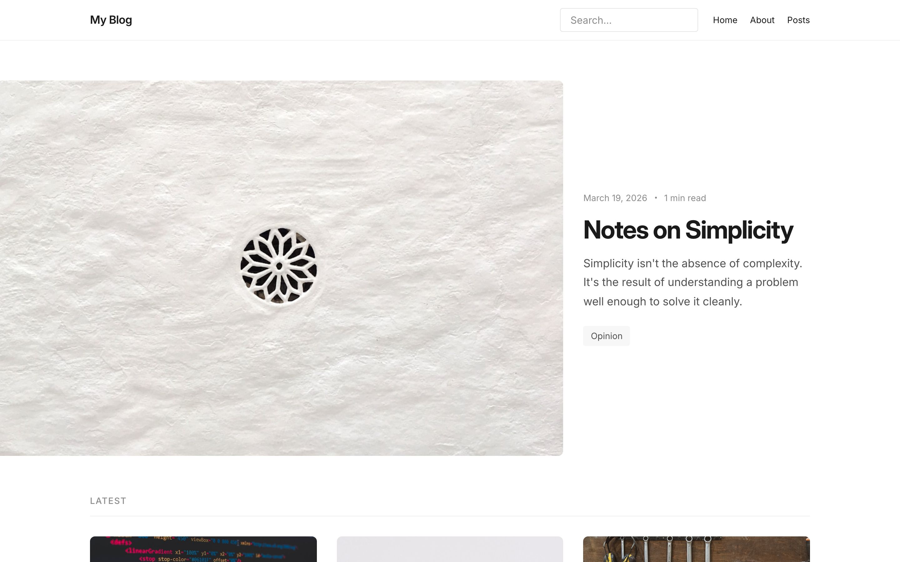
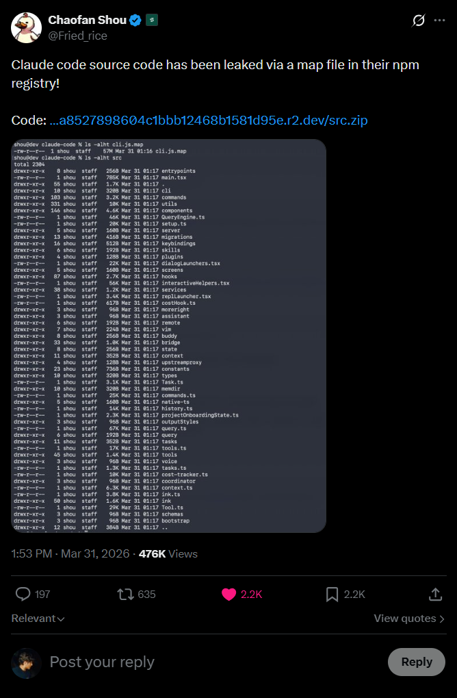

# GitHub Trending 排行榜

🔥 每周自动爬取GitHub最受欢迎的开源项目，生成AI智能总结的中文排行榜

[](https://github.com/qfy123/GitHub-Trending-/actions)
[](https://nodejs.org/)
[](LICENSE)

## ✨ 特性

- 🤖 **AI智能总结** - 使用DeepSeek AI生成简洁的中文项目描述
- 📊 **多维度排名** - 综合Star数、活跃度、新鲜度等指标
- 🖼️ **自动爬取图片** - 从项目README提取代表性图片
- 📈 **趋势分析** - 对比历史数据，显示项目排名变化
- 🗂️ **完整归档** - 按年份/周数归档所有历史数据
- 🔄 **自动更新** - GitHub Actions每周自动执行

## 📈 本周排行榜

<!-- TRENDING-START -->
### GitHub趋势排行榜 - 2026年第15周

**📅 统计周期**: 2026-04-05 ~ 2026-04-11  
**📊 项目总数**: 10 个  
**⭐ 总Star数**: 266,027  
**🔄 更新时间**: 2026-04-11 23:59:59  

| 排名 | 项目 | 描述 | Star | Fork | 语言 | 趋势 |
|------|------|------|------|------|------|------|
| 1 | [claw-code](https://github.com/ultraworkers/claw-code) | 史上最快破10万星的Rust极速代码生成与协作引擎，解锁后引爆社区狂欢。 | 171,445 | 103,926 | Rust | 🆕 |
| 2 | [openclaude](https://github.com/Gitlawb/openclaude) | 一款终端优先的开源编码助手CLI，统一调用200+大模型（OpenAI、Gemini、Ollama等），让开发者用... | 16,659 | 5,844 | TypeScript | 🆕 |
| 3 | [learn-coding-agent](https://github.com/sanbuphy/learn-coding-agent) | 公开资料整理的CLI Agent架构学习库，聚焦Claude Code等热门工具，帮助开发者快速掌握Agent设计... | 11,342 | 19,656 | Unknown | 🆕 |
| 4 | [awesome-design-md](https://github.com/VoltAgent/awesome-design-md) | 收录主流网站DESIGN.md的精选仓库，复制一份即可让AI按同款设计系统快速生成UI，大幅提升原型与开发效率。 | 16,411 | 2,021 | HTML | 🆕 |
| 5 | [claude-code](https://github.com/claude-code-best/claude-code) | Anthropic 官方 Claude Code CLI 的逆向复刻版，完整还原核心功能并修复 TypeScrip... | 13,959 | 14,100 | TypeScript | 🆕 |
| 6 | [emdash](https://github.com/emdash-cms/emdash) | 基于Astro的全栈TypeScript CMS，继承WordPress的插件与主题生态，但以无服务器、类型安全、... | 7,484 | 539 | TypeScript | 🆕 |
| 7 | [claurst](https://github.com/Kuberwastaken/claurst) | 把 Claude Code 泄漏的终端 AI 编程助手用 Rust 重写，速度更快、内存更省，可直接在命令行完成代... | 8,344 | 7,578 | Rust | 🆕 |
| 8 | [claude-code-sourcemap](https://github.com/ChinaSiro/claude-code-sourcemap) | 通过npm包附带的source map逆向还原Claude Code 2.1.88完整TypeScript源码，供... | 8,462 | 14,123 | TypeScript | 🆕 |
| 9 | [claw-code-parity](https://github.com/ultraworkers/claw-code-parity) | 原 claw-code 的 Rust 重写临时仓库，用于迁移期间保持功能一致，2 小时破 5 万星，极速、轻量、跨平台。 | 6,515 | 5,384 | Rust | 🆕 |
| 10 | [OpenHarness](https://github.com/HKUDS/OpenHarness) | OpenHarness提供轻量级开源智能体基础设施，集成工具调用、技能、记忆与多智能体协同，降低AI智能体开发门槛。 | 5,406 | 938 | Python | 🆕 |

### 🔥 详细介绍

#### 1. [claw-code](https://github.com/ultraworkers/claw-code) 


**📝 项目简介**: 史上最快破10万星的Rust极速代码生成与协作引擎，解锁后引爆社区狂欢。

**✨ 核心特性**:
- Rust驱动极致性能
- 一键生成高质量代码
- Discord实时协作生态

**📊 项目统计**:
- **⭐ Star数**: 171,445
- **🔀 Fork数**: 103,926
- **👀 Watch数**: 171,445
- **📝 语言**: Rust
- **💻 技术栈**: Rust, Python, Shell, Dockerfile
- **📈 趋势**: 🆕 新上榜项目

---

#### 2. [openclaude](https://github.com/Gitlawb/openclaude) 


**📝 项目简介**: 一款终端优先的开源编码助手CLI，统一调用200+大模型（OpenAI、Gemini、Ollama等），让开发者用同一命令行完成代码生成、调试与对话。

**✨ 核心特性**:
- 一键切换云/本地200+模型
- 终端内流式交互与MCP工具链
- 内置/provider配置管理，零门槛调用

**📊 项目统计**:
- **⭐ Star数**: 16,659
- **🔀 Fork数**: 5,844
- **👀 Watch数**: 16,659
- **📝 语言**: TypeScript
- **💻 技术栈**: TypeScript, JavaScript, Python, Shell
- **📈 趋势**: 🆕 新上榜项目

---

#### 3. [learn-coding-agent](https://github.com/sanbuphy/learn-coding-agent) 

**📝 项目简介**: 公开资料整理的CLI Agent架构学习库，聚焦Claude Code等热门工具，帮助开发者快速掌握Agent设计思路与落地方法。

**✨ 核心特性**:
- 资料全部来自公开讨论，零门槛学习
- 聚焦明星项目Claude Code，紧跟前沿
- 持续更新架构洞察与实战技巧

**📊 项目统计**:
- **⭐ Star数**: 11,342
- **🔀 Fork数**: 19,656
- **👀 Watch数**: 11,342
- **📝 语言**: Unknown
- **💻 技术栈**: React, Node.js
- **📈 趋势**: 🆕 新上榜项目

---

#### 4. [awesome-design-md](https://github.com/VoltAgent/awesome-design-md) 


**📝 项目简介**: 收录主流网站DESIGN.md的精选仓库，复制一份即可让AI按同款设计系统快速生成UI，大幅提升原型与开发效率。

**✨ 核心特性**:
- 一键复刻大厂设计系统
- AI友好，直接驱动代码生成
- 持续收录热门网站最新规范

**📊 项目统计**:
- **⭐ Star数**: 16,411
- **🔀 Fork数**: 2,021
- **👀 Watch数**: 16,411
- **📝 语言**: HTML
- **💻 技术栈**: HTML, awesome-list, design-md, design-system, design-tokens, figma
- **📈 趋势**: 🆕 新上榜项目

---

#### 5. [claude-code](https://github.com/claude-code-best/claude-code) 

**📝 项目简介**: Anthropic 官方 Claude Code CLI 的逆向复刻版，完整还原核心功能并修复 TypeScript 类型，支持一键安装、企业级监控与调试。

**✨ 核心特性**:
- 官方 CLI 逆向还原，功能一致
- TypeScript 类型全修复，工程化可靠
- bun 一键安装启动，国内网络友好

**📊 项目统计**:
- **⭐ Star数**: 13,959
- **🔀 Fork数**: 14,100
- **👀 Watch数**: 13,959
- **📝 语言**: TypeScript
- **🌐 官网**: [https://ccb.agent-aura.top/](https://ccb.agent-aura.top/)
- **💻 技术栈**: TypeScript, Python, JavaScript, Shell, AWS
- **📈 趋势**: 🆕 新上榜项目

---

#### 6. [emdash](https://github.com/emdash-cms/emdash) 



**📝 项目简介**: 基于Astro的全栈TypeScript CMS，继承WordPress的插件与主题生态，但以无服务器、类型安全、沙箱隔离插件解决传统安全痛点。

**✨ 核心特性**:
- 插件在Worker沙箱运行，杜绝WordPress级安全漏洞
- 全栈TypeScript+无服务器架构，开发体验现代化
- 保留WordPress式主题与钩子系统，零门槛迁移

**📊 项目统计**:
- **⭐ Star数**: 7,484
- **🔀 Fork数**: 539
- **👀 Watch数**: 7,484
- **📝 语言**: TypeScript
- **🌐 官网**: [https://emdashcms.com](https://emdashcms.com)
- **💻 技术栈**: TypeScript, Astro, JavaScript, CSS, Shell, HTML
- **📈 趋势**: 🆕 新上榜项目

---

#### 7. [claurst](https://github.com/Kuberwastaken/claurst) 



**📝 项目简介**: 把 Claude Code 泄漏的终端 AI 编程助手用 Rust 重写，速度更快、内存更省，可直接在命令行完成代码生成与调试。

**✨ 核心特性**:
- Rust 重写，性能翻倍
- 终端即开即用，零配置
- 内置 Claude 泄漏提示词与调试技巧

**📊 项目统计**:
- **⭐ Star数**: 8,344
- **🔀 Fork数**: 7,578
- **👀 Watch数**: 8,344
- **📝 语言**: Rust
- **🌐 官网**: [https://kuber.studio/blog/AI/Claude-Code's-Entire-Source-Code-Got-Leaked-via-a-Sourcemap-in-npm,-Let's-Talk-About-it](https://kuber.studio/blog/AI/Claude-Code's-Entire-Source-Code-Got-Leaked-via-a-Sourcemap-in-npm,-Let's-Talk-About-it)
- **💻 技术栈**: Rust, React, Express, TypeScript, AWS
- **📈 趋势**: 🆕 新上榜项目

---

#### 8. [claude-code-sourcemap](https://github.com/ChinaSiro/claude-code-sourcemap) 

**📝 项目简介**: 通过npm包附带的source map逆向还原Claude Code 2.1.88完整TypeScript源码，供研究者学习其CLI实现思路。

**✨ 核心特性**:
- 非官方逆向工程，保留4756个文件原貌
- 基于公开npm包与source map精准还原
- 社区Fork活跃，已超1.4万次，研究价值高

**📊 项目统计**:
- **⭐ Star数**: 8,462
- **🔀 Fork数**: 14,123
- **👀 Watch数**: 8,462
- **📝 语言**: TypeScript
- **🌐 官网**: [https://linux.do/u/huo0](https://linux.do/u/huo0)
- **💻 技术栈**: TypeScript, JavaScript, React
- **📈 趋势**: 🆕 新上榜项目

---

#### 9. [claw-code-parity](https://github.com/ultraworkers/claw-code-parity) 


**📝 项目简介**: 原 claw-code 的 Rust 重写临时仓库，用于迁移期间保持功能一致，2 小时破 5 万星，极速、轻量、跨平台。

**✨ 核心特性**:
- 2 小时 50k Star 创纪录
- Rust 重写性能翻倍
- 零依赖一键运行

**📊 项目统计**:
- **⭐ Star数**: 6,515
- **🔀 Fork数**: 5,384
- **👀 Watch数**: 6,515
- **📝 语言**: Rust
- **💻 技术栈**: Rust, Python, Shell, TypeScript, AWS
- **📈 趋势**: 🆕 新上榜项目

---

#### 10. [OpenHarness](https://github.com/HKUDS/OpenHarness) 


**📝 项目简介**: OpenHarness提供轻量级开源智能体基础设施，集成工具调用、技能、记忆与多智能体协同，降低AI智能体开发门槛。

**✨ 核心特性**:
- 工具调用与技能即插即用
- 统一记忆管理
- 原生多智能体协作

**📊 项目统计**:
- **⭐ Star数**: 5,406
- **🔀 Fork数**: 938
- **👀 Watch数**: 5,406
- **📝 语言**: Python
- **💻 技术栈**: Python, TypeScript, Shell, React, Node.js, Azure
- **📈 趋势**: 🆕 新上榜项目

---

### 📈 本周统计

**🔥 热门语言**:
1. **TypeScript** (4 个项目)
2. **Rust** (3 个项目)
3. **Unknown** (1 个项目)
4. **HTML** (1 个项目)
5. **Python** (1 个项目)

**🏷️ 热门话题**:
1. awesome-list (1)
2. design-md (1)
3. design-system (1)
4. design-tokens (1)
5. figma (1)
6. google-stitch (1)
7. landing-page (1)
8. astro (1)


<!-- TRENDING-END -->

## 📚 历史数据

<!-- HISTORY-START -->
| 时间 | 周期 | 项目数 | 链接 |
|------|------|--------|------|
| 04-11 | 2026年第15周 | 10 个 | [查看详情](./archives/2026/week-15/report.md) |
| 04-04 | 2026年第14周 | 10 个 | [查看详情](./archives/2026/week-14/report.md) |
| 03-28 | 2026年第13周 | 10 个 | [查看详情](./archives/2026/week-13/report.md) |
| 03-21 | 2026年第12周 | 10 个 | [查看详情](./archives/2026/week-12/report.md) |
| 03-14 | 2026年第11周 | 10 个 | [查看详情](./archives/2026/week-11/report.md) |
| 03-07 | 2026年第10周 | 10 个 | [查看详情](./archives/2026/week-10/report.md) |
| 02-28 | 2026年第9周 | 10 个 | [查看详情](./archives/2026/week-9/report.md) |
| 02-21 | 2026年第8周 | 10 个 | [查看详情](./archives/2026/week-8/report.md) |
| 02-14 | 2026年第7周 | 10 个 | [查看详情](./archives/2026/week-7/report.md) |
| 02-07 | 2026年第6周 | 10 个 | [查看详情](./archives/2026/week-6/report.md) |
| 01-31 | 2026年第5周 | 10 个 | [查看详情](./archives/2026/week-5/report.md) |
| 01-24 | 2026年第4周 | 10 个 | [查看详情](./archives/2026/week-4/report.md) |
| 01-17 | 2026年第3周 | 10 个 | [查看详情](./archives/2026/week-3/report.md) |
| 01-10 | 2026年第2周 | 10 个 | [查看详情](./archives/2026/week-2/report.md) |
| 12-27 | 2025年第52周 | 10 个 | [查看详情](./archives/2025/week-52/report.md) |
| 12-20 | 2025年第51周 | 10 个 | [查看详情](./archives/2025/week-51/report.md) |
| 12-13 | 2025年第50周 | 10 个 | [查看详情](./archives/2025/week-50/report.md) |
| 12-06 | 2025年第49周 | 10 个 | [查看详情](./archives/2025/week-49/report.md) |
| 11-29 | 2025年第48周 | 10 个 | [查看详情](./archives/2025/week-48/report.md) |
| 11-22 | 2025年第47周 | 10 个 | [查看详情](./archives/2025/week-47/report.md) |

[查看完整历史数据](./archives/)
<!-- HISTORY-END -->

## 🚀 快速开始

### 1. 克隆项目

```bash
git clone https://github.com/your-username/GitHub-Trending.git
cd GitHub-Trending
```

### 2. 安装依赖

```bash
npm install
```

### 3. 配置环境变量

```bash
# 复制环境变量模板
cp .env.example .env

# 编辑 .env 文件，填入以下必需配置：
# GITHUB_TOKEN=your_github_token
# SILICONFLOW_API_KEY=your_siliconflow_api_key
```

### 4. 测试配置

```bash
# 系统测试
node test/system-test.js

# 配置检查
node scripts/update-trending.js --check
```

### 5. 运行项目

```bash
# 测试运行（少量数据）
node scripts/update-trending.js --limit 3

# 正式运行
node scripts/update-trending.js
```

## 🔧 配置说明

### 环境变量

| 变量名 | 必需 | 说明 | 获取方式 |
|--------|------|------|----------|
| `GITHUB_TOKEN` | ✅ | GitHub API访问令牌 | [GitHub设置](https://github.com/settings/tokens) |
| `SILICONFLOW_API_KEY` | ✅ | 硅基流动API密钥 | [硅基流动官网](https://siliconflow.cn) |
| `AI_BASE_URL` | ❌ | AI服务地址 | 默认硅基流动 |
| `AI_MODEL` | ❌ | AI模型名称 | 默认deepseek-chat |

详细配置请参考：[配置指南](config/README.md)

### GitHub Actions自动化

1. **Fork本项目**到你的GitHub账号
2. **设置Secrets**：
   - `SILICONFLOW_API_KEY`: 硅基流动API密钥
3. **启用Actions**：项目会自动每周一更新

详细设置请参考：[GitHub Actions配置](-.github/README.md)

## 📊 项目结构

```
GitHub-Trending/
├── src/                          # 核心源码
│   ├── github-api.js            # GitHub API调用
│   ├── ai-summarizer.js         # AI项目总结
│   ├── image-crawler.js         # 图片爬取
│   ├── data-processor.js        # 数据处理
│   ├── file-manager.js          # 文件管理
│   └── readme-updater.js        # README更新
├── scripts/                      # 执行脚本
│   └── update-trending.js       # 主执行脚本
├── test/                         # 测试文件
│   └── system-test.js           # 系统测试
├── archives/                     # 历史数据归档
│   └── YYYY/                    # 按年份归档
│       └── week-XX.md           # 周报文件
├── images/                       # 项目图片
│   └── YYYY/week-XX/            # 按周归档
├── data/                         # 临时数据
├── config/                       # 配置文档
├── .github/                      # GitHub Actions
│   └── workflows/
└── README.md                     # 项目说明
```

## 🎯 使用场景

### 开发者
- 🔍 **发现新项目** - 了解最新热门开源项目
- 📈 **技术趋势** - 跟踪编程语言和技术栈趋势
- 💡 **学习参考** - 学习优秀项目的设计和实现

### 技术团队
- 📊 **技术选型** - 参考热门项目进行技术选型
- 🎯 **竞品分析** - 关注同类项目的发展趋势
- 📝 **技术报告** - 生成定期的技术趋势报告

### 内容创作者
- ✍️ **素材收集** - 为技术文章和视频收集素材
- 📰 **新闻线索** - 发现值得报道的新兴项目
- 🗣️ **分享内容** - 分享有价值的开源项目

## 🛠️ 命令行工具

```bash
# 查看帮助
node scripts/update-trending.js --help

# 检查配置
node scripts/update-trending.js --check

# 自定义参数运行
node scripts/update-trending.js --limit 20 --language python

# 数据管理
node scripts/update-trending.js --backup     # 创建备份
node scripts/update-trending.js --cleanup    # 清理过期数据
node scripts/update-trending.js --stats      # 查看统计信息

# 系统测试
node test/system-test.js                      # 完整测试
node test/system-test.js --quick             # 快速诊断
```

## 📈 排名算法

项目排名基于以下三个维度的综合评分：

### 🌟 受欢迎程度 (50%)
- **Star数量** (60%): 项目获得的Star数
- **Fork数量** (25%): 项目被Fork的次数  
- **Watch数量** (15%): 项目被Watch的次数

### 🔥 活跃程度 (30%)
- **最近提交** (50%): 距离最后一次提交的时间
- **Issues活跃度** (30%): 开放的Issues数量
- **Fork活跃度** (20%): Fork的活跃程度

### 🆕 新鲜程度 (20%)
- **创建时间** (30%): 项目创建时间（新项目得分高）
- **更新时间** (70%): 最近更新时间

### 趋势分析
- 📈 **上升**: 排名比上周提升
- 📉 **下降**: 排名比上周下降  
- ➡️ **稳定**: 排名无明显变化
- 🆕 **新上榜**: 首次进入排行榜

## 🤝 贡献指南

欢迎提交 Issues 和 Pull Requests！

### 开发环境设置

```bash
# 1. Fork 并克隆项目
git clone https://github.com/your-username/GitHub-Trending.git

# 2. 创建功能分支
git checkout -b feature/your-feature

# 3. 安装依赖并测试
npm install
node test/system-test.js

# 4. 开发完成后提交
git commit -m "feat: 添加新功能"
git push origin feature/your-feature
```

### 提交规范

- `feat`: 新功能
- `fix`: 修复bug
- `docs`: 文档更新
- `style`: 代码格式调整
- `refactor`: 代码重构
- `test`: 测试相关
- `chore`: 构建/工具相关

## 📄 许可证

本项目基于 [MIT 许可证](LICENSE) 开源。

## 🙏 致谢

- [GitHub API](https://docs.github.com/en/rest) - 提供项目数据
- [硅基流动](https://siliconflow.cn) - 提供AI总结服务
- [DeepSeek](https://deepseek.com) - 优秀的AI模型
- [GitHub Actions](https://github.com/features/actions) - 自动化支持

## 📞 联系方式

- 🐛 **Bug报告**: [提交Issue](https://github.com/your-username/GitHub-Trending/issues)
- 💡 **功能建议**: [功能请求](https://github.com/your-username/GitHub-Trending/issues)
- 📧 **其他问题**: [发送邮件](mailto:your-email@example.com)

## 🔗 相关链接

- [项目文档](https://github.com/your-username/GitHub-Trending/wiki)
- [更新日志](CHANGELOG.md)
- [FAQ](FAQ.md)

---

⭐ 如果这个项目对你有帮助，请给它一个Star！

*本项目由 [GitHub Actions](https://github.com/features/actions) 自动维护，数据每周更新*