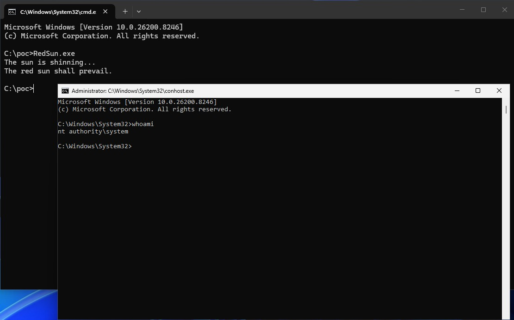

# GitHub Trending 排行榜

🔥 每周自动爬取GitHub最受欢迎的开源项目，生成AI智能总结的中文排行榜

[](https://github.com/qfy123/GitHub-Trending-/actions)
[](https://nodejs.org/)
[](LICENSE)

## ✨ 特性

- 🤖 **AI智能总结** - 使用DeepSeek AI生成简洁的中文项目描述
- 📊 **多维度排名** - 综合Star数、活跃度、新鲜度等指标
- 🖼️ **自动爬取图片** - 从项目README提取代表性图片
- 📈 **趋势分析** - 对比历史数据，显示项目排名变化
- 🗂️ **完整归档** - 按年份/周数归档所有历史数据
- 🔄 **自动更新** - GitHub Actions每周自动执行

## 📈 本周排行榜

<!-- TRENDING-START -->
### GitHub趋势排行榜 - 2026年第17周

**📅 统计周期**: 2026-04-19 ~ 2026-04-25  
**📊 项目总数**: 10 个  
**⭐ 总Star数**: 16,144  
**🔄 更新时间**: 2026-04-25 23:59:59  

| 排名 | 项目 | 描述 | Star | Fork | 语言 | 趋势 |
|------|------|------|------|------|------|------|
| 1 | [browser-harness](https://github.com/browser-use/browser-harness) | 基于CDP的极简自愈浏览器框架，让LLM在运行中动态补全缺失代码，零依赖完成任意网页任务。 | 2,552 | 204 | Python | 🆕 |
| 2 | [lingbot-map](https://github.com/Robbyant/lingbot-map) | LingBot-Map用几何上下文Transformer把实时视频流直接变成可扩展的3D场景，无需逐帧优化，重建又... | 2,716 | 211 | Python | 🆕 |
| 3 | [OpenMythos](https://github.com/kyegomez/OpenMythos) | 一个使用Python开发的开源项目：A theoretical reconstruction of the Cla... | 1,865 | 342 | Python | 🆕 |
| 4 | [RedSun](https://github.com/Nightmare-Eclipse/RedSun) | 一个使用C++开发的开源项目：The Red Sun vulnerability repository，已获得1,... | 1,582 | 345 | C++ | 🆕 |
| 5 | [wterm](https://github.com/vercel-labs/wterm) | 一个使用TypeScript开发的开源项目：A terminal emulator for the web，已获得... | 2,120 | 80 | TypeScript | 🆕 |
| 6 | [html-ppt-skill](https://github.com/lewislulu/html-ppt-skill) | 零依赖、一键生成专业级HTML演示文稿，内置36主题、31版式、47动效与演讲者模式，无需构建即可部署。 | 1,497 | 168 | HTML | 🆕 |
| 7 | [design-extract](https://github.com/Manavarya09/design-extract) | 一条命令即可抓取任意网站的完整设计系统，自动生成设计令牌、多平台代码、无障碍修复方案并支持主流AI编辑器。 | 1,096 | 86 | JavaScript | 🆕 |
| 8 | [weft](https://github.com/WeaveMindAI/weft) | 一个使用Rust开发的开源项目：A programming language for AI systems，已获得... | 888 | 116 | Rust | 🆕 |
| 9 | [UZI-Skill](https://github.com/wbh604/UZI-Skill) | 聚合51位顶级游资策略，180条量化规则+22维数据，一键生成A/H/美股个股深度诊断报告，让散户也能用机构视角选股。 | 849 | 147 | Python | 🆕 |
| 10 | [BuilderPulse](https://github.com/BuilderPulse/BuilderPulse) | 每日为独立开发者推送1个AI筛选的高潜力创业点子，附紧迫理由与300+公开信号来源，降低选题试错成本。 | 979 | 71 | Unknown | 🆕 |

### 🔥 详细介绍

#### 1. [browser-harness](https://github.com/browser-use/browser-harness) 


**📝 项目简介**: 基于CDP的极简自愈浏览器框架，让LLM在运行中动态补全缺失代码，零依赖完成任意网页任务。

**✨ 核心特性**:
- 运行中自愈补代码，无需预设脚本
- 直连Chrome WebSocket，无中间层
- 无框架、无配方，LLM自由操作

**📊 项目统计**:
- **⭐ Star数**: 2,552
- **🔀 Fork数**: 204
- **👀 Watch数**: 2,552
- **📝 语言**: Python
- **🌐 官网**: [https://cloud.browser-use.com](https://cloud.browser-use.com)
- **💻 技术栈**: Python, Redis
- **📈 趋势**: 🆕 新上榜项目

---

#### 2. [lingbot-map](https://github.com/Robbyant/lingbot-map) 


**📝 项目简介**: LingBot-Map用几何上下文Transformer把实时视频流直接变成可扩展的3D场景，无需逐帧优化，重建又快又稳。

**✨ 核心特性**:
- 前馈式基础模型，毫秒级推理
- 统一几何上下文Transformer，精度高
- 支持流式输入，边采边重建

**📊 项目统计**:
- **⭐ Star数**: 2,716
- **🔀 Fork数**: 211
- **👀 Watch数**: 2,716
- **📝 语言**: Python
- **💻 技术栈**: Python
- **📈 趋势**: 🆕 新上榜项目

---

#### 3. [OpenMythos](https://github.com/kyegomez/OpenMythos) 

**📝 项目简介**: 一个使用Python开发的开源项目：A theoretical reconstruction of the Claude Mythos architecture, built from first principles using the available research literature.，已获得1,865个star。

**✨ 核心特性**:
- 1,865 stars
- Python

**📊 项目统计**:
- **⭐ Star数**: 1,865
- **🔀 Fork数**: 342
- **👀 Watch数**: 1,865
- **📝 语言**: Python
- **🌐 官网**: [https://discord.gg/EamjgSaEQf](https://discord.gg/EamjgSaEQf)
- **💻 技术栈**: Python, ai, anthropic, attention, claude, claude-ai
- **📈 趋势**: 🆕 新上榜项目

---

#### 4. [RedSun](https://github.com/Nightmare-Eclipse/RedSun) 



**📝 项目简介**: 一个使用C++开发的开源项目：The Red Sun vulnerability repository，已获得1,582个star。

**✨ 核心特性**:
- 1,582 stars
- C++

**📊 项目统计**:
- **⭐ Star数**: 1,582
- **🔀 Fork数**: 345
- **👀 Watch数**: 1,582
- **📝 语言**: C++
- **💻 技术栈**: C++
- **📈 趋势**: 🆕 新上榜项目

---

#### 5. [wterm](https://github.com/vercel-labs/wterm) 

**📝 项目简介**: 一个使用TypeScript开发的开源项目：A terminal emulator for the web，已获得2,120个star。

**✨ 核心特性**:
- 2,120 stars
- TypeScript

**📊 项目统计**:
- **⭐ Star数**: 2,120
- **🔀 Fork数**: 80
- **👀 Watch数**: 2,120
- **📝 语言**: TypeScript
- **🌐 官网**: [https://wterm.dev](https://wterm.dev)
- **💻 技术栈**: TypeScript, Zig, MDX, CSS, HTML, JavaScript
- **📈 趋势**: 🆕 新上榜项目

---

#### 6. [html-ppt-skill](https://github.com/lewislulu/html-ppt-skill) 


**📝 项目简介**: 零依赖、一键生成专业级HTML演示文稿，内置36主题、31版式、47动效与演讲者模式，无需构建即可部署。

**✨ 核心特性**:
- 36套主题+15套整站模板开箱即用
- 真·演讲者模式：预览、提词、计时三合一
- 纯静态HTML/CSS/JS，无构建步骤，一键复制即可分享

**📊 项目统计**:
- **⭐ Star数**: 1,497
- **🔀 Fork数**: 168
- **👀 Watch数**: 1,497
- **📝 语言**: HTML
- **💻 技术栈**: HTML, CSS, JavaScript, Shell, React
- **📈 趋势**: 🆕 新上榜项目

---

#### 7. [design-extract](https://github.com/Manavarya09/design-extract) 


**📝 项目简介**: 一条命令即可抓取任意网站的完整设计系统，自动生成设计令牌、多平台代码、无障碍修复方案并支持主流AI编辑器。

**✨ 核心特性**:
- 一键输出DTCG设计令牌与Tailwind v4配置
- 内置MCP服务器，直接驱动Claude Code/Cursor/Windsurf
- 支持iOS、Android、Flutter、WordPress多平台代码导出

**📊 项目统计**:
- **⭐ Star数**: 1,096
- **🔀 Fork数**: 86
- **👀 Watch数**: 1,096
- **📝 语言**: JavaScript
- **🌐 官网**: [https://designlang.manavaryasingh.com](https://designlang.manavaryasingh.com)
- **💻 技术栈**: JavaScript, CSS, HTML, TypeScript, Dockerfile, accessibility
- **📈 趋势**: 🆕 新上榜项目

---

#### 8. [weft](https://github.com/WeaveMindAI/weft) 

**📝 项目简介**: 一个使用Rust开发的开源项目：A programming language for AI systems，已获得888个star。

**✨ 核心特性**:
- 888 stars
- Rust

**📊 项目统计**:
- **⭐ Star数**: 888
- **🔀 Fork数**: 116
- **👀 Watch数**: 888
- **📝 语言**: Rust
- **💻 技术栈**: Rust, TypeScript, Svelte, Shell, JavaScript, CSS
- **📈 趋势**: 🆕 新上榜项目

---

#### 9. [UZI-Skill](https://github.com/wbh604/UZI-Skill) 


**📝 项目简介**: 聚合51位顶级游资策略，180条量化规则+22维数据，一键生成A/H/美股个股深度诊断报告，让散户也能用机构视角选股。

**✨ 核心特性**:
- 51位大佬策略同台回测
- 22维数据×180规则实时打分
- 支持A股/港股/美股一键分析

**📊 项目统计**:
- **⭐ Star数**: 849
- **🔀 Fork数**: 147
- **👀 Watch数**: 849
- **📝 语言**: Python
- **💻 技术栈**: Python, HTML, Shell, Batchfile
- **📈 趋势**: 🆕 新上榜项目

---

#### 10. [BuilderPulse](https://github.com/BuilderPulse/BuilderPulse) 

**📝 项目简介**: 每日为独立开发者推送1个AI筛选的高潜力创业点子，附紧迫理由与300+公开信号来源，降低选题试错成本。

**✨ 核心特性**:
- AI实时扫描300+公开信号
- 每天只精选1个可立即落地的Build Idea
- 结合热点事件给出“为什么现在做”

**📊 项目统计**:
- **⭐ Star数**: 979
- **🔀 Fork数**: 71
- **👀 Watch数**: 979
- **📝 语言**: Unknown
- **🌐 官网**: [https://builderpulse.ai](https://builderpulse.ai)
- **💻 技术栈**: ai, builders, indiehackers
- **📈 趋势**: 🆕 新上榜项目

---

### 📈 本周统计

**🔥 热门语言**:
1. **Python** (4 个项目)
2. **C++** (1 个项目)
3. **TypeScript** (1 个项目)
4. **HTML** (1 个项目)
5. **JavaScript** (1 个项目)

**🏷️ 热门话题**:
1. ai (3)
2. claude-code-plugin (2)
3. anthropic (1)
4. attention (1)
5. claude (1)
6. claude-ai (1)
7. claude-code (1)
8. claude-mythos (1)


<!-- TRENDING-END -->

## 📚 历史数据

<!-- HISTORY-START -->
| 时间 | 周期 | 项目数 | 链接 |
|------|------|--------|------|
| 04-25 | 2026年第17周 | 10 个 | [查看详情](./archives/2026/week-17/report.md) |
| 04-18 | 2026年第16周 | 10 个 | [查看详情](./archives/2026/week-16/report.md) |
| 04-11 | 2026年第15周 | 10 个 | [查看详情](./archives/2026/week-15/report.md) |
| 04-04 | 2026年第14周 | 10 个 | [查看详情](./archives/2026/week-14/report.md) |
| 03-28 | 2026年第13周 | 10 个 | [查看详情](./archives/2026/week-13/report.md) |
| 03-21 | 2026年第12周 | 10 个 | [查看详情](./archives/2026/week-12/report.md) |
| 03-14 | 2026年第11周 | 10 个 | [查看详情](./archives/2026/week-11/report.md) |
| 03-07 | 2026年第10周 | 10 个 | [查看详情](./archives/2026/week-10/report.md) |
| 02-28 | 2026年第9周 | 10 个 | [查看详情](./archives/2026/week-9/report.md) |
| 02-21 | 2026年第8周 | 10 个 | [查看详情](./archives/2026/week-8/report.md) |
| 02-14 | 2026年第7周 | 10 个 | [查看详情](./archives/2026/week-7/report.md) |
| 02-07 | 2026年第6周 | 10 个 | [查看详情](./archives/2026/week-6/report.md) |
| 01-31 | 2026年第5周 | 10 个 | [查看详情](./archives/2026/week-5/report.md) |
| 01-24 | 2026年第4周 | 10 个 | [查看详情](./archives/2026/week-4/report.md) |
| 01-17 | 2026年第3周 | 10 个 | [查看详情](./archives/2026/week-3/report.md) |
| 01-10 | 2026年第2周 | 10 个 | [查看详情](./archives/2026/week-2/report.md) |
| 12-27 | 2025年第52周 | 10 个 | [查看详情](./archives/2025/week-52/report.md) |
| 12-20 | 2025年第51周 | 10 个 | [查看详情](./archives/2025/week-51/report.md) |
| 12-13 | 2025年第50周 | 10 个 | [查看详情](./archives/2025/week-50/report.md) |
| 12-06 | 2025年第49周 | 10 个 | [查看详情](./archives/2025/week-49/report.md) |

[查看完整历史数据](./archives/)
<!-- HISTORY-END -->

## 🚀 快速开始

### 1. 克隆项目

```bash
git clone https://github.com/your-username/GitHub-Trending.git
cd GitHub-Trending
```

### 2. 安装依赖

```bash
npm install
```

### 3. 配置环境变量

```bash
# 复制环境变量模板
cp .env.example .env

# 编辑 .env 文件，填入以下必需配置：
# GITHUB_TOKEN=your_github_token
# SILICONFLOW_API_KEY=your_siliconflow_api_key
```

### 4. 测试配置

```bash
# 系统测试
node test/system-test.js

# 配置检查
node scripts/update-trending.js --check
```

### 5. 运行项目

```bash
# 测试运行（少量数据）
node scripts/update-trending.js --limit 3

# 正式运行
node scripts/update-trending.js
```

## 🔧 配置说明

### 环境变量

| 变量名 | 必需 | 说明 | 获取方式 |
|--------|------|------|----------|
| `GITHUB_TOKEN` | ✅ | GitHub API访问令牌 | [GitHub设置](https://github.com/settings/tokens) |
| `SILICONFLOW_API_KEY` | ✅ | 硅基流动API密钥 | [硅基流动官网](https://siliconflow.cn) |
| `AI_BASE_URL` | ❌ | AI服务地址 | 默认硅基流动 |
| `AI_MODEL` | ❌ | AI模型名称 | 默认deepseek-chat |

详细配置请参考：[配置指南](config/README.md)

### GitHub Actions自动化

1. **Fork本项目**到你的GitHub账号
2. **设置Secrets**：
   - `SILICONFLOW_API_KEY`: 硅基流动API密钥
3. **启用Actions**：项目会自动每周一更新

详细设置请参考：[GitHub Actions配置](-.github/README.md)

## 📊 项目结构

```
GitHub-Trending/
├── src/                          # 核心源码
│   ├── github-api.js            # GitHub API调用
│   ├── ai-summarizer.js         # AI项目总结
│   ├── image-crawler.js         # 图片爬取
│   ├── data-processor.js        # 数据处理
│   ├── file-manager.js          # 文件管理
│   └── readme-updater.js        # README更新
├── scripts/                      # 执行脚本
│   └── update-trending.js       # 主执行脚本
├── test/                         # 测试文件
│   └── system-test.js           # 系统测试
├── archives/                     # 历史数据归档
│   └── YYYY/                    # 按年份归档
│       └── week-XX.md           # 周报文件
├── images/                       # 项目图片
│   └── YYYY/week-XX/            # 按周归档
├── data/                         # 临时数据
├── config/                       # 配置文档
├── .github/                      # GitHub Actions
│   └── workflows/
└── README.md                     # 项目说明
```

## 🎯 使用场景

### 开发者
- 🔍 **发现新项目** - 了解最新热门开源项目
- 📈 **技术趋势** - 跟踪编程语言和技术栈趋势
- 💡 **学习参考** - 学习优秀项目的设计和实现

### 技术团队
- 📊 **技术选型** - 参考热门项目进行技术选型
- 🎯 **竞品分析** - 关注同类项目的发展趋势
- 📝 **技术报告** - 生成定期的技术趋势报告

### 内容创作者
- ✍️ **素材收集** - 为技术文章和视频收集素材
- 📰 **新闻线索** - 发现值得报道的新兴项目
- 🗣️ **分享内容** - 分享有价值的开源项目

## 🛠️ 命令行工具

```bash
# 查看帮助
node scripts/update-trending.js --help

# 检查配置
node scripts/update-trending.js --check

# 自定义参数运行
node scripts/update-trending.js --limit 20 --language python

# 数据管理
node scripts/update-trending.js --backup     # 创建备份
node scripts/update-trending.js --cleanup    # 清理过期数据
node scripts/update-trending.js --stats      # 查看统计信息

# 系统测试
node test/system-test.js                      # 完整测试
node test/system-test.js --quick             # 快速诊断
```

## 📈 排名算法

项目排名基于以下三个维度的综合评分：

### 🌟 受欢迎程度 (50%)
- **Star数量** (60%): 项目获得的Star数
- **Fork数量** (25%): 项目被Fork的次数  
- **Watch数量** (15%): 项目被Watch的次数

### 🔥 活跃程度 (30%)
- **最近提交** (50%): 距离最后一次提交的时间
- **Issues活跃度** (30%): 开放的Issues数量
- **Fork活跃度** (20%): Fork的活跃程度

### 🆕 新鲜程度 (20%)
- **创建时间** (30%): 项目创建时间（新项目得分高）
- **更新时间** (70%): 最近更新时间

### 趋势分析
- 📈 **上升**: 排名比上周提升
- 📉 **下降**: 排名比上周下降  
- ➡️ **稳定**: 排名无明显变化
- 🆕 **新上榜**: 首次进入排行榜

## 🤝 贡献指南

欢迎提交 Issues 和 Pull Requests！

### 开发环境设置

```bash
# 1. Fork 并克隆项目
git clone https://github.com/your-username/GitHub-Trending.git

# 2. 创建功能分支
git checkout -b feature/your-feature

# 3. 安装依赖并测试
npm install
node test/system-test.js

# 4. 开发完成后提交
git commit -m "feat: 添加新功能"
git push origin feature/your-feature
```

### 提交规范

- `feat`: 新功能
- `fix`: 修复bug
- `docs`: 文档更新
- `style`: 代码格式调整
- `refactor`: 代码重构
- `test`: 测试相关
- `chore`: 构建/工具相关

## 📄 许可证

本项目基于 [MIT 许可证](LICENSE) 开源。

## 🙏 致谢

- [GitHub API](https://docs.github.com/en/rest) - 提供项目数据
- [硅基流动](https://siliconflow.cn) - 提供AI总结服务
- [DeepSeek](https://deepseek.com) - 优秀的AI模型
- [GitHub Actions](https://github.com/features/actions) - 自动化支持

## 📞 联系方式

- 🐛 **Bug报告**: [提交Issue](https://github.com/your-username/GitHub-Trending/issues)
- 💡 **功能建议**: [功能请求](https://github.com/your-username/GitHub-Trending/issues)
- 📧 **其他问题**: [发送邮件](mailto:your-email@example.com)

## 🔗 相关链接

- [项目文档](https://github.com/your-username/GitHub-Trending/wiki)
- [更新日志](CHANGELOG.md)
- [FAQ](FAQ.md)

---

⭐ 如果这个项目对你有帮助，请给它一个Star！

*本项目由 [GitHub Actions](https://github.com/features/actions) 自动维护，数据每周更新*