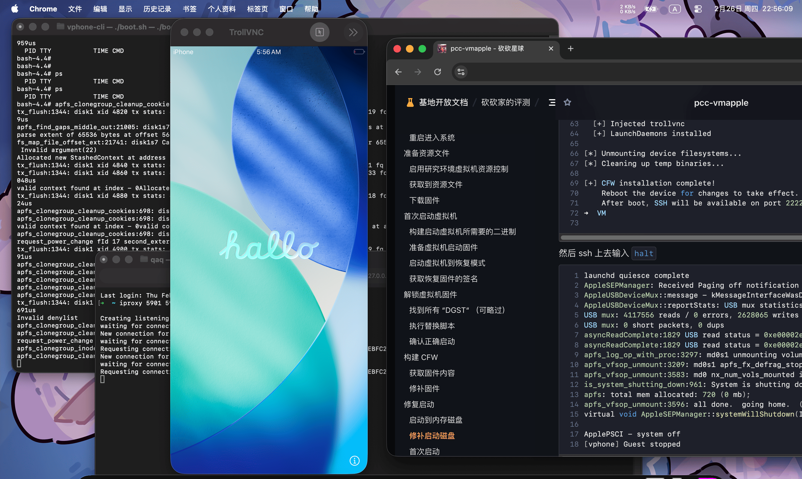

# GitHub Trending 排行榜

🔥 每周自动爬取GitHub最受欢迎的开源项目，生成AI智能总结的中文排行榜

[](https://github.com/qfy123/GitHub-Trending-/actions)
[](https://nodejs.org/)
[](LICENSE)

## ✨ 特性

- 🤖 **AI智能总结** - 使用DeepSeek AI生成简洁的中文项目描述
- 📊 **多维度排名** - 综合Star数、活跃度、新鲜度等指标
- 🖼️ **自动爬取图片** - 从项目README提取代表性图片
- 📈 **趋势分析** - 对比历史数据，显示项目排名变化
- 🗂️ **完整归档** - 按年份/周数归档所有历史数据
- 🔄 **自动更新** - GitHub Actions每周自动执行

## 📈 本周排行榜

<!-- TRENDING-START -->
### GitHub趋势排行榜 - 2026年第10周

**📅 统计周期**: 2026-03-01 ~ 2026-03-07  
**📊 项目总数**: 10 个  
**⭐ 总Star数**: 28,165  
**🔄 更新时间**: 2026-03-07 23:59:59  

| 排名 | 项目 | 描述 | Star | Fork | 语言 | 趋势 |
|------|------|------|------|------|------|------|
| 1 | [openfang](https://github.com/RightNow-AI/openfang) | Rust编写的开源“代理操作系统”，把LLM、工具链与运行时打包成单文件二进制，让AI代理即装即用、稳定可扩展。 | 7,922 | 830 | Rust | 🆕 |
| 2 | [CoPaw](https://github.com/agentscope-ai/CoPaw) | 一键私有化部署的个人AI助手，可对接多平台聊天应用，支持插件式扩展，数据与模型完全自主掌控。 | 3,777 | 375 | Python | 🆕 |
| 3 | [vinext](https://github.com/cloudflare/vinext) | 基于Vite重写的Next.js API插件，让开发者无需锁定Vercel即可把Next.js应用部署到任意平台，... | 4,973 | 154 | TypeScript | 🆕 |
| 4 | [wechat-decrypt](https://github.com/ylytdeng/wechat-decrypt) | 无需密码，直接从运行中的微信4.0进程提取密钥，一键解密本地加密数据库并实时监听消息。 | 1,019 | 874 | Python | 🆕 |
| 5 | [Agent-Reach](https://github.com/Panniantong/Agent-Reach) | 零API费用，一条命令让AI Agent实时“看见”Twitter、Reddit、B站、小红书等全站内容并搜索。 | 3,537 | 284 | Python | 🆕 |
| 6 | [vphone-cli](https://github.com/Lakr233/vphone-cli) | 一条命令在macOS上启动iOS 26虚拟iPhone，利用苹果私有虚拟化框架，无需真机即可调试与测试。 | 1,773 | 285 | Python | 🆕 |
| 7 | [polymarket-cli](https://github.com/Polymarket/polymarket-cli) | Rust编写的Polymarket终端工具，可浏览预测市场、下单、管理仓位并直接链上交互，支持脚本调用。 | 1,415 | 132 | Rust | 🆕 |
| 8 | [dataclaw](https://github.com/peteromallet/dataclaw) | 一键把Claude Code等AI对话记录转成结构化数据并发布到Hugging Face，反击大厂数据封闭，共享高... | 1,714 | 211 | Python | 🆕 |
| 9 | [contextplus](https://github.com/ForLoopCodes/contextplus) | Context+通过Tree-sitter、谱聚类与Obsidian式链接，把超大型代码库秒变可搜索的分层特性图谱... | 1,092 | 67 | TypeScript | 🆕 |
| 10 | [skills-best-practices](https://github.com/mgechev/skills-best-practices) | 提供编写专业级AI Agent技能的规范指南，支持LLM验证并优化上下文窗口，帮助开发者构建高质量智能体能力。 | 943 | 58 | Unknown | 🆕 |

### 🔥 详细介绍

#### 1. [openfang](https://github.com/RightNow-AI/openfang) 


**📝 项目简介**: Rust编写的开源“代理操作系统”，把LLM、工具链与运行时打包成单文件二进制，让AI代理即装即用、稳定可扩展。

**✨ 核心特性**:
- 单文件部署，零依赖运行
- 14个Rust crate、1.7K+测试，零Clippy警告
- 内置MCP协议，代理可插拔、热升级

**📊 项目统计**:
- **⭐ Star数**: 7,922
- **🔀 Fork数**: 830
- **👀 Watch数**: 7,922
- **📝 语言**: Rust
- **🌐 官网**: [https://www.openfang.sh/](https://www.openfang.sh/)
- **💻 技术栈**: Rust, HTML, JavaScript, CSS, Python, PowerShell
- **📈 趋势**: 🆕 新上榜项目

---

#### 2. [CoPaw](https://github.com/agentscope-ai/CoPaw) 


**📝 项目简介**: 一键私有化部署的个人AI助手，可对接多平台聊天应用，支持插件式扩展，数据与模型完全自主掌控。

**✨ 核心特性**:
- 本地/云端一键部署
- 多聊天平台无缝接入
- 插件化能力轻松扩展

**📊 项目统计**:
- **⭐ Star数**: 3,777
- **🔀 Fork数**: 375
- **👀 Watch数**: 3,777
- **📝 语言**: Python
- **🌐 官网**: [http://copaw.agentscope.io/](http://copaw.agentscope.io/)
- **💻 技术栈**: Python, TypeScript, Less, CSS, Shell, PowerShell
- **📈 趋势**: 🆕 新上榜项目

---

#### 3. [vinext](https://github.com/cloudflare/vinext) 

**📝 项目简介**: 基于Vite重写的Next.js API插件，让开发者无需锁定Vercel即可把Next.js应用部署到任意平台，兼顾熟悉体验与更高自由度。

**✨ 核心特性**:
- Next.js API零改动迁移
- Vite构建极速冷启动
- 支持多平台一键部署

**📊 项目统计**:
- **⭐ Star数**: 4,973
- **🔀 Fork数**: 154
- **👀 Watch数**: 4,973
- **📝 语言**: TypeScript
- **💻 技术栈**: TypeScript, JavaScript, Shell, React, Node.js, Docker
- **📈 趋势**: 🆕 新上榜项目

---

#### 4. [wechat-decrypt](https://github.com/ylytdeng/wechat-decrypt) 

**📝 项目简介**: 无需密码，直接从运行中的微信4.0进程提取密钥，一键解密本地加密数据库并实时监听消息。

**✨ 核心特性**:
- 内存抓密钥，零依赖破解
- 支持SQLCipher4全库解密
- 可实时监听新增聊天记录

**📊 项目统计**:
- **⭐ Star数**: 1,019
- **🔀 Fork数**: 874
- **👀 Watch数**: 1,019
- **📝 语言**: Python
- **💻 技术栈**: Python
- **📈 趋势**: 🆕 新上榜项目

---

#### 5. [Agent-Reach](https://github.com/Panniantong/Agent-Reach) 


**📝 项目简介**: 零API费用，一条命令让AI Agent实时“看见”Twitter、Reddit、B站、小红书等全站内容并搜索。

**✨ 核心特性**:
- 免密钥、零费用抓取多平台
- 统一CLI即装即用
- 内置LLM工具链，快速接入Cursor/Claude

**📊 项目统计**:
- **⭐ Star数**: 3,537
- **🔀 Fork数**: 284
- **👀 Watch数**: 3,537
- **📝 语言**: Python
- **💻 技术栈**: Python, Shell, agent-infrastructure, ai-agent, ai-search, automation
- **📈 趋势**: 🆕 新上榜项目

---

#### 6. [vphone-cli](https://github.com/Lakr233/vphone-cli) 



**📝 项目简介**: 一条命令在macOS上启动iOS 26虚拟iPhone，利用苹果私有虚拟化框架，无需真机即可调试与测试。

**✨ 核心特性**:
- 一键启动iOS 26虚拟机
- 基于苹果官方Virtualization.framework
- 支持PCC研究VM，性能接近真机

**📊 项目统计**:
- **⭐ Star数**: 1,773
- **🔀 Fork数**: 285
- **👀 Watch数**: 1,773
- **📝 语言**: Python
- **💻 技术栈**: Python, Shell, Swift, Makefile, C
- **📈 趋势**: 🆕 新上榜项目

---

#### 7. [polymarket-cli](https://github.com/Polymarket/polymarket-cli) 

**📝 项目简介**: Rust编写的Polymarket终端工具，可浏览预测市场、下单、管理仓位并直接链上交互，支持脚本调用。

**✨ 核心特性**:
- 全功能CLI+JSON API双模式
- 链上合约直接交互，无需前端
- Rust高性能，脚本与代理易集成

**📊 项目统计**:
- **⭐ Star数**: 1,415
- **🔀 Fork数**: 132
- **👀 Watch数**: 1,415
- **📝 语言**: Rust
- **💻 技术栈**: Rust, Shell, Ruby
- **📈 趋势**: 🆕 新上榜项目

---

#### 8. [dataclaw](https://github.com/peteromallet/dataclaw) 


**📝 项目简介**: 一键把Claude Code等AI对话记录转成结构化数据并发布到Hugging Face，反击大厂数据封闭，共享高质量训练语料。

**✨ 核心特性**:
- 支持Claude、Codex、Gemini等多平台对话导出
- 自动清洗、结构化并推送至Hugging Face
- 完全开源，鼓励社区共建开放数据集

**📊 项目统计**:
- **⭐ Star数**: 1,714
- **🔀 Fork数**: 211
- **👀 Watch数**: 1,714
- **📝 语言**: Python
- **💻 技术栈**: Python, AWS
- **📈 趋势**: 🆕 新上榜项目

---

#### 9. [contextplus](https://github.com/ForLoopCodes/contextplus) 

**📝 项目简介**: Context+通过Tree-sitter、谱聚类与Obsidian式链接，把超大型代码库秒变可搜索的分层特性图谱，保证99%语义准确率。

**✨ 核心特性**:
- Tree-sitter精准AST解析
- 谱聚类自动构建功能层次
- Obsidian式双向链接快速定位

**📊 项目统计**:
- **⭐ Star数**: 1,092
- **🔀 Fork数**: 67
- **👀 Watch数**: 1,092
- **📝 语言**: TypeScript
- **🌐 官网**: [https://contextplus.vercel.app](https://contextplus.vercel.app)
- **💻 技术栈**: TypeScript, JavaScript, CSS, mcp-server
- **📈 趋势**: 🆕 新上榜项目

---

#### 10. [skills-best-practices](https://github.com/mgechev/skills-best-practices) 

**📝 项目简介**: 提供编写专业级AI Agent技能的规范指南，支持LLM验证并优化上下文窗口，帮助开发者构建高质量智能体能力。

**✨ 核心特性**:
- 浓缩最佳实践，结构清晰
- 内置LLM验证机制，确保技能质量
- 严控上下文长度，提升运行效率

**📊 项目统计**:
- **⭐ Star数**: 943
- **🔀 Fork数**: 58
- **👀 Watch数**: 943
- **📝 语言**: Unknown
- **💻 技术栈**: React, Vue, Angular
- **📈 趋势**: 🆕 新上榜项目

---

### 📈 本周统计

**🔥 热门语言**:
1. **Python** (5 个项目)
2. **Rust** (2 个项目)
3. **TypeScript** (2 个项目)
4. **Unknown** (1 个项目)

**🏷️ 热门话题**:
1. mcp (2)
2. agent-framework (1)
3. ai-agents (1)
4. llm (1)
5. open-source (1)
6. openclaw (1)
7. operating-system (1)
8. rust (1)


<!-- TRENDING-END -->

## 📚 历史数据

<!-- HISTORY-START -->
| 时间 | 周期 | 项目数 | 链接 |
|------|------|--------|------|
| 03-07 | 2026年第10周 | 10 个 | [查看详情](./archives/2026/week-10/report.md) |
| 02-28 | 2026年第9周 | 10 个 | [查看详情](./archives/2026/week-9/report.md) |
| 02-21 | 2026年第8周 | 10 个 | [查看详情](./archives/2026/week-8/report.md) |
| 02-14 | 2026年第7周 | 10 个 | [查看详情](./archives/2026/week-7/report.md) |
| 02-07 | 2026年第6周 | 10 个 | [查看详情](./archives/2026/week-6/report.md) |
| 01-31 | 2026年第5周 | 10 个 | [查看详情](./archives/2026/week-5/report.md) |
| 01-24 | 2026年第4周 | 10 个 | [查看详情](./archives/2026/week-4/report.md) |
| 01-17 | 2026年第3周 | 10 个 | [查看详情](./archives/2026/week-3/report.md) |
| 01-10 | 2026年第2周 | 10 个 | [查看详情](./archives/2026/week-2/report.md) |
| 12-27 | 2025年第52周 | 10 个 | [查看详情](./archives/2025/week-52/report.md) |
| 12-20 | 2025年第51周 | 10 个 | [查看详情](./archives/2025/week-51/report.md) |
| 12-13 | 2025年第50周 | 10 个 | [查看详情](./archives/2025/week-50/report.md) |
| 12-06 | 2025年第49周 | 10 个 | [查看详情](./archives/2025/week-49/report.md) |
| 11-29 | 2025年第48周 | 10 个 | [查看详情](./archives/2025/week-48/report.md) |
| 11-22 | 2025年第47周 | 10 个 | [查看详情](./archives/2025/week-47/report.md) |
| 11-15 | 2025年第46周 | 10 个 | [查看详情](./archives/2025/week-46/report.md) |
| 11-08 | 2025年第45周 | 10 个 | [查看详情](./archives/2025/week-45/report.md) |
| 11-01 | 2025年第44周 | 10 个 | [查看详情](./archives/2025/week-44/report.md) |
| 10-25 | 2025年第43周 | 10 个 | [查看详情](./archives/2025/week-43/report.md) |
| 10-18 | 2025年第42周 | 10 个 | [查看详情](./archives/2025/week-42/report.md) |

[查看完整历史数据](./archives/)
<!-- HISTORY-END -->

## 🚀 快速开始

### 1. 克隆项目

```bash
git clone https://github.com/your-username/GitHub-Trending.git
cd GitHub-Trending
```

### 2. 安装依赖

```bash
npm install
```

### 3. 配置环境变量

```bash
# 复制环境变量模板
cp .env.example .env

# 编辑 .env 文件，填入以下必需配置：
# GITHUB_TOKEN=your_github_token
# SILICONFLOW_API_KEY=your_siliconflow_api_key
```

### 4. 测试配置

```bash
# 系统测试
node test/system-test.js

# 配置检查
node scripts/update-trending.js --check
```

### 5. 运行项目

```bash
# 测试运行（少量数据）
node scripts/update-trending.js --limit 3

# 正式运行
node scripts/update-trending.js
```

## 🔧 配置说明

### 环境变量

| 变量名 | 必需 | 说明 | 获取方式 |
|--------|------|------|----------|
| `GITHUB_TOKEN` | ✅ | GitHub API访问令牌 | [GitHub设置](https://github.com/settings/tokens) |
| `SILICONFLOW_API_KEY` | ✅ | 硅基流动API密钥 | [硅基流动官网](https://siliconflow.cn) |
| `AI_BASE_URL` | ❌ | AI服务地址 | 默认硅基流动 |
| `AI_MODEL` | ❌ | AI模型名称 | 默认deepseek-chat |

详细配置请参考：[配置指南](config/README.md)

### GitHub Actions自动化

1. **Fork本项目**到你的GitHub账号
2. **设置Secrets**：
   - `SILICONFLOW_API_KEY`: 硅基流动API密钥
3. **启用Actions**：项目会自动每周一更新

详细设置请参考：[GitHub Actions配置](-.github/README.md)

## 📊 项目结构

```
GitHub-Trending/
├── src/                          # 核心源码
│   ├── github-api.js            # GitHub API调用
│   ├── ai-summarizer.js         # AI项目总结
│   ├── image-crawler.js         # 图片爬取
│   ├── data-processor.js        # 数据处理
│   ├── file-manager.js          # 文件管理
│   └── readme-updater.js        # README更新
├── scripts/                      # 执行脚本
│   └── update-trending.js       # 主执行脚本
├── test/                         # 测试文件
│   └── system-test.js           # 系统测试
├── archives/                     # 历史数据归档
│   └── YYYY/                    # 按年份归档
│       └── week-XX.md           # 周报文件
├── images/                       # 项目图片
│   └── YYYY/week-XX/            # 按周归档
├── data/                         # 临时数据
├── config/                       # 配置文档
├── .github/                      # GitHub Actions
│   └── workflows/
└── README.md                     # 项目说明
```

## 🎯 使用场景

### 开发者
- 🔍 **发现新项目** - 了解最新热门开源项目
- 📈 **技术趋势** - 跟踪编程语言和技术栈趋势
- 💡 **学习参考** - 学习优秀项目的设计和实现

### 技术团队
- 📊 **技术选型** - 参考热门项目进行技术选型
- 🎯 **竞品分析** - 关注同类项目的发展趋势
- 📝 **技术报告** - 生成定期的技术趋势报告

### 内容创作者
- ✍️ **素材收集** - 为技术文章和视频收集素材
- 📰 **新闻线索** - 发现值得报道的新兴项目
- 🗣️ **分享内容** - 分享有价值的开源项目

## 🛠️ 命令行工具

```bash
# 查看帮助
node scripts/update-trending.js --help

# 检查配置
node scripts/update-trending.js --check

# 自定义参数运行
node scripts/update-trending.js --limit 20 --language python

# 数据管理
node scripts/update-trending.js --backup     # 创建备份
node scripts/update-trending.js --cleanup    # 清理过期数据
node scripts/update-trending.js --stats      # 查看统计信息

# 系统测试
node test/system-test.js                      # 完整测试
node test/system-test.js --quick             # 快速诊断
```

## 📈 排名算法

项目排名基于以下三个维度的综合评分：

### 🌟 受欢迎程度 (50%)
- **Star数量** (60%): 项目获得的Star数
- **Fork数量** (25%): 项目被Fork的次数  
- **Watch数量** (15%): 项目被Watch的次数

### 🔥 活跃程度 (30%)
- **最近提交** (50%): 距离最后一次提交的时间
- **Issues活跃度** (30%): 开放的Issues数量
- **Fork活跃度** (20%): Fork的活跃程度

### 🆕 新鲜程度 (20%)
- **创建时间** (30%): 项目创建时间（新项目得分高）
- **更新时间** (70%): 最近更新时间

### 趋势分析
- 📈 **上升**: 排名比上周提升
- 📉 **下降**: 排名比上周下降  
- ➡️ **稳定**: 排名无明显变化
- 🆕 **新上榜**: 首次进入排行榜

## 🤝 贡献指南

欢迎提交 Issues 和 Pull Requests！

### 开发环境设置

```bash
# 1. Fork 并克隆项目
git clone https://github.com/your-username/GitHub-Trending.git

# 2. 创建功能分支
git checkout -b feature/your-feature

# 3. 安装依赖并测试
npm install
node test/system-test.js

# 4. 开发完成后提交
git commit -m "feat: 添加新功能"
git push origin feature/your-feature
```

### 提交规范

- `feat`: 新功能
- `fix`: 修复bug
- `docs`: 文档更新
- `style`: 代码格式调整
- `refactor`: 代码重构
- `test`: 测试相关
- `chore`: 构建/工具相关

## 📄 许可证

本项目基于 [MIT 许可证](LICENSE) 开源。

## 🙏 致谢

- [GitHub API](https://docs.github.com/en/rest) - 提供项目数据
- [硅基流动](https://siliconflow.cn) - 提供AI总结服务
- [DeepSeek](https://deepseek.com) - 优秀的AI模型
- [GitHub Actions](https://github.com/features/actions) - 自动化支持

## 📞 联系方式

- 🐛 **Bug报告**: [提交Issue](https://github.com/your-username/GitHub-Trending/issues)
- 💡 **功能建议**: [功能请求](https://github.com/your-username/GitHub-Trending/issues)
- 📧 **其他问题**: [发送邮件](mailto:your-email@example.com)

## 🔗 相关链接

- [项目文档](https://github.com/your-username/GitHub-Trending/wiki)
- [更新日志](CHANGELOG.md)
- [FAQ](FAQ.md)

---

⭐ 如果这个项目对你有帮助，请给它一个Star！

*本项目由 [GitHub Actions](https://github.com/features/actions) 自动维护，数据每周更新*