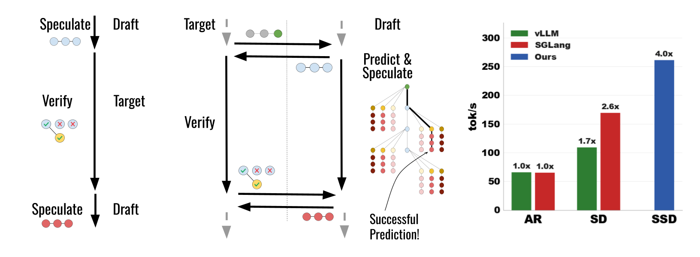

# GitHub Trending 排行榜

🔥 每周自动爬取GitHub最受欢迎的开源项目，生成AI智能总结的中文排行榜

[](https://github.com/qfy123/GitHub-Trending-/actions)
[](https://nodejs.org/)
[](LICENSE)

## ✨ 特性

- 🤖 **AI智能总结** - 使用DeepSeek AI生成简洁的中文项目描述
- 📊 **多维度排名** - 综合Star数、活跃度、新鲜度等指标
- 🖼️ **自动爬取图片** - 从项目README提取代表性图片
- 📈 **趋势分析** - 对比历史数据，显示项目排名变化
- 🗂️ **完整归档** - 按年份/周数归档所有历史数据
- 🔄 **自动更新** - GitHub Actions每周自动执行

## 📈 本周排行榜

<!-- TRENDING-START -->
### GitHub趋势排行榜 - 2026年第11周

**📅 统计周期**: 2026-03-08 ~ 2026-03-14  
**📊 项目总数**: 10 个  
**⭐ 总Star数**: 19,542  
**🔄 更新时间**: 2026-03-14 23:59:59  

| 排名 | 项目 | 描述 | Star | Fork | 语言 | 趋势 |
|------|------|------|------|------|------|------|
| 1 | [autoresearch](https://github.com/karpathy/autoresearch) | 让单GPU也能自动跑通大模型前沿实验，AI代理24小时无休迭代nanochat训练，彻底解放人类研究员。 | 9,800 | 1,300 | Python | 🆕 |
| 2 | [OBLITERATUS](https://github.com/elder-plinius/OBLITERATUS) | 一键“解锁”大模型内置安全限制，保留推理能力的同时移除对齐约束，并提供在线聊天沙箱，方便研究模型行为。 | 2,416 | 410 | Python | 🆕 |
| 3 | [Claude-to-IM-skill](https://github.com/op7418/Claude-to-IM-skill) | 把 Claude Code 接入 Telegram、Discord、飞书等 IM，像聊天一样指挥 AI 写代码，轻... | 676 | 81 | TypeScript | 🆕 |
| 4 | [TorchCode](https://github.com/duoan/TorchCode) | PyTorch版LeetCode，通过Jupyter交互练习手写softmax、attention、GPT-2等核... | 1,234 | 83 | Jupyter Notebook | 🆕 |
| 5 | [Uncodixfy](https://github.com/cyxzdev/Uncodixfy) | 提供一套反“GPT式UI”设计规范，帮助开发者避免千篇一律的AI生成界面套路。 | 1,088 | 81 | Unknown | 🆕 |
| 6 | [Siftly](https://github.com/viperrcrypto/Siftly) | 自托管的 Twitter/X 书签管理器，一键导入后用 AI 自动分类并生成思维导图，让碎片信息秒变结构化知识库。 | 1,023 | 77 | TypeScript | 🆕 |
| 7 | [SwiftUI-Agent-Skill](https://github.com/twostraws/SwiftUI-Agent-Skill) | 为 Claude Code、Codex 等 AI 工具提供 SwiftUI 开发能力，让 AI 直接生成可运行的 ... | 1,400 | 40 | Unknown | 🆕 |
| 8 | [qualcomm_gbl_exploit_poc](https://github.com/hicode002/qualcomm_gbl_exploit_poc) | 利用高通GBL未签名漏洞，绕过安全启动，解锁Bootloader并改写RPMB锁状态，实现设备完全控制。 | 541 | 191 | C | 🆕 |
| 9 | [ssd](https://github.com/tanishqkumar/ssd) | 轻量级推理引擎，通过“推测式推测解码”在单卡上实现大模型多倍加速，降低延迟与算力成本。 | 715 | 44 | Python | 🆕 |
| 10 | [tg-ws-proxy](https://github.com/Flowseal/tg-ws-proxy) | 本地SOCKS5代理，通过WebSocket隧道转发Telegram流量，绕过限速节点，加速文件与媒体加载。 | 649 | 8 | Python | 🆕 |

### 🔥 详细介绍

#### 1. [autoresearch](https://github.com/karpathy/autoresearch) 


**📝 项目简介**: 让单GPU也能自动跑通大模型前沿实验，AI代理24小时无休迭代nanochat训练，彻底解放人类研究员。

**✨ 核心特性**:
- 单GPU即可复现前沿研究，门槛低
- AI代理自主设计-训练-评估闭环，无需人工
- 持续自我进化，已迭代上万代，成果可即时落地

**📊 项目统计**:
- **⭐ Star数**: 9,800
- **🔀 Fork数**: 1,300
- **👀 Watch数**: 9,800
- **📝 语言**: Python
- **💻 技术栈**: Python, Jupyter Notebook
- **📈 趋势**: 🆕 新上榜项目

---

#### 2. [OBLITERATUS](https://github.com/elder-plinius/OBLITERATUS) 


**📝 项目简介**: 一键“解锁”大模型内置安全限制，保留推理能力的同时移除对齐约束，并提供在线聊天沙箱，方便研究模型行为。

**✨ 核心特性**:
- 一键abliteration，无需重训
- 保留原模型推理脑结构
- 集成Gradio交互演示界面

**📊 项目统计**:
- **⭐ Star数**: 2,416
- **🔀 Fork数**: 410
- **👀 Watch数**: 2,416
- **📝 语言**: Python
- **🌐 官网**: [https://huggingface.co/spaces/pliny-the-prompter/](https://huggingface.co/spaces/pliny-the-prompter/)
- **💻 技术栈**: Python, TeX, Shell, Jupyter Notebook, Dockerfile, HTML
- **📈 趋势**: 🆕 新上榜项目

---

#### 3. [Claude-to-IM-skill](https://github.com/op7418/Claude-to-IM-skill) 

**📝 项目简介**: 把 Claude Code 接入 Telegram、Discord、飞书等 IM，像聊天一样指挥 AI 写代码，轻量 CLI 守护进程秒级部署。

**✨ 核心特性**:
- 一条命令桥接多平台 IM 机器人
- 实时双向对话，代码/文件/权限全交互
- 从 CodePilot 提炼，专注极速 CLI 场景

**📊 项目统计**:
- **⭐ Star数**: 676
- **🔀 Fork数**: 81
- **👀 Watch数**: 676
- **📝 语言**: TypeScript
- **💻 技术栈**: TypeScript, Shell, PowerShell, JavaScript, chatbot, claude
- **📈 趋势**: 🆕 新上榜项目

---

#### 4. [TorchCode](https://github.com/duoan/TorchCode) 


**📝 项目简介**: PyTorch版LeetCode，通过Jupyter交互练习手写softmax、attention、GPT-2等核心算子，即时自动评分，助你通关一线ML面试。

**✨ 核心特性**:
- 面试真题级算子/模型手写训练
- Jupyter即时运行+自动判分
- 可本地Docker部署或在线免安装使用

**📊 项目统计**:
- **⭐ Star数**: 1,234
- **🔀 Fork数**: 83
- **👀 Watch数**: 1,234
- **📝 语言**: Jupyter Notebook
- **🌐 官网**: [https://huggingface.co/spaces/duoan/TorchCode](https://huggingface.co/spaces/duoan/TorchCode)
- **💻 技术栈**: Jupyter Notebook, Python, TypeScript, CSS, Dockerfile, Shell
- **📈 趋势**: 🆕 新上榜项目

---

#### 5. [Uncodixfy](https://github.com/cyxzdev/Uncodixfy) 


**📝 项目简介**: 提供一套反“GPT式UI”设计规范，帮助开发者避免千篇一律的AI生成界面套路。

**✨ 核心特性**:
- 收录常见AI UI反模式
- 给出可执行设计规则
- 提升界面原创性与专业度

**📊 项目统计**:
- **⭐ Star数**: 1,088
- **🔀 Fork数**: 81
- **👀 Watch数**: 1,088
- **📝 语言**: Unknown
- **📈 趋势**: 🆕 新上榜项目

---

#### 6. [Siftly](https://github.com/viperrcrypto/Siftly) 


**📝 项目简介**: 自托管的 Twitter/X 书签管理器，一键导入后用 AI 自动分类并生成思维导图，让碎片信息秒变结构化知识库。

**✨ 核心特性**:
- AI 智能分类与标签，无需手动整理
- 可视化思维导图，快速发现内容关联
- 本地优先+自托管，数据隐私完全可控

**📊 项目统计**:
- **⭐ Star数**: 1,023
- **🔀 Fork数**: 77
- **👀 Watch数**: 1,023
- **📝 语言**: TypeScript
- **💻 技术栈**: TypeScript, Shell, CSS, Dockerfile, JavaScript, ai
- **📈 趋势**: 🆕 新上榜项目

---

#### 7. [SwiftUI-Agent-Skill](https://github.com/twostraws/SwiftUI-Agent-Skill) 


**📝 项目简介**: 为 Claude Code、Codex 等 AI 工具提供 SwiftUI 开发能力，让 AI 直接生成可运行的 SwiftUI 代码。

**✨ 核心特性**:
- AI 友好：一键集成主流代码模型
- SwiftUI 原生：输出即运行，零配置
- 云端支持：AWS 托管，随时调用

**📊 项目统计**:
- **⭐ Star数**: 1,400
- **🔀 Fork数**: 40
- **👀 Watch数**: 1,400
- **📝 语言**: Unknown
- **💻 技术栈**: AWS
- **📈 趋势**: 🆕 新上榜项目

---

#### 8. [qualcomm_gbl_exploit_poc](https://github.com/hicode002/qualcomm_gbl_exploit_poc) 

**📝 项目简介**: 利用高通GBL未签名漏洞，绕过安全启动，解锁Bootloader并改写RPMB锁状态，实现设备完全控制。

**✨ 核心特性**:
- 无需厂商授权即可解锁
- GBL阶段任意代码执行
- 直接改写RPMB锁标志

**📊 项目统计**:
- **⭐ Star数**: 541
- **🔀 Fork数**: 191
- **👀 Watch数**: 541
- **📝 语言**: C
- **💻 技术栈**: C
- **📈 趋势**: 🆕 新上榜项目

---

#### 9. [ssd](https://github.com/tanishqkumar/ssd) 



**📝 项目简介**: 轻量级推理引擎，通过“推测式推测解码”在单卡上实现大模型多倍加速，降低延迟与算力成本。

**✨ 核心特性**:
- 单卡即可运行，零额外训练
- 多候选并行验证，加速比高
- 代码简洁，易集成到现有服务

**📊 项目统计**:
- **⭐ Star数**: 715
- **🔀 Fork数**: 44
- **👀 Watch数**: 715
- **📝 语言**: Python
- **💻 技术栈**: Python
- **📈 趋势**: 🆕 新上榜项目

---

#### 10. [tg-ws-proxy](https://github.com/Flowseal/tg-ws-proxy) 

**📝 项目简介**: 本地SOCKS5代理，通过WebSocket隧道转发Telegram流量，绕过限速节点，加速文件与媒体加载。

**✨ 核心特性**:
- 零配置一键启动
- 仅加速Telegram，不影响其他应用
- 开源轻量，跨平台Python实现

**📊 项目统计**:
- **⭐ Star数**: 649
- **🔀 Fork数**: 8
- **👀 Watch数**: 649
- **📝 语言**: Python
- **💻 技术栈**: Python
- **📈 趋势**: 🆕 新上榜项目

---

### 📈 本周统计

**🔥 热门语言**:
1. **Python** (4 个项目)
2. **TypeScript** (2 个项目)
3. **Unknown** (2 个项目)
4. **Jupyter Notebook** (1 个项目)
5. **C** (1 个项目)

**🏷️ 热门话题**:
1. chatbot (1)
2. claude (1)
3. claude-code (1)
4. discord (1)
5. feishu (1)
6. lark (1)
7. skill (1)
8. telegram (1)


<!-- TRENDING-END -->

## 📚 历史数据

<!-- HISTORY-START -->
| 时间 | 周期 | 项目数 | 链接 |
|------|------|--------|------|
| 03-14 | 2026年第11周 | 10 个 | [查看详情](./archives/2026/week-11/report.md) |
| 03-07 | 2026年第10周 | 10 个 | [查看详情](./archives/2026/week-10/report.md) |
| 02-28 | 2026年第9周 | 10 个 | [查看详情](./archives/2026/week-9/report.md) |
| 02-21 | 2026年第8周 | 10 个 | [查看详情](./archives/2026/week-8/report.md) |
| 02-14 | 2026年第7周 | 10 个 | [查看详情](./archives/2026/week-7/report.md) |
| 02-07 | 2026年第6周 | 10 个 | [查看详情](./archives/2026/week-6/report.md) |
| 01-31 | 2026年第5周 | 10 个 | [查看详情](./archives/2026/week-5/report.md) |
| 01-24 | 2026年第4周 | 10 个 | [查看详情](./archives/2026/week-4/report.md) |
| 01-17 | 2026年第3周 | 10 个 | [查看详情](./archives/2026/week-3/report.md) |
| 01-10 | 2026年第2周 | 10 个 | [查看详情](./archives/2026/week-2/report.md) |
| 12-27 | 2025年第52周 | 10 个 | [查看详情](./archives/2025/week-52/report.md) |
| 12-20 | 2025年第51周 | 10 个 | [查看详情](./archives/2025/week-51/report.md) |
| 12-13 | 2025年第50周 | 10 个 | [查看详情](./archives/2025/week-50/report.md) |
| 12-06 | 2025年第49周 | 10 个 | [查看详情](./archives/2025/week-49/report.md) |
| 11-29 | 2025年第48周 | 10 个 | [查看详情](./archives/2025/week-48/report.md) |
| 11-22 | 2025年第47周 | 10 个 | [查看详情](./archives/2025/week-47/report.md) |
| 11-15 | 2025年第46周 | 10 个 | [查看详情](./archives/2025/week-46/report.md) |
| 11-08 | 2025年第45周 | 10 个 | [查看详情](./archives/2025/week-45/report.md) |
| 11-01 | 2025年第44周 | 10 个 | [查看详情](./archives/2025/week-44/report.md) |
| 10-25 | 2025年第43周 | 10 个 | [查看详情](./archives/2025/week-43/report.md) |

[查看完整历史数据](./archives/)
<!-- HISTORY-END -->

## 🚀 快速开始

### 1. 克隆项目

```bash
git clone https://github.com/your-username/GitHub-Trending.git
cd GitHub-Trending
```

### 2. 安装依赖

```bash
npm install
```

### 3. 配置环境变量

```bash
# 复制环境变量模板
cp .env.example .env

# 编辑 .env 文件，填入以下必需配置：
# GITHUB_TOKEN=your_github_token
# SILICONFLOW_API_KEY=your_siliconflow_api_key
```

### 4. 测试配置

```bash
# 系统测试
node test/system-test.js

# 配置检查
node scripts/update-trending.js --check
```

### 5. 运行项目

```bash
# 测试运行（少量数据）
node scripts/update-trending.js --limit 3

# 正式运行
node scripts/update-trending.js
```

## 🔧 配置说明

### 环境变量

| 变量名 | 必需 | 说明 | 获取方式 |
|--------|------|------|----------|
| `GITHUB_TOKEN` | ✅ | GitHub API访问令牌 | [GitHub设置](https://github.com/settings/tokens) |
| `SILICONFLOW_API_KEY` | ✅ | 硅基流动API密钥 | [硅基流动官网](https://siliconflow.cn) |
| `AI_BASE_URL` | ❌ | AI服务地址 | 默认硅基流动 |
| `AI_MODEL` | ❌ | AI模型名称 | 默认deepseek-chat |

详细配置请参考：[配置指南](config/README.md)

### GitHub Actions自动化

1. **Fork本项目**到你的GitHub账号
2. **设置Secrets**：
   - `SILICONFLOW_API_KEY`: 硅基流动API密钥
3. **启用Actions**：项目会自动每周一更新

详细设置请参考：[GitHub Actions配置](-.github/README.md)

## 📊 项目结构

```
GitHub-Trending/
├── src/                          # 核心源码
│   ├── github-api.js            # GitHub API调用
│   ├── ai-summarizer.js         # AI项目总结
│   ├── image-crawler.js         # 图片爬取
│   ├── data-processor.js        # 数据处理
│   ├── file-manager.js          # 文件管理
│   └── readme-updater.js        # README更新
├── scripts/                      # 执行脚本
│   └── update-trending.js       # 主执行脚本
├── test/                         # 测试文件
│   └── system-test.js           # 系统测试
├── archives/                     # 历史数据归档
│   └── YYYY/                    # 按年份归档
│       └── week-XX.md           # 周报文件
├── images/                       # 项目图片
│   └── YYYY/week-XX/            # 按周归档
├── data/                         # 临时数据
├── config/                       # 配置文档
├── .github/                      # GitHub Actions
│   └── workflows/
└── README.md                     # 项目说明
```

## 🎯 使用场景

### 开发者
- 🔍 **发现新项目** - 了解最新热门开源项目
- 📈 **技术趋势** - 跟踪编程语言和技术栈趋势
- 💡 **学习参考** - 学习优秀项目的设计和实现

### 技术团队
- 📊 **技术选型** - 参考热门项目进行技术选型
- 🎯 **竞品分析** - 关注同类项目的发展趋势
- 📝 **技术报告** - 生成定期的技术趋势报告

### 内容创作者
- ✍️ **素材收集** - 为技术文章和视频收集素材
- 📰 **新闻线索** - 发现值得报道的新兴项目
- 🗣️ **分享内容** - 分享有价值的开源项目

## 🛠️ 命令行工具

```bash
# 查看帮助
node scripts/update-trending.js --help

# 检查配置
node scripts/update-trending.js --check

# 自定义参数运行
node scripts/update-trending.js --limit 20 --language python

# 数据管理
node scripts/update-trending.js --backup     # 创建备份
node scripts/update-trending.js --cleanup    # 清理过期数据
node scripts/update-trending.js --stats      # 查看统计信息

# 系统测试
node test/system-test.js                      # 完整测试
node test/system-test.js --quick             # 快速诊断
```

## 📈 排名算法

项目排名基于以下三个维度的综合评分：

### 🌟 受欢迎程度 (50%)
- **Star数量** (60%): 项目获得的Star数
- **Fork数量** (25%): 项目被Fork的次数  
- **Watch数量** (15%): 项目被Watch的次数

### 🔥 活跃程度 (30%)
- **最近提交** (50%): 距离最后一次提交的时间
- **Issues活跃度** (30%): 开放的Issues数量
- **Fork活跃度** (20%): Fork的活跃程度

### 🆕 新鲜程度 (20%)
- **创建时间** (30%): 项目创建时间（新项目得分高）
- **更新时间** (70%): 最近更新时间

### 趋势分析
- 📈 **上升**: 排名比上周提升
- 📉 **下降**: 排名比上周下降  
- ➡️ **稳定**: 排名无明显变化
- 🆕 **新上榜**: 首次进入排行榜

## 🤝 贡献指南

欢迎提交 Issues 和 Pull Requests！

### 开发环境设置

```bash
# 1. Fork 并克隆项目
git clone https://github.com/your-username/GitHub-Trending.git

# 2. 创建功能分支
git checkout -b feature/your-feature

# 3. 安装依赖并测试
npm install
node test/system-test.js

# 4. 开发完成后提交
git commit -m "feat: 添加新功能"
git push origin feature/your-feature
```

### 提交规范

- `feat`: 新功能
- `fix`: 修复bug
- `docs`: 文档更新
- `style`: 代码格式调整
- `refactor`: 代码重构
- `test`: 测试相关
- `chore`: 构建/工具相关

## 📄 许可证

本项目基于 [MIT 许可证](LICENSE) 开源。

## 🙏 致谢

- [GitHub API](https://docs.github.com/en/rest) - 提供项目数据
- [硅基流动](https://siliconflow.cn) - 提供AI总结服务
- [DeepSeek](https://deepseek.com) - 优秀的AI模型
- [GitHub Actions](https://github.com/features/actions) - 自动化支持

## 📞 联系方式

- 🐛 **Bug报告**: [提交Issue](https://github.com/your-username/GitHub-Trending/issues)
- 💡 **功能建议**: [功能请求](https://github.com/your-username/GitHub-Trending/issues)
- 📧 **其他问题**: [发送邮件](mailto:your-email@example.com)

## 🔗 相关链接

- [项目文档](https://github.com/your-username/GitHub-Trending/wiki)
- [更新日志](CHANGELOG.md)
- [FAQ](FAQ.md)

---

⭐ 如果这个项目对你有帮助，请给它一个Star！

*本项目由 [GitHub Actions](https://github.com/features/actions) 自动维护，数据每周更新*