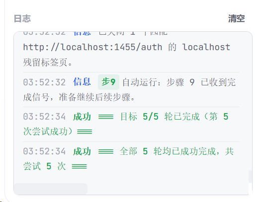
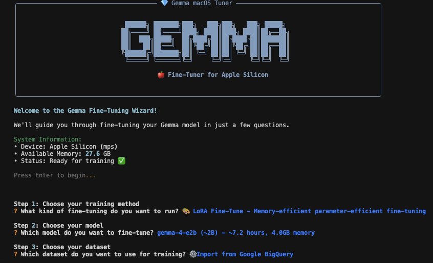
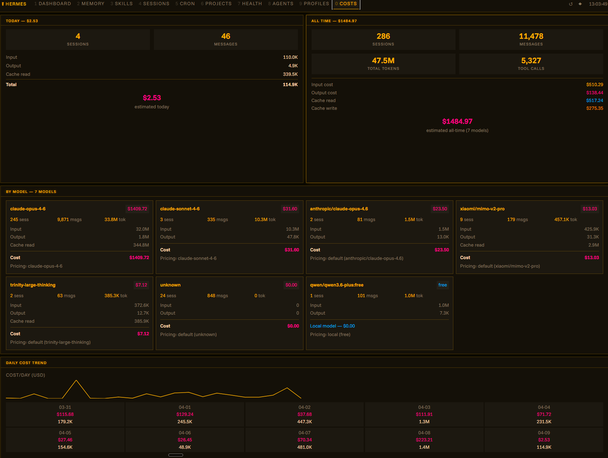
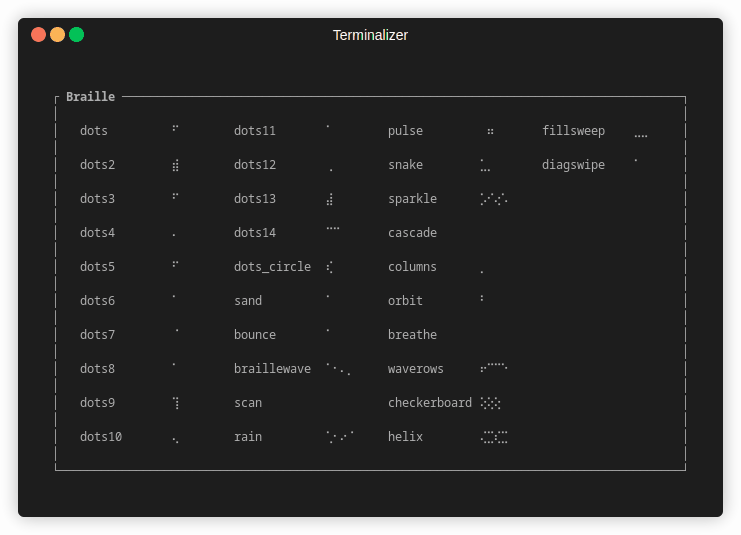

# GitHub Trending 排行榜

🔥 每周自动爬取GitHub最受欢迎的开源项目，生成AI智能总结的中文排行榜

[](https://github.com/qfy123/GitHub-Trending-/actions)
[](https://nodejs.org/)
[](LICENSE)

## ✨ 特性

- 🤖 **AI智能总结** - 使用DeepSeek AI生成简洁的中文项目描述
- 📊 **多维度排名** - 综合Star数、活跃度、新鲜度等指标
- 🖼️ **自动爬取图片** - 从项目README提取代表性图片
- 📈 **趋势分析** - 对比历史数据，显示项目排名变化
- 🗂️ **完整归档** - 按年份/周数归档所有历史数据
- 🔄 **自动更新** - GitHub Actions每周自动执行

## 📈 本周排行榜

<!-- TRENDING-START -->
### GitHub趋势排行榜 - 2026年第16周

**📅 统计周期**: 2026-04-12 ~ 2026-04-18  
**📊 项目总数**: 10 个  
**⭐ 总Star数**: 14,011  
**🔄 更新时间**: 2026-04-18 23:59:59  

| 排名 | 项目 | 描述 | Star | Fork | 语言 | 趋势 |
|------|------|------|------|------|------|------|
| 1 | [clicky](https://github.com/farzaa/clicky) | 一款AI屏幕伴侣，实时跟随光标，可识屏、语音互动并用光标指示，像真人老师贴身辅导。 | 3,965 | 701 | Swift | 🆕 |
| 2 | [codex-oauth-automation-extension](https://github.com/QLHazyCoder/codex-oauth-automation-extension) | 一键批量完成 ChatGPT OAuth 注册/登录的 Chrome 扩展，集成验证码获取与 CPA 回调验证，成... | 1,004 | 213 | JavaScript | 🆕 |
| 3 | [hermes-agent-orange-book](https://github.com/alchaincyf/hermes-agent-orange-book) | Nous Research开源AI Agent框架Hermes的实战橙皮书，从入门到精通系统讲解，内置可扩展的“缰... | 2,153 | 235 | Unknown | 🆕 |
| 4 | [fireworks-tech-graph](https://github.com/yizhiyanhua-ai/fireworks-tech-graph) | 用自然语言秒级生成出版级SVG/PNG技术架构图，告别手绘，支持8种图类、5套主题，内置AI/Agent领域知识库。 | 1,684 | 125 | Python | 🆕 |
| 5 | [llm_wiki](https://github.com/nashsu/llm_wiki) | 跨平台桌面应用，自动把本地文档持续整理成可检索、互联的持久化知识库，无需每次重新解析。 | 974 | 110 | TypeScript | 🆕 |
| 6 | [claude-usage](https://github.com/phuryn/claude-usage) | 本地可视化 Claude Code 的 token 用量、费用与会话历史，支持 API/Pro/Max 三档计划，... | 879 | 129 | Python | 🆕 |
| 7 | [gemma-tuner-multimodal](https://github.com/mattmireles/gemma-tuner-multimodal) | 在苹果芯片Mac上零门槛微调Gemma多模态模型，支持图像、语音、文本LoRA，云端流式训练不占本地空间。 | 1,236 | 78 | Python | 🆕 |
| 8 | [hermes-hudui](https://github.com/joeynyc/hermes-hudui) | 为拥有持久记忆的AI代理Hermes打造的浏览器端意识监控面板，一键克隆即可实时洞察Agent思维与记忆状态。 | 740 | 77 | Python | 🆕 |
| 9 | [claude-obsidian](https://github.com/AgriciDaniel/claude-obsidian) | 基于Shell的Claude+Obsidian知识伴侣，自动构建持续增长的Wiki库，零手动整理即可复利式积累知识。 | 718 | 71 | Shell | 🆕 |
| 10 | [rattles](https://github.com/vyfor/rattles) | 零依赖、极简终端转圈动画库，编译期自定义，直接嵌入渲染循环，无需运行时或生命周期管理。 | 658 | 13 | Rust | 🆕 |

### 🔥 详细介绍

#### 1. [clicky](https://github.com/farzaa/clicky) 


**📝 项目简介**: 一款AI屏幕伴侣，实时跟随光标，可识屏、语音互动并用光标指示，像真人老师贴身辅导。

**✨ 核心特性**:
- 光标级实时互动教学
- 支持屏幕视觉识别与语音对话
- 开源可二次开发

**📊 项目统计**:
- **⭐ Star数**: 3,965
- **🔀 Fork数**: 701
- **👀 Watch数**: 3,965
- **📝 语言**: Swift
- **💻 技术栈**: Swift, Shell, TypeScript, Node.js
- **📈 趋势**: 🆕 新上榜项目

---

#### 2. [codex-oauth-automation-extension](https://github.com/QLHazyCoder/codex-oauth-automation-extension) 



**📝 项目简介**: 一键批量完成 ChatGPT OAuth 注册/登录的 Chrome 扩展，集成验证码获取与 CPA 回调验证，成功率实测 90%+。

**✨ 核心特性**:
- 侧边栏可视化操作，支持单步/整套流程
- DuckDuckGo/QQ/163/Hotmail 等多通道验证码自动获取
- 断点续跑与配置保存，夜间挂机零人工

**📊 项目统计**:
- **⭐ Star数**: 1,004
- **🔀 Fork数**: 213
- **👀 Watch数**: 1,004
- **📝 语言**: JavaScript
- **🌐 官网**: [https://linux.do/t/topic/1928372](https://linux.do/t/topic/1928372)
- **💻 技术栈**: JavaScript, CSS, HTML
- **📈 趋势**: 🆕 新上榜项目

---

#### 3. [hermes-agent-orange-book](https://github.com/alchaincyf/hermes-agent-orange-book) 

**📝 项目简介**: Nous Research开源AI Agent框架Hermes的实战橙皮书，从入门到精通系统讲解，内置可扩展的“缰绳”机制，帮助开发者快速构建可控智能体。

**✨ 核心特性**:
- 官方权威指南，体系完整
- 自带可成长缰绳机制，安全可控
- 中英双语PDF，开源免费

**📊 项目统计**:
- **⭐ Star数**: 2,153
- **🔀 Fork数**: 235
- **👀 Watch数**: 2,153
- **📝 语言**: Unknown
- **📈 趋势**: 🆕 新上榜项目

---

#### 4. [fireworks-tech-graph](https://github.com/yizhiyanhua-ai/fireworks-tech-graph) 


**📝 项目简介**: 用自然语言秒级生成出版级SVG/PNG技术架构图，告别手绘，支持8种图类、5套主题，内置AI/Agent领域知识库。

**✨ 核心特性**:
- 自然语言一键出图
- AI/Agent专属图库与样式
- SVG+PNG高分辨率双输出

**📊 项目统计**:
- **⭐ Star数**: 1,684
- **🔀 Fork数**: 125
- **👀 Watch数**: 1,684
- **📝 语言**: Python
- **💻 技术栈**: Python, Shell, Docker, Kubernetes, Redis, MongoDB
- **📈 趋势**: 🆕 新上榜项目

---

#### 5. [llm_wiki](https://github.com/nashsu/llm_wiki) 


**📝 项目简介**: 跨平台桌面应用，自动把本地文档持续整理成可检索、互联的持久化知识库，无需每次重新解析。

**✨ 核心特性**:
- 增量式构建个人Wiki，避免重复RAG
- 自动提取主题、链接与目录，保持更新
- 支持多格式文档，离线运行，数据本地存储

**📊 项目统计**:
- **⭐ Star数**: 974
- **🔀 Fork数**: 110
- **👀 Watch数**: 974
- **📝 语言**: TypeScript
- **💻 技术栈**: TypeScript, JavaScript, Rust, HTML, CSS, React
- **📈 趋势**: 🆕 新上榜项目

---

#### 6. [claude-usage](https://github.com/phuryn/claude-usage) 


**📝 项目简介**: 本地可视化 Claude Code 的 token 用量、费用与会话历史，支持 API/Pro/Max 三档计划，让成本一目了然。

**✨ 核心特性**:
- 零配置读取本地日志，无需上传数据
- 实时图表+进度条，Pro/Max 用户可直观剩余额度
- 自动估算费用，按模型/项目/会话多维度汇总

**📊 项目统计**:
- **⭐ Star数**: 879
- **🔀 Fork数**: 129
- **👀 Watch数**: 879
- **📝 语言**: Python
- **🌐 官网**: [https://www.productcompass.pm/](https://www.productcompass.pm/)
- **💻 技术栈**: Python, claude-code
- **📈 趋势**: 🆕 新上榜项目

---

#### 7. [gemma-tuner-multimodal](https://github.com/mattmireles/gemma-tuner-multimodal) 



**📝 项目简介**: 在苹果芯片Mac上零门槛微调Gemma多模态模型，支持图像、语音、文本LoRA，云端流式训练不占本地空间。

**✨ 核心特性**:
- Apple Silicon原生MPS加速，无需CUDA
- 云端流式读取GCS/BigQuery，TB级数据即时训
- 一键LoRA微调图文、语音、纯文本任务

**📊 项目统计**:
- **⭐ Star数**: 1,236
- **🔀 Fork数**: 78
- **👀 Watch数**: 1,236
- **📝 语言**: Python
- **💻 技术栈**: Python, JavaScript, HTML, Shell, React, Flask
- **📈 趋势**: 🆕 新上榜项目

---

#### 8. [hermes-hudui](https://github.com/joeynyc/hermes-hudui) 



**📝 项目简介**: 为拥有持久记忆的AI代理Hermes打造的浏览器端意识监控面板，一键克隆即可实时洞察Agent思维与记忆状态。

**✨ 核心特性**:
- 浏览器可视化Hermes意识流
- 零配置读取本地~/.hermes数据
- 一键脚本安装，秒级启动

**📊 项目统计**:
- **⭐ Star数**: 740
- **🔀 Fork数**: 77
- **👀 Watch数**: 740
- **📝 语言**: Python
- **💻 技术栈**: Python, TypeScript, CSS, Shell, HTML, JavaScript
- **📈 趋势**: 🆕 新上榜项目

---

#### 9. [claude-obsidian](https://github.com/AgriciDaniel/claude-obsidian) 


**📝 项目简介**: 基于Shell的Claude+Obsidian知识伴侣，自动构建持续增长的Wiki库，零手动整理即可复利式积累知识。

**✨ 核心特性**:
- 10项内置技能，自动归档与关联
- 多Agent协同，问答即时调用全库
- 每份新资料即时融入，知识像利息复利

**📊 项目统计**:
- **⭐ Star数**: 718
- **🔀 Fork数**: 71
- **👀 Watch数**: 718
- **📝 语言**: Shell
- **🌐 官网**: [https://agricidaniel.com/blog/claude-obsidian-ai-second-brain](https://agricidaniel.com/blog/claude-obsidian-ai-second-brain)
- **💻 技术栈**: Shell, ai, claude-code, claude-code-skill, knowledge-management, obsidian
- **📈 趋势**: 🆕 新上榜项目

---

#### 10. [rattles](https://github.com/vyfor/rattles) 



**📝 项目简介**: 零依赖、极简终端转圈动画库，编译期自定义，直接嵌入渲染循环，无需运行时或生命周期管理。

**✨ 核心特性**:
- 零依赖、no-std
- 编译期自定义转圈样式
- 无需运行时/actor，随取随用

**📊 项目统计**:
- **⭐ Star数**: 658
- **🔀 Fork数**: 13
- **👀 Watch数**: 658
- **📝 语言**: Rust
- **🌐 官网**: [https://docs.rs/rattles](https://docs.rs/rattles)
- **💻 技术栈**: Rust, animation, cli, no-std, ratatui, rattles
- **📈 趋势**: 🆕 新上榜项目

---

### 📈 本周统计

**🔥 热门语言**:
1. **Python** (4 个项目)
2. **Swift** (1 个项目)
3. **JavaScript** (1 个项目)
4. **Unknown** (1 个项目)
5. **TypeScript** (1 个项目)

**🏷️ 热门话题**:
1. claude-code (2)
2. ai (1)
3. claude-code-skill (1)
4. knowledge-management (1)
5. obsidian (1)
6. open-source (1)
7. second-brain (1)
8. animation (1)


<!-- TRENDING-END -->

## 📚 历史数据

<!-- HISTORY-START -->
| 时间 | 周期 | 项目数 | 链接 |
|------|------|--------|------|
| 04-18 | 2026年第16周 | 10 个 | [查看详情](./archives/2026/week-16/report.md) |
| 04-11 | 2026年第15周 | 10 个 | [查看详情](./archives/2026/week-15/report.md) |
| 04-04 | 2026年第14周 | 10 个 | [查看详情](./archives/2026/week-14/report.md) |
| 03-28 | 2026年第13周 | 10 个 | [查看详情](./archives/2026/week-13/report.md) |
| 03-21 | 2026年第12周 | 10 个 | [查看详情](./archives/2026/week-12/report.md) |
| 03-14 | 2026年第11周 | 10 个 | [查看详情](./archives/2026/week-11/report.md) |
| 03-07 | 2026年第10周 | 10 个 | [查看详情](./archives/2026/week-10/report.md) |
| 02-28 | 2026年第9周 | 10 个 | [查看详情](./archives/2026/week-9/report.md) |
| 02-21 | 2026年第8周 | 10 个 | [查看详情](./archives/2026/week-8/report.md) |
| 02-14 | 2026年第7周 | 10 个 | [查看详情](./archives/2026/week-7/report.md) |
| 02-07 | 2026年第6周 | 10 个 | [查看详情](./archives/2026/week-6/report.md) |
| 01-31 | 2026年第5周 | 10 个 | [查看详情](./archives/2026/week-5/report.md) |
| 01-24 | 2026年第4周 | 10 个 | [查看详情](./archives/2026/week-4/report.md) |
| 01-17 | 2026年第3周 | 10 个 | [查看详情](./archives/2026/week-3/report.md) |
| 01-10 | 2026年第2周 | 10 个 | [查看详情](./archives/2026/week-2/report.md) |
| 12-27 | 2025年第52周 | 10 个 | [查看详情](./archives/2025/week-52/report.md) |
| 12-20 | 2025年第51周 | 10 个 | [查看详情](./archives/2025/week-51/report.md) |
| 12-13 | 2025年第50周 | 10 个 | [查看详情](./archives/2025/week-50/report.md) |
| 12-06 | 2025年第49周 | 10 个 | [查看详情](./archives/2025/week-49/report.md) |
| 11-29 | 2025年第48周 | 10 个 | [查看详情](./archives/2025/week-48/report.md) |

[查看完整历史数据](./archives/)
<!-- HISTORY-END -->

## 🚀 快速开始

### 1. 克隆项目

```bash
git clone https://github.com/your-username/GitHub-Trending.git
cd GitHub-Trending
```

### 2. 安装依赖

```bash
npm install
```

### 3. 配置环境变量

```bash
# 复制环境变量模板
cp .env.example .env

# 编辑 .env 文件，填入以下必需配置：
# GITHUB_TOKEN=your_github_token
# SILICONFLOW_API_KEY=your_siliconflow_api_key
```

### 4. 测试配置

```bash
# 系统测试
node test/system-test.js

# 配置检查
node scripts/update-trending.js --check
```

### 5. 运行项目

```bash
# 测试运行（少量数据）
node scripts/update-trending.js --limit 3

# 正式运行
node scripts/update-trending.js
```

## 🔧 配置说明

### 环境变量

| 变量名 | 必需 | 说明 | 获取方式 |
|--------|------|------|----------|
| `GITHUB_TOKEN` | ✅ | GitHub API访问令牌 | [GitHub设置](https://github.com/settings/tokens) |
| `SILICONFLOW_API_KEY` | ✅ | 硅基流动API密钥 | [硅基流动官网](https://siliconflow.cn) |
| `AI_BASE_URL` | ❌ | AI服务地址 | 默认硅基流动 |
| `AI_MODEL` | ❌ | AI模型名称 | 默认deepseek-chat |

详细配置请参考：[配置指南](config/README.md)

### GitHub Actions自动化

1. **Fork本项目**到你的GitHub账号
2. **设置Secrets**：
   - `SILICONFLOW_API_KEY`: 硅基流动API密钥
3. **启用Actions**：项目会自动每周一更新

详细设置请参考：[GitHub Actions配置](-.github/README.md)

## 📊 项目结构

```
GitHub-Trending/
├── src/                          # 核心源码
│   ├── github-api.js            # GitHub API调用
│   ├── ai-summarizer.js         # AI项目总结
│   ├── image-crawler.js         # 图片爬取
│   ├── data-processor.js        # 数据处理
│   ├── file-manager.js          # 文件管理
│   └── readme-updater.js        # README更新
├── scripts/                      # 执行脚本
│   └── update-trending.js       # 主执行脚本
├── test/                         # 测试文件
│   └── system-test.js           # 系统测试
├── archives/                     # 历史数据归档
│   └── YYYY/                    # 按年份归档
│       └── week-XX.md           # 周报文件
├── images/                       # 项目图片
│   └── YYYY/week-XX/            # 按周归档
├── data/                         # 临时数据
├── config/                       # 配置文档
├── .github/                      # GitHub Actions
│   └── workflows/
└── README.md                     # 项目说明
```

## 🎯 使用场景

### 开发者
- 🔍 **发现新项目** - 了解最新热门开源项目
- 📈 **技术趋势** - 跟踪编程语言和技术栈趋势
- 💡 **学习参考** - 学习优秀项目的设计和实现

### 技术团队
- 📊 **技术选型** - 参考热门项目进行技术选型
- 🎯 **竞品分析** - 关注同类项目的发展趋势
- 📝 **技术报告** - 生成定期的技术趋势报告

### 内容创作者
- ✍️ **素材收集** - 为技术文章和视频收集素材
- 📰 **新闻线索** - 发现值得报道的新兴项目
- 🗣️ **分享内容** - 分享有价值的开源项目

## 🛠️ 命令行工具

```bash
# 查看帮助
node scripts/update-trending.js --help

# 检查配置
node scripts/update-trending.js --check

# 自定义参数运行
node scripts/update-trending.js --limit 20 --language python

# 数据管理
node scripts/update-trending.js --backup     # 创建备份
node scripts/update-trending.js --cleanup    # 清理过期数据
node scripts/update-trending.js --stats      # 查看统计信息

# 系统测试
node test/system-test.js                      # 完整测试
node test/system-test.js --quick             # 快速诊断
```

## 📈 排名算法

项目排名基于以下三个维度的综合评分：

### 🌟 受欢迎程度 (50%)
- **Star数量** (60%): 项目获得的Star数
- **Fork数量** (25%): 项目被Fork的次数  
- **Watch数量** (15%): 项目被Watch的次数

### 🔥 活跃程度 (30%)
- **最近提交** (50%): 距离最后一次提交的时间
- **Issues活跃度** (30%): 开放的Issues数量
- **Fork活跃度** (20%): Fork的活跃程度

### 🆕 新鲜程度 (20%)
- **创建时间** (30%): 项目创建时间（新项目得分高）
- **更新时间** (70%): 最近更新时间

### 趋势分析
- 📈 **上升**: 排名比上周提升
- 📉 **下降**: 排名比上周下降  
- ➡️ **稳定**: 排名无明显变化
- 🆕 **新上榜**: 首次进入排行榜

## 🤝 贡献指南

欢迎提交 Issues 和 Pull Requests！

### 开发环境设置

```bash
# 1. Fork 并克隆项目
git clone https://github.com/your-username/GitHub-Trending.git

# 2. 创建功能分支
git checkout -b feature/your-feature

# 3. 安装依赖并测试
npm install
node test/system-test.js

# 4. 开发完成后提交
git commit -m "feat: 添加新功能"
git push origin feature/your-feature
```

### 提交规范

- `feat`: 新功能
- `fix`: 修复bug
- `docs`: 文档更新
- `style`: 代码格式调整
- `refactor`: 代码重构
- `test`: 测试相关
- `chore`: 构建/工具相关

## 📄 许可证

本项目基于 [MIT 许可证](LICENSE) 开源。

## 🙏 致谢

- [GitHub API](https://docs.github.com/en/rest) - 提供项目数据
- [硅基流动](https://siliconflow.cn) - 提供AI总结服务
- [DeepSeek](https://deepseek.com) - 优秀的AI模型
- [GitHub Actions](https://github.com/features/actions) - 自动化支持

## 📞 联系方式

- 🐛 **Bug报告**: [提交Issue](https://github.com/your-username/GitHub-Trending/issues)
- 💡 **功能建议**: [功能请求](https://github.com/your-username/GitHub-Trending/issues)
- 📧 **其他问题**: [发送邮件](mailto:your-email@example.com)

## 🔗 相关链接

- [项目文档](https://github.com/your-username/GitHub-Trending/wiki)
- [更新日志](CHANGELOG.md)
- [FAQ](FAQ.md)

---

⭐ 如果这个项目对你有帮助，请给它一个Star！

*本项目由 [GitHub Actions](https://github.com/features/actions) 自动维护，数据每周更新*