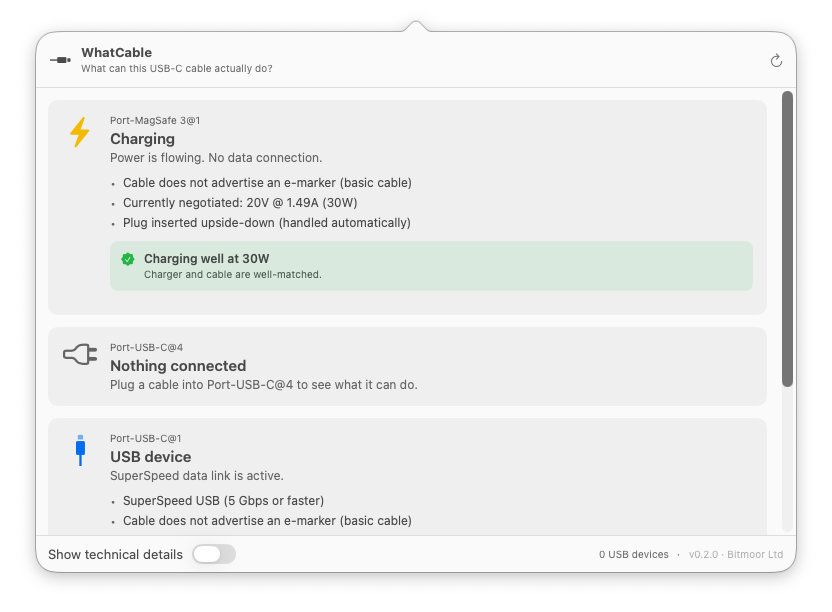

# GitHub Trending 排行榜

🔥 每周自动爬取GitHub最受欢迎的开源项目，生成AI智能总结的中文排行榜

[](https://github.com/qfy123/GitHub-Trending-/actions)
[](https://nodejs.org/)
[](LICENSE)

## ✨ 特性

- 🤖 **AI智能总结** - 使用DeepSeek AI生成简洁的中文项目描述
- 📊 **多维度排名** - 综合Star数、活跃度、新鲜度等指标
- 🖼️ **自动爬取图片** - 从项目README提取代表性图片
- 📈 **趋势分析** - 对比历史数据，显示项目排名变化
- 🗂️ **完整归档** - 按年份/周数归档所有历史数据
- 🔄 **自动更新** - GitHub Actions每周自动执行

## 📈 本周排行榜

<!-- TRENDING-START -->
### GitHub趋势排行榜 - 2026年第19周

**📅 统计周期**: 2026-05-03 ~ 2026-05-09  
**📊 项目总数**: 10 个  
**⭐ 总Star数**: 31,336  
**🔄 更新时间**: 2026-05-09 23:59:59  

| 排名 | 项目 | 描述 | Star | Fork | 语言 | 趋势 |
|------|------|------|------|------|------|------|
| 1 | [open-design](https://github.com/nexu-io/open-design) | 本地优先的开源AI设计工具，一键生成网页/桌面/移动端原型、幻灯片、图片、视频，可对接13种主流AI编码助手，自带... | 20,285 | 2,247 | TypeScript | 🆕 |
| 2 | [copy-fail-CVE-2026-31431](https://github.com/theori-io/copy-fail-CVE-2026-31431) | 针对CVE-2026-31431的Linux内核本地提权漏洞PoC，一键验证多发行版风险，帮助运维快速排查。 | 3,045 | 634 | Python | 🆕 |
| 3 | [mike](https://github.com/willchen96/mike) | Mike 是开源 AI 法律平台，前端 Next.js 与后端 Express 协同，提供合同审查、法规检索与文档... | 1,727 | 452 | TypeScript | 🆕 |
| 4 | [NTSB_FOIA_MU5735](https://github.com/wrongly-cuddly-obsession/NTSB_FOIA_MU5735) | 备份并公开东航MU5735空难NTSB FOIA调查文件，防止原始仓库被删后资料丢失，附带非官方中文译稿。 | 829 | 308 | Unknown | 🆕 |
| 5 | [whatcable](https://github.com/darrylmorley/whatcable) | macOS菜单栏小工具，实时把插在Mac上的每根USB-C线真实能力（功率、速率、协议）用大白话告诉你，一眼识别快... | 1,494 | 33 | Swift | 🆕 |
| 6 | [codex-plusplus](https://github.com/b-nnett/codex-plusplus) | 无需重新编译即可为Codex桌面客户端注入自定义功能、修复UI缺陷，并提供可视化插件管理器。 | 859 | 42 | TypeScript | 🆕 |
| 7 | [dictionary-of-ai-coding](https://github.com/mattpocock/dictionary-of-ai-coding) | 用通俗英语拆解AI编程黑话，帮助开发者快速理解术语、避免踩坑，降低学习门槛。 | 863 | 116 | TypeScript | 🆕 |
| 8 | [dbx](https://github.com/t8y2/dbx) | 仅15MB的跨平台数据库客户端，一键连接MySQL、PostgreSQL、SQLite、Redis、MongoDB... | 781 | 44 | Vue | 🆕 |
| 9 | [chromex](https://github.com/GENEXIS-AI/chromex) | Chrome侧边栏AI助手，通过本地桥接Codex，可对话网页、标签、截图、文件并执行浏览器工作流，零存储凭据。 | 775 | 64 | TypeScript | 🆕 |
| 10 | [SoftwareCopyright-Skill](https://github.com/Fokkyp/SoftwareCopyright-Skill) | 一键解析本地代码，自动生成中国软件著作权申请所需的全部.docx材料，彻底告别高价代办。 | 678 | 146 | Python | 🆕 |

### 🔥 详细介绍

#### 1. [open-design](https://github.com/nexu-io/open-design) 


**📝 项目简介**: 本地优先的开源AI设计工具，一键生成网页/桌面/移动端原型、幻灯片、图片、视频，可对接13种主流AI编码助手，自带72套品牌级设计系统。

**✨ 核心特性**:
- 零门槛替代Claude Design，完全开源
- 支持HTML/PDF/PPTX/MP4多格式导出
- BYOK模式，兼容所有OpenAI接口与主流CLI

**📊 项目统计**:
- **⭐ Star数**: 20,285
- **🔀 Fork数**: 2,247
- **👀 Watch数**: 20,285
- **📝 语言**: TypeScript
- **🌐 官网**: [https://github.com/nexu-io/open-design](https://github.com/nexu-io/open-design)
- **💻 技术栈**: TypeScript, HTML, CSS, JavaScript, Python, Astro
- **📈 趋势**: 🆕 新上榜项目

---

#### 2. [copy-fail-CVE-2026-31431](https://github.com/theori-io/copy-fail-CVE-2026-31431) 

**📝 项目简介**: 针对CVE-2026-31431的Linux内核本地提权漏洞PoC，一键验证多发行版风险，帮助运维快速排查。

**✨ 核心特性**:
- 覆盖Ubuntu、Amazon Linux、RHEL、SUSE等主流云镜像
- 提供内核版本对照表，精准定位受影响系统
- 开源PoC，社区持续更新，Star已超3k

**📊 项目统计**:
- **⭐ Star数**: 3,045
- **🔀 Fork数**: 634
- **👀 Watch数**: 3,045
- **📝 语言**: Python
- **💻 技术栈**: Python, AWS
- **📈 趋势**: 🆕 新上榜项目

---

#### 3. [mike](https://github.com/willchen96/mike) 

**📝 项目简介**: Mike 是开源 AI 法律平台，前端 Next.js 与后端 Express 协同，提供合同审查、法规检索与文档自动化服务，降低中小企业与个人法律成本。

**✨ 核心特性**:
- AI 驱动的合同审查与风险提示
- 一键法规检索与合规建议
- 开源可自部署，数据本地掌控

**📊 项目统计**:
- **⭐ Star数**: 1,727
- **🔀 Fork数**: 452
- **👀 Watch数**: 1,727
- **📝 语言**: TypeScript
- **💻 技术栈**: TypeScript, CSS, PLpgSQL, JavaScript, Express
- **📈 趋势**: 🆕 新上榜项目

---

#### 4. [NTSB_FOIA_MU5735](https://github.com/wrongly-cuddly-obsession/NTSB_FOIA_MU5735) 

**📝 项目简介**: 备份并公开东航MU5735空难NTSB FOIA调查文件，防止原始仓库被删后资料丢失，附带非官方中文译稿。

**✨ 核心特性**:
- 空难关键调查资料永久存档
- 原始仓库被删后的唯一公开副本
- 提供中文翻译降低阅读门槛

**📊 项目统计**:
- **⭐ Star数**: 829
- **🔀 Fork数**: 308
- **👀 Watch数**: 829
- **📝 语言**: Unknown
- **📈 趋势**: 🆕 新上榜项目

---

#### 5. [whatcable](https://github.com/darrylmorley/whatcable) 



**📝 项目简介**: macOS菜单栏小工具，实时把插在Mac上的每根USB-C线真实能力（功率、速率、协议）用大白话告诉你，一眼识别快充慢充原因。

**✨ 核心特性**:
- 即插即显，菜单栏一键查看
- 自动区分雷电4/3、USB4、240W等隐藏规格
- 开源Swift原生，Apple Silicon优化，零依赖

**📊 项目统计**:
- **⭐ Star数**: 1,494
- **🔀 Fork数**: 33
- **👀 Watch数**: 1,494
- **📝 语言**: Swift
- **🌐 官网**: [https://github.com/darrylmorley/whatcable/releases/latest](https://github.com/darrylmorley/whatcable/releases/latest)
- **💻 技术栈**: Swift, Shell, apple-silicon, hardware-info, iokit, mac-app
- **📈 趋势**: 🆕 新上榜项目

---

#### 6. [codex-plusplus](https://github.com/b-nnett/codex-plusplus) 

**📝 项目简介**: 无需重新编译即可为Codex桌面客户端注入自定义功能、修复UI缺陷，并提供可视化插件管理器。

**✨ 核心特性**:
- 零侵入式补丁，直接修改本地安装包
- 跨macOS/Windows双平台，已验证Beta可用
- 内置Tweak Manager，一键开关插件

**📊 项目统计**:
- **⭐ Star数**: 859
- **🔀 Fork数**: 42
- **👀 Watch数**: 859
- **📝 语言**: TypeScript
- **💻 技术栈**: TypeScript, JavaScript, PowerShell, Shell, Ruby
- **📈 趋势**: 🆕 新上榜项目

---

#### 7. [dictionary-of-ai-coding](https://github.com/mattpocock/dictionary-of-ai-coding) 

**📝 项目简介**: 用通俗英语拆解AI编程黑话，帮助开发者快速理解术语、避免踩坑，降低学习门槛。

**✨ 核心特性**:
- 术语速查：覆盖常见AI编码黑话
- 通俗解释：用日常语言讲透概念
- 开源共建：社区持续补充更新

**📊 项目统计**:
- **⭐ Star数**: 863
- **🔀 Fork数**: 116
- **👀 Watch数**: 863
- **📝 语言**: TypeScript
- **💻 技术栈**: TypeScript, React, MySQL
- **📈 趋势**: 🆕 新上榜项目

---

#### 8. [dbx](https://github.com/t8y2/dbx) 


**📝 项目简介**: 仅15MB的跨平台数据库客户端，一键连接MySQL、PostgreSQL、SQLite、Redis、MongoDB等十余种主流数据库，开源免费。

**✨ 核心特性**:
- 体积仅15MB，秒级启动
- 支持10+种数据库，统一界面管理
- Vue+Rust+Tauri，跨Windows/macOS/Linux

**📊 项目统计**:
- **⭐ Star数**: 781
- **🔀 Fork数**: 44
- **👀 Watch数**: 781
- **📝 语言**: Vue
- **💻 技术栈**: Vue, Rust, TypeScript, JavaScript, CSS, HTML
- **📈 趋势**: 🆕 新上榜项目

---

#### 9. [chromex](https://github.com/GENEXIS-AI/chromex) 


**📝 项目简介**: Chrome侧边栏AI助手，通过本地桥接Codex，可对话网页、标签、截图、文件并执行浏览器工作流，零存储凭据。

**✨ 核心特性**:
- 侧边栏集成，不离开当前页即可交互
- 支持网页、标签、截图、PDF/Office/图片等多模态输入
- 本地桥接Codex，凭据不留扩展，安全合规

**📊 项目统计**:
- **⭐ Star数**: 775
- **🔀 Fork数**: 64
- **👀 Watch数**: 775
- **📝 语言**: TypeScript
- **💻 技术栈**: TypeScript, CSS, JavaScript, HTML, Node.js
- **📈 趋势**: 🆕 新上榜项目

---

#### 10. [SoftwareCopyright-Skill](https://github.com/Fokkyp/SoftwareCopyright-Skill) 


**📝 项目简介**: 一键解析本地代码，自动生成中国软件著作权申请所需的全部.docx材料，彻底告别高价代办。

**✨ 核心特性**:
- 完全免费开源，零付费陷阱
- 自动截取代码、生成手册并保持字段一致
- 本地运行，代码隐私零泄露

**📊 项目统计**:
- **⭐ Star数**: 678
- **🔀 Fork数**: 146
- **👀 Watch数**: 678
- **📝 语言**: Python
- **💻 技术栈**: Python
- **📈 趋势**: 🆕 新上榜项目

---

### 📈 本周统计

**🔥 热门语言**:
1. **TypeScript** (5 个项目)
2. **Python** (2 个项目)
3. **Unknown** (1 个项目)
4. **Swift** (1 个项目)
5. **Vue** (1 个项目)

**🏷️ 热门话题**:
1. agent-skills (1)
2. ai-agents (1)
3. ai-design (1)
4. byok (1)
5. claude (1)
6. claude-code-for-design (1)
7. claude-design (1)
8. coding-agents (1)


<!-- TRENDING-END -->

## 📚 历史数据

<!-- HISTORY-START -->
| 时间 | 周期 | 项目数 | 链接 |
|------|------|--------|------|
| 05-09 | 2026年第19周 | 10 个 | [查看详情](./archives/2026/week-19/report.md) |
| 05-02 | 2026年第18周 | 10 个 | [查看详情](./archives/2026/week-18/report.md) |
| 04-25 | 2026年第17周 | 10 个 | [查看详情](./archives/2026/week-17/report.md) |
| 04-18 | 2026年第16周 | 10 个 | [查看详情](./archives/2026/week-16/report.md) |
| 04-11 | 2026年第15周 | 10 个 | [查看详情](./archives/2026/week-15/report.md) |
| 04-04 | 2026年第14周 | 10 个 | [查看详情](./archives/2026/week-14/report.md) |
| 03-28 | 2026年第13周 | 10 个 | [查看详情](./archives/2026/week-13/report.md) |
| 03-21 | 2026年第12周 | 10 个 | [查看详情](./archives/2026/week-12/report.md) |
| 03-14 | 2026年第11周 | 10 个 | [查看详情](./archives/2026/week-11/report.md) |
| 03-07 | 2026年第10周 | 10 个 | [查看详情](./archives/2026/week-10/report.md) |
| 02-28 | 2026年第9周 | 10 个 | [查看详情](./archives/2026/week-9/report.md) |
| 02-21 | 2026年第8周 | 10 个 | [查看详情](./archives/2026/week-8/report.md) |
| 02-14 | 2026年第7周 | 10 个 | [查看详情](./archives/2026/week-7/report.md) |
| 02-07 | 2026年第6周 | 10 个 | [查看详情](./archives/2026/week-6/report.md) |
| 01-31 | 2026年第5周 | 10 个 | [查看详情](./archives/2026/week-5/report.md) |
| 01-24 | 2026年第4周 | 10 个 | [查看详情](./archives/2026/week-4/report.md) |
| 01-17 | 2026年第3周 | 10 个 | [查看详情](./archives/2026/week-3/report.md) |
| 01-10 | 2026年第2周 | 10 个 | [查看详情](./archives/2026/week-2/report.md) |
| 12-27 | 2025年第52周 | 10 个 | [查看详情](./archives/2025/week-52/report.md) |
| 12-20 | 2025年第51周 | 10 个 | [查看详情](./archives/2025/week-51/report.md) |

[查看完整历史数据](./archives/)
<!-- HISTORY-END -->

## 🚀 快速开始

### 1. 克隆项目

```bash
git clone https://github.com/your-username/GitHub-Trending.git
cd GitHub-Trending
```

### 2. 安装依赖

```bash
npm install
```

### 3. 配置环境变量

```bash
# 复制环境变量模板
cp .env.example .env

# 编辑 .env 文件，填入以下必需配置：
# GITHUB_TOKEN=your_github_token
# SILICONFLOW_API_KEY=your_siliconflow_api_key
```

### 4. 测试配置

```bash
# 系统测试
node test/system-test.js

# 配置检查
node scripts/update-trending.js --check
```

### 5. 运行项目

```bash
# 测试运行（少量数据）
node scripts/update-trending.js --limit 3

# 正式运行
node scripts/update-trending.js
```

## 🔧 配置说明

### 环境变量

| 变量名 | 必需 | 说明 | 获取方式 |
|--------|------|------|----------|
| `GITHUB_TOKEN` | ✅ | GitHub API访问令牌 | [GitHub设置](https://github.com/settings/tokens) |
| `SILICONFLOW_API_KEY` | ✅ | 硅基流动API密钥 | [硅基流动官网](https://siliconflow.cn) |
| `AI_BASE_URL` | ❌ | AI服务地址 | 默认硅基流动 |
| `AI_MODEL` | ❌ | AI模型名称 | 默认deepseek-chat |

详细配置请参考：[配置指南](config/README.md)

### GitHub Actions自动化

1. **Fork本项目**到你的GitHub账号
2. **设置Secrets**：
   - `SILICONFLOW_API_KEY`: 硅基流动API密钥
3. **启用Actions**：项目会自动每周一更新

详细设置请参考：[GitHub Actions配置](-.github/README.md)

## 📊 项目结构

```
GitHub-Trending/
├── src/                          # 核心源码
│   ├── github-api.js            # GitHub API调用
│   ├── ai-summarizer.js         # AI项目总结
│   ├── image-crawler.js         # 图片爬取
│   ├── data-processor.js        # 数据处理
│   ├── file-manager.js          # 文件管理
│   └── readme-updater.js        # README更新
├── scripts/                      # 执行脚本
│   └── update-trending.js       # 主执行脚本
├── test/                         # 测试文件
│   └── system-test.js           # 系统测试
├── archives/                     # 历史数据归档
│   └── YYYY/                    # 按年份归档
│       └── week-XX.md           # 周报文件
├── images/                       # 项目图片
│   └── YYYY/week-XX/            # 按周归档
├── data/                         # 临时数据
├── config/                       # 配置文档
├── .github/                      # GitHub Actions
│   └── workflows/
└── README.md                     # 项目说明
```

## 🎯 使用场景

### 开发者
- 🔍 **发现新项目** - 了解最新热门开源项目
- 📈 **技术趋势** - 跟踪编程语言和技术栈趋势
- 💡 **学习参考** - 学习优秀项目的设计和实现

### 技术团队
- 📊 **技术选型** - 参考热门项目进行技术选型
- 🎯 **竞品分析** - 关注同类项目的发展趋势
- 📝 **技术报告** - 生成定期的技术趋势报告

### 内容创作者
- ✍️ **素材收集** - 为技术文章和视频收集素材
- 📰 **新闻线索** - 发现值得报道的新兴项目
- 🗣️ **分享内容** - 分享有价值的开源项目

## 🛠️ 命令行工具

```bash
# 查看帮助
node scripts/update-trending.js --help

# 检查配置
node scripts/update-trending.js --check

# 自定义参数运行
node scripts/update-trending.js --limit 20 --language python

# 数据管理
node scripts/update-trending.js --backup     # 创建备份
node scripts/update-trending.js --cleanup    # 清理过期数据
node scripts/update-trending.js --stats      # 查看统计信息

# 系统测试
node test/system-test.js                      # 完整测试
node test/system-test.js --quick             # 快速诊断
```

## 📈 排名算法

项目排名基于以下三个维度的综合评分：

### 🌟 受欢迎程度 (50%)
- **Star数量** (60%): 项目获得的Star数
- **Fork数量** (25%): 项目被Fork的次数  
- **Watch数量** (15%): 项目被Watch的次数

### 🔥 活跃程度 (30%)
- **最近提交** (50%): 距离最后一次提交的时间
- **Issues活跃度** (30%): 开放的Issues数量
- **Fork活跃度** (20%): Fork的活跃程度

### 🆕 新鲜程度 (20%)
- **创建时间** (30%): 项目创建时间（新项目得分高）
- **更新时间** (70%): 最近更新时间

### 趋势分析
- 📈 **上升**: 排名比上周提升
- 📉 **下降**: 排名比上周下降  
- ➡️ **稳定**: 排名无明显变化
- 🆕 **新上榜**: 首次进入排行榜

## 🤝 贡献指南

欢迎提交 Issues 和 Pull Requests！

### 开发环境设置

```bash
# 1. Fork 并克隆项目
git clone https://github.com/your-username/GitHub-Trending.git

# 2. 创建功能分支
git checkout -b feature/your-feature

# 3. 安装依赖并测试
npm install
node test/system-test.js

# 4. 开发完成后提交
git commit -m "feat: 添加新功能"
git push origin feature/your-feature
```

### 提交规范

- `feat`: 新功能
- `fix`: 修复bug
- `docs`: 文档更新
- `style`: 代码格式调整
- `refactor`: 代码重构
- `test`: 测试相关
- `chore`: 构建/工具相关

## 📄 许可证

本项目基于 [MIT 许可证](LICENSE) 开源。

## 🙏 致谢

- [GitHub API](https://docs.github.com/en/rest) - 提供项目数据
- [硅基流动](https://siliconflow.cn) - 提供AI总结服务
- [DeepSeek](https://deepseek.com) - 优秀的AI模型
- [GitHub Actions](https://github.com/features/actions) - 自动化支持

## 📞 联系方式

- 🐛 **Bug报告**: [提交Issue](https://github.com/your-username/GitHub-Trending/issues)
- 💡 **功能建议**: [功能请求](https://github.com/your-username/GitHub-Trending/issues)
- 📧 **其他问题**: [发送邮件](mailto:your-email@example.com)

## 🔗 相关链接

- [项目文档](https://github.com/your-username/GitHub-Trending/wiki)
- [更新日志](CHANGELOG.md)
- [FAQ](FAQ.md)

---

⭐ 如果这个项目对你有帮助，请给它一个Star！

*本项目由 [GitHub Actions](https://github.com/features/actions) 自动维护，数据每周更新*