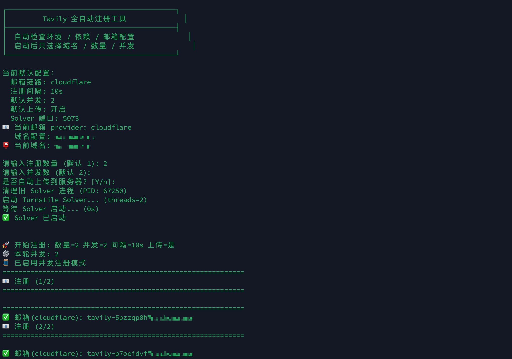
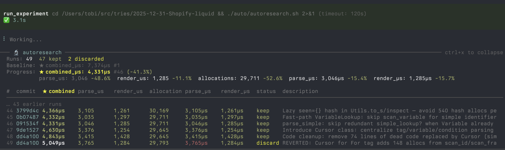
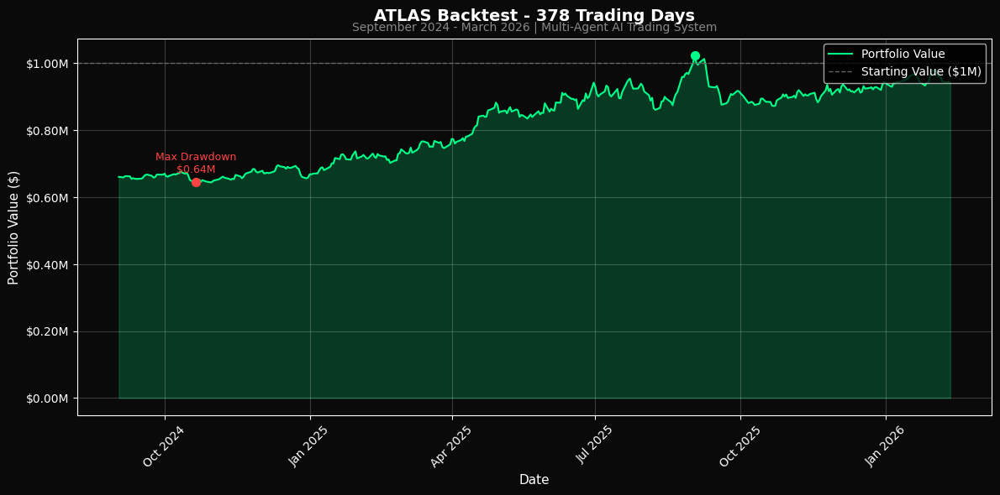

# GitHub Trending 排行榜

🔥 每周自动爬取GitHub最受欢迎的开源项目，生成AI智能总结的中文排行榜

[](https://github.com/qfy123/GitHub-Trending-/actions)
[](https://nodejs.org/)
[](LICENSE)

## ✨ 特性

- 🤖 **AI智能总结** - 使用DeepSeek AI生成简洁的中文项目描述
- 📊 **多维度排名** - 综合Star数、活跃度、新鲜度等指标
- 🖼️ **自动爬取图片** - 从项目README提取代表性图片
- 📈 **趋势分析** - 对比历史数据，显示项目排名变化
- 🗂️ **完整归档** - 按年份/周数归档所有历史数据
- 🔄 **自动更新** - GitHub Actions每周自动执行

## 📈 本周排行榜

<!-- TRENDING-START -->
### GitHub趋势排行榜 - 2026年第12周

**📅 统计周期**: 2026-03-15 ~ 2026-03-21  
**📊 项目总数**: 10 个  
**⭐ 总Star数**: 26,183  
**🔄 更新时间**: 2026-03-21 23:59:59  

| 排名 | 项目 | 描述 | Star | Fork | 语言 | 趋势 |
|------|------|------|------|------|------|------|
| 1 | [gstack](https://github.com/garrytan/gstack) | 把 Claude Code 变成可召唤的6人专家团队：CEO/Eng Manager/Release Manage... | 14,487 | 1,654 | TypeScript | 🆕 |
| 2 | [gsd-2](https://github.com/gsd-build/gsd-2) | GSD-2 把 Claude 的提示框架升级为独立 CLI，让 AI 长时间自主编码不跑题，全程按规格驱动。 | 1,388 | 119 | TypeScript | 🆕 |
| 3 | [openclaw-control-center](https://github.com/TianyiDataScience/openclaw-control-center) | 一个使用TypeScript开发的开源项目：Turn OpenClaw from a black box into... | 1,763 | 240 | TypeScript | 🆕 |
| 4 | [tavily-key-generator](https://github.com/skernelx/tavily-key-generator) | 一个使用Python开发的开源项目：Auto batch register Tavily API Keys wit... | 930 | 710 | Python | 🆕 |
| 5 | [inkos](https://github.com/Narcooo/inkos) | 一个使用TypeScript开发的开源项目：Multi-agent novel production system... | 900 | 186 | TypeScript | 🆕 |
| 6 | [MANPADS-System-Launcher-and-Rocket](https://github.com/novatic14/MANPADS-System-Launcher-and-Rocket) | 开源便携防空火箭与发射器原型，含完整机械、电子、固件及试射资料，可低成本复现。 | 1,059 | 253 | Unknown | 🆕 |
| 7 | [pi-autoresearch](https://github.com/davebcn87/pi-autoresearch) | 为pi打造的自主实验循环扩展：自动提出假设→测量→保留优解→无限迭代，持续优化任意指标。 | 1,875 | 93 | TypeScript | 🆕 |
| 8 | [chrome-cdp-skill](https://github.com/pasky/chrome-cdp-skill) | 一键让AI直接接管你正在用的Chrome，读取已登录标签页、操作网页，无需额外浏览器或重新登录。 | 1,593 | 88 | JavaScript | 🆕 |
| 9 | [Auto-claude-code-research-in-sleep](https://github.com/wanshuiyin/Auto-claude-code-research-in-sleep) | 让Claude Code在你睡觉时全自动完成ML论文评审、弱点定位、实验重跑与故事重写，醒来即可收获改进稿。 | 1,383 | 129 | Python | 🆕 |
| 10 | [atlas-gic](https://github.com/chrisworsey55/atlas-gic) | ATLAS让25个AI交易代理每日辩论市场，用真实盈亏当损失，自动重写最差代理的提示词，实现零GPU自进化策略。 | 805 | 170 | Unknown | 🆕 |

### 🔥 详细介绍

#### 1. [gstack](https://github.com/garrytan/gstack) 

**📝 项目简介**: 把 Claude Code 变成可召唤的6人专家团队：CEO/Eng Manager/Release Manager/QA，一键完成需求评审、代码审查、发布与测试，避免AI只按字面开发。

**✨ 核心特性**:
- /slash命令即可召唤不同角色
- 一次运行成本仅1美元
- 内置浏览器自动化与QA测试

**📊 项目统计**:
- **⭐ Star数**: 14,487
- **🔀 Fork数**: 1,654
- **👀 Watch数**: 14,487
- **📝 语言**: TypeScript
- **💻 技术栈**: TypeScript, Go Template, Shell
- **📈 趋势**: 🆕 新上榜项目

---

#### 2. [gsd-2](https://github.com/gsd-build/gsd-2) 

**📝 项目简介**: GSD-2 把 Claude 的提示框架升级为独立 CLI，让 AI 长时间自主编码不跑题，全程按规格驱动。

**✨ 核心特性**:
- 元提示+上下文工程，自动维持全局视图
- TypeScript 原生接入代理内核，告别注入式命令
- 规格即代码，需求变更一键同步到实现

**📊 项目统计**:
- **⭐ Star数**: 1,388
- **🔀 Fork数**: 119
- **👀 Watch数**: 1,388
- **📝 语言**: TypeScript
- **💻 技术栈**: TypeScript, Rust, JavaScript, Python, Swift, CSS
- **📈 趋势**: 🆕 新上榜项目

---

#### 3. [openclaw-control-center](https://github.com/TianyiDataScience/openclaw-control-center) 


**📝 项目简介**: 一个使用TypeScript开发的开源项目：Turn OpenClaw from a black box into a local control center you can see, trust, and control.，已获得1,763个star。

**✨ 核心特性**:
- 1,763 stars
- TypeScript

**📊 项目统计**:
- **⭐ Star数**: 1,763
- **🔀 Fork数**: 240
- **👀 Watch数**: 1,763
- **📝 语言**: TypeScript
- **💻 技术栈**: TypeScript, Shell, JavaScript, Python, Docker
- **📈 趋势**: 🆕 新上榜项目

---

#### 4. [tavily-key-generator](https://github.com/skernelx/tavily-key-generator) 



**📝 项目简介**: 一个使用Python开发的开源项目：Auto batch register Tavily API Keys with pluggable email backends，已获得930个star。

**✨ 核心特性**:
- 930 stars
- Python

**📊 项目统计**:
- **⭐ Star数**: 930
- **🔀 Fork数**: 710
- **👀 Watch数**: 930
- **📝 语言**: Python
- **💻 技术栈**: Python, HTML, Dockerfile, Shell, Batchfile, Docker
- **📈 趋势**: 🆕 新上榜项目

---

#### 5. [inkos](https://github.com/Narcooo/inkos) 


**📝 项目简介**: 一个使用TypeScript开发的开源项目：Multi-agent novel production system — AI agents autonomously write, audit, and revise novels with human review gates，已获得900个star。

**✨ 核心特性**:
- 900 stars
- TypeScript

**📊 项目统计**:
- **⭐ Star数**: 900
- **🔀 Fork数**: 186
- **👀 Watch数**: 900
- **📝 语言**: TypeScript
- **💻 技术栈**: TypeScript, JavaScript, agent, ai-writing, aigc-detection, automated-storytelling
- **📈 趋势**: 🆕 新上榜项目

---

#### 6. [MANPADS-System-Launcher-and-Rocket](https://github.com/novatic14/MANPADS-System-Launcher-and-Rocket) 


**📝 项目简介**: 开源便携防空火箭与发射器原型，含完整机械、电子、固件及试射资料，可低成本复现。

**✨ 核心特性**:
- 全链开源设计
- Google Drive共享全套图纸与测试数据
- 1美元获取5分钟系统演示

**📊 项目统计**:
- **⭐ Star数**: 1,059
- **🔀 Fork数**: 253
- **👀 Watch数**: 1,059
- **📝 语言**: Unknown
- **📈 趋势**: 🆕 新上榜项目

---

#### 7. [pi-autoresearch](https://github.com/davebcn87/pi-autoresearch) 



**📝 项目简介**: 为pi打造的自主实验循环扩展：自动提出假设→测量→保留优解→无限迭代，持续优化任意指标。

**✨ 核心特性**:
- 全自动闭环优化，无需人工干预
- 支持测试速度、包体积、LLM训练等多目标
- 提供实时看板与会话文件，结果可追溯

**📊 项目统计**:
- **⭐ Star数**: 1,875
- **🔀 Fork数**: 93
- **👀 Watch数**: 1,875
- **📝 语言**: TypeScript
- **💻 技术栈**: TypeScript
- **📈 趋势**: 🆕 新上榜项目

---

#### 8. [chrome-cdp-skill](https://github.com/pasky/chrome-cdp-skill) 

**📝 项目简介**: 一键让AI直接接管你正在用的Chrome，读取已登录标签页、操作网页，无需额外浏览器或重新登录。

**✨ 核心特性**:
- 零配置接入现有Chrome会话
- 无需重登录即可操作已认证页面
- 轻量CDP通道，无庞大自动化框架

**📊 项目统计**:
- **⭐ Star数**: 1,593
- **🔀 Fork数**: 88
- **👀 Watch数**: 1,593
- **📝 语言**: JavaScript
- **💻 技术栈**: JavaScript, Node.js, Express
- **📈 趋势**: 🆕 新上榜项目

---

#### 9. [Auto-claude-code-research-in-sleep](https://github.com/wanshuiyin/Auto-claude-code-research-in-sleep) 


**📝 项目简介**: 让Claude Code在你睡觉时全自动完成ML论文评审、弱点定位、实验重跑与故事重写，醒来即可收获改进稿。

**✨ 核心特性**:
- 跨模型互评循环，自动发现创新点
- 一键复现、修正实验并更新图表
- 集成Codex MCP，支持GLM、Kimi等多模型

**📊 项目统计**:
- **⭐ Star数**: 1,383
- **🔀 Fork数**: 129
- **👀 Watch数**: 1,383
- **📝 语言**: Python
- **💻 技术栈**: Python, TeX, ai-research, ai-tools, aris, autonomous-agent
- **📈 趋势**: 🆕 新上榜项目

---

#### 10. [atlas-gic](https://github.com/chrisworsey55/atlas-gic) 



**📝 项目简介**: ATLAS让25个AI交易代理每日辩论市场，用真实盈亏当损失，自动重写最差代理的提示词，实现零GPU自进化策略。

**✨ 核心特性**:
- 无需GPU，纯提示词进化
- 25层多代理辩论+实时Sharpe评分
- 真实市场反馈闭环优化

**📊 项目统计**:
- **⭐ Star数**: 805
- **🔀 Fork数**: 170
- **👀 Watch数**: 805
- **📝 语言**: Unknown
- **💻 技术栈**: Azure
- **📈 趋势**: 🆕 新上榜项目

---

### 📈 本周统计

**🔥 热门语言**:
1. **TypeScript** (5 个项目)
2. **Python** (2 个项目)
3. **Unknown** (2 个项目)
4. **JavaScript** (1 个项目)

**🏷️ 热门话题**:
1. context-engineering (1)
2. meta-prompting (1)
3. spec-driven-development (1)
4. agent (1)
5. ai-writing (1)
6. aigc-detection (1)
7. automated-storytelling (1)
8. chinese-novel (1)


<!-- TRENDING-END -->

## 📚 历史数据

<!-- HISTORY-START -->
| 时间 | 周期 | 项目数 | 链接 |
|------|------|--------|------|
| 03-21 | 2026年第12周 | 10 个 | [查看详情](./archives/2026/week-12/report.md) |
| 03-14 | 2026年第11周 | 10 个 | [查看详情](./archives/2026/week-11/report.md) |
| 03-07 | 2026年第10周 | 10 个 | [查看详情](./archives/2026/week-10/report.md) |
| 02-28 | 2026年第9周 | 10 个 | [查看详情](./archives/2026/week-9/report.md) |
| 02-21 | 2026年第8周 | 10 个 | [查看详情](./archives/2026/week-8/report.md) |
| 02-14 | 2026年第7周 | 10 个 | [查看详情](./archives/2026/week-7/report.md) |
| 02-07 | 2026年第6周 | 10 个 | [查看详情](./archives/2026/week-6/report.md) |
| 01-31 | 2026年第5周 | 10 个 | [查看详情](./archives/2026/week-5/report.md) |
| 01-24 | 2026年第4周 | 10 个 | [查看详情](./archives/2026/week-4/report.md) |
| 01-17 | 2026年第3周 | 10 个 | [查看详情](./archives/2026/week-3/report.md) |
| 01-10 | 2026年第2周 | 10 个 | [查看详情](./archives/2026/week-2/report.md) |
| 12-27 | 2025年第52周 | 10 个 | [查看详情](./archives/2025/week-52/report.md) |
| 12-20 | 2025年第51周 | 10 个 | [查看详情](./archives/2025/week-51/report.md) |
| 12-13 | 2025年第50周 | 10 个 | [查看详情](./archives/2025/week-50/report.md) |
| 12-06 | 2025年第49周 | 10 个 | [查看详情](./archives/2025/week-49/report.md) |
| 11-29 | 2025年第48周 | 10 个 | [查看详情](./archives/2025/week-48/report.md) |
| 11-22 | 2025年第47周 | 10 个 | [查看详情](./archives/2025/week-47/report.md) |
| 11-15 | 2025年第46周 | 10 个 | [查看详情](./archives/2025/week-46/report.md) |
| 11-08 | 2025年第45周 | 10 个 | [查看详情](./archives/2025/week-45/report.md) |
| 11-01 | 2025年第44周 | 10 个 | [查看详情](./archives/2025/week-44/report.md) |

[查看完整历史数据](./archives/)
<!-- HISTORY-END -->

## 🚀 快速开始

### 1. 克隆项目

```bash
git clone https://github.com/your-username/GitHub-Trending.git
cd GitHub-Trending
```

### 2. 安装依赖

```bash
npm install
```

### 3. 配置环境变量

```bash
# 复制环境变量模板
cp .env.example .env

# 编辑 .env 文件，填入以下必需配置：
# GITHUB_TOKEN=your_github_token
# SILICONFLOW_API_KEY=your_siliconflow_api_key
```

### 4. 测试配置

```bash
# 系统测试
node test/system-test.js

# 配置检查
node scripts/update-trending.js --check
```

### 5. 运行项目

```bash
# 测试运行（少量数据）
node scripts/update-trending.js --limit 3

# 正式运行
node scripts/update-trending.js
```

## 🔧 配置说明

### 环境变量

| 变量名 | 必需 | 说明 | 获取方式 |
|--------|------|------|----------|
| `GITHUB_TOKEN` | ✅ | GitHub API访问令牌 | [GitHub设置](https://github.com/settings/tokens) |
| `SILICONFLOW_API_KEY` | ✅ | 硅基流动API密钥 | [硅基流动官网](https://siliconflow.cn) |
| `AI_BASE_URL` | ❌ | AI服务地址 | 默认硅基流动 |
| `AI_MODEL` | ❌ | AI模型名称 | 默认deepseek-chat |

详细配置请参考：[配置指南](config/README.md)

### GitHub Actions自动化

1. **Fork本项目**到你的GitHub账号
2. **设置Secrets**：
   - `SILICONFLOW_API_KEY`: 硅基流动API密钥
3. **启用Actions**：项目会自动每周一更新

详细设置请参考：[GitHub Actions配置](-.github/README.md)

## 📊 项目结构

```
GitHub-Trending/
├── src/                          # 核心源码
│   ├── github-api.js            # GitHub API调用
│   ├── ai-summarizer.js         # AI项目总结
│   ├── image-crawler.js         # 图片爬取
│   ├── data-processor.js        # 数据处理
│   ├── file-manager.js          # 文件管理
│   └── readme-updater.js        # README更新
├── scripts/                      # 执行脚本
│   └── update-trending.js       # 主执行脚本
├── test/                         # 测试文件
│   └── system-test.js           # 系统测试
├── archives/                     # 历史数据归档
│   └── YYYY/                    # 按年份归档
│       └── week-XX.md           # 周报文件
├── images/                       # 项目图片
│   └── YYYY/week-XX/            # 按周归档
├── data/                         # 临时数据
├── config/                       # 配置文档
├── .github/                      # GitHub Actions
│   └── workflows/
└── README.md                     # 项目说明
```

## 🎯 使用场景

### 开发者
- 🔍 **发现新项目** - 了解最新热门开源项目
- 📈 **技术趋势** - 跟踪编程语言和技术栈趋势
- 💡 **学习参考** - 学习优秀项目的设计和实现

### 技术团队
- 📊 **技术选型** - 参考热门项目进行技术选型
- 🎯 **竞品分析** - 关注同类项目的发展趋势
- 📝 **技术报告** - 生成定期的技术趋势报告

### 内容创作者
- ✍️ **素材收集** - 为技术文章和视频收集素材
- 📰 **新闻线索** - 发现值得报道的新兴项目
- 🗣️ **分享内容** - 分享有价值的开源项目

## 🛠️ 命令行工具

```bash
# 查看帮助
node scripts/update-trending.js --help

# 检查配置
node scripts/update-trending.js --check

# 自定义参数运行
node scripts/update-trending.js --limit 20 --language python

# 数据管理
node scripts/update-trending.js --backup     # 创建备份
node scripts/update-trending.js --cleanup    # 清理过期数据
node scripts/update-trending.js --stats      # 查看统计信息

# 系统测试
node test/system-test.js                      # 完整测试
node test/system-test.js --quick             # 快速诊断
```

## 📈 排名算法

项目排名基于以下三个维度的综合评分：

### 🌟 受欢迎程度 (50%)
- **Star数量** (60%): 项目获得的Star数
- **Fork数量** (25%): 项目被Fork的次数  
- **Watch数量** (15%): 项目被Watch的次数

### 🔥 活跃程度 (30%)
- **最近提交** (50%): 距离最后一次提交的时间
- **Issues活跃度** (30%): 开放的Issues数量
- **Fork活跃度** (20%): Fork的活跃程度

### 🆕 新鲜程度 (20%)
- **创建时间** (30%): 项目创建时间（新项目得分高）
- **更新时间** (70%): 最近更新时间

### 趋势分析
- 📈 **上升**: 排名比上周提升
- 📉 **下降**: 排名比上周下降  
- ➡️ **稳定**: 排名无明显变化
- 🆕 **新上榜**: 首次进入排行榜

## 🤝 贡献指南

欢迎提交 Issues 和 Pull Requests！

### 开发环境设置

```bash
# 1. Fork 并克隆项目
git clone https://github.com/your-username/GitHub-Trending.git

# 2. 创建功能分支
git checkout -b feature/your-feature

# 3. 安装依赖并测试
npm install
node test/system-test.js

# 4. 开发完成后提交
git commit -m "feat: 添加新功能"
git push origin feature/your-feature
```

### 提交规范

- `feat`: 新功能
- `fix`: 修复bug
- `docs`: 文档更新
- `style`: 代码格式调整
- `refactor`: 代码重构
- `test`: 测试相关
- `chore`: 构建/工具相关

## 📄 许可证

本项目基于 [MIT 许可证](LICENSE) 开源。

## 🙏 致谢

- [GitHub API](https://docs.github.com/en/rest) - 提供项目数据
- [硅基流动](https://siliconflow.cn) - 提供AI总结服务
- [DeepSeek](https://deepseek.com) - 优秀的AI模型
- [GitHub Actions](https://github.com/features/actions) - 自动化支持

## 📞 联系方式

- 🐛 **Bug报告**: [提交Issue](https://github.com/your-username/GitHub-Trending/issues)
- 💡 **功能建议**: [功能请求](https://github.com/your-username/GitHub-Trending/issues)
- 📧 **其他问题**: [发送邮件](mailto:your-email@example.com)

## 🔗 相关链接

- [项目文档](https://github.com/your-username/GitHub-Trending/wiki)
- [更新日志](CHANGELOG.md)
- [FAQ](FAQ.md)

---

⭐ 如果这个项目对你有帮助，请给它一个Star！

*本项目由 [GitHub Actions](https://github.com/features/actions) 自动维护，数据每周更新*