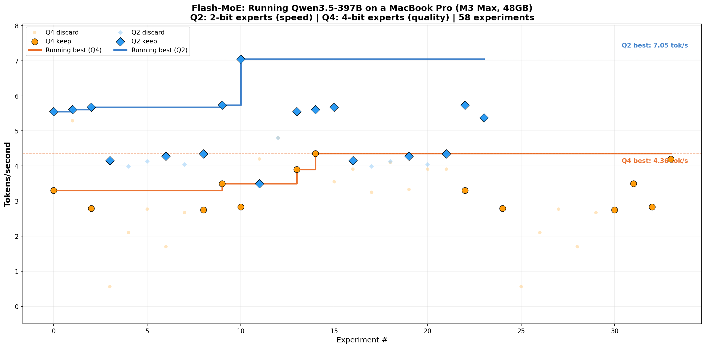

# GitHub Trending 排行榜

🔥 每周自动爬取GitHub最受欢迎的开源项目，生成AI智能总结的中文排行榜

[](https://github.com/qfy123/GitHub-Trending-/actions)
[](https://nodejs.org/)
[](LICENSE)

## ✨ 特性

- 🤖 **AI智能总结** - 使用DeepSeek AI生成简洁的中文项目描述
- 📊 **多维度排名** - 综合Star数、活跃度、新鲜度等指标
- 🖼️ **自动爬取图片** - 从项目README提取代表性图片
- 📈 **趋势分析** - 对比历史数据，显示项目排名变化
- 🗂️ **完整归档** - 按年份/周数归档所有历史数据
- 🔄 **自动更新** - GitHub Actions每周自动执行

## 📈 本周排行榜

<!-- TRENDING-START -->
### GitHub趋势排行榜 - 2026年第13周

**📅 统计周期**: 2026-03-22 ~ 2026-03-28  
**📊 项目总数**: 10 个  
**⭐ 总Star数**: 14,015  
**🔄 更新时间**: 2026-03-28 23:59:59  

| 排名 | 项目 | 描述 | Star | Fork | 语言 | 趋势 |
|------|------|------|------|------|------|------|
| 1 | [ClawTeam](https://github.com/HKUDS/ClawTeam) | 一个使用Python开发的开源项目：ClawTeam: Agent Swarm Intelligence (One... | 2,921 | 379 | Python | 🆕 |
| 2 | [any-auto-register](https://github.com/lxf746/any-auto-register) | 一键批量注册多平台账号（Trae、Cursor、ChatGPT等），插件化扩展，自带Web管理界面，支持邮箱、验证... | 1,000 | 502 | Python | 🆕 |
| 3 | [skills](https://github.com/MiniMax-AI/skills) | MiniMax Skills为AI编程助手提供结构化、可直接落地的开发技能包，覆盖前端、全栈、移动端与Shader... | 2,208 | 127 | C# | 🆕 |
| 4 | [awesome-codex-subagents](https://github.com/VoltAgent/awesome-codex-subagents) | 精选136+个Codex子代理，按10大开发场景分类，开箱即用，极大提升AI编程效率。 | 2,105 | 175 | Unknown | 🆕 |
| 5 | [flash-moe](https://github.com/danveloper/flash-moe) | 用纯C/Metal在48GB内存MacBook Pro上本地跑通3970亿参数MoE大模型，4.4token/s，... | 1,299 | 119 | Objective-C | 🆕 |
| 6 | [OpenGauss](https://github.com/math-inc/OpenGauss) | Math.Inc开源的多智能体Lean4工作流编排器，为Gauss提供证明、草拟、自动证明、形式化与自动形式化一站... | 1,026 | 85 | Python | 🆕 |
| 7 | [dbskill](https://github.com/dontbesilent2025/dbskill) | 将1.2万条推文提炼成4千+知识原子，打包成Claude Code技能，一键做商业诊断、内容优化与执行力提升。 | 993 | 174 | Unknown | 🆕 |
| 8 | [taiwan-md](https://github.com/frank890417/taiwan-md) | 开源、AI友好的台湾知识库，用结构化数据与精选内容让世界与AI真正认识台湾，超越维基与旅游指南。 | 725 | 81 | Astro | 🆕 |
| 9 | [autoresearch-genealogy](https://github.com/mattprusak/autoresearch-genealogy) | 为AI辅助家谱研究提供结构化提示、Vault模板与归档指南，帮助研究者高效整理9代6系的家族史料。 | 880 | 73 | Unknown | 🆕 |
| 10 | [app-store-preflight-skills](https://github.com/truongduy2611/app-store-preflight-skills) | 在提交iOS/macOS应用前，AI自动扫描Xcode工程、源码与配置，提前发现易被App Store拒审的违规点... | 858 | 46 | Unknown | 🆕 |

### 🔥 详细介绍

#### 1. [ClawTeam](https://github.com/HKUDS/ClawTeam) 


**📝 项目简介**: 一个使用Python开发的开源项目：ClawTeam: Agent Swarm Intelligence (One Command → Full Automation)，已获得2,921个star。

**✨ 核心特性**:
- 2,921 stars
- Python

**📊 项目统计**:
- **⭐ Star数**: 2,921
- **🔀 Fork数**: 379
- **👀 Watch数**: 2,921
- **📝 语言**: Python
- **💻 技术栈**: Python, HTML, React, Docker, Redis, PostgreSQL
- **📈 趋势**: 🆕 新上榜项目

---

#### 2. [any-auto-register](https://github.com/lxf746/any-auto-register) 

**📝 项目简介**: 一键批量注册多平台账号（Trae、Cursor、ChatGPT等），插件化扩展，自带Web管理界面，支持邮箱、验证码、代理池全自动化。

**✨ 核心特性**:
- 多平台插件扩展，新平台可热插拔
- 内置邮箱+验证码+代理池，全流程无人值守
- FastAPI+React实时日志，并发可控可视

**📊 项目统计**:
- **⭐ Star数**: 1,000
- **🔀 Fork数**: 502
- **👀 Watch数**: 1,000
- **📝 语言**: Python
- **💻 技术栈**: Python, TypeScript, CSS, JavaScript, Dockerfile, Shell
- **📈 趋势**: 🆕 新上榜项目

---

#### 3. [skills](https://github.com/MiniMax-AI/skills) 

**📝 项目简介**: MiniMax Skills为AI编程助手提供结构化、可直接落地的开发技能包，覆盖前端、全栈、移动端与Shader场景，显著提升AI生成代码的生产级质量。

**✨ 核心特性**:
- 即插即用：适配主流AI编程工具
- 多领域覆盖：前端/全栈/Android/iOS/Shader
- 持续迭代：社区反馈驱动，格式与API快速演进

**📊 项目统计**:
- **⭐ Star数**: 2,208
- **🔀 Fork数**: 127
- **👀 Watch数**: 2,208
- **📝 语言**: C#
- **💻 技术栈**: C#, Python, Shell, HTML, JavaScript, PowerShell
- **📈 趋势**: 🆕 新上榜项目

---

#### 4. [awesome-codex-subagents](https://github.com/VoltAgent/awesome-codex-subagents) 


**📝 项目简介**: 精选136+个Codex子代理，按10大开发场景分类，开箱即用，极大提升AI编程效率。

**✨ 核心特性**:
- 覆盖130+专用子代理
- 10大开发场景一键调用
- 持续更新社区维护

**📊 项目统计**:
- **⭐ Star数**: 2,105
- **🔀 Fork数**: 175
- **👀 Watch数**: 2,105
- **📝 语言**: Unknown
- **🌐 官网**: [https://github.com/VoltAgent/voltagent](https://github.com/VoltAgent/voltagent)
- **💻 技术栈**: ai-agents, awesome-list, chatgpt, codex, codex-skills, codex-subagents
- **📈 趋势**: 🆕 新上榜项目

---

#### 5. [flash-moe](https://github.com/danveloper/flash-moe) 



**📝 项目简介**: 用纯C/Metal在48GB内存MacBook Pro上本地跑通3970亿参数MoE大模型，4.4token/s，零依赖，零成本。

**✨ 核心特性**:
- 397B参数MoE笔记本可跑
- 纯C/Metal引擎，无Python框架
- 48GB内存+SSD流式加载，4.4token/s

**📊 项目统计**:
- **⭐ Star数**: 1,299
- **🔀 Fork数**: 119
- **👀 Watch数**: 1,299
- **📝 语言**: Objective-C
- **💻 技术栈**: Objective-C, C, TeX, Python, Metal, Shell
- **📈 趋势**: 🆕 新上榜项目

---

#### 6. [OpenGauss](https://github.com/math-inc/OpenGauss) 

**📝 项目简介**: Math.Inc开源的多智能体Lean4工作流编排器，为Gauss提供证明、草拟、自动证明、形式化与自动形式化一站式前端，并自动管理Lean工具链与会话状态。

**✨ 核心特性**:
- 一站式Lean4证明工作流
- 多智能体协作前端
- 自动管理工具链与状态

**📊 项目统计**:
- **⭐ Star数**: 1,026
- **🔀 Fork数**: 85
- **👀 Watch数**: 1,026
- **📝 语言**: Python
- **💻 技术栈**: Python, TeX, BibTeX Style, Shell, PowerShell, CSS
- **📈 趋势**: 🆕 新上榜项目

---

#### 7. [dbskill](https://github.com/dontbesilent2025/dbskill) 

**📝 项目简介**: 将1.2万条推文提炼成4千+知识原子，打包成Claude Code技能，一键做商业诊断、内容优化与执行力提升。

**✨ 核心特性**:
- 推文→原子化知识库，可整用可拆分
- 内置短视频钩子、奥派聊天室等10+技能
- Skill联动闭环，诊断-讨论-行动一体化

**📊 项目统计**:
- **⭐ Star数**: 993
- **🔀 Fork数**: 174
- **👀 Watch数**: 993
- **📝 语言**: Unknown
- **📈 趋势**: 🆕 新上榜项目

---

#### 8. [taiwan-md](https://github.com/frank890417/taiwan-md) 


**📝 项目简介**: 开源、AI友好的台湾知识库，用结构化数据与精选内容让世界与AI真正认识台湾，超越维基与旅游指南。

**✨ 核心特性**:
- AI-native结构化知识，方便模型训练与问答
- 开源协作持续精编，涵盖芯片、文化等深度议题
- Astro驱动，极速静态生成，多语言易扩展

**📊 项目统计**:
- **⭐ Star数**: 725
- **🔀 Fork数**: 81
- **👀 Watch数**: 725
- **📝 语言**: Astro
- **🌐 官网**: [https://taiwan.md](https://taiwan.md)
- **💻 技术栈**: Astro, TypeScript, Shell, JavaScript, Python
- **📈 趋势**: 🆕 新上榜项目

---

#### 9. [autoresearch-genealogy](https://github.com/mattprusak/autoresearch-genealogy) 

**📝 项目简介**: 为AI辅助家谱研究提供结构化提示、Vault模板与归档指南，帮助研究者高效整理9代6系的家族史料。

**✨ 核心特性**:
- 基于真实105份家谱成果提炼的通用方法
- 内置Claude Code工作流，可迁移至任意AI工具
- 提供可复用的研究模板与自动归档规范

**📊 项目统计**:
- **⭐ Star数**: 880
- **🔀 Fork数**: 73
- **👀 Watch数**: 880
- **📝 语言**: Unknown
- **📈 趋势**: 🆕 新上榜项目

---

#### 10. [app-store-preflight-skills](https://github.com/truongduy2611/app-store-preflight-skills) 

**📝 项目简介**: 在提交iOS/macOS应用前，AI自动扫描Xcode工程、源码与配置，提前发现易被App Store拒审的违规点，降低被拒风险。

**✨ 核心特性**:
- AI驱动预审查，精准匹配Apple拒审模式
- 一键扫描工程、元数据与配置文件
- 集成Homebrew，安装即用，CI友好

**📊 项目统计**:
- **⭐ Star数**: 858
- **🔀 Fork数**: 46
- **👀 Watch数**: 858
- **📝 语言**: Unknown
- **📈 趋势**: 🆕 新上榜项目

---

### 📈 本周统计

**🔥 热门语言**:
1. **Unknown** (4 个项目)
2. **Python** (3 个项目)
3. **C#** (1 个项目)
4. **Objective-C** (1 个项目)
5. **Astro** (1 个项目)

**🏷️ 热门话题**:
1. ai-agents (1)
2. awesome-list (1)
3. chatgpt (1)
4. codex (1)
5. codex-skills (1)
6. codex-subagents (1)
7. subagents (1)


<!-- TRENDING-END -->

## 📚 历史数据

<!-- HISTORY-START -->
| 时间 | 周期 | 项目数 | 链接 |
|------|------|--------|------|
| 03-28 | 2026年第13周 | 10 个 | [查看详情](./archives/2026/week-13/report.md) |
| 03-21 | 2026年第12周 | 10 个 | [查看详情](./archives/2026/week-12/report.md) |
| 03-14 | 2026年第11周 | 10 个 | [查看详情](./archives/2026/week-11/report.md) |
| 03-07 | 2026年第10周 | 10 个 | [查看详情](./archives/2026/week-10/report.md) |
| 02-28 | 2026年第9周 | 10 个 | [查看详情](./archives/2026/week-9/report.md) |
| 02-21 | 2026年第8周 | 10 个 | [查看详情](./archives/2026/week-8/report.md) |
| 02-14 | 2026年第7周 | 10 个 | [查看详情](./archives/2026/week-7/report.md) |
| 02-07 | 2026年第6周 | 10 个 | [查看详情](./archives/2026/week-6/report.md) |
| 01-31 | 2026年第5周 | 10 个 | [查看详情](./archives/2026/week-5/report.md) |
| 01-24 | 2026年第4周 | 10 个 | [查看详情](./archives/2026/week-4/report.md) |
| 01-17 | 2026年第3周 | 10 个 | [查看详情](./archives/2026/week-3/report.md) |
| 01-10 | 2026年第2周 | 10 个 | [查看详情](./archives/2026/week-2/report.md) |
| 12-27 | 2025年第52周 | 10 个 | [查看详情](./archives/2025/week-52/report.md) |
| 12-20 | 2025年第51周 | 10 个 | [查看详情](./archives/2025/week-51/report.md) |
| 12-13 | 2025年第50周 | 10 个 | [查看详情](./archives/2025/week-50/report.md) |
| 12-06 | 2025年第49周 | 10 个 | [查看详情](./archives/2025/week-49/report.md) |
| 11-29 | 2025年第48周 | 10 个 | [查看详情](./archives/2025/week-48/report.md) |
| 11-22 | 2025年第47周 | 10 个 | [查看详情](./archives/2025/week-47/report.md) |
| 11-15 | 2025年第46周 | 10 个 | [查看详情](./archives/2025/week-46/report.md) |
| 11-08 | 2025年第45周 | 10 个 | [查看详情](./archives/2025/week-45/report.md) |

[查看完整历史数据](./archives/)
<!-- HISTORY-END -->

## 🚀 快速开始

### 1. 克隆项目

```bash
git clone https://github.com/your-username/GitHub-Trending.git
cd GitHub-Trending
```

### 2. 安装依赖

```bash
npm install
```

### 3. 配置环境变量

```bash
# 复制环境变量模板
cp .env.example .env

# 编辑 .env 文件，填入以下必需配置：
# GITHUB_TOKEN=your_github_token
# SILICONFLOW_API_KEY=your_siliconflow_api_key
```

### 4. 测试配置

```bash
# 系统测试
node test/system-test.js

# 配置检查
node scripts/update-trending.js --check
```

### 5. 运行项目

```bash
# 测试运行（少量数据）
node scripts/update-trending.js --limit 3

# 正式运行
node scripts/update-trending.js
```

## 🔧 配置说明

### 环境变量

| 变量名 | 必需 | 说明 | 获取方式 |
|--------|------|------|----------|
| `GITHUB_TOKEN` | ✅ | GitHub API访问令牌 | [GitHub设置](https://github.com/settings/tokens) |
| `SILICONFLOW_API_KEY` | ✅ | 硅基流动API密钥 | [硅基流动官网](https://siliconflow.cn) |
| `AI_BASE_URL` | ❌ | AI服务地址 | 默认硅基流动 |
| `AI_MODEL` | ❌ | AI模型名称 | 默认deepseek-chat |

详细配置请参考：[配置指南](config/README.md)

### GitHub Actions自动化

1. **Fork本项目**到你的GitHub账号
2. **设置Secrets**：
   - `SILICONFLOW_API_KEY`: 硅基流动API密钥
3. **启用Actions**：项目会自动每周一更新

详细设置请参考：[GitHub Actions配置](-.github/README.md)

## 📊 项目结构

```
GitHub-Trending/
├── src/                          # 核心源码
│   ├── github-api.js            # GitHub API调用
│   ├── ai-summarizer.js         # AI项目总结
│   ├── image-crawler.js         # 图片爬取
│   ├── data-processor.js        # 数据处理
│   ├── file-manager.js          # 文件管理
│   └── readme-updater.js        # README更新
├── scripts/                      # 执行脚本
│   └── update-trending.js       # 主执行脚本
├── test/                         # 测试文件
│   └── system-test.js           # 系统测试
├── archives/                     # 历史数据归档
│   └── YYYY/                    # 按年份归档
│       └── week-XX.md           # 周报文件
├── images/                       # 项目图片
│   └── YYYY/week-XX/            # 按周归档
├── data/                         # 临时数据
├── config/                       # 配置文档
├── .github/                      # GitHub Actions
│   └── workflows/
└── README.md                     # 项目说明
```

## 🎯 使用场景

### 开发者
- 🔍 **发现新项目** - 了解最新热门开源项目
- 📈 **技术趋势** - 跟踪编程语言和技术栈趋势
- 💡 **学习参考** - 学习优秀项目的设计和实现

### 技术团队
- 📊 **技术选型** - 参考热门项目进行技术选型
- 🎯 **竞品分析** - 关注同类项目的发展趋势
- 📝 **技术报告** - 生成定期的技术趋势报告

### 内容创作者
- ✍️ **素材收集** - 为技术文章和视频收集素材
- 📰 **新闻线索** - 发现值得报道的新兴项目
- 🗣️ **分享内容** - 分享有价值的开源项目

## 🛠️ 命令行工具

```bash
# 查看帮助
node scripts/update-trending.js --help

# 检查配置
node scripts/update-trending.js --check

# 自定义参数运行
node scripts/update-trending.js --limit 20 --language python

# 数据管理
node scripts/update-trending.js --backup     # 创建备份
node scripts/update-trending.js --cleanup    # 清理过期数据
node scripts/update-trending.js --stats      # 查看统计信息

# 系统测试
node test/system-test.js                      # 完整测试
node test/system-test.js --quick             # 快速诊断
```

## 📈 排名算法

项目排名基于以下三个维度的综合评分：

### 🌟 受欢迎程度 (50%)
- **Star数量** (60%): 项目获得的Star数
- **Fork数量** (25%): 项目被Fork的次数  
- **Watch数量** (15%): 项目被Watch的次数

### 🔥 活跃程度 (30%)
- **最近提交** (50%): 距离最后一次提交的时间
- **Issues活跃度** (30%): 开放的Issues数量
- **Fork活跃度** (20%): Fork的活跃程度

### 🆕 新鲜程度 (20%)
- **创建时间** (30%): 项目创建时间（新项目得分高）
- **更新时间** (70%): 最近更新时间

### 趋势分析
- 📈 **上升**: 排名比上周提升
- 📉 **下降**: 排名比上周下降  
- ➡️ **稳定**: 排名无明显变化
- 🆕 **新上榜**: 首次进入排行榜

## 🤝 贡献指南

欢迎提交 Issues 和 Pull Requests！

### 开发环境设置

```bash
# 1. Fork 并克隆项目
git clone https://github.com/your-username/GitHub-Trending.git

# 2. 创建功能分支
git checkout -b feature/your-feature

# 3. 安装依赖并测试
npm install
node test/system-test.js

# 4. 开发完成后提交
git commit -m "feat: 添加新功能"
git push origin feature/your-feature
```

### 提交规范

- `feat`: 新功能
- `fix`: 修复bug
- `docs`: 文档更新
- `style`: 代码格式调整
- `refactor`: 代码重构
- `test`: 测试相关
- `chore`: 构建/工具相关

## 📄 许可证

本项目基于 [MIT 许可证](LICENSE) 开源。

## 🙏 致谢

- [GitHub API](https://docs.github.com/en/rest) - 提供项目数据
- [硅基流动](https://siliconflow.cn) - 提供AI总结服务
- [DeepSeek](https://deepseek.com) - 优秀的AI模型
- [GitHub Actions](https://github.com/features/actions) - 自动化支持

## 📞 联系方式

- 🐛 **Bug报告**: [提交Issue](https://github.com/your-username/GitHub-Trending/issues)
- 💡 **功能建议**: [功能请求](https://github.com/your-username/GitHub-Trending/issues)
- 📧 **其他问题**: [发送邮件](mailto:your-email@example.com)

## 🔗 相关链接

- [项目文档](https://github.com/your-username/GitHub-Trending/wiki)
- [更新日志](CHANGELOG.md)
- [FAQ](FAQ.md)

---

⭐ 如果这个项目对你有帮助，请给它一个Star！

*本项目由 [GitHub Actions](https://github.com/features/actions) 自动维护，数据每周更新*