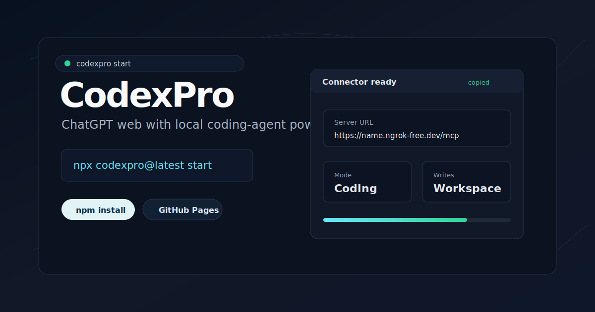
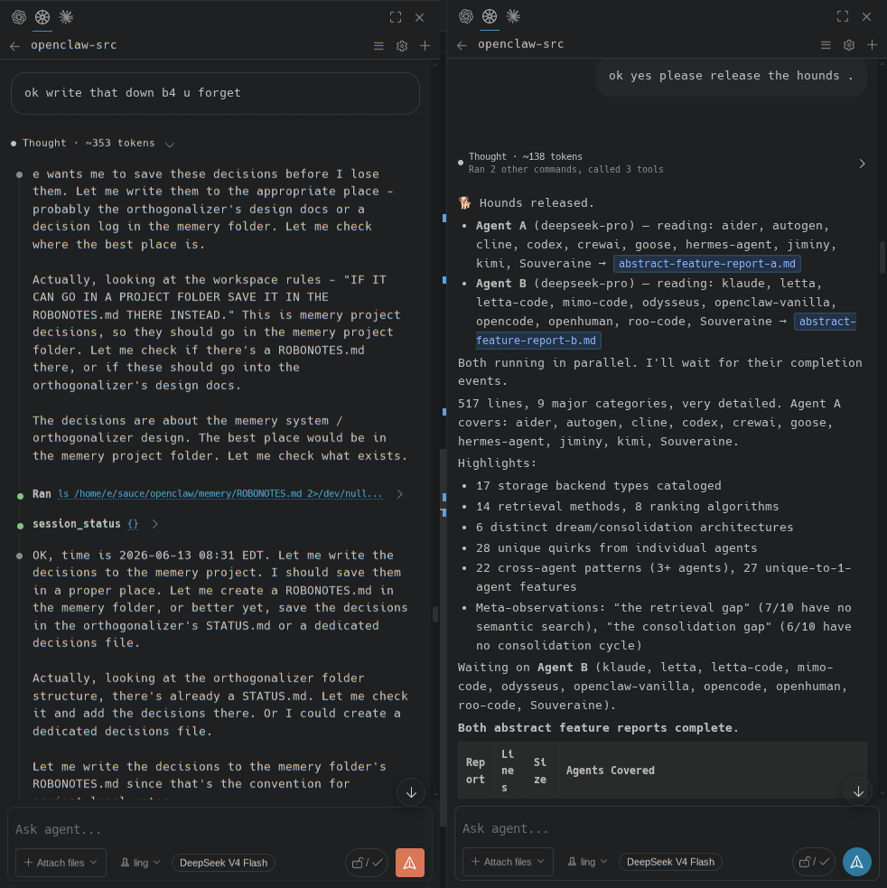

# GitHub Trending 排行榜

🔥 每周自动爬取GitHub最受欢迎的开源项目，生成AI智能总结的中文排行榜

[](https://github.com/qfy123/GitHub-Trending-/actions)
[](https://nodejs.org/)
[](LICENSE)

## ✨ 特性

- 🤖 **AI智能总结** - 使用DeepSeek AI生成简洁的中文项目描述
- 📊 **多维度排名** - 综合Star数、活跃度、新鲜度等指标
- 🖼️ **自动爬取图片** - 从项目README提取代表性图片
- 📈 **趋势分析** - 对比历史数据，显示项目排名变化
- 🗂️ **完整归档** - 按年份/周数归档所有历史数据
- 🔄 **自动更新** - GitHub Actions每周自动执行

## 📈 本周排行榜

<!-- TRENDING-START -->
### GitHub趋势排行榜 - 2026年第26周

**📅 统计周期**: 2026-06-21 ~ 2026-06-27  
**📊 项目总数**: 10 个  
**⭐ 总Star数**: 7,640  
**🔄 更新时间**: 2026-06-27 23:59:59  

| 排名 | 项目 | 描述 | Star | Fork | 语言 | 趋势 |
|------|------|------|------|------|------|------|
| 1 | [eve](https://github.com/vercel/eve) | 一个使用TypeScript开发的开源项目：The Framework for Building Agents，已... | 2,147 | 150 | TypeScript | 🆕 |
| 2 | [Cowart](https://github.com/zhongerxin/Cowart) | 一个热门的JavaScript开源项目，在GitHub上获得了1,589个star，值得关注。 | 1,589 | 129 | JavaScript | 🆕 |
| 3 | [polymarket-trading-bot-services-polyedge365](https://github.com/MstKail/polymarket-trading-bot-services-polyedge365) | 一个使用Unknown开发的开源项目：polymarket trading bot services, polym... | 385 | 710 | Unknown | 🆕 |
| 4 | [codexpro](https://github.com/rebel0789/codexpro) | 一个使用JavaScript开发的开源项目：Use ChatGPT Developer Mode as a loc... | 646 | 61 | JavaScript | 🆕 |
| 5 | [agent-apprenticeship](https://github.com/Forsy-AI/agent-apprenticeship) | 一个使用Unknown开发的开源项目：The living ecosystem where AI agents l... | 626 | 42 | Unknown | 🆕 |
| 6 | [webernetes](https://github.com/ngrok/webernetes) | 一个使用TypeScript开发的开源项目：Kubernetes in the browser.，已获得492个s... | 492 | 38 | TypeScript | 🆕 |
| 7 | [zhengxi-views](https://github.com/lyra81604/zhengxi-views) | 一个使用Python开发的开源项目：可溯源的郑希(易方达基金经理)投研 Agent Skill——基于他全部公开观... | 375 | 48 | Python | 🆕 |
| 8 | [Boogu-Image](https://github.com/boogu-project/Boogu-Image) | 一个使用Python开发的开源项目：Boogu-Image-0.1 is an Apache-2.0 open-s... | 418 | 19 | Python | 🆕 |
| 9 | [cnfast](https://github.com/aidenybai/cnfast) | 一个使用TypeScript开发的开源项目：Fast drop in replacement for `cn`，已... | 444 | 5 | TypeScript | 🆕 |
| 10 | [junction](https://github.com/Plaer1/junction) | 一个使用TypeScript开发的开源项目：VS Code chat sidebar for local AI c... | 518 | 7 | TypeScript | 🆕 |

### 🔥 详细介绍

#### 1. [eve](https://github.com/vercel/eve) 


**📝 项目简介**: 一个使用TypeScript开发的开源项目：The Framework for Building Agents，已获得2,147个star。

**✨ 核心特性**:
- 2,147 stars
- TypeScript

**📊 项目统计**:
- **⭐ Star数**: 2,147
- **🔀 Fork数**: 150
- **👀 Watch数**: 2,147
- **📝 语言**: TypeScript
- **🌐 官网**: [https://vercel.com/eve](https://vercel.com/eve)
- **💻 技术栈**: TypeScript, JavaScript, CSS, Svelte, Vue, Dockerfile
- **📈 趋势**: 🆕 新上榜项目

---

#### 2. [Cowart](https://github.com/zhongerxin/Cowart) 


**📝 项目简介**: 一个热门的JavaScript开源项目，在GitHub上获得了1,589个star，值得关注。

**✨ 核心特性**:
- 1,589 stars
- JavaScript

**📊 项目统计**:
- **⭐ Star数**: 1,589
- **🔀 Fork数**: 129
- **👀 Watch数**: 1,589
- **📝 语言**: JavaScript
- **💻 技术栈**: JavaScript, CSS, Shell, HTML
- **📈 趋势**: 🆕 新上榜项目

---

#### 3. [polymarket-trading-bot-services-polyedge365](https://github.com/MstKail/polymarket-trading-bot-services-polyedge365) 

**📝 项目简介**: 一个使用Unknown开发的开源项目：polymarket trading bot services, polymarket copy trading bot, polymarket arbitrage bot, polymarket hedge bot, polymarket maker bot, polymarket trading bot services, polymarket copy trading bot, polymarket arbitrage bot, polymarket hedge bot, polymarket maker bot, polymarket trading bot services, polymarket copy trading bot, polymarket arbitrage bot，已获得385个star。

**✨ 核心特性**:
- 385 stars
- Unknown

**📊 项目统计**:
- **⭐ Star数**: 385
- **🔀 Fork数**: 710
- **👀 Watch数**: 385
- **📝 语言**: Unknown
- **🌐 官网**: [https://polyedge365.com](https://polyedge365.com)
- **💻 技术栈**: arbitrage, bot, copy, hedge, market-marker, polyedge
- **📈 趋势**: 🆕 新上榜项目

---

#### 4. [codexpro](https://github.com/rebel0789/codexpro) 



**📝 项目简介**: 一个使用JavaScript开发的开源项目：Use ChatGPT Developer Mode as a local coding agent for your repo through MCP.，已获得646个star。

**✨ 核心特性**:
- 646 stars
- JavaScript

**📊 项目统计**:
- **⭐ Star数**: 646
- **🔀 Fork数**: 61
- **👀 Watch数**: 646
- **📝 语言**: JavaScript
- **🌐 官网**: [https://rebel0789.github.io/codexpro/](https://rebel0789.github.io/codexpro/)
- **💻 技术栈**: JavaScript, TypeScript, apps-sdk, chatgpt, cloudflare-tunnel, codex
- **📈 趋势**: 🆕 新上榜项目

---

#### 5. [agent-apprenticeship](https://github.com/Forsy-AI/agent-apprenticeship) 


**📝 项目简介**: 一个使用Unknown开发的开源项目：The living ecosystem where AI agents learn from real-world work through iterative workflow loops, reusable experience, and collective training signal exchange.，已获得626个star。

**✨ 核心特性**:
- 626 stars
- Unknown

**📊 项目统计**:
- **⭐ Star数**: 626
- **🔀 Fork数**: 42
- **👀 Watch数**: 626
- **📝 语言**: Unknown
- **🌐 官网**: [https://agentapprenticeship.org/](https://agentapprenticeship.org/)
- **💻 技术栈**: agent-apprenticeship, agent-economy, agent-experience, agent-learning, agent-traces, agentic-ai
- **📈 趋势**: 🆕 新上榜项目

---

#### 6. [webernetes](https://github.com/ngrok/webernetes) 

**📝 项目简介**: 一个使用TypeScript开发的开源项目：Kubernetes in the browser.，已获得492个star。

**✨ 核心特性**:
- 492 stars
- TypeScript

**📊 项目统计**:
- **⭐ Star数**: 492
- **🔀 Fork数**: 38
- **👀 Watch数**: 492
- **📝 语言**: TypeScript
- **💻 技术栈**: TypeScript, JavaScript, Shell, Docker, Kubernetes
- **📈 趋势**: 🆕 新上榜项目

---

#### 7. [zhengxi-views](https://github.com/lyra81604/zhengxi-views) 


**📝 项目简介**: 一个使用Python开发的开源项目：可溯源的郑希(易方达基金经理)投研 Agent Skill——基于他全部公开观点原文 + 有原话佐证的投资方法 + 全市场基金真实数据，能溯源问答、按他框架给基金打分，绝不杜撰。⚠️仅研究学习辅助，不构成投资建议‼️website是郑希主页！，已获得375个star。

**✨ 核心特性**:
- 375 stars
- Python

**📊 项目统计**:
- **⭐ Star数**: 375
- **🔀 Fork数**: 48
- **👀 Watch数**: 375
- **📝 语言**: Python
- **🌐 官网**: [https://www.efunds.com.cn/manager/462.shtml](https://www.efunds.com.cn/manager/462.shtml)
- **💻 技术栈**: Python, agent-skill, chinese-funds, funds, investing
- **📈 趋势**: 🆕 新上榜项目

---

#### 8. [Boogu-Image](https://github.com/boogu-project/Boogu-Image) 


**📝 项目简介**: 一个使用Python开发的开源项目：Boogu-Image-0.1 is an Apache-2.0 open-source image generation and editing model family that delivers near-closed-source performance with an order of magnitude less data.，已获得418个star。

**✨ 核心特性**:
- 418 stars
- Python

**📊 项目统计**:
- **⭐ Star数**: 418
- **🔀 Fork数**: 19
- **👀 Watch数**: 418
- **📝 语言**: Python
- **💻 技术栈**: Python, Shell
- **📈 趋势**: 🆕 新上榜项目

---

#### 9. [cnfast](https://github.com/aidenybai/cnfast) 


**📝 项目简介**: 一个使用TypeScript开发的开源项目：Fast drop in replacement for `cn`，已获得444个star。

**✨ 核心特性**:
- 444 stars
- TypeScript

**📊 项目统计**:
- **⭐ Star数**: 444
- **🔀 Fork数**: 5
- **👀 Watch数**: 444
- **📝 语言**: TypeScript
- **💻 技术栈**: TypeScript, Shell, JavaScript, clsx, cn, tailwindcss
- **📈 趋势**: 🆕 新上榜项目

---

#### 10. [junction](https://github.com/Plaer1/junction) 



**📝 项目简介**: 一个使用TypeScript开发的开源项目：VS Code chat sidebar for local AI coding agents，已获得518个star。

**✨ 核心特性**:
- 518 stars
- TypeScript

**📊 项目统计**:
- **⭐ Star数**: 518
- **🔀 Fork数**: 7
- **👀 Watch数**: 518
- **📝 语言**: TypeScript
- **💻 技术栈**: TypeScript, JavaScript, CSS, HTML, Shell, REST API
- **📈 趋势**: 🆕 新上榜项目

---

### 📈 本周统计

**🔥 热门语言**:
1. **TypeScript** (4 个项目)
2. **JavaScript** (2 个项目)
3. **Unknown** (2 个项目)
4. **Python** (2 个项目)

**🏷️ 热门话题**:
1. codex (2)
2. agent (1)
3. framework (1)
4. harness (1)
5. javascript (1)
6. markdown (1)
7. sandbox (1)
8. typescript (1)


<!-- TRENDING-END -->

## 📚 历史数据

<!-- HISTORY-START -->
| 时间 | 周期 | 项目数 | 链接 |
|------|------|--------|------|
| 06-27 | 2026年第26周 | 10 个 | [查看详情](./archives/2026/week-26/report.md) |
| 06-20 | 2026年第25周 | 10 个 | [查看详情](./archives/2026/week-25/report.md) |
| 06-13 | 2026年第24周 | 10 个 | [查看详情](./archives/2026/week-24/report.md) |
| 06-06 | 2026年第23周 | 10 个 | [查看详情](./archives/2026/week-23/report.md) |
| 05-30 | 2026年第22周 | 10 个 | [查看详情](./archives/2026/week-22/report.md) |
| 05-23 | 2026年第21周 | 10 个 | [查看详情](./archives/2026/week-21/report.md) |
| 05-16 | 2026年第20周 | 10 个 | [查看详情](./archives/2026/week-20/report.md) |
| 05-09 | 2026年第19周 | 10 个 | [查看详情](./archives/2026/week-19/report.md) |
| 05-02 | 2026年第18周 | 10 个 | [查看详情](./archives/2026/week-18/report.md) |
| 04-25 | 2026年第17周 | 10 个 | [查看详情](./archives/2026/week-17/report.md) |
| 04-18 | 2026年第16周 | 10 个 | [查看详情](./archives/2026/week-16/report.md) |
| 04-11 | 2026年第15周 | 10 个 | [查看详情](./archives/2026/week-15/report.md) |
| 04-04 | 2026年第14周 | 10 个 | [查看详情](./archives/2026/week-14/report.md) |
| 03-28 | 2026年第13周 | 10 个 | [查看详情](./archives/2026/week-13/report.md) |
| 03-21 | 2026年第12周 | 10 个 | [查看详情](./archives/2026/week-12/report.md) |
| 03-14 | 2026年第11周 | 10 个 | [查看详情](./archives/2026/week-11/report.md) |
| 03-07 | 2026年第10周 | 10 个 | [查看详情](./archives/2026/week-10/report.md) |
| 02-28 | 2026年第9周 | 10 个 | [查看详情](./archives/2026/week-9/report.md) |
| 02-21 | 2026年第8周 | 10 个 | [查看详情](./archives/2026/week-8/report.md) |
| 02-14 | 2026年第7周 | 10 个 | [查看详情](./archives/2026/week-7/report.md) |

[查看完整历史数据](./archives/)
<!-- HISTORY-END -->

## 🚀 快速开始

### 1. 克隆项目

```bash
git clone https://github.com/your-username/GitHub-Trending.git
cd GitHub-Trending
```

### 2. 安装依赖

```bash
npm install
```

### 3. 配置环境变量

```bash
# 复制环境变量模板
cp .env.example .env

# 编辑 .env 文件，填入以下必需配置：
# GITHUB_TOKEN=your_github_token
# SILICONFLOW_API_KEY=your_siliconflow_api_key
```

### 4. 测试配置

```bash
# 系统测试
node test/system-test.js

# 配置检查
node scripts/update-trending.js --check
```

### 5. 运行项目

```bash
# 测试运行（少量数据）
node scripts/update-trending.js --limit 3

# 正式运行
node scripts/update-trending.js
```

## 🔧 配置说明

### 环境变量

| 变量名 | 必需 | 说明 | 获取方式 |
|--------|------|------|----------|
| `GITHUB_TOKEN` | ✅ | GitHub API访问令牌 | [GitHub设置](https://github.com/settings/tokens) |
| `SILICONFLOW_API_KEY` | ✅ | 硅基流动API密钥 | [硅基流动官网](https://siliconflow.cn) |
| `AI_BASE_URL` | ❌ | AI服务地址 | 默认硅基流动 |
| `AI_MODEL` | ❌ | AI模型名称 | 默认deepseek-chat |

详细配置请参考：[配置指南](config/README.md)

### GitHub Actions自动化

1. **Fork本项目**到你的GitHub账号
2. **设置Secrets**：
   - `SILICONFLOW_API_KEY`: 硅基流动API密钥
3. **启用Actions**：项目会自动每周一更新

详细设置请参考：[GitHub Actions配置](-.github/README.md)

## 📊 项目结构

```
GitHub-Trending/
├── src/                          # 核心源码
│   ├── github-api.js            # GitHub API调用
│   ├── ai-summarizer.js         # AI项目总结
│   ├── image-crawler.js         # 图片爬取
│   ├── data-processor.js        # 数据处理
│   ├── file-manager.js          # 文件管理
│   └── readme-updater.js        # README更新
├── scripts/                      # 执行脚本
│   └── update-trending.js       # 主执行脚本
├── test/                         # 测试文件
│   └── system-test.js           # 系统测试
├── archives/                     # 历史数据归档
│   └── YYYY/                    # 按年份归档
│       └── week-XX.md           # 周报文件
├── images/                       # 项目图片
│   └── YYYY/week-XX/            # 按周归档
├── data/                         # 临时数据
├── config/                       # 配置文档
├── .github/                      # GitHub Actions
│   └── workflows/
└── README.md                     # 项目说明
```

## 🎯 使用场景

### 开发者
- 🔍 **发现新项目** - 了解最新热门开源项目
- 📈 **技术趋势** - 跟踪编程语言和技术栈趋势
- 💡 **学习参考** - 学习优秀项目的设计和实现

### 技术团队
- 📊 **技术选型** - 参考热门项目进行技术选型
- 🎯 **竞品分析** - 关注同类项目的发展趋势
- 📝 **技术报告** - 生成定期的技术趋势报告

### 内容创作者
- ✍️ **素材收集** - 为技术文章和视频收集素材
- 📰 **新闻线索** - 发现值得报道的新兴项目
- 🗣️ **分享内容** - 分享有价值的开源项目

## 🛠️ 命令行工具

```bash
# 查看帮助
node scripts/update-trending.js --help

# 检查配置
node scripts/update-trending.js --check

# 自定义参数运行
node scripts/update-trending.js --limit 20 --language python

# 数据管理
node scripts/update-trending.js --backup     # 创建备份
node scripts/update-trending.js --cleanup    # 清理过期数据
node scripts/update-trending.js --stats      # 查看统计信息

# 系统测试
node test/system-test.js                      # 完整测试
node test/system-test.js --quick             # 快速诊断
```

## 📈 排名算法

项目排名基于以下三个维度的综合评分：

### 🌟 受欢迎程度 (50%)
- **Star数量** (60%): 项目获得的Star数
- **Fork数量** (25%): 项目被Fork的次数  
- **Watch数量** (15%): 项目被Watch的次数

### 🔥 活跃程度 (30%)
- **最近提交** (50%): 距离最后一次提交的时间
- **Issues活跃度** (30%): 开放的Issues数量
- **Fork活跃度** (20%): Fork的活跃程度

### 🆕 新鲜程度 (20%)
- **创建时间** (30%): 项目创建时间（新项目得分高）
- **更新时间** (70%): 最近更新时间

### 趋势分析
- 📈 **上升**: 排名比上周提升
- 📉 **下降**: 排名比上周下降  
- ➡️ **稳定**: 排名无明显变化
- 🆕 **新上榜**: 首次进入排行榜

## 🤝 贡献指南

欢迎提交 Issues 和 Pull Requests！

### 开发环境设置

```bash
# 1. Fork 并克隆项目
git clone https://github.com/your-username/GitHub-Trending.git

# 2. 创建功能分支
git checkout -b feature/your-feature

# 3. 安装依赖并测试
npm install
node test/system-test.js

# 4. 开发完成后提交
git commit -m "feat: 添加新功能"
git push origin feature/your-feature
```

### 提交规范

- `feat`: 新功能
- `fix`: 修复bug
- `docs`: 文档更新
- `style`: 代码格式调整
- `refactor`: 代码重构
- `test`: 测试相关
- `chore`: 构建/工具相关

## 📄 许可证

本项目基于 [MIT 许可证](LICENSE) 开源。

## 🙏 致谢

- [GitHub API](https://docs.github.com/en/rest) - 提供项目数据
- [硅基流动](https://siliconflow.cn) - 提供AI总结服务
- [DeepSeek](https://deepseek.com) - 优秀的AI模型
- [GitHub Actions](https://github.com/features/actions) - 自动化支持

## 📞 联系方式

- 🐛 **Bug报告**: [提交Issue](https://github.com/your-username/GitHub-Trending/issues)
- 💡 **功能建议**: [功能请求](https://github.com/your-username/GitHub-Trending/issues)
- 📧 **其他问题**: [发送邮件](mailto:your-email@example.com)

## 🔗 相关链接

- [项目文档](https://github.com/your-username/GitHub-Trending/wiki)
- [更新日志](CHANGELOG.md)
- [FAQ](FAQ.md)

---

⭐ 如果这个项目对你有帮助，请给它一个Star！

*本项目由 [GitHub Actions](https://github.com/features/actions) 自动维护，数据每周更新*