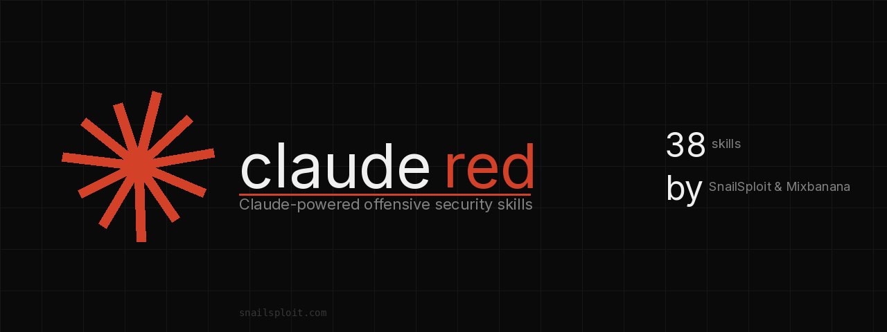
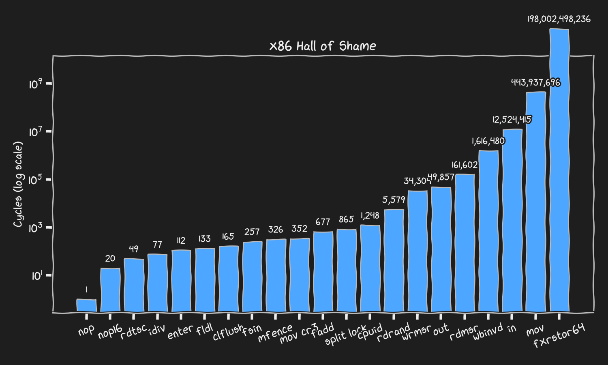

# GitHub Trending 排行榜

🔥 每周自动爬取GitHub最受欢迎的开源项目，生成AI智能总结的中文排行榜

[](https://github.com/qfy123/GitHub-Trending-/actions)
[](https://nodejs.org/)
[](LICENSE)

## ✨ 特性

- 🤖 **AI智能总结** - 使用DeepSeek AI生成简洁的中文项目描述
- 📊 **多维度排名** - 综合Star数、活跃度、新鲜度等指标
- 🖼️ **自动爬取图片** - 从项目README提取代表性图片
- 📈 **趋势分析** - 对比历史数据，显示项目排名变化
- 🗂️ **完整归档** - 按年份/周数归档所有历史数据
- 🔄 **自动更新** - GitHub Actions每周自动执行

## 📈 本周排行榜

<!-- TRENDING-START -->
### GitHub趋势排行榜 - 2026年第33周

**📅 统计周期**: 2026-08-09 ~ 2026-08-15  
**📊 项目总数**: 10 个  
**⭐ 总Star数**: 10,766  
**🔄 更新时间**: 2026-08-15 23:59:59  

| 排名 | 项目 | 描述 | Star | Fork | 语言 | 趋势 |
|------|------|------|------|------|------|------|
| 1 | [open-kimi-ppt-skill](https://github.com/Binaryify/open-kimi-ppt-skill) | 一个使用Unknown开发的开源项目：非官方 Kimi Slides Skill：让 AI Agent 生成可编辑... | 1,607 | 1,162 | Unknown | 🆕 |
| 2 | [human-writing](https://github.com/KKKKhazix/human-writing) | 一个使用Python开发的开源项目：让 AI 写的中文读起来像一个具体的人在说话。通用创作与改稿 Skill，开箱... | 2,134 | 189 | Python | 🆕 |
| 3 | [photo-abstract-editorial](https://github.com/ZzzLc0405/photo-abstract-editorial) | 一个热门的Unknown开源项目，在GitHub上获得了2,007个star，值得关注。 | 2,007 | 100 | Unknown | 🆕 |
| 4 | [phone-harness](https://github.com/ShawnPana/phone-harness) | 一个使用Python开发的开源项目：let your agent control your phone，已获得95... | 955 | 77 | Python | 🆕 |
| 5 | [claude-red](https://github.com/0xwilliamortiz/claude-red) | 一个使用JavaScript开发的开源项目：claude-red is a curated library of ... | 712 | 91 | JavaScript | 🆕 |
| 6 | [kage](https://github.com/MengTo/kage) | 一个使用HTML开发的开源项目：An interactive five-chapter night walk th... | 632 | 109 | HTML | 🆕 |
| 7 | [oil-motion](https://github.com/oil-oil/oil-motion) | 一个使用Python开发的开源项目：Create smooth, responsive interactive w... | 618 | 59 | Python | 🆕 |
| 8 | [JoyAI-Video-Edit](https://github.com/jd-opensource/JoyAI-Video-Edit) | 一个使用Python开发的开源项目：[Official Repo] JoyAI-Video-Edit: Real-... | 632 | 27 | Python | 🆕 |
| 9 | [awesome-growth-hacking-skills](https://github.com/mikiarlo3/awesome-growth-hacking-skills) | 一个使用Shell开发的开源项目：Find agentic growth hacking skills for C... | 799 | 14 | Shell | 🆕 |
| 10 | [asm-hall-of-shame](https://github.com/xoreaxeaxeax/asm-hall-of-shame) | 一个使用C开发的开源项目：Racing to the bottom of CPU performance，已获得6... | 670 | 7 | C | 🆕 |

### 🔥 详细介绍

#### 1. [open-kimi-ppt-skill](https://github.com/Binaryify/open-kimi-ppt-skill) 

**📝 项目简介**: 一个使用Unknown开发的开源项目：非官方 Kimi Slides Skill：让 AI Agent 生成可编辑 PPTD + PPTX，并附带本地浏览器编辑器 Unofficial Kimi Slides skill for AI agents — generate editable PPTD + PPTX with a local browser editor，已获得1,607个star。

**✨ 核心特性**:
- 1,607 stars
- Unknown

**📊 项目统计**:
- **⭐ Star数**: 1,607
- **🔀 Fork数**: 1,162
- **👀 Watch数**: 1,607
- **📝 语言**: Unknown
- **📈 趋势**: 🆕 新上榜项目

---

#### 2. [human-writing](https://github.com/KKKKhazix/human-writing) 


**📝 项目简介**: 一个使用Python开发的开源项目：让 AI 写的中文读起来像一个具体的人在说话。通用创作与改稿 Skill，开箱即用。，已获得2,134个star。

**✨ 核心特性**:
- 2,134 stars
- Python

**📊 项目统计**:
- **⭐ Star数**: 2,134
- **🔀 Fork数**: 189
- **👀 Watch数**: 2,134
- **📝 语言**: Python
- **💻 技术栈**: Python, agent-skills, chinese-writing, creative-writing, writing-skill
- **📈 趋势**: 🆕 新上榜项目

---

#### 3. [photo-abstract-editorial](https://github.com/ZzzLc0405/photo-abstract-editorial) 


**📝 项目简介**: 一个热门的Unknown开源项目，在GitHub上获得了2,007个star，值得关注。

**✨ 核心特性**:
- 2,007 stars
- Unknown

**📊 项目统计**:
- **⭐ Star数**: 2,007
- **🔀 Fork数**: 100
- **👀 Watch数**: 2,007
- **📝 语言**: Unknown
- **📈 趋势**: 🆕 新上榜项目

---

#### 4. [phone-harness](https://github.com/ShawnPana/phone-harness) 

**📝 项目简介**: 一个使用Python开发的开源项目：let your agent control your phone，已获得955个star。

**✨ 核心特性**:
- 955 stars
- Python

**📊 项目统计**:
- **⭐ Star数**: 955
- **🔀 Fork数**: 77
- **👀 Watch数**: 955
- **📝 语言**: Python
- **💻 技术栈**: Python, Shell
- **📈 趋势**: 🆕 新上榜项目

---

#### 5. [claude-red](https://github.com/0xwilliamortiz/claude-red) 



**📝 项目简介**: 一个使用JavaScript开发的开源项目：claude-red is a curated library of offensive security skills designed for the Claude skills system. Each skill is a structured SKILL.md file that primes Claude with expert-level methodology for a specific attack surface — from SQLi to shellcode, EDR evasion to exploit development.，已获得712个star。

**✨ 核心特性**:
- 712 stars
- JavaScript

**📊 项目统计**:
- **⭐ Star数**: 712
- **🔀 Fork数**: 91
- **👀 Watch数**: 712
- **📝 语言**: JavaScript
- **💻 技术栈**: JavaScript, Python, Shell, claude, claude-code, claude-code-plugin
- **📈 趋势**: 🆕 新上榜项目

---

#### 6. [kage](https://github.com/MengTo/kage) 


**📝 项目简介**: 一个使用HTML开发的开源项目：An interactive five-chapter night walk through a Kyoto mountain temple, rendered live in Three.js.，已获得632个star。

**✨ 核心特性**:
- 632 stars
- HTML

**📊 项目统计**:
- **⭐ Star数**: 632
- **🔀 Fork数**: 109
- **👀 Watch数**: 632
- **📝 语言**: HTML
- **🌐 官网**: [https://mengto.github.io/kage/](https://mengto.github.io/kage/)
- **💻 技术栈**: HTML, creative-coding, generative-art, interactive-storytelling, japanese-design, threejs
- **📈 趋势**: 🆕 新上榜项目

---

#### 7. [oil-motion](https://github.com/oil-oil/oil-motion) 


**📝 项目简介**: 一个使用Python开发的开源项目：Create smooth, responsive interactive web animations.，已获得618个star。

**✨ 核心特性**:
- 618 stars
- Python

**📊 项目统计**:
- **⭐ Star数**: 618
- **🔀 Fork数**: 59
- **👀 Watch数**: 618
- **📝 语言**: Python
- **💻 技术栈**: Python, HTML, TypeScript
- **📈 趋势**: 🆕 新上榜项目

---

#### 8. [JoyAI-Video-Edit](https://github.com/jd-opensource/JoyAI-Video-Edit) 


**📝 项目简介**: 一个使用Python开发的开源项目：[Official Repo] JoyAI-Video-Edit: Real-Time Open-Ended Video Editing with Autoregressive Diffusion，已获得632个star。

**✨ 核心特性**:
- 632 stars
- Python

**📊 项目统计**:
- **⭐ Star数**: 632
- **🔀 Fork数**: 27
- **👀 Watch数**: 632
- **📝 语言**: Python
- **💻 技术栈**: Python, HTML, Cuda, C++, Shell, C
- **📈 趋势**: 🆕 新上榜项目

---

#### 9. [awesome-growth-hacking-skills](https://github.com/mikiarlo3/awesome-growth-hacking-skills) 


**📝 项目简介**: 一个使用Shell开发的开源项目：Find agentic growth hacking skills for Claude, ChatGPT, Manus | by enso.bot，已获得799个star。

**✨ 核心特性**:
- 799 stars
- Shell

**📊 项目统计**:
- **⭐ Star数**: 799
- **🔀 Fork数**: 14
- **👀 Watch数**: 799
- **📝 语言**: Shell
- **💻 技术栈**: Shell
- **📈 趋势**: 🆕 新上榜项目

---

#### 10. [asm-hall-of-shame](https://github.com/xoreaxeaxeax/asm-hall-of-shame) 



**📝 项目简介**: 一个使用C开发的开源项目：Racing to the bottom of CPU performance，已获得670个star。

**✨ 核心特性**:
- 670 stars
- C

**📊 项目统计**:
- **⭐ Star数**: 670
- **🔀 Fork数**: 7
- **👀 Watch数**: 670
- **📝 语言**: C
- **💻 技术栈**: C, Makefile, Python, Shell
- **📈 趋势**: 🆕 新上榜项目

---

### 📈 本周统计

**🔥 热门语言**:
1. **Python** (4 个项目)
2. **Unknown** (2 个项目)
3. **JavaScript** (1 个项目)
4. **HTML** (1 个项目)
5. **Shell** (1 个项目)

**🏷️ 热门话题**:
1. agent-skills (1)
2. chinese-writing (1)
3. creative-writing (1)
4. writing-skill (1)
5. claude (1)
6. claude-code (1)
7. claude-code-plugin (1)
8. claude-skills (1)


<!-- TRENDING-END -->

## 📚 历史数据

<!-- HISTORY-START -->
| 时间 | 周期 | 项目数 | 链接 |
|------|------|--------|------|
| 08-15 | 2026年第33周 | 10 个 | [查看详情](./archives/2026/week-33/report.md) |
| 08-08 | 2026年第32周 | 10 个 | [查看详情](./archives/2026/week-32/report.md) |
| 08-01 | 2026年第31周 | 10 个 | [查看详情](./archives/2026/week-31/report.md) |
| 07-25 | 2026年第30周 | 10 个 | [查看详情](./archives/2026/week-30/report.md) |
| 07-18 | 2026年第29周 | 10 个 | [查看详情](./archives/2026/week-29/report.md) |
| 07-11 | 2026年第28周 | 10 个 | [查看详情](./archives/2026/week-28/report.md) |
| 07-04 | 2026年第27周 | 10 个 | [查看详情](./archives/2026/week-27/report.md) |
| 06-27 | 2026年第26周 | 10 个 | [查看详情](./archives/2026/week-26/report.md) |
| 06-20 | 2026年第25周 | 10 个 | [查看详情](./archives/2026/week-25/report.md) |
| 06-13 | 2026年第24周 | 10 个 | [查看详情](./archives/2026/week-24/report.md) |
| 06-06 | 2026年第23周 | 10 个 | [查看详情](./archives/2026/week-23/report.md) |
| 05-30 | 2026年第22周 | 10 个 | [查看详情](./archives/2026/week-22/report.md) |
| 05-23 | 2026年第21周 | 10 个 | [查看详情](./archives/2026/week-21/report.md) |
| 05-16 | 2026年第20周 | 10 个 | [查看详情](./archives/2026/week-20/report.md) |
| 05-09 | 2026年第19周 | 10 个 | [查看详情](./archives/2026/week-19/report.md) |
| 05-02 | 2026年第18周 | 10 个 | [查看详情](./archives/2026/week-18/report.md) |
| 04-25 | 2026年第17周 | 10 个 | [查看详情](./archives/2026/week-17/report.md) |
| 04-18 | 2026年第16周 | 10 个 | [查看详情](./archives/2026/week-16/report.md) |
| 04-11 | 2026年第15周 | 10 个 | [查看详情](./archives/2026/week-15/report.md) |
| 04-04 | 2026年第14周 | 10 个 | [查看详情](./archives/2026/week-14/report.md) |

[查看完整历史数据](./archives/)
<!-- HISTORY-END -->

## 🚀 快速开始

### 1. 克隆项目

```bash
git clone https://github.com/your-username/GitHub-Trending.git
cd GitHub-Trending
```

### 2. 安装依赖

```bash
npm install
```

### 3. 配置环境变量

```bash
# 复制环境变量模板
cp .env.example .env

# 编辑 .env 文件，填入以下必需配置：
# GITHUB_TOKEN=your_github_token
# SILICONFLOW_API_KEY=your_siliconflow_api_key
```

### 4. 测试配置

```bash
# 系统测试
node test/system-test.js

# 配置检查
node scripts/update-trending.js --check
```

### 5. 运行项目

```bash
# 测试运行（少量数据）
node scripts/update-trending.js --limit 3

# 正式运行
node scripts/update-trending.js
```

## 🔧 配置说明

### 环境变量

| 变量名 | 必需 | 说明 | 获取方式 |
|--------|------|------|----------|
| `GITHUB_TOKEN` | ✅ | GitHub API访问令牌 | [GitHub设置](https://github.com/settings/tokens) |
| `SILICONFLOW_API_KEY` | ✅ | 硅基流动API密钥 | [硅基流动官网](https://siliconflow.cn) |
| `AI_BASE_URL` | ❌ | AI服务地址 | 默认硅基流动 |
| `AI_MODEL` | ❌ | AI模型名称 | 默认deepseek-chat |

详细配置请参考：[配置指南](config/README.md)

### GitHub Actions自动化

1. **Fork本项目**到你的GitHub账号
2. **设置Secrets**：
   - `SILICONFLOW_API_KEY`: 硅基流动API密钥
3. **启用Actions**：项目会自动每周一更新

详细设置请参考：[GitHub Actions配置](-.github/README.md)

## 📊 项目结构

```
GitHub-Trending/
├── src/                          # 核心源码
│   ├── github-api.js            # GitHub API调用
│   ├── ai-summarizer.js         # AI项目总结
│   ├── image-crawler.js         # 图片爬取
│   ├── data-processor.js        # 数据处理
│   ├── file-manager.js          # 文件管理
│   └── readme-updater.js        # README更新
├── scripts/                      # 执行脚本
│   └── update-trending.js       # 主执行脚本
├── test/                         # 测试文件
│   └── system-test.js           # 系统测试
├── archives/                     # 历史数据归档
│   └── YYYY/                    # 按年份归档
│       └── week-XX.md           # 周报文件
├── images/                       # 项目图片
│   └── YYYY/week-XX/            # 按周归档
├── data/                         # 临时数据
├── config/                       # 配置文档
├── .github/                      # GitHub Actions
│   └── workflows/
└── README.md                     # 项目说明
```

## 🎯 使用场景

### 开发者
- 🔍 **发现新项目** - 了解最新热门开源项目
- 📈 **技术趋势** - 跟踪编程语言和技术栈趋势
- 💡 **学习参考** - 学习优秀项目的设计和实现

### 技术团队
- 📊 **技术选型** - 参考热门项目进行技术选型
- 🎯 **竞品分析** - 关注同类项目的发展趋势
- 📝 **技术报告** - 生成定期的技术趋势报告

### 内容创作者
- ✍️ **素材收集** - 为技术文章和视频收集素材
- 📰 **新闻线索** - 发现值得报道的新兴项目
- 🗣️ **分享内容** - 分享有价值的开源项目

## 🛠️ 命令行工具

```bash
# 查看帮助
node scripts/update-trending.js --help

# 检查配置
node scripts/update-trending.js --check

# 自定义参数运行
node scripts/update-trending.js --limit 20 --language python

# 数据管理
node scripts/update-trending.js --backup     # 创建备份
node scripts/update-trending.js --cleanup    # 清理过期数据
node scripts/update-trending.js --stats      # 查看统计信息

# 系统测试
node test/system-test.js                      # 完整测试
node test/system-test.js --quick             # 快速诊断
```

## 📈 排名算法

项目排名基于以下三个维度的综合评分：

### 🌟 受欢迎程度 (50%)
- **Star数量** (60%): 项目获得的Star数
- **Fork数量** (25%): 项目被Fork的次数  
- **Watch数量** (15%): 项目被Watch的次数

### 🔥 活跃程度 (30%)
- **最近提交** (50%): 距离最后一次提交的时间
- **Issues活跃度** (30%): 开放的Issues数量
- **Fork活跃度** (20%): Fork的活跃程度

### 🆕 新鲜程度 (20%)
- **创建时间** (30%): 项目创建时间（新项目得分高）
- **更新时间** (70%): 最近更新时间

### 趋势分析
- 📈 **上升**: 排名比上周提升
- 📉 **下降**: 排名比上周下降  
- ➡️ **稳定**: 排名无明显变化
- 🆕 **新上榜**: 首次进入排行榜

## 🤝 贡献指南

欢迎提交 Issues 和 Pull Requests！

### 开发环境设置

```bash
# 1. Fork 并克隆项目
git clone https://github.com/your-username/GitHub-Trending.git

# 2. 创建功能分支
git checkout -b feature/your-feature

# 3. 安装依赖并测试
npm install
node test/system-test.js

# 4. 开发完成后提交
git commit -m "feat: 添加新功能"
git push origin feature/your-feature
```

### 提交规范

- `feat`: 新功能
- `fix`: 修复bug
- `docs`: 文档更新
- `style`: 代码格式调整
- `refactor`: 代码重构
- `test`: 测试相关
- `chore`: 构建/工具相关

## 📄 许可证

本项目基于 [MIT 许可证](LICENSE) 开源。

## 🙏 致谢

- [GitHub API](https://docs.github.com/en/rest) - 提供项目数据
- [硅基流动](https://siliconflow.cn) - 提供AI总结服务
- [DeepSeek](https://deepseek.com) - 优秀的AI模型
- [GitHub Actions](https://github.com/features/actions) - 自动化支持

## 📞 联系方式

- 🐛 **Bug报告**: [提交Issue](https://github.com/your-username/GitHub-Trending/issues)
- 💡 **功能建议**: [功能请求](https://github.com/your-username/GitHub-Trending/issues)
- 📧 **其他问题**: [发送邮件](mailto:your-email@example.com)

## 🔗 相关链接

- [项目文档](https://github.com/your-username/GitHub-Trending/wiki)
- [更新日志](CHANGELOG.md)
- [FAQ](FAQ.md)

---

⭐ 如果这个项目对你有帮助，请给它一个Star！

*本项目由 [GitHub Actions](https://github.com/features/actions) 自动维护，数据每周更新*