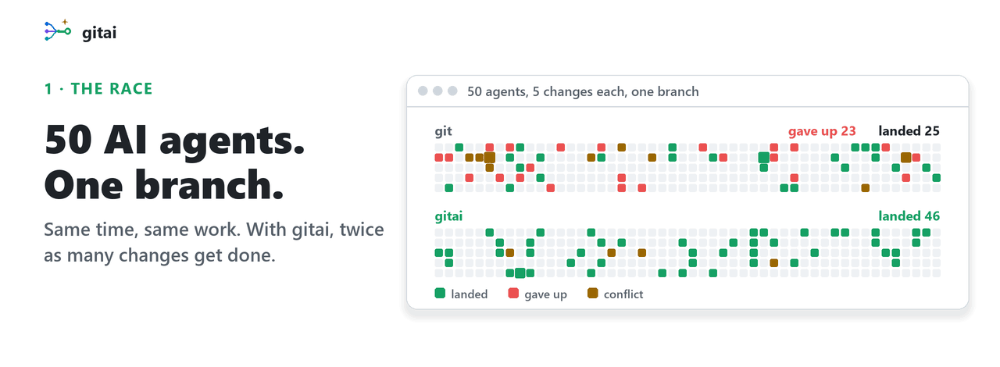
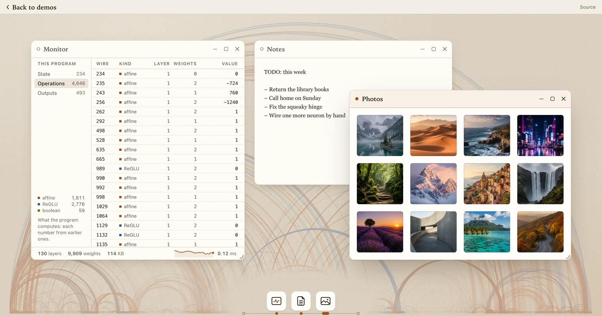

# GitHub Trending 排行榜

🔥 每周自动爬取GitHub最受欢迎的开源项目，生成AI智能总结的中文排行榜

[](https://github.com/qfy123/GitHub-Trending-/actions)
[](https://nodejs.org/)
[](LICENSE)

## ✨ 特性

- 🤖 **AI智能总结** - 使用DeepSeek AI生成简洁的中文项目描述
- 📊 **多维度排名** - 综合Star数、活跃度、新鲜度等指标
- 🖼️ **自动爬取图片** - 从项目README提取代表性图片
- 📈 **趋势分析** - 对比历史数据，显示项目排名变化
- 🗂️ **完整归档** - 按年份/周数归档所有历史数据
- 🔄 **自动更新** - GitHub Actions每周自动执行

## 📈 本周排行榜

<!-- TRENDING-START -->
### GitHub趋势排行榜 - 2026年第43周

**📅 统计周期**: 2026-10-18 ~ 2026-10-24  
**📊 项目总数**: 10 个  
**⭐ 总Star数**: 19,032  
**🔄 更新时间**: 2026-10-24 23:59:59  

| 排名 | 项目 | 描述 | Star | Fork | 语言 | 趋势 |
|------|------|------|------|------|------|------|
| 1 | [qwen21-nsfw-pose-skill](https://github.com/Arekejoker/qwen21-nsfw-pose-skill) | 一个使用Python开发的开源项目：Qwen-Image 2.1 NSFW/姿势出图 skill：作者级提示词配方... | 3,157 | 579 | Python | 🆕 |
| 2 | [uncharted_pc](https://github.com/Supermedo/uncharted_pc) | 一个使用C++开发的开源项目：Uncharted: The Nathan Drake Collection run... | 1,480 | 76 | C++ | 🆕 |
| 3 | [tv-vibehack](https://github.com/Gathin23/tv-vibehack) | 一个使用Java开发的开源项目：Your TV, minus the ads. Debloat any Andro... | 2,747 | 329 | Java | 🆕 |
| 4 | [everything](https://github.com/HeyPuter/everything) | 一个使用JavaScript开发的开源项目：We're rebuilding and open-sourcing ... | 2,257 | 322 | JavaScript | 🆕 |
| 5 | [git-ai](https://github.com/feder-cr/git-ai) | 一个使用Go开发的开源项目：Git designed for AI agents.，已获得2,328个star。 | 2,328 | 260 | Go | 🆕 |
| 6 | [MacNativeGames](https://github.com/ly05010419/MacNativeGames) | 一个热门的C开源项目，在GitHub上获得了1,170个star，值得关注。 | 1,170 | 201 | C | 🆕 |
| 7 | [BRUTAL](https://github.com/ahwootech/BRUTAL) | 一个使用C#开发的开源项目：A free, open source C# framework for making... | 1,933 | 102 | C# | 🆕 |
| 8 | [handwired](https://github.com/chenglou/handwired) | 一个使用TypeScript开发的开源项目：Turn your regular JavaScript code i... | 1,753 | 146 | TypeScript | 🆕 |
| 9 | [open-claude-ui](https://github.com/Caho1/open-claude-ui) | 一个使用TypeScript开发的开源项目：基于 REA 深度拆解并高保真还原 Claude 官方桌面端 UI。还... | 1,218 | 262 | TypeScript | 🆕 |
| 10 | [earshot](https://github.com/Leonxlnx/earshot) | 一个使用Python开发的开源项目：Ears for coding agents: let AI hear, re... | 989 | 56 | Python | 🆕 |

### 🔥 详细介绍

#### 1. [qwen21-nsfw-pose-skill](https://github.com/Arekejoker/qwen21-nsfw-pose-skill) 


**📝 项目简介**: 一个使用Python开发的开源项目：Qwen-Image 2.1 NSFW/姿势出图 skill：作者级提示词配方 + NSFW LoRA + 136 姿势 VNCCS 人偶控制；适用 Claude Code / Codex / Cursor / OpenClaw，已获得3,157个star。

**✨ 核心特性**:
- 3,157 stars
- Python

**📊 项目统计**:
- **⭐ Star数**: 3,157
- **🔀 Fork数**: 579
- **👀 Watch数**: 3,157
- **📝 语言**: Python
- **💻 技术栈**: Python, agent-skill, comfyui, image-generation, openclaw, pose-control
- **📈 趋势**: 🆕 新上榜项目

---

#### 2. [uncharted_pc](https://github.com/Supermedo/uncharted_pc) 

**📝 项目简介**: 一个使用C++开发的开源项目：Uncharted: The Nathan Drake Collection running natively on Windows - by SuperMedo，已获得1,480个star。

**✨ 核心特性**:
- 1,480 stars
- C++

**📊 项目统计**:
- **⭐ Star数**: 1,480
- **🔀 Fork数**: 76
- **👀 Watch数**: 1,480
- **📝 语言**: C++
- **💻 技术栈**: C++, C, Python, Shell, CMake, Nix
- **📈 趋势**: 🆕 新上榜项目

---

#### 3. [tv-vibehack](https://github.com/Gathin23/tv-vibehack) 


**📝 项目简介**: 一个使用Java开发的开源项目：Your TV, minus the ads. Debloat any Android TV or Google TV over Wi-Fi and swap the ad-filled home screen for a clean Apple TV-style launcher. No root, fully reversible.，已获得2,747个star。

**✨ 核心特性**:
- 2,747 stars
- Java

**📊 项目统计**:
- **⭐ Star数**: 2,747
- **🔀 Fork数**: 329
- **👀 Watch数**: 2,747
- **📝 语言**: Java
- **🌐 官网**: [https://x.com/gathint/status/2111379569030939102](https://x.com/gathint/status/2111379569030939102)
- **💻 技术栈**: Java, PowerShell, Shell, Python, ad-free, adb
- **📈 趋势**: 🆕 新上榜项目

---

#### 4. [everything](https://github.com/HeyPuter/everything) 


**📝 项目简介**: 一个使用JavaScript开发的开源项目：We're rebuilding and open-sourcing the world’s software from scratch.，已获得2,257个star。

**✨ 核心特性**:
- 2,257 stars
- JavaScript

**📊 项目统计**:
- **⭐ Star数**: 2,257
- **🔀 Fork数**: 322
- **👀 Watch数**: 2,257
- **📝 语言**: JavaScript
- **💻 技术栈**: JavaScript, HTML, TypeScript, CSS, Python, Rust
- **📈 趋势**: 🆕 新上榜项目

---

#### 5. [git-ai](https://github.com/feder-cr/git-ai) 



**📝 项目简介**: 一个使用Go开发的开源项目：Git designed for AI agents.，已获得2,328个star。

**✨ 核心特性**:
- 2,328 stars
- Go

**📊 项目统计**:
- **⭐ Star数**: 2,328
- **🔀 Fork数**: 260
- **👀 Watch数**: 2,328
- **📝 语言**: Go
- **🌐 官网**: [https://www.anthropic.com/engineering/redesigning-source-control](https://www.anthropic.com/engineering/redesigning-source-control)
- **💻 技术栈**: Go, Protocol Buffer, Python, Shell, JavaScript, Makefile
- **📈 趋势**: 🆕 新上榜项目

---

#### 6. [MacNativeGames](https://github.com/ly05010419/MacNativeGames) 

**📝 项目简介**: 一个热门的C开源项目，在GitHub上获得了1,170个star，值得关注。

**✨ 核心特性**:
- 1,170 stars
- C

**📊 项目统计**:
- **⭐ Star数**: 1,170
- **🔀 Fork数**: 201
- **👀 Watch数**: 1,170
- **📝 语言**: C
- **💻 技术栈**: C, Python, Objective-C, C#, Makefile, Assembly
- **📈 趋势**: 🆕 新上榜项目

---

#### 7. [BRUTAL](https://github.com/ahwootech/BRUTAL) 


**📝 项目简介**: 一个使用C#开发的开源项目：A free, open source C# framework for making games, or your own game engine. Direct access to native APIs and Vulkan, with the low-level libraries around them. The foundation under Kitten Space Agency and RimWorld's Waylith engine.，已获得1,933个star。

**✨ 核心特性**:
- 1,933 stars
- C#

**📊 项目统计**:
- **⭐ Star数**: 1,933
- **🔀 Fork数**: 102
- **👀 Watch数**: 1,933
- **📝 语言**: C#
- **🌐 官网**: [https://ahwoo.com/brutal](https://ahwoo.com/brutal)
- **💻 技术栈**: C#, csharp, dotnet, game-engine, gamedev, vulkan
- **📈 趋势**: 🆕 新上榜项目

---

#### 8. [handwired](https://github.com/chenglou/handwired) 



**📝 项目简介**: 一个使用TypeScript开发的开源项目：Turn your regular JavaScript code into a neural net.，已获得1,753个star。

**✨ 核心特性**:
- 1,753 stars
- TypeScript

**📊 项目统计**:
- **⭐ Star数**: 1,753
- **🔀 Fork数**: 146
- **👀 Watch数**: 1,753
- **📝 语言**: TypeScript
- **🌐 官网**: [https://chenglou.me/handwired/](https://chenglou.me/handwired/)
- **💻 技术栈**: TypeScript, CSS, HTML, C, Yacc, Swift
- **📈 趋势**: 🆕 新上榜项目

---

#### 9. [open-claude-ui](https://github.com/Caho1/open-claude-ui) 


**📝 项目简介**: 一个使用TypeScript开发的开源项目：基于 REA 深度拆解并高保真还原 Claude 官方桌面端 UI。还原 30 个独立 React 组件与 8 项硬核交互物理算法，附带 3000+ 行逆向分析手册。，已获得1,218个star。

**✨ 核心特性**:
- 1,218 stars
- TypeScript

**📊 项目统计**:
- **⭐ Star数**: 1,218
- **🔀 Fork数**: 262
- **👀 Watch数**: 1,218
- **📝 语言**: TypeScript
- **💻 技术栈**: TypeScript, CSS, JavaScript, anthropic, audioworklet, claude
- **📈 趋势**: 🆕 新上榜项目

---

#### 10. [earshot](https://github.com/Leonxlnx/earshot) 


**📝 项目简介**: 一个使用Python开发的开源项目：Ears for coding agents: let AI hear, review and make sound. CPU-only, open source.，已获得989个star。

**✨ 核心特性**:
- 989 stars
- Python

**📊 项目统计**:
- **⭐ Star数**: 989
- **🔀 Fork数**: 56
- **👀 Watch数**: 989
- **📝 语言**: Python
- **💻 技术栈**: Python, JavaScript, ai-agents, audio, claude-code, mcp
- **📈 趋势**: 🆕 新上榜项目

---

### 📈 本周统计

**🔥 热门语言**:
1. **Python** (2 个项目)
2. **TypeScript** (2 个项目)
3. **C++** (1 个项目)
4. **Java** (1 个项目)
5. **JavaScript** (1 个项目)

**🏷️ 热门话题**:
1. claude-code (2)
2. ai-agents (2)
3. agent-skill (1)
4. comfyui (1)
5. image-generation (1)
6. openclaw (1)
7. pose-control (1)
8. qwen-image (1)


<!-- TRENDING-END -->

## 📚 历史数据

<!-- HISTORY-START -->
| 时间 | 周期 | 项目数 | 链接 |
|------|------|--------|------|
| 10-24 | 2026年第43周 | 10 个 | [查看详情](./archives/2026/week-43/report.md) |
| 10-17 | 2026年第42周 | 10 个 | [查看详情](./archives/2026/week-42/report.md) |
| 10-10 | 2026年第41周 | 10 个 | [查看详情](./archives/2026/week-41/report.md) |
| 10-03 | 2026年第40周 | 10 个 | [查看详情](./archives/2026/week-40/report.md) |
| 09-26 | 2026年第39周 | 10 个 | [查看详情](./archives/2026/week-39/report.md) |
| 09-19 | 2026年第38周 | 10 个 | [查看详情](./archives/2026/week-38/report.md) |
| 09-12 | 2026年第37周 | 10 个 | [查看详情](./archives/2026/week-37/report.md) |
| 09-05 | 2026年第36周 | 10 个 | [查看详情](./archives/2026/week-36/report.md) |
| 08-29 | 2026年第35周 | 10 个 | [查看详情](./archives/2026/week-35/report.md) |
| 08-22 | 2026年第34周 | 10 个 | [查看详情](./archives/2026/week-34/report.md) |
| 08-15 | 2026年第33周 | 10 个 | [查看详情](./archives/2026/week-33/report.md) |
| 08-08 | 2026年第32周 | 10 个 | [查看详情](./archives/2026/week-32/report.md) |
| 08-01 | 2026年第31周 | 10 个 | [查看详情](./archives/2026/week-31/report.md) |
| 07-25 | 2026年第30周 | 10 个 | [查看详情](./archives/2026/week-30/report.md) |
| 07-18 | 2026年第29周 | 10 个 | [查看详情](./archives/2026/week-29/report.md) |
| 07-11 | 2026年第28周 | 10 个 | [查看详情](./archives/2026/week-28/report.md) |
| 07-04 | 2026年第27周 | 10 个 | [查看详情](./archives/2026/week-27/report.md) |
| 06-27 | 2026年第26周 | 10 个 | [查看详情](./archives/2026/week-26/report.md) |
| 06-20 | 2026年第25周 | 10 个 | [查看详情](./archives/2026/week-25/report.md) |
| 06-13 | 2026年第24周 | 10 个 | [查看详情](./archives/2026/week-24/report.md) |

[查看完整历史数据](./archives/)
<!-- HISTORY-END -->

## 🚀 快速开始

### 1. 克隆项目

```bash
git clone https://github.com/your-username/GitHub-Trending.git
cd GitHub-Trending
```

### 2. 安装依赖

```bash
npm install
```

### 3. 配置环境变量

```bash
# 复制环境变量模板
cp .env.example .env

# 编辑 .env 文件，填入以下必需配置：
# GITHUB_TOKEN=your_github_token
# SILICONFLOW_API_KEY=your_siliconflow_api_key
```

### 4. 测试配置

```bash
# 系统测试
node test/system-test.js

# 配置检查
node scripts/update-trending.js --check
```

### 5. 运行项目

```bash
# 测试运行（少量数据）
node scripts/update-trending.js --limit 3

# 正式运行
node scripts/update-trending.js
```

## 🔧 配置说明

### 环境变量

| 变量名 | 必需 | 说明 | 获取方式 |
|--------|------|------|----------|
| `GITHUB_TOKEN` | ✅ | GitHub API访问令牌 | [GitHub设置](https://github.com/settings/tokens) |
| `SILICONFLOW_API_KEY` | ✅ | 硅基流动API密钥 | [硅基流动官网](https://siliconflow.cn) |
| `AI_BASE_URL` | ❌ | AI服务地址 | 默认硅基流动 |
| `AI_MODEL` | ❌ | AI模型名称 | 默认deepseek-chat |

详细配置请参考：[配置指南](config/README.md)

### GitHub Actions自动化

1. **Fork本项目**到你的GitHub账号
2. **设置Secrets**：
   - `SILICONFLOW_API_KEY`: 硅基流动API密钥
3. **启用Actions**：项目会自动每周一更新

详细设置请参考：[GitHub Actions配置](-.github/README.md)

## 📊 项目结构

```
GitHub-Trending/
├── src/                          # 核心源码
│   ├── github-api.js            # GitHub API调用
│   ├── ai-summarizer.js         # AI项目总结
│   ├── image-crawler.js         # 图片爬取
│   ├── data-processor.js        # 数据处理
│   ├── file-manager.js          # 文件管理
│   └── readme-updater.js        # README更新
├── scripts/                      # 执行脚本
│   └── update-trending.js       # 主执行脚本
├── test/                         # 测试文件
│   └── system-test.js           # 系统测试
├── archives/                     # 历史数据归档
│   └── YYYY/                    # 按年份归档
│       └── week-XX.md           # 周报文件
├── images/                       # 项目图片
│   └── YYYY/week-XX/            # 按周归档
├── data/                         # 临时数据
├── config/                       # 配置文档
├── .github/                      # GitHub Actions
│   └── workflows/
└── README.md                     # 项目说明
```

## 🎯 使用场景

### 开发者
- 🔍 **发现新项目** - 了解最新热门开源项目
- 📈 **技术趋势** - 跟踪编程语言和技术栈趋势
- 💡 **学习参考** - 学习优秀项目的设计和实现

### 技术团队
- 📊 **技术选型** - 参考热门项目进行技术选型
- 🎯 **竞品分析** - 关注同类项目的发展趋势
- 📝 **技术报告** - 生成定期的技术趋势报告

### 内容创作者
- ✍️ **素材收集** - 为技术文章和视频收集素材
- 📰 **新闻线索** - 发现值得报道的新兴项目
- 🗣️ **分享内容** - 分享有价值的开源项目

## 🛠️ 命令行工具

```bash
# 查看帮助
node scripts/update-trending.js --help

# 检查配置
node scripts/update-trending.js --check

# 自定义参数运行
node scripts/update-trending.js --limit 20 --language python

# 数据管理
node scripts/update-trending.js --backup     # 创建备份
node scripts/update-trending.js --cleanup    # 清理过期数据
node scripts/update-trending.js --stats      # 查看统计信息

# 系统测试
node test/system-test.js                      # 完整测试
node test/system-test.js --quick             # 快速诊断
```

## 📈 排名算法

项目排名基于以下三个维度的综合评分：

### 🌟 受欢迎程度 (50%)
- **Star数量** (60%): 项目获得的Star数
- **Fork数量** (25%): 项目被Fork的次数  
- **Watch数量** (15%): 项目被Watch的次数

### 🔥 活跃程度 (30%)
- **最近提交** (50%): 距离最后一次提交的时间
- **Issues活跃度** (30%): 开放的Issues数量
- **Fork活跃度** (20%): Fork的活跃程度

### 🆕 新鲜程度 (20%)
- **创建时间** (30%): 项目创建时间（新项目得分高）
- **更新时间** (70%): 最近更新时间

### 趋势分析
- 📈 **上升**: 排名比上周提升
- 📉 **下降**: 排名比上周下降  
- ➡️ **稳定**: 排名无明显变化
- 🆕 **新上榜**: 首次进入排行榜

## 🤝 贡献指南

欢迎提交 Issues 和 Pull Requests！

### 开发环境设置

```bash
# 1. Fork 并克隆项目
git clone https://github.com/your-username/GitHub-Trending.git

# 2. 创建功能分支
git checkout -b feature/your-feature

# 3. 安装依赖并测试
npm install
node test/system-test.js

# 4. 开发完成后提交
git commit -m "feat: 添加新功能"
git push origin feature/your-feature
```

### 提交规范

- `feat`: 新功能
- `fix`: 修复bug
- `docs`: 文档更新
- `style`: 代码格式调整
- `refactor`: 代码重构
- `test`: 测试相关
- `chore`: 构建/工具相关

## 📄 许可证

本项目基于 [MIT 许可证](LICENSE) 开源。

## 🙏 致谢

- [GitHub API](https://docs.github.com/en/rest) - 提供项目数据
- [硅基流动](https://siliconflow.cn) - 提供AI总结服务
- [DeepSeek](https://deepseek.com) - 优秀的AI模型
- [GitHub Actions](https://github.com/features/actions) - 自动化支持

## 📞 联系方式

- 🐛 **Bug报告**: [提交Issue](https://github.com/your-username/GitHub-Trending/issues)
- 💡 **功能建议**: [功能请求](https://github.com/your-username/GitHub-Trending/issues)
- 📧 **其他问题**: [发送邮件](mailto:your-email@example.com)

## 🔗 相关链接

- [项目文档](https://github.com/your-username/GitHub-Trending/wiki)
- [更新日志](CHANGELOG.md)
- [FAQ](FAQ.md)

---

⭐ 如果这个项目对你有帮助，请给它一个Star！

*本项目由 [GitHub Actions](https://github.com/features/actions) 自动维护，数据每周更新*