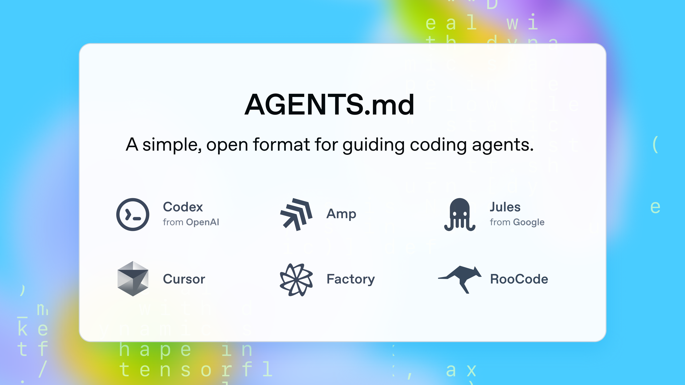
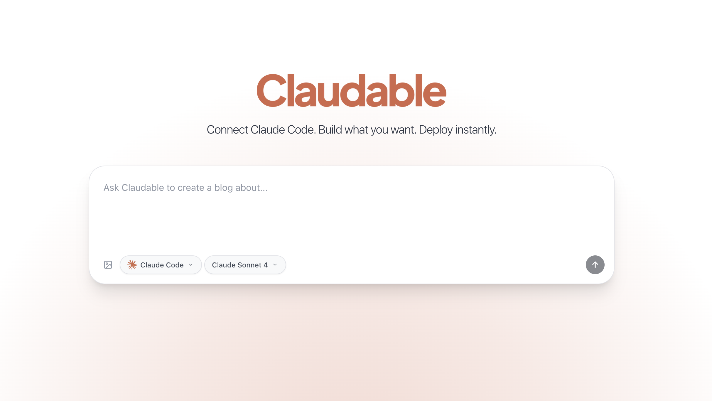

# GitHub Trending 排行榜

🔥 每周自动爬取GitHub最受欢迎的开源项目，生成AI智能总结的中文排行榜

[](https://github.com/qfy123/GitHub-Trending-/actions)
[](https://nodejs.org/)
[](LICENSE)

## ✨ 特性

- 🤖 **AI智能总结** - 使用DeepSeek AI生成简洁的中文项目描述
- 📊 **多维度排名** - 综合Star数、活跃度、新鲜度等指标
- 🖼️ **自动爬取图片** - 从项目README提取代表性图片
- 📈 **趋势分析** - 对比历史数据，显示项目排名变化
- 🗂️ **完整归档** - 按年份/周数归档所有历史数据
- 🔄 **自动更新** - GitHub Actions每周自动执行

## 📈 本周排行榜

<!-- TRENDING-START -->
### GitHub趋势排行榜 - 2025年第35周

**📅 统计周期**: 2025-08-24 ~ 2025-08-30  
**📊 项目总数**: 10 个  
**⭐ 总Star数**: 8,370  
**🔄 更新时间**: 2025-08-30 23:59:59  

| 排名 | 项目 | 描述 | Star | Fork | 语言 | 趋势 |
|------|------|------|------|------|------|------|
| 1 | [agents.md](https://github.com/openai/agents.md) | AGENTS.md 为 AI 编程助手提供统一的项目说明格式，让代码代理像读 README 一样快速理解仓库上下文。 | 3,387 | 230 | TypeScript | 🆕 |
| 2 | [rendergit](https://github.com/karpathy/rendergit) | 一键把任意 GitHub 仓库渲染成单页静态 HTML，告别层层点击，代码一览无余。 | 1,175 | 101 | Python | 🆕 |
| 3 | [Claudable](https://github.com/opactorai/Claudable) | 开源可视化建站平台，通过本地 Claude Code/Cursor 等 AI Agent 一键生成并部署完整产品。 | 810 | 97 | TypeScript | 🆕 |
| 4 | [pumpfun-bundler](https://github.com/printz-labs/pumpfun-bundler) | 一键在PumpFun上创建代币并同时用20个钱包抢购的极速捆绑脚本，提升首发成功率。 | 348 | 279 | TypeScript | 🆕 |
| 5 | [copytrading-bot-solana](https://github.com/printz-labs/copytrading-bot-solana) | 一键跟单Solana链上高手钱包，实时同步买卖，自动复制顶级交易者策略，支持所有DEX。 | 347 | 284 | TypeScript | 🆕 |
| 6 | [av](https://github.com/auv-sh/av) | 自称“极快”的电影管理工具，用Rust编写，README却警告用户安装后可能“自伤”，更像一场兄弟间的玩笑。 | 499 | 77 | Rust | 🆕 |
| 7 | [DiffMem](https://github.com/Growth-Kinetics/DiffMem) | 用 Git 做 AI 记忆库：把对话历史存成 Markdown，自动版本化并可快速检索。 | 485 | 29 | Python | 🆕 |
| 8 | [lunar-test](https://github.com/lunarengine/lunar-test) | LunarEngine 是一个开源的 Luau 3D 引擎，与 Roblox Luau API 兼容，方便开发者快... | 372 | 19 | C++ | 🆕 |
| 9 | [try](https://github.com/tobi/try) | 单文件 Ruby 脚本，一键创建并跳转到带时间戳的干净实验目录，告别 test、test2 混乱。 | 502 | 17 | Ruby | 🆕 |
| 10 | [nstr](https://github.com/shuding/nstr) | 智能数字转字符串库，自动修复浮点精度误差，让 UI 不再出现 0.30000000000000004 等丑陋数字。 | 445 | 8 | TypeScript | 🆕 |

### 🔥 详细介绍

#### 1. [agents.md](https://github.com/openai/agents.md) 



**📝 项目简介**: AGENTS.md 为 AI 编程助手提供统一的项目说明格式，让代码代理像读 README 一样快速理解仓库上下文。

**✨ 核心特性**:
- 类 README 的开放标准
- 帮助 AI 代理快速上手项目
- 简单 Markdown 即可配置

**📊 项目统计**:
- **⭐ Star数**: 3,387
- **🔀 Fork数**: 230
- **👀 Watch数**: 3,387
- **📝 语言**: TypeScript
- **🌐 官网**: [https://agents.md](https://agents.md)
- **💻 技术栈**: TypeScript, CSS, JavaScript, React
- **📈 趋势**: 🆕 新上榜项目

---

#### 2. [rendergit](https://github.com/karpathy/rendergit) 

**📝 项目简介**: 一键把任意 GitHub 仓库渲染成单页静态 HTML，告别层层点击，代码一览无余。

**✨ 核心特性**:
- 单页展示全部源码，支持语法高亮与 Markdown
- 侧边栏导航+全文搜索，浏览效率翻倍
- 零依赖安装，一行命令即可使用

**📊 项目统计**:
- **⭐ Star数**: 1,175
- **🔀 Fork数**: 101
- **👀 Watch数**: 1,175
- **📝 语言**: Python
- **💻 技术栈**: Python
- **📈 趋势**: 🆕 新上榜项目

---

#### 3. [Claudable](https://github.com/opactorai/Claudable) 



**📝 项目简介**: 开源可视化建站平台，通过本地 Claude Code/Cursor 等 AI Agent 一键生成并部署完整产品。

**✨ 核心特性**:
- 零代码拖拽生成
- 本地 AI Agent 驱动
- 一键部署上线

**📊 项目统计**:
- **⭐ Star数**: 810
- **🔀 Fork数**: 97
- **👀 Watch数**: 810
- **📝 语言**: TypeScript
- **💻 技术栈**: TypeScript, Python, JavaScript, CSS, HTML, Shell
- **📈 趋势**: 🆕 新上榜项目

---

#### 4. [pumpfun-bundler](https://github.com/printz-labs/pumpfun-bundler) 


**📝 项目简介**: 一键在PumpFun上创建代币并同时用20个钱包抢购的极速捆绑脚本，提升首发成功率。

**✨ 核心特性**:
- 20钱包并发抢购
- 单bundle完成创建+买入
- 极速高效，降低滑点

**📊 项目统计**:
- **⭐ Star数**: 348
- **🔀 Fork数**: 279
- **👀 Watch数**: 348
- **📝 语言**: TypeScript
- **💻 技术栈**: TypeScript, JavaScript, bundler, bundler-bot, pumpfun-bundler
- **📈 趋势**: 🆕 新上榜项目

---

#### 5. [copytrading-bot-solana](https://github.com/printz-labs/copytrading-bot-solana) 

**📝 项目简介**: 一键跟单Solana链上高手钱包，实时同步买卖，自动复制顶级交易者策略，支持所有DEX。

**✨ 核心特性**:
- 实时跟单任意钱包
- 覆盖Solana全部DEX
- 零门槛自动执行

**📊 项目统计**:
- **⭐ Star数**: 347
- **🔀 Fork数**: 284
- **👀 Watch数**: 347
- **📝 语言**: TypeScript
- **💻 技术栈**: TypeScript, auto-trade-bot, bot, copy-trade, copy-trading, copytrading
- **📈 趋势**: 🆕 新上榜项目

---

#### 6. [av](https://github.com/auv-sh/av) 

**📝 项目简介**: 自称“极快”的电影管理工具，用Rust编写，README却警告用户安装后可能“自伤”，更像一场兄弟间的玩笑。

**✨ 核心特性**:
- Rust实现的高性能
- README幽默警告
- Shell脚本集成

**📊 项目统计**:
- **⭐ Star数**: 499
- **🔀 Fork数**: 77
- **👀 Watch数**: 499
- **📝 语言**: Rust
- **💻 技术栈**: Rust, Shell
- **📈 趋势**: 🆕 新上榜项目

---

#### 7. [DiffMem](https://github.com/Growth-Kinetics/DiffMem) 


**📝 项目简介**: 用 Git 做 AI 记忆库：把对话历史存成 Markdown，自动版本化并可快速检索。

**✨ 核心特性**:
- Git 版本化记忆，天然可追溯
- Markdown 存储，人类可读易编辑
- 内置 BM25 检索，秒级召回相关记忆

**📊 项目统计**:
- **⭐ Star数**: 485
- **🔀 Fork数**: 29
- **👀 Watch数**: 485
- **📝 语言**: Python
- **💻 技术栈**: Python, Dockerfile
- **📈 趋势**: 🆕 新上榜项目

---

#### 8. [lunar-test](https://github.com/lunarengine/lunar-test) 


**📝 项目简介**: LunarEngine 是一个开源的 Luau 3D 引擎，与 Roblox Luau API 兼容，方便开发者快速构建跨平台 3D 游戏。

**✨ 核心特性**:
- 与 Luau API 兼容，降低 Roblox 开发者迁移成本
- C++ 高性能核心，支持 Lua 脚本快速迭代
- 开源免费，社区活跃，已有 372 Star

**📊 项目统计**:
- **⭐ Star数**: 372
- **🔀 Fork数**: 19
- **👀 Watch数**: 372
- **📝 语言**: C++
- **💻 技术栈**: C++, Lua, Luau, C, Python, CMake
- **📈 趋势**: 🆕 新上榜项目

---

#### 9. [try](https://github.com/tobi/try) 


**📝 项目简介**: 单文件 Ruby 脚本，一键创建并跳转到带时间戳的干净实验目录，告别 test、test2 混乱。

**✨ 核心特性**:
- 秒级目录创建与自动 cd
- 按日期自动命名，永不重名
- 单文件零依赖，随拷随用

**📊 项目统计**:
- **⭐ Star数**: 502
- **🔀 Fork数**: 17
- **👀 Watch数**: 502
- **📝 语言**: Ruby
- **💻 技术栈**: Ruby, Nix, Redis
- **📈 趋势**: 🆕 新上榜项目

---

#### 10. [nstr](https://github.com/shuding/nstr) 

**📝 项目简介**: 智能数字转字符串库，自动修复浮点精度误差，让 UI 不再出现 0.30000000000000004 等丑陋数字。

**✨ 核心特性**:
- 自动检测并修正浮点误差
- 零配置，一行代码接入
- 支持多种格式化风格

**📊 项目统计**:
- **⭐ Star数**: 445
- **🔀 Fork数**: 8
- **👀 Watch数**: 445
- **📝 语言**: TypeScript
- **🌐 官网**: [https://nstr.vercel.app](https://nstr.vercel.app)
- **💻 技术栈**: TypeScript, JavaScript, CSS
- **📈 趋势**: 🆕 新上榜项目

---

### 📈 本周统计

**🔥 热门语言**:
1. **TypeScript** (5 个项目)
2. **Python** (2 个项目)
3. **Rust** (1 个项目)
4. **C++** (1 个项目)
5. **Ruby** (1 个项目)

**🏷️ 热门话题**:
1. bundler (1)
2. bundler-bot (1)
3. pumpfun-bundler (1)
4. auto-trade-bot (1)
5. bot (1)
6. copy-trade (1)
7. copy-trading (1)
8. copytrading (1)


<!-- TRENDING-END -->

## 📚 历史数据

<!-- HISTORY-START -->
| 时间 | 周期 | 项目数 | 链接 |
|------|------|--------|------|
| 08-30 | 2025年第35周 | 10 个 | [查看详情](./archives/2025/week-35/report.md) |
| 08-23 | 2025年第34周 | 10 个 | [查看详情](./archives/2025/week-34/report.md) |
| 08-16 | 2025年第33周 | 3 个 | [查看详情](./archives/2025/week-33/report.md) |

<!-- HISTORY-END -->

## 🚀 快速开始

### 1. 克隆项目

```bash
git clone https://github.com/your-username/GitHub-Trending.git
cd GitHub-Trending
```

### 2. 安装依赖

```bash
npm install
```

### 3. 配置环境变量

```bash
# 复制环境变量模板
cp .env.example .env

# 编辑 .env 文件，填入以下必需配置：
# GITHUB_TOKEN=your_github_token
# SILICONFLOW_API_KEY=your_siliconflow_api_key
```

### 4. 测试配置

```bash
# 系统测试
node test/system-test.js

# 配置检查
node scripts/update-trending.js --check
```

### 5. 运行项目

```bash
# 测试运行（少量数据）
node scripts/update-trending.js --limit 3

# 正式运行
node scripts/update-trending.js
```

## 🔧 配置说明

### 环境变量

| 变量名 | 必需 | 说明 | 获取方式 |
|--------|------|------|----------|
| `GITHUB_TOKEN` | ✅ | GitHub API访问令牌 | [GitHub设置](https://github.com/settings/tokens) |
| `SILICONFLOW_API_KEY` | ✅ | 硅基流动API密钥 | [硅基流动官网](https://siliconflow.cn) |
| `AI_BASE_URL` | ❌ | AI服务地址 | 默认硅基流动 |
| `AI_MODEL` | ❌ | AI模型名称 | 默认deepseek-chat |

详细配置请参考：[配置指南](config/README.md)

### GitHub Actions自动化

1. **Fork本项目**到你的GitHub账号
2. **设置Secrets**：
   - `SILICONFLOW_API_KEY`: 硅基流动API密钥
3. **启用Actions**：项目会自动每周一更新

详细设置请参考：[GitHub Actions配置](-.github/README.md)

## 📊 项目结构

```
GitHub-Trending/
├── src/                          # 核心源码
│   ├── github-api.js            # GitHub API调用
│   ├── ai-summarizer.js         # AI项目总结
│   ├── image-crawler.js         # 图片爬取
│   ├── data-processor.js        # 数据处理
│   ├── file-manager.js          # 文件管理
│   └── readme-updater.js        # README更新
├── scripts/                      # 执行脚本
│   └── update-trending.js       # 主执行脚本
├── test/                         # 测试文件
│   └── system-test.js           # 系统测试
├── archives/                     # 历史数据归档
│   └── YYYY/                    # 按年份归档
│       └── week-XX.md           # 周报文件
├── images/                       # 项目图片
│   └── YYYY/week-XX/            # 按周归档
├── data/                         # 临时数据
├── config/                       # 配置文档
├── .github/                      # GitHub Actions
│   └── workflows/
└── README.md                     # 项目说明
```

## 🎯 使用场景

### 开发者
- 🔍 **发现新项目** - 了解最新热门开源项目
- 📈 **技术趋势** - 跟踪编程语言和技术栈趋势
- 💡 **学习参考** - 学习优秀项目的设计和实现

### 技术团队
- 📊 **技术选型** - 参考热门项目进行技术选型
- 🎯 **竞品分析** - 关注同类项目的发展趋势
- 📝 **技术报告** - 生成定期的技术趋势报告

### 内容创作者
- ✍️ **素材收集** - 为技术文章和视频收集素材
- 📰 **新闻线索** - 发现值得报道的新兴项目
- 🗣️ **分享内容** - 分享有价值的开源项目

## 🛠️ 命令行工具

```bash
# 查看帮助
node scripts/update-trending.js --help

# 检查配置
node scripts/update-trending.js --check

# 自定义参数运行
node scripts/update-trending.js --limit 20 --language python

# 数据管理
node scripts/update-trending.js --backup     # 创建备份
node scripts/update-trending.js --cleanup    # 清理过期数据
node scripts/update-trending.js --stats      # 查看统计信息

# 系统测试
node test/system-test.js                      # 完整测试
node test/system-test.js --quick             # 快速诊断
```

## 📈 排名算法

项目排名基于以下三个维度的综合评分：

### 🌟 受欢迎程度 (50%)
- **Star数量** (60%): 项目获得的Star数
- **Fork数量** (25%): 项目被Fork的次数  
- **Watch数量** (15%): 项目被Watch的次数

### 🔥 活跃程度 (30%)
- **最近提交** (50%): 距离最后一次提交的时间
- **Issues活跃度** (30%): 开放的Issues数量
- **Fork活跃度** (20%): Fork的活跃程度

### 🆕 新鲜程度 (20%)
- **创建时间** (30%): 项目创建时间（新项目得分高）
- **更新时间** (70%): 最近更新时间

### 趋势分析
- 📈 **上升**: 排名比上周提升
- 📉 **下降**: 排名比上周下降  
- ➡️ **稳定**: 排名无明显变化
- 🆕 **新上榜**: 首次进入排行榜

## 🤝 贡献指南

欢迎提交 Issues 和 Pull Requests！

### 开发环境设置

```bash
# 1. Fork 并克隆项目
git clone https://github.com/your-username/GitHub-Trending.git

# 2. 创建功能分支
git checkout -b feature/your-feature

# 3. 安装依赖并测试
npm install
node test/system-test.js

# 4. 开发完成后提交
git commit -m "feat: 添加新功能"
git push origin feature/your-feature
```

### 提交规范

- `feat`: 新功能
- `fix`: 修复bug
- `docs`: 文档更新
- `style`: 代码格式调整
- `refactor`: 代码重构
- `test`: 测试相关
- `chore`: 构建/工具相关

## 📄 许可证

本项目基于 [MIT 许可证](LICENSE) 开源。

## 🙏 致谢

- [GitHub API](https://docs.github.com/en/rest) - 提供项目数据
- [硅基流动](https://siliconflow.cn) - 提供AI总结服务
- [DeepSeek](https://deepseek.com) - 优秀的AI模型
- [GitHub Actions](https://github.com/features/actions) - 自动化支持

## 📞 联系方式

- 🐛 **Bug报告**: [提交Issue](https://github.com/your-username/GitHub-Trending/issues)
- 💡 **功能建议**: [功能请求](https://github.com/your-username/GitHub-Trending/issues)
- 📧 **其他问题**: [发送邮件](mailto:your-email@example.com)

## 🔗 相关链接

- [项目文档](https://github.com/your-username/GitHub-Trending/wiki)
- [更新日志](CHANGELOG.md)
- [FAQ](FAQ.md)

---

⭐ 如果这个项目对你有帮助，请给它一个Star！

*本项目由 [GitHub Actions](https://github.com/features/actions) 自动维护，数据每周更新*